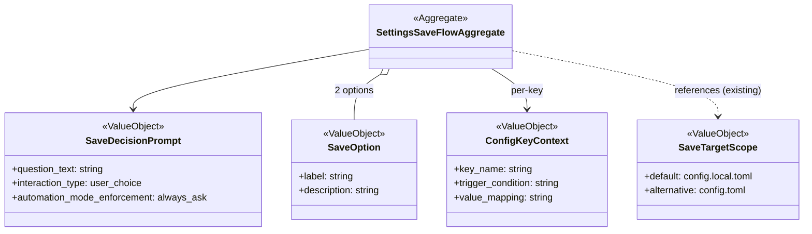

# ドメインモデル: Unit 006 設定保存フローの暗黙書き込み防止

## 概要

3 箇所の「設定保存フロー」（`branch_mode` / `draft_pr` / `merge_method`）で、ユーザーが明示的に「はい」を選ばない限り `.aidlc/config.local.toml` への書き込みを行わない状態に整える。対話種別を「ユーザー選択」に明示し、`AskUserQuestion` を `automation_mode` に関わらず必須化する。

**重要**: このドメインモデル設計では**コードは書かず**、対話フロー・記述仕様の定義のみを行う。実装は Phase 2 で SKILL.md と 3 ステップファイルの Markdown 記述を編集する。

## 責務境界（レイヤー分離と成果物の役割）

本 Unit の対象は「対話プロトコル仕様（静的 Markdown 記述）」のみ。実行時ロジック（`write-config.sh` 等）の変更は行わない。

| 系統 | 役割 | 対応ファイル | 本 Unit での変更 |
|------|------|------------|--------------|
| 対話プロトコルの正本 | SKILL.md「AskUserQuestion 使用ルール」で対話種別の分類と必須化ルールを宣言する | `skills/aidlc/SKILL.md` | **あり**（「ユーザー選択」種別の具体例に設定保存確認を追記） |
| 対話フロー実装記述 | 各ステップファイルで設定保存確認の具体的な質問文・選択肢・保存先説明を定義する Markdown 記述 | `skills/aidlc/steps/inception/01-setup.md` §9-1, `skills/aidlc/steps/inception/05-completion.md` §5d-1, `skills/aidlc/steps/operations/operations-release.md` 設定保存フロー | **あり**（3 ファイルを統一フォーマットに更新） |
| 書き込み実装（既存、変更なし） | `write-config.sh` が与えられた key/value/scope を受け取り書き込む既存の責務 | `skills/aidlc/scripts/write-config.sh` | なし（呼び出し側のプロトコルのみ更新） |
| 保存先選択フロー（既存、変更なし） | 「はい」選択時に `config.local.toml` or `config.toml` を選ぶ既存の 2 択フロー | 上記 3 ステップファイル内 | なし（既存仕様維持） |

### 本 Unit の責務の限定

- 書き換えるのは SKILL.md の「ユーザー選択」種別の具体例追記（または等価な表現）と、3 ステップファイルの設定保存確認の質問文・選択肢定義のみ
- `AskUserQuestion` の実装（ツール本体）には触れない
- `write-config.sh` の引数仕様・動作は変更しない
- 「はい」選択時の保存先選択フロー（デフォルト `config.local.toml`、代替 `config.toml`）は現状維持
- 各対象キー（`branch_mode` / `draft_pr` / `merge_method`）の固有保持条件（トリガー条件・値マッピング）は全て維持する

## 値オブジェクト（Value Object）

### SaveDecisionPrompt（設定保存確認プロンプト）

「この選択を設定に保存しますか？」の対話を表す値オブジェクト。3 ステップファイルで共通化される雛形。

- **属性**:
  - `question_text`: string - 「この選択を設定に保存しますか？」（共通）
  - `interaction_type`: enum - 常に `user_choice`（SKILL.md「ユーザー選択」種別）
  - `options`: list[SaveOption] - 選択肢のリスト、先頭が Recommended（デフォルト）
  - `automation_mode_enforcement`: enum - 常に `always_ask`（全 `automation_mode` で `AskUserQuestion` 必須）
- **不変性**: Markdown 記述で固定、実行時に動的生成しない
- **不変条件**:
  - `options[0]` は常に「いいえ（今回のみ使用） (Recommended)」
  - `options[1]` は常に「はい（保存する）」
  - 追加オプションを設けない（2 択固定）
  - `interaction_type == "user_choice"` は `automation_mode ∈ {manual, semi_auto, full_auto}` の全パターンで維持

### SaveOption（選択肢）

`AskUserQuestion` の option を表す値オブジェクト。`AskUserQuestion` 契約に沿って label と description のみを属性とし、「Recommended」概念はフラグではなく「先頭配置 + label への `(Recommended)` サフィックス付与」という不変条件として表現する（既存ツール契約への非侵襲性を維持）。

- **属性**:
  - `label`: string - 表示ラベル（例: 「いいえ（今回のみ使用） (Recommended)」）
  - `description`: string - 選択した場合の動作説明
- **不変性**: Markdown 記述で固定
- **不変条件（`options[]` 配列全体に対して）**:
  - 先頭（`options[0]`）の label には末尾に `(Recommended)` サフィックスを付与し、他の option の label にはこれを付与しない
  - `(Recommended)` が付与されている option はちょうど 1 つで、必ず先頭に配置される
  - 追加のフラグ属性（例: `is_recommended`）は導入しない。デフォルト判定は「先頭配置 + label サフィックス」で表現する

### ConfigKeyContext（キー固有コンテキスト）

各対象キー（`branch_mode` / `draft_pr` / `merge_method`）の固有条件を表す値オブジェクト。3 ステップファイル間で共通フォーマットを取りつつ、本属性で固有の違いを表現する。

- **属性**:
  - `key_name`: string - 設定キー名（例: `rules.git.branch_mode`）
  - `trigger_condition`: string - 設定保存確認フローに入る条件（例: `branch_mode=ask` かつ「現在のブランチで続行」以外を選択）
  - `value_mapping`: string - `AskUserQuestion` 応答から保存値への変換ルール（例: `draft_pr` は はい→`always` / いいえ→`never`、`branch_mode` と `merge_method` は選択値そのまま）
- **固有値**:
  - `branch_mode`: trigger = `ask` でユーザーが `worktree` / `branch` を選んだ場合のみ。「現在のブランチで続行」では保存フローに入らない。value_mapping = 選択値（`worktree` / `branch`）そのまま
  - `draft_pr`: trigger = `action=ask_user` の場合のみ（`skip_never` / `create_draft_pr` では保存フローに入らない）。value_mapping = AskUserQuestion の「はい（作成）」→ `always` / 「いいえ（作成しない）」→ `never`
  - `merge_method`: trigger = `merge_method=ask` の場合のみ。value_mapping = 選択値（`merge` / `squash` / `rebase`）そのまま
- **不変条件**:
  - 本 Unit の変更後もこれらの trigger / mapping は維持される（統一フォーマット化による退行を起こさない）

### SaveTargetScope（保存先スコープ、既存仕様の参照のみ）

「はい（保存する）」選択時の保存先選択を表す値オブジェクト。**本 Unit では変更しない**。

- **属性**:
  - `default`: enum - `config.local.toml`（個人設定、既存デフォルト）
  - `alternative`: enum - `config.toml`（プロジェクト共有）
- **本 Unit との関係**: 既存仕様を維持。`SaveDecisionPrompt` で「はい」が選ばれた場合のみ本フローに入る

## 挙動マトリクス（対話種別 × automation_mode）

Codex 計画レビュー指摘 #4 に対応し、対話種別が `automation_mode` に依存せず常に `AskUserQuestion` で処理されることを明示する。

### A. デフォルト選択とユーザー応答

| automation_mode | 選択肢 Enter（デフォルト） | 「はい（保存する）」明示選択 |
|----------------|------------------------|-------------------------|
| manual | 「いいえ（今回のみ使用）」→ 保存せず続行 | 保存先選択 → `write-config.sh` 呼び出し |
| semi_auto | 「いいえ（今回のみ使用）」→ 保存せず続行 | 保存先選択 → `write-config.sh` 呼び出し |
| full_auto | 「いいえ（今回のみ使用）」→ 保存せず続行 | 保存先選択 → `write-config.sh` 呼び出し |

### B. AskUserQuestion 必須化の確認

| automation_mode | 起動形態 | 期待 |
|----------------|---------|-----|
| manual | `AskUserQuestion` 必須 | テキスト出力代替不可 |
| semi_auto | `AskUserQuestion` 必須 | ゲート承認として `auto_approved` されない |
| full_auto | `AskUserQuestion` 必須 | 全自動フローでも `AskUserQuestion` が起動し、ユーザー選択なしで自動保存されない |

## 集約（Aggregate）

### SettingsSaveFlowAggregate（設定保存フロー集約）

- **集約ルート**: `SaveDecisionPrompt`
- **含まれる要素**: `SaveDecisionPrompt`, `SaveOption × 2`, `ConfigKeyContext`（キー別）, `SaveTargetScope`（参照）
- **境界**: 3 ステップファイルそれぞれに 1 つずつ存在する「設定保存フロー」Markdown セクション
- **不変条件**:
  - 本集約は常に 3 インスタンス（`branch_mode` / `draft_pr` / `merge_method`）が独立に存在し、`SaveDecisionPrompt` と `SaveOption` の形式は共通、`ConfigKeyContext` のみキー固有
  - 対話プロトコル仕様（SKILL.md）と 3 ステップファイルの記述は同期して更新する（片方だけの更新は整合性違反）

## リポジトリインターフェース・ファクトリ

本ドメインは**静的 Markdown 記述のみ**で、実行時の集約生成や永続化層を持たない。Markdown 記述が Git バージョン管理下の「永続化された仕様」となる。

## ドメインモデル図（簡約版）

## ユビキタス言語

- **設定保存確認（SaveDecisionPrompt）**: 3 箇所の設定フローで「選択値を設定ファイルに保存するか」をユーザーに問うインタラクション
- **ユーザー選択（user_choice）**: SKILL.md「AskUserQuestion 使用ルール」で定義される対話種別の一つ。`automation_mode` に関わらず常に `AskUserQuestion` 必須
- **opt-in 化**: デフォルト選択肢を「いいえ（今回のみ使用）」にし、ユーザーが明示的に「はい」を選んだときのみ保存が発動する状態
- **Recommended 指定**: `AskUserQuestion` の option の label 末尾に `(Recommended)` を付与し、先頭に配置することでデフォルト選択肢を視覚的に示す規約
- **トリガー条件（trigger_condition）**: 設定保存フローに入るための前提条件（例: `branch_mode=ask` + 「現在のブランチで続行」以外）
- **値マッピング（value_mapping）**: AskUserQuestion の応答（「はい」「いいえ」等）を保存値に変換するルール（例: `draft_pr` は はい→`always`）
- **保存先スコープ（SaveTargetScope）**: 「はい」選択時の書き込み先選択（既存仕様、本 Unit では変更せず）

## 不明点と質問

[Question] SKILL.md に「ユーザー選択」の具体例として設定保存確認を追記する際、3 場面（`branch_mode` / `draft_pr` / `merge_method`）を個別列挙するか、まとめて『設定保存確認』として抽象化するか？

[Answer] **まとめて抽象化**（「設定保存確認（`branch_mode` / `draft_pr` / `merge_method`）」の形で 1 項目として追記）する。理由: 既存テーブルの「具体例」列は短いフレーズで記述されており、3 行に分けると表の構造バランスが崩れるため。また、将来的に設定保存場面が増えた場合の拡張性も確保できる。

[Question] `AskUserQuestion` の 2 択で「いいえ（今回のみ使用） (Recommended)」「はい（保存する）」の順序を固定するとき、既存ユーザーに混乱が生じないか？

[Answer] 混乱のリスクは低い。既存ユーザーも「保存するかどうか」を個別に判断してきた前提。Recommended マーカーは「デフォルトとして推奨される」を示すだけで、ユーザーは依然として明示選択可能。むしろ「保存しない」がデフォルトになることで、これまで意図せず保存されていた設定が今後は起こらなくなる（Issue #578 の要求）。移行期の案内は本 Unit のスコープ外だが、CHANGELOG で変更を周知する想定。

[Question] `draft_pr` の value_mapping（はい→`always` / いいえ→`never`）は `SaveDecisionPrompt` の「はい（保存する）」/「いいえ（今回のみ使用）」とは別の対話で決まる。これが混乱を招かないか？

[Answer] 対話は 2 段階で明確に分離される: (1) `draft_pr` の PR 作成選択（はい/いいえ）→ value_mapping で保存値を決定 → (2) 設定保存確認（はい/いいえ）で保存実行を判断。本 Unit は (2) のプロトコル仕様のみ変更するため、(1) の value_mapping には影響しない。05-completion.md の記述で「(1) の結果を value_mapping で変換した上で (2) の設定保存確認を行う」流れを明示すれば混乱しない。
