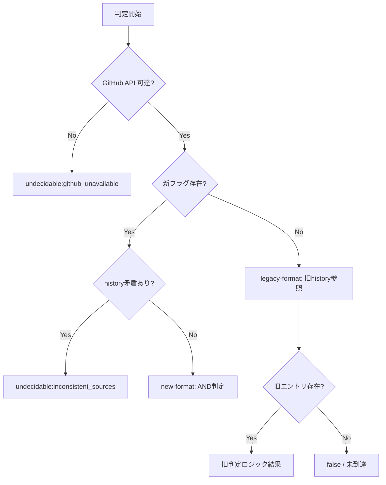

# 論理設計: Operations 復帰判定の進捗源移行

## 概要

`phase-recovery-spec.md` §5.3 の Operations 復帰判定（`release_done` / `completion_done`）を、`history/operations.md` 参照方式から `operations/progress.md` の固定スロットフラグ + GitHub PR 実態確認の AND 方式に移行する。後方互換・4 カテゴリ決定表・新 reason_code・rollback 手順を含む。

**重要**: この論理設計では**コードは書かず**、コンポーネント構成とインターフェース定義のみを行います。

## アーキテクチャパターン

**レイヤード仕様パターン**: 規範仕様（spec）→ Materialized Binding（index.md）→ 具象テンプレート（template）の 3 層構造を維持する。`OperationsStepResolver` は `ArtifactsState`（構造化済み状態）のみを参照し、テンプレートの具象フォーマットに直接依存しない。判定源選択は `DecisionCategoryClassifier` に委譲し、Strategy パターンで旧方式との切り替えを実現する。

## コンポーネント構成

### ファイル / モジュール構成

```text
phase-recovery-spec.md（規範仕様）
├── §3 ArtifactsState（progressFlags/prNumber 追加）
├── §5.3 OperationsStepResolver（AND 判定ロジック）
│   ├── §5.3.1.3 release_done（フラグ AND isDraft=false∧state=OPEN）
│   └── §5.3.1.4 completion_done（フラグ AND state=MERGED∧mergedAt!=null）
├── §7 reason_code 体系（4 新コード追加 + 4 カテゴリ決定表）
│   ├── §7.0 必須/オプション集合表
│   ├── §7.1 分類表
│   └── §7.2 排他性評価順
└── §12 Operations 適用例（binding 参照テーブル + 検証ケース）

operations/index.md（Materialized Binding）
├── §3 判定チェックポイント表（input_artifacts 更新）
└── §4 ステップ読み込み契約（exit_condition 更新）

operations_progress_template.md（具象テンプレート）
└── ステップ7 サブステップ欄（固定スロット grammar materialization）

operations-release.md（Operations ステップ手順）
└── §7.8 PR Ready 化（pr_number 追加コミット手順）

compaction.md / session-continuity.md（呼び出し層）
└── Operations 復帰判定の参照先更新
```

### コンポーネント詳細

#### phase-recovery-spec.md §3（ArtifactsState 拡張）

- **責務**: 判定入力モデルの構造定義
- **変更内容**: `progressFlags: Map<flag_name, boolean>` と `prNumber: int | null` をフィールド追加。§3.1 の構造表を拡張
- **構築方法の更新**: §3.4 の手順に以下の工程を追加:
  - ステップ 2.5: `progress.md` の固定スロットを `FixedSlotGrammar` に基づいてパースし `progressFlags` / `prNumber` に格納（grammar version comment `<!-- fixed-slot-grammar: v1 -->` の互換性チェックは本 parser 工程の責務）
  - ステップ 2.6: `history/operations.md` をスキャンし、旧形式のチェックポイント記録を `legacyOperationsCheckpoints` に格納
- **`snapshotDiagnostics` の追加**: `ArtifactsState` に `snapshotDiagnostics: List<Diagnostic>` フィールドを追加。パース失敗時は `format_error` を本リストに記録し、判定層（`PhaseResolver` / `OperationsStepResolver`）が `PhaseRecoveryJudgment.diagnostics` に転写する。これにより既存 spec §3.5 / §7 のエラー伝播パターン（`phaseProgressStatus=unknown` + blocking `format_error` 検出）と整合する

#### phase-recovery-spec.md §5.3.1.3 / §5.3.1.4（判定ロジック変更）

- **責務**: `release_done` / `completion_done` の判定条件定義
- **変更前**: `history/operations.md` に記録ありで `true`
- **変更後**:

| checkpoint | 判定条件 |
|-----------|---------|
| `release_done` | `progressFlags["release_gate_ready"] == true` AND `GitHubPullRequestGateway.fetchByNumber(prNumber)` → `isDraft=false ∧ state="OPEN"` |
| `completion_done` | `progressFlags["completion_gate_ready"] == true` AND `GitHubPullRequestGateway.fetchByNumber(prNumber)` → `state="MERGED" ∧ mergedAt!=null` |

- **checkpoint 別契約**:

| 状況 | `release_done` の戻り値 | `completion_done` の戻り値 |
|------|----------------------|--------------------------|
| フラグ=false | `false` | `false` |
| フラグ=true, PR 存在, GitHub 条件 true | `true` | `true` |
| フラグ=true, PR 存在, GitHub 条件 false | `false`（まだ Ready 化 / マージ前） | `false`（まだマージ前） |
| フラグ=true, `prNumber`=null | `false`（未到達、7.8 で初回作成前） | `undecidable:<pr_number_missing>` |
| フラグ=true, PR 未存在（`PrNotFound`） | `false`（PR 未作成の未到達状態） | `undecidable:<pr_not_found>` |
| GitHub API 不達 | `undecidable:<github_unavailable>` | `undecidable:<github_unavailable>` |

#### phase-recovery-spec.md §7（reason_code 体系 + 決定表）

- **§7.0 更新**: `operations.release_done` / `operations.completion_done` の `input_artifacts` を `operations/progress.md`（固定スロット）+ `GitHubPullRequestSnapshot` に変更。旧 `history/operations.md` 参照は「後方互換フォールバック用途」として残す
- **§7.1 追加**: 分類表に 4 新 reason_code を blocking として追加

| reason_code | 分類 | 判定層 | 検出条件 |
|------------|------|-------|---------|
| `pr_not_found` | blocking | OperationsStepResolver | `completion_done` 判定時に `gh pr view` で PR 未存在 |
| `github_unavailable` | blocking | GitHubPullRequestGateway | API 不達（タイムアウト / 認証失敗 / レート制限） |
| `pr_number_missing` | blocking | OperationsStepResolver | `completion_done` 判定時に `ArtifactsState.prNumber=null` |
| `inconsistent_sources` | blocking | DecisionCategoryClassifier | 新フラグと history 判定結果が矛盾（invalid-mixed-format） |

- **§7.2 更新**: blocking 優先順位に新コードを組み込み: `missing_file > conflict > format_error > dependency_block > github_unavailable > inconsistent_sources > pr_not_found > pr_number_missing`
- **§7 新セクション**: 4 カテゴリ決定表を追記（計画の「判定源選択の決定表」セクションの仕様化。述語の真理値表記と全状態被覆を明記）

#### phase-recovery-spec.md §12（適用例更新）

- **§12.1**: binding テーブルの `operations.release_done` / `operations.completion_done` 行の `input_artifacts` を `operations/progress.md`（固定スロット） + GitHub に変更
- **§12.2**: 正常系検証ケースを AND 判定フローの適用例に書き換え。新規ケース追加:
  - ケース 5: マージ後シナリオ（`main` checkout + cycle ブランチ削除後の `completion_done` 判定）
  - ケース 6: エッジケースシナリオ（7.8 初回 PR 作成前の `release_done` = `false`）
- **§12.3**: 異常系例に追加:
  - ケース 4: `pr_number_missing`（completion_done 判定時、prNumber=null）
  - ケース 5: `github_unavailable`（API タイムアウト）
  - ケース 6: `inconsistent_sources`（新フラグ true だが history に矛盾記録）
  - ケース 7: `pr_not_found`（completion_done 判定時、PR 消失）
- **§12.4**: ファイル境界対応を新方式（`progress.md` が判定ソース）に合わせて再定義

#### operations/index.md §3（Materialized Binding 更新）

- **判定チェックポイント表**: `operations.release_done` と `operations.completion_done` の `input_artifacts` 欄を更新:
  - 旧: `history/operations.md`
  - 新: `operations/progress.md`（固定スロット: `release_gate_ready` / `completion_gate_ready` / `pr_number`）+ `GitHubPullRequestSnapshot`
- **解説文**: 「7.7 最終コミット時点（通常系）または 7.8 追加コミット時点（エッジケース）で全判定ソースが確定する」旨の肯定表現を追記

#### operations_progress_template.md（テンプレート拡張）

- **ステップ7 サブステップ欄**: 自由記述から固定スロット grammar materialization に変更

変更後のステップ7 行（テーブル形式を維持しつつ、サブステップ欄を追加）:

```markdown
| 7. リリース準備 | 未着手 | README.md, history.md, PR | - |

### ステップ7 サブステップ

<!-- fixed-slot-grammar: v1 -->
- release_gate_ready=false
- completion_gate_ready=false
- pr_number=
```

- **grammar バージョン**: `<!-- fixed-slot-grammar: v1 -->` HTML コメントでバージョン管理。**grammar version の読み取り・互換性チェックは `ArtifactsStateRepository` のパース工程の責務**（spec 検証側ではなく repository parser 側）。パーサは HTML コメント行を Markdown 一般の構文として無視しつつ、`fixed-slot-grammar:` 接頭辞のコメントのみ特別に検出して version 互換性を判定する。`FixedSlotGrammar` VO の `grammarVersion` フィールドと照合し、非互換の場合は `snapshotDiagnostics` に `format_error` を追加
- **初期値**: すべて false / 空（Operations 01-setup.md でテンプレートから作成された時点の状態）
- **更新タイミング**:
  1. `pr_number`: 7.1 初期化時（通常系、Inception でドラフト PR 作成済み）または 7.8 `gh pr create` 直後（エッジケース）
  2. `release_gate_ready=true`: 7.6 progress 更新時（7.7 コミットに含める。リリース準備完了を示す）
  3. `completion_gate_ready=true`: 7.7 コミット時に設定。ただし意味論は「マージ準備が整った（PR Ready 化前の最終状態）」であり、AND 判定の GitHub 側（`state=MERGED`）で実際のマージ完了を検証する。7.6 時点で同時に立てても、`completion_done` は `state=MERGED` が true にならない限り `false` を返すため安全。両フラグの同時設定はマージ前完結契約を満たすための設計判断（Unit 005 改訂: Codex コードレビュー #4 対応）

#### operations-release.md §7.8（PR 番号追加コミット）

- **追記内容**: エッジケース（7.8 で初回 `gh pr create` 実行時）のフロー:
  1. `gh pr create` 実行 → PR 番号取得
  2. `operations/progress.md` の `pr_number=` スロットを取得した番号で更新
  3. 追加コミット（`commit-flow.md` 準拠: `chore: [{{CYCLE}}] PR番号記録 - operations/progress.md`）
  4. Ready 化処理に進む
- **文言追加**: 「初回 PR 作成前のセッション再開では `pr_number` 欠損は正常状態であり、復帰判定は `release_done=false` を返して `operations.03-release` の継続を促す」

#### compaction.md / session-continuity.md（参照先更新）

- **Operations 復帰判定の記述**: 参照先を `history/operations.md` → `operations/progress.md`（固定スロット）+ GitHub に更新
- **更新箇所**: session-continuity.md のフェーズ別進捗源テーブル（Operations 行）

## 処理フロー概要

### release_done 判定フロー

1. `DecisionCategoryClassifier.classify()` で判定源カテゴリを決定（優先順位: legacy_format → github_unavailable → invalid_mixed_format → new_format。コードレビュー #2 で改訂）
2. カテゴリが `legacy_format`:
   a. 旧方式（`history/operations.md` の「PR Ready 化」記録有無）で判定
   b. 旧エントリ不在 → `false`
3. カテゴリが `github_unavailable` → `undecidable:<github_unavailable>` を返す
4. カテゴリが `invalid_mixed_format` → `undecidable:<inconsistent_sources>` を返す
5. カテゴリが `new_format`:
   a. `ArtifactsState.progressFlags["release_gate_ready"]` が `false` → `false` を返す
   b. `ArtifactsState.prNumber` が `null` → `false` を返す（未到達扱い）
   c. `GitHubPullRequestGateway.fetchByNumber(prNumber)` を呼び出し
   d. `PrNotFound` → `false` を返す（PR 未作成の未到達状態）
   e. `ApiUnavailable` → `undecidable:<github_unavailable>` を返す
   f. `isDraft=false ∧ state="OPEN"` → `true`、それ以外 → `false`
### completion_done 判定フロー

1. `DecisionCategoryClassifier.classify()` で判定源カテゴリを決定（release_done と同一カテゴリを使用）
2. カテゴリが `legacy_format`:
   a. 旧方式（`history/operations.md` の「PR マージ」記録有無）で判定
   b. 旧エントリ不在 → `false`
3. カテゴリが `github_unavailable` → `undecidable:<github_unavailable>` を返す
4. カテゴリが `invalid_mixed_format` → `undecidable:<inconsistent_sources>` を返す
5. カテゴリが `new_format`:
   a. `ArtifactsState.progressFlags["completion_gate_ready"]` が `false` → `false` を返す
   b. `ArtifactsState.prNumber` が `null` → `undecidable:<pr_number_missing>` を返す（PR 作成済みであるべき状態）
   c. `GitHubPullRequestGateway.fetchByNumber(prNumber)` を呼び出し
   d. `PrNotFound` → `undecidable:<pr_not_found>` を返す
   e. `ApiUnavailable` → `undecidable:<github_unavailable>` を返す
   f. `state="MERGED" ∧ mergedAt!=null` → `true`、それ以外 → `false`
5. カテゴリが `legacy_format`:
   a. 旧方式（`history/operations.md` の「PR マージ」記録有無）で判定
   b. 旧エントリ不在 → `false`

### 後方互換フォールバックフロー



## データモデル概要

### operations/progress.md 固定スロット形式

```text
### ステップ7 サブステップ

<!-- fixed-slot-grammar: v1 -->
- release_gate_ready=true
- completion_gate_ready=true
- pr_number=123
```

| スロット名 | キー名 | 値型 | 必須 | 未記録時 |
|-----------|-------|------|------|---------|
| ゲート準備（リリース） | `release_gate_ready` | boolean | 任意 | 旧形式扱い |
| ゲート準備（完了） | `completion_gate_ready` | boolean | 任意 | 旧形式扱い |
| PR 番号 | `pr_number` | integer | 任意 | checkpoint 別 |

### Rollback 手順設計

#### パターン A: フラグ記録済み × 実行失敗

| 状況 | 対応 |
|------|------|
| `release_gate_ready=true` だが PR Ready 化に失敗 | progress.md の `release_gate_ready` を `false` に戻す。手動コミットで修正 |
| `completion_gate_ready=true` だが PR マージに失敗 | progress.md の `completion_gate_ready` を `false` に戻す。手動コミットで修正 |

#### パターン B: 実行成功 × フラグ未記録

| 状況 | 対応 |
|------|------|
| PR Ready 化成功だが `release_gate_ready` 未更新 | progress.md に `release_gate_ready=true` を追記 + コミット |
| PR マージ成功だが `completion_gate_ready` 未更新 | progress.md に `completion_gate_ready=true` を追記 + コミット（マージ済みなので main ブランチ上で修正が必要。worktree 環境では次サイクル開始時に気づくことが期待される） |

#### パターン C: PR 番号の不整合

| 状況 | 対応 |
|------|------|
| `pr_number` スロットの値が実際の PR 番号と不一致 | `gh pr list --head cycle/{{CYCLE}} --json number` で正しい番号を確認し、progress.md を修正 + コミット |
| `pr_number` スロットが空のまま 7.8 以降に進んだ | `gh pr view` で番号を取得し、progress.md に追記 + コミット |

## 非機能要件（NFR）への対応

### パフォーマンス

- **要件**: `determine_current_step()` の 1 回の呼び出しにつき `gh pr view` は最大 1 回。セッション全体で同一 PR に対する重複呼び出しを回避
- **対応策**: `OperationsStepResolver` 内で `fetchByNumber()` 結果をキャッシュし、`release_done` → `completion_done` の連続評価時に 2 回目の API 呼び出しを回避する。ローカルファイル（progress.md / history/operations.md）の読み取りは既存の `ArtifactsStateRepository.snapshot()` に含まれるため追加コストなし

### セキュリティ

- **要件**: 新規機密情報なし
- **対応策**: `gh` トークンは既存と同じ扱い。progress.md に記録される PR 番号は公開情報

### 可用性

- **要件**: GitHub API 不可時は `undecidable:<reason_code>` でユーザー確認へ安全フォールバック
- **対応策**: `GitHubPullRequestGateway` のエラー型（`PrNotFound` / `ApiUnavailable`）を `OperationsStepResolver` が checkpoint 別に適切な `undecidable` に変換。`automation_mode=semi_auto` でも自動継続禁止

## 技術選定

- **言語**: Markdown（仕様ドキュメント）
- **ツール**: `gh` CLI（GitHub PR 実態確認）
- **パーサ**: 正規表現ベースの固定スロットパース（`ArtifactsStateRepository` 内部、spec §3 に仕様記載）

## 実装上の注意事項

- `operations_progress_template.md` の変更は全サイクルのテンプレートに影響するが、旧形式サイクルは `progressFlags` が空 Map として返される → 4 カテゴリ決定表の `legacy_format` パスで従来通り動作
- `phase-recovery-spec.md` の行番号は変更前の参照（計画ファイルの L104, L472-486 等）。変更後は行番号がズレるため、計画の完了条件チェック時はセクション番号（§3, §5.3, §7 等）で照合する
- Materialized Binding の spec 参照トークン（`spec§5.operations.release_done` 等）は名前を変更しない。トークンが指す仕様の中身が変わる
- `7.8 以降の history 追記を誘導する文言` の grep 確認は、実装ステップで全ステップファイル対象に行う

## 不明点と質問（設計中に記録）

（なし — 計画段階の 4 ラウンドレビューおよびドメインモデル設計での対話で主要な不明点は解消済み）
