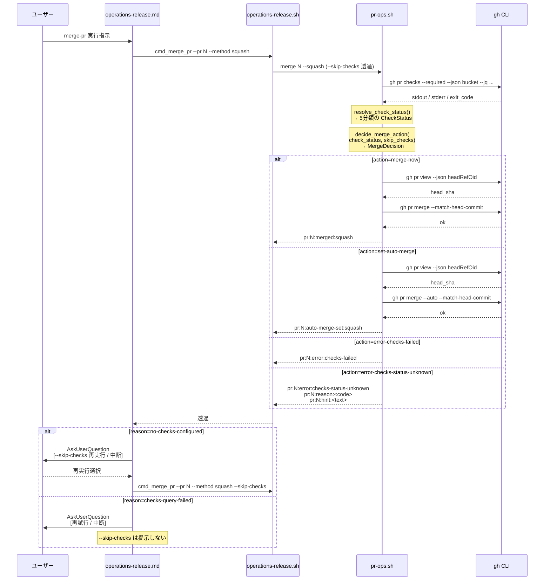

# 論理設計: Unit 003 merge-pr `--skip-checks` オプション追加

## 概要

ドメインモデル（`unit_003_merge_pr_skip_checks_domain_model.md`）を Bash スクリプト（`pr-ops.sh` / `operations-release.sh`）とドキュメント（`operations-release.md`、guides）に写像する論理設計。`--skip-checks` フラグの安全な適用範囲（`no-checks-configured` のみ）を実装レイヤーで保証し、機械可読な `reason:<code>` / `hint:<text>` 補助行の出力順序契約を固定する。

**重要**: この論理設計では**コードは書かず**、コンポーネント構成とインターフェース定義のみを行います。

## 責務境界の再確認（ドメインモデルとの対応）

| ドメイン層 | 実装ファイル | 実装関数（論理名） |
|-----------|------------|------------------|
| 判定ドメイン（`CheckStatusResolver`） | `skills/aidlc/scripts/pr-ops.sh` | `resolve_check_status()` |
| 決定ドメイン（`MergeDecisionFactory`） | `skills/aidlc/scripts/pr-ops.sh` | `cmd_merge()` 内の判定分岐（既存と新規統合） |
| 実行ドメイン（`MergeExecutor`） | `skills/aidlc/scripts/pr-ops.sh` | `cmd_merge()` 内の `gh pr merge` 呼び出し |
| 出力契約（`OutputContractEmitter`） | `skills/aidlc/scripts/pr-ops.sh` | `emit_checks_status_unknown_error()`（新規ヘルパー） |
| 呼び出しラッパー | `skills/aidlc/scripts/operations-release.sh` | `cmd_merge_pr()`（既存 + `--skip-checks` 透過） |
| ユーザー対話層 | `skills/aidlc/steps/operations/operations-release.md` 7.13 節 | markdown 手順（`AskUserQuestion` 分岐） |
| 挙動リファレンス | `skills/aidlc/guides/merge-pr-usage.md`（新規） | markdown |

**注**: Bash は厳密な OOP を提供しないため、ドメインモデルの「値オブジェクト」「集約」は関数の引数・ローカル変数・出力フォーマットとして写像する。凝集度はファイル・関数境界で表現し、`--match-head-commit` 等の不変条件は関数内の早期 return・共通呼び出しで担保する。

## アーキテクチャパターン

**レイヤード・シェルスクリプト + 出力契約駆動**:

- 判定・決定・実行・出力を**関数境界で分離**し、単一ファイル内でもドメイン責務を明確化
- **出力契約**（`pr:<N>:<kind>:<value>` 形式の複数行出力）をスクリプト間のインターフェースとし、上位層（`operations-release.md`）は標準 grep / awk / sed で機械的にパース可能
- 既存出力との**後方互換**を維持するため、新規行（`reason:` / `hint:`）は既存行の後ろに追加するだけで、既存出力文字列の変更は行わない

## コンポーネント構成

### レイヤー / モジュール構成

```text
operations-release.sh (呼び出しラッパー層)
└── cmd_merge_pr()
    ├── 引数パーサ（新規: --skip-checks）
    └── 透過呼び出し → pr-ops.sh merge [--skip-checks]

pr-ops.sh (ドメイン + 実行層)
└── cmd_merge()
    ├── 引数パーサ（新規: --skip-checks）
    ├── resolve_check_status() ← 新規（判定ドメイン）
    ├── decide_merge_action()   ← 新規（決定ドメイン。インラインでも可、設計では論理関数として分離）
    ├── 既存: gh pr merge 呼び出し（実行ドメイン）
    └── emit_checks_status_unknown_error()  ← 新規（出力契約）

steps/operations/operations-release.md 7.13 節 (ユーザー対話層)
├── error:checks-status-unknown 検出
├── 続く行の reason:<code> をパース
├── reason=no-checks-configured → AskUserQuestion（--skip-checks 再実行 / 中断）
└── reason=checks-query-failed → AskUserQuestion（再試行 / 中断）

guides/merge-pr-usage.md (挙動リファレンス層)
└── 挙動マトリクス + 使い分けガイダンス + エラーコード一覧
```

### コンポーネント詳細

#### `pr-ops.sh :: resolve_check_status()`（新規ヘルパー関数）

- **責務**: `gh pr checks --required --json bucket --jq ...` の**生結果**（stdout / stderr / exit code）を単一 I/O 境界で取得し、`CheckStatus` 値（5 分類の文字列）を返す
- **依存**: `gh` CLI（`GhCliGateway` の写像）
- **公開インターフェース**:
  - 入力: `pr_number`（位置引数）
  - 出力: 標準出力に 5 分類の文字列（`pass` / `fail` / `pending` / `no-checks-configured` / `checks-query-failed`）のいずれか 1 つを出力
  - 終了コード: 常に 0（関数の戻り値に関わらず呼び出し元で解析）
- **判定順序**（ドメインモデルの不変条件と厳密に一致）:
  1. `gh pr checks --required --json bucket --jq ...` を実行し、stdout を `checks_output`、stderr を `checks_stderr`、exit code を `checks_ec` に取得
  2. `checks_output` が `"pass"` / `"fail"` / `"pending"` のいずれか → **exit code に関わらず** その値を出力
  3. `checks_ec != 0` かつ `checks_stderr` に `"no checks reported"` を含む → `no-checks-configured` を出力
  4. それ以外 → `checks-query-failed` を出力
- **exit code 非依存で stdout を優先する理由**: `gh pr checks` は pending 時に**追加 exit code 8** を返す公式仕様（`cli.github.com/manual/gh_pr_checks`）。`checks_ec == 0` を必須条件にすると pending が検出できず `checks-query-failed` に誤分類される（既存挙動の regression）。stdout が確定値（`pass`/`fail`/`pending`）を返した場合は必ずそれを採用する
- **不変条件**: 判定順序 2 → 3 → 4 を厳守（2 を飛ばすと既存挙動が壊れる。3 を 4 より後に置くと `no-checks-configured` が永遠に判定されない）

#### `pr-ops.sh :: cmd_merge()`（既存、改修）

- **責務**: CLI 引数を解釈し、`resolve_check_status()` → `decide_merge_action()` → 実行・出力を連携
- **依存**: `resolve_check_status()`, `decide_merge_action()`, `emit_checks_status_unknown_error()`, 既存の `gh pr view` / `gh pr merge` 呼び出し
- **処理順序の不変条件**:
  1. `resolve_check_status()` で `check_status` 確定
  2. `decide_merge_action(check_status, skip_checks)` で `action` 決定
  3. `action` がエラー系（`error-checks-failed` / `error-checks-status-unknown`）の場合、即座にエラー出力して exit 1（`head_sha` 取得をスキップ）
  4. `action` が `merge-now` / `set-auto-merge` の場合のみ `gh pr view` で `head_sha` を解決
  5. `--match-head-commit <head_sha>` を付与して `gh pr merge` を呼び出す
- **公開インターフェース（CLI）**:

  | 引数 | 必須/任意 | 説明 |
  |------|----------|------|
  | `<pr_number>` | 必須 | PR 番号 |
  | `--squash` | 任意 | squash マージ |
  | `--rebase` | 任意 | rebase マージ |
  | `--skip-checks` | **新規・任意** | `no-checks-configured` 時のみ CI バイパスを許可 |
  | `-h` / `--help` | 任意 | ヘルプ表示 |

- **決定ドメインの実装**（`decide_merge_action()` を論理的に分離、実装では同一関数内のインライン分岐でも可）:

  ```text
  check_status = resolve_check_status(pr_number)
  case check_status in
    "pass")                    action = merge-now ;;
    "fail")                    action = error-checks-failed ;;
    "pending")                 action = set-auto-merge ;;
    "no-checks-configured")
      if skip_checks then action = merge-now
      else action = error-checks-status-unknown; reason = no-checks-configured
      fi ;;
    "checks-query-failed")
      action = error-checks-status-unknown; reason = checks-query-failed
      (skip_checks は**無視**) ;;
  esac
  ```

- **不変条件**:
  - `action=merge-now` または `action=set-auto-merge` の場合、必ず `head_sha` を先行解決し、`gh pr merge` に `--match-head-commit <head_sha>` を付与
  - `fail` / `pending` / `checks-query-failed` で `--skip-checks` が指定されていても、action は変化しない（**安全性契約**）

#### `pr-ops.sh :: emit_checks_status_unknown_error()`（新規ヘルパー関数）

- **責務**: `error:checks-status-unknown` 系エラーの**順序固定な出力契約**を単一の関数で実装
- **依存**: なし（純粋な出力関数）
- **公開インターフェース**:
  - 入力: `pr_number`, `reason_code`（`no-checks-configured` | `checks-query-failed`）
  - 出力（stdout、順序固定）:
    1. `pr:<pr_number>:error:checks-status-unknown`
    2. `pr:<pr_number>:reason:<reason_code>`
    3. `pr:<pr_number>:hint:<日本語ガイダンス>`
  - 終了コード: 呼び出し元に委譲（この関数は出力のみ。呼び出し元が `return 1` する）
- **hint 文言テーブル**（固定文字列、スクリプト内で定数として保持）:

  | `reason_code` | hint 文言（固定） |
  |---------------|-----------------|
  | `no-checks-configured` | `この PR では必須 CI チェックが検出されませんでした。リポジトリに必須チェックが未設定の場合は --skip-checks を付与してバイパスできます（failed/pending/API エラー時は無効）。` |
  | `checks-query-failed` | `CI チェック状態の取得に失敗しました（ネットワークまたは API エラーの可能性）。--skip-checks では回避できません。時間を置いて再試行してください。` |

- **不変条件**: 3 行を連続出力する。途中に他の出力を挟まない

#### `operations-release.sh :: cmd_merge_pr()`（既存、改修）

- **責務**: `--skip-checks` を含む引数を `pr-ops.sh merge` に**透過**する薄いラッパー。ドメイン判定は一切持たない
- **依存**: `pr-ops.sh merge`
- **公開インターフェース（CLI）**:

  | 引数 | 必須/任意 | 説明 |
  |------|----------|------|
  | `--pr <N>` | 必須 | PR 番号 |
  | `--method <merge\|squash\|rebase>` | 必須 | マージ方法 |
  | `--skip-checks` | **新規・任意** | `pr-ops.sh merge --skip-checks` に透過 |
  | `--dry-run` | 任意 | 既存動作 |
  | `-h` / `--help` | 任意 | ヘルプ表示 |

- **透過ルール**:
  - `--skip-checks` が指定されていれば、`pr-ops.sh merge <PR> --<method>` に `--skip-checks` を追加して呼び出す
  - `--dry-run` の場合は `would run: pr-ops.sh merge <PR> --<method> --skip-checks` 形式で出力
- **責務の境界**: `cmd_merge_pr()` は CI 状態を判定しない。判定ドメインは `pr-ops.sh` に閉じる

#### `operations-release.md 7.13 節`（既存、改修）

- **責務**: `merge-pr` 実行結果を機械可読にパースし、ユーザー対話を構築
- **新規フロー**（`AskUserQuestion` 分岐）:

  ```text
  merge-pr 実行
    ├─ 成功 (merged / auto-merge-set) → 完了
    └─ error:checks-status-unknown 検出
        ├─ 続く行の reason:<code> をパース
        ├─ reason=no-checks-configured
        │    └─ AskUserQuestion: [--skip-checks で再実行 / 中断]
        │         ├─ 再実行 → merge-pr --skip-checks を呼び直し
        │         └─ 中断 → ユーザー判断で次のアクション
        └─ reason=checks-query-failed
             └─ AskUserQuestion: [再試行 / 中断]
                  ├─ 再試行 → merge-pr を同じ引数で再呼び出し
                  └─ 中断 → ユーザー判断で次のアクション
  ```

- **不変条件**: `reason:checks-query-failed` では `--skip-checks` オプションを**提示してはならない**（安全性契約）

#### `guides/merge-pr-usage.md`（新規）

- **責務**: `merge-pr` の挙動リファレンス。利用者がどの状況で `--skip-checks` を使うべきか判断できる
- **構成**:
  1. 概要（1 段落）
  2. 挙動マトリクス（CI 状態 5 分類 × `--skip-checks` 有無 → `action` の全 10 セル）
  3. 使い分けガイダンス（`--skip-checks` を使うべきケース / 使ってはいけないケース）
  4. CI 状態の判定フロー（`no-checks-configured` vs `checks-query-failed` の見分け方）
  5. エラーコード一覧（`error:checks-status-unknown` / `error:checks-failed` / `error:head-sha-unavailable` 等）とユーザー対応

## インターフェース設計

### コマンド

#### `pr-ops.sh merge <pr_number> [--squash|--rebase] [--skip-checks]`

- **パラメータ**:
  - `<pr_number>`: integer - PR 番号（必須）
  - `--squash` / `--rebase`: マージ方法（どちらも指定なしの場合は merge commit）
  - `--skip-checks`: flag - `no-checks-configured` 時のみ CI バイパスを許可
- **戻り値**: stdout に出力契約に従う文字列を出力、exit code は成功 0 / エラー 1
- **副作用**: `gh pr merge` による実際のマージ実行

#### `operations-release.sh merge-pr --pr <N> --method <merge|squash|rebase> [--skip-checks] [--dry-run]`

- **パラメータ**:
  - `--pr <N>`: PR 番号（必須）
  - `--method`: マージ方法（必須、`merge` / `squash` / `rebase`）
  - `--skip-checks`: flag - `pr-ops.sh merge --skip-checks` に透過
  - `--dry-run`: 副作用を抑止
- **戻り値**: `pr-ops.sh merge` の stdout / exit code を透過
- **副作用**: `--dry-run` 未指定時のみ `pr-ops.sh merge` を呼び出す

## スクリプトインターフェース設計

### pr-ops.sh（改修後）

#### 成功時出力（merge サブコマンド）

```text
pr:<N>:merged:<method>
```

または

```text
pr:<N>:auto-merge-set:<method>
```

- 終了コード: `0`
- 出力先: stdout

#### エラー時出力（merge サブコマンド）

**既存エラー**:

```text
pr:<N>:error:<code>
```

`<code>` の既存値: `checks-failed` / `head-sha-unavailable` / `not-found` / `not-mergeable` / `review-required` / `head-mismatch` / `auto-merge-not-enabled` / `permission-denied` / `invalid-merge-method` / `unknown`

**`checks-status-unknown` 系エラー（本 Unit 改修）**:

```text
pr:<N>:error:checks-status-unknown
pr:<N>:reason:<reason_code>
pr:<N>:hint:<日本語ガイダンス>
```

- `<reason_code>`: `no-checks-configured` | `checks-query-failed`
- 終了コード: `1`
- 出力先: stdout
- **順序固定**: `error` → `reason` → `hint` の順、連続 3 行

### operations-release.sh（改修後、merge-pr サブコマンドのみ記載）

- **入出力**: `pr-ops.sh merge` の透過（既存挙動維持）
- **新規オプション**: `--skip-checks`（`pr-ops.sh merge --skip-checks` に透過）
- **`--dry-run` 時の出力**: `would run: <script_dir>/pr-ops.sh merge <PR> --<method_flag> --skip-checks`（`--skip-checks` ありの場合のみ末尾に追加）

## データモデル概要

本ドメインは永続化を持たない。ただしスクリプト内の**値の受け渡し**は以下のインメモリ構造で行う:

### `CheckStatus`（Bash 変数）

- 型: string（5 分類のいずれか）
- 保持場所: `cmd_merge()` ローカル変数 `check_status`
- 生成: `resolve_check_status()` の stdout をコマンド置換（`$(...)`）で取得する（既存スクリプト `pr-ops.sh` / `validate-git.sh` と同じパターン。CLAUDE.md の `$()` 禁止ルールは**コマンド入力時**の制約であり、`.sh` ファイル内の実装では既存規約どおり許容される。本プロジェクトの設計規約は `v2.3.0 Unit 006 logical design L337` で明文化済み）

### `MergeDecision`（Bash ローカル変数の組）

- 型:
  - `action`: string（`merge-now` / `set-auto-merge` / `error-checks-failed` / `error-checks-status-unknown`）
  - `reason_code`: string（`none` / `no-checks-configured` / `checks-query-failed` / `checks-failed`）
- 保持場所: `cmd_merge()` ローカル変数

## 処理フロー概要

### ユースケース 1: `pr-ops.sh merge <N> --squash`（`--skip-checks` なし、既存挙動）

**処理順序の原則（ドメインモデル整合）**: `check_status` を先に確定し、`action=merge-now` / `set-auto-merge` に到達した場合にのみ `head_sha` を解決する。これにより `error:checks-status-unknown` / `error:checks-failed` の経路では `gh pr view` 呼び出しを省略でき、障害伝播範囲が縮小する。

**ステップ**:

1. 引数パース（`--skip-checks` は 0）
2. `gh` 可用性確認（既存）
3. `resolve_check_status(pr_number)` 呼び出し → `check_status` 受領
4. `decide_merge_action(check_status, skip_checks=0)` で `action` 決定
5. `action` で分岐:
   - `action=error-checks-failed` → `pr:<N>:error:checks-failed` 出力 → exit 1（`head_sha` 取得をスキップ）
   - `action=error-checks-status-unknown` → `emit_checks_status_unknown_error(pr_number, reason_code)` → exit 1（`head_sha` 取得をスキップ）
   - `action=merge-now` / `set-auto-merge` → ステップ 6 へ
6. `gh pr view --json headRefOid` で `head_sha` 取得（失敗時 `error:head-sha-unavailable` → exit 1）
7. `action` による実行:
   - `merge-now` → `gh pr merge --match-head-commit <head_sha>` 実行 → `pr:<N>:merged:squash` 出力
   - `set-auto-merge` → `gh pr merge --auto --match-head-commit <head_sha>` 実行 → `pr:<N>:auto-merge-set:squash` 出力

**関与するコンポーネント**: `cmd_merge()`, `resolve_check_status()`, `decide_merge_action()`, `emit_checks_status_unknown_error()`

### ユースケース 2: `pr-ops.sh merge <N> --squash --skip-checks`（`no-checks-configured` 時の即時マージ）

**ステップ**:

1. 引数パース（`--skip-checks` は 1）
2. gh 可用性確認
3. `resolve_check_status()` → `no-checks-configured` を受領
4. `decide_merge_action(no-checks-configured, skip_checks=1)` → `action=merge-now`
5. `gh pr view --json headRefOid` で `head_sha` 取得
6. `gh pr merge --match-head-commit <head_sha>` 実行 → `pr:<N>:merged:squash` 出力

### ユースケース 3: `pr-ops.sh merge <N> --squash --skip-checks`（`fail` 時でもバイパスされない）

**ステップ**:

1. 引数パース（`--skip-checks` は 1）
2. gh 可用性確認
3. `resolve_check_status()` → `fail` を受領
4. `decide_merge_action(fail, skip_checks=1)` → `action=error-checks-failed`（`skip_checks` は**無視**）
5. `pr:<N>:error:checks-failed` 出力 → exit 1（`head_sha` 取得をスキップ）

**不変条件検証**: ステップ 4 で `skip_checks` を参照しないことが重要。実装時はこの順序（CheckStatus を先に決定 → skip_checks は `no-checks-configured` のみで参照）を守る。`head_sha` 取得はエラー経路ではスキップされる。

### ユースケース 4: `operations-release.md` 7.13 節での `AskUserQuestion` 分岐

**ステップ**:

1. `operations-release.sh merge-pr --pr <N> --method squash` を実行
2. stdout を機械的に grep:
   - `pr:<N>:error:checks-status-unknown` が出力されたら、続く行から `pr:<N>:reason:<code>` をパース
3. `reason=no-checks-configured`:
   - `AskUserQuestion` で 2 択（`--skip-checks で再実行` / `中断`）を提示
   - 再実行選択時 → `operations-release.sh merge-pr --pr <N> --method squash --skip-checks` を実行
4. `reason=checks-query-failed`:
   - `AskUserQuestion` で 2 択（`再試行` / `中断`）を提示
   - 再試行選択時 → 同じ引数で再呼び出し（`--skip-checks` は**提示しない**）

**シーケンス図**:



## 非機能要件（NFR）への対応

### パフォーマンス

- **要件**: 既存と同等（Unit 定義 NFR）
- **対応策**: `gh pr checks` の呼び出し回数は 1 回（既存と同じ）。stderr 捕捉は同一プロセス内で追加コストなし

### セキュリティ（安全性契約）

- **要件**: `fail` / `pending` では必ず拒否。`--skip-checks` を指定しても CI を無視した不正マージを防ぐ（Unit 定義 NFR）
- **対応策**:
  - `decide_merge_action()` の決定表で `fail` / `pending` / `checks-query-failed` は `skip_checks` に関わらず `action=merge-now` に遷移しない
  - 単体テストで 10 セル（5 状態 × `--skip-checks` 有無）をすべてカバーし、回帰を防ぐ
  - `checks-query-failed` は fail-closed（安全側に倒す）で、ネットワーク障害時のバイパスを構造的に排除

### スケーラビリティ

- **要件**: N/A（Unit 定義 NFR）

### 可用性

- **要件**: `--skip-checks` を指定しない場合、既存呼び出しの挙動と完全互換（Unit 定義 NFR）
- **対応策**:
  - 既存の `pr:<N>:error:checks-status-unknown` は**維持**（新規行は追加のみ）
  - `--skip-checks` なしの既存呼び出しは、`resolve_check_status()` が `pass` / `fail` / `pending` を返す限り従来と同一経路を通る
  - `unknown` バケットが `no-checks-configured` / `checks-query-failed` の 2 分類に分離されたことによる外部呼び出し元の挙動変化は、既存の error code プレフィックスが保持されているため発生しない（追加の reason / hint 行を無視する呼び出し元は既存通り動作）

## 技術選定

- **言語**: Bash（既存スクリプトと同じ）
- **フレームワーク**: なし（POSIX シェル互換を維持）
- **ライブラリ**: `gh` CLI（既存）、`jq`（既存、`gh --jq` 経由）

## 既存ガイドとの照合（`.aidlc/rules.md` 準拠）

### `skills/aidlc/guides/exit-code-convention.md`

- 本 Unit の exit code 契約:
  - `action=merge-now` / `set-auto-merge` 成功 → exit 0
  - `error:*` 系すべて → **exit 1（既存 `pr-ops.sh` 互換のため例外的に維持）**
- ガイドの厳密な意味論では、`checks-query-failed`（外部コマンド失敗系）や `head-sha-unavailable`（外部コマンド失敗系）は exit 2（システムエラー）が本来の分類に該当する
- **ただし**、既存 `pr-ops.sh cmd_merge()` は全 `error:*` 経路で `return 1` を返しており、`merge-pr` を呼び出す `operations-release.md` 7.13 節および他の呼び出し元は exit 1 前提で判定しているため、本 Unit では**既存挙動との後方互換を優先**し exit 1 を維持する
- 将来 exit code を整理する場合は、`operations-release.md` / `operations-release.sh` / `pr-ops.sh` を横断した整合が必要なため、本 Unit のスコープ外とし改善提案としてバックログ化を設計レビュー時に検討する
- 結果として、本 Unit は `exit-code-convention.md` の「原則」に完全準拠するのではなく、「既存 `pr-ops.sh` の exit 1 統一」という上位互換制約を優先する設計である

### `skills/aidlc/guides/error-handling.md`

- 本 Unit の error 出力は `pr:<N>:error:<code>` プレフィックスを維持
- `reason:` / `hint:` の補助行追加は既存ガイド違反なし（機械可読な拡張）

### `skills/aidlc/guides/backlog-management.md`

- 設計レビュー時にスコープ外の改善提案（`skipping` / `cancel` bucket の扱い、`gh` 構造化 error code への将来移行等）が発生した場合、バックログに登録する

## 実装上の注意事項

### 出力順序契約の厳守

- `emit_checks_status_unknown_error()` は必ず 3 行連続で出力する。途中に `echo` や他の関数呼び出しを挟まない
- 呼び出し元（`cmd_merge()`）は、この関数呼び出し後に stdout にログを出さないこと（出力順序が崩れる）

### `resolve_check_status()` の実装パターン（設計で固定）

Bash での stdout / stderr / exit code の同時取得は、既存 `pr-ops.sh` と `validate-git.sh` のパターンに揃え、以下を**設計確定方針**とする:

```text
# 疑似コード（実装フェーズで関数化する）
resolve_check_status(pr_number):
    stderr_file = mktemp               # stderr を一時ファイルに退避

    # if/else で exit code を保持（|| true は使わない）
    if stdout_value = $(gh pr checks "$pr_number" --required --json bucket --jq '...' 2>"$stderr_file"); then
        checks_ec = 0
    else
        checks_ec = $?                  # 非 0 をそのまま保持
    fi
    stderr_value = $(< "$stderr_file")  # $(< file) で高速読み取り
    rm -f "$stderr_file"                # 即時クリーンアップ（EXIT/RETURN trap は使わない）

    # stdout が確定値なら exit code に関わらず優先（pending は exit 8 を返す公式仕様）
    if stdout_value matches /^(pass|fail|pending)$/:
        echo stdout_value
    elif checks_ec != 0 AND stderr_value contains "no checks reported":
        echo "no-checks-configured"
    else:
        echo "checks-query-failed"
```

**クリーンアップ契約の注意事項**:
- **`trap ... EXIT` は関数内で使用しない**: Bash の `EXIT` trap はシェル全体に効くため、関数内で設定すると呼び出し元の既存 `EXIT` trap を上書きしたり、関数終了後も副作用が残る
- **`trap ... RETURN` も避ける**: 関数内 trap は複雑さを招くため、代わりに**明示的な `rm -f` をリターン前に実行する**方針とする
- エラー経路でも `rm -f` が呼ばれるよう、早期 return せず最後にクリーンアップ → 判定結果 echo の順で実装する

**方針の根拠**:
- `$()`（コマンド置換）は `.sh` ファイル内での使用が既存規約で許容されている（`v2.3.0 Unit 006 logical design L337` 参照）。CLAUDE.md の禁止ルールは**コマンド入力時**（Bash ツールで実行する際の直接コマンド）に限定される
- `mktemp` + `2>file` パターンは既存 `validate-git.sh` / `squash-unit.sh` でも採用されており、既存コードスタイルと整合する
- **`|| true` は禁止**: `cmd || true` の後に `$?` を取得すると常に 0 を拾うため、`no-checks-configured` / `checks-query-failed` を正しく判定できない。`if/else` 形式で exit code を保持する

**実装時の禁止パターン**:

```bash
# NG: || true の後の $? は常に 0 を返す
stdout=$(gh ... 2>"$stderr_file") || true
ec=$?   # 常に 0。誤った判定になる
```

**実装時の推奨パターン**:

```bash
# OK: if/else で exit code を保持
if stdout=$(gh ... 2>"$stderr_file"); then
    ec=0
else
    ec=$?
fi
```

### `$()` 使用ルール（既存規約）

- `.sh` ファイル内: コマンド置換（`$()`）は**許容**（既存規約 `v2.3.0 Unit 006 logical design L337`）
- コマンド入力時（Bash ツール直接呼び出し等）: 禁止（CLAUDE.md ルール、本 Unit のスコープ外）
- 本 Unit の実装は `.sh` ファイル内のため、`$()` を使用する

### `--match-head-commit` の付与

- `action=merge-now` と `action=set-auto-merge` の両経路で、`gh pr merge` に必ず `--match-head-commit <head_sha>` を付与する（race condition 防止の不変条件）

### `no checks reported` 文言マッチの脆弱性対策

- `gh` CLI のバージョンアップで文言が変わる可能性があるため、以下で安全側に倒す:
  - 文言マッチ成功 → `no-checks-configured`
  - 文言マッチ失敗 → `checks-query-failed`（安全側: `--skip-checks` でバイパスされない）
- 長期対応は本 Unit のスコープ外（ドメインモデル Q3 参照）

### テストのモック戦略

- `gh` CLI の挙動を bash 関数で置換する既存テストパターン（`validate-git.sh` テスト等）に準拠
- 5 状態をすべてモックで再現し、全 10 セル（× `--skip-checks` 有無）をカバー
- `no-checks-configured` の再現は、`gh pr checks` モックで stderr に `no checks reported` + exit 1 を返すスタブを使用

## 不明点と質問

[Question] `gh pr checks --required --json bucket` が空配列を返した場合（必須チェックが 0 件、かつ `gh` が exit 0 で返す稀なケース）、現行 jq ロジックは `"pass"` にマップする。本 Unit の判定順序 2（`checks_output == "pass"` なら exit code に関わらず `pass`）で扱うと、「必須チェック 0 件」は `no-checks-configured` ではなく `pass` として即時マージされる。これは意図通りか？
[Answer] 意図通り。現行実装と同じ。`gh pr checks --required --json bucket` が exit 0 で空配列を返す場合は「取得は成功したが必須チェックは 0 件」であり、ブロック要因がないため `pass` として即時マージが安全。`no-checks-configured` が発生するのは `gh` が exit 1 + `no checks reported` を返す別ケース（必須 / 非必須を問わずチェックが一つも存在しない、reportable チェック 0 件）。したがってこれは既存の `pass` 経路で問題なく、`--skip-checks` も不要で動作する。

[Question] `resolve_check_status()` で stderr を取得する際、Bash の実装で `2>` を一時ファイルにリダイレクトするか、`stderr` を変数に代入するか。どちらが既存コードスタイルと整合するか？
[Answer] 既存 `pr-ops.sh` および `validate-git.sh` の実装パターンに合わせる。`validate-git.sh run_remote_sync` では `git ...` の stderr を一時ファイル経由で捕捉している実装が存在するが、`pr-ops.sh` の既存 `gh pr view` 呼び出しは stderr を `/dev/null` に捨てている。本 Unit では**新規関数**を作成するため、シンプルな実装として Bash の `exec` / `{command} 2> >(...)` / 一時ファイルいずれも選択可能。実装フェーズで既存スクリプトのコーディング規約（`scripts-guide.md` や `script-design-guideline.md`）を確認し、最も整合する方法を採用する。設計としては「stderr を取得できる方法であれば実装方法は問わない」とし、テストで stderr マッチが正しく動くことを検証する。

[Question] `operations-release.md` 7.13 節の `AskUserQuestion` 分岐で、`reason:no-checks-configured` の選択肢に「`--skip-checks` で再実行」を含める実装は、`automation_mode=semi_auto` でもユーザー確認必須か？
[Answer] ユーザー確認必須。PR マージは `common/rules.md` の「ユーザー選択」分類（破壊的・不可逆）に該当し、`automation_mode` に関わらず `AskUserQuestion` を使用する既存契約（`operations-release.md` 7.13 節の既存記述「PRマージは破壊的・不可逆操作…automation_mode に関わらず自動化対象外」）に準拠する。`--skip-checks` 再実行はさらに CI をバイパスする判断であり、安全側に倒してユーザー明示承認を必須とする。
