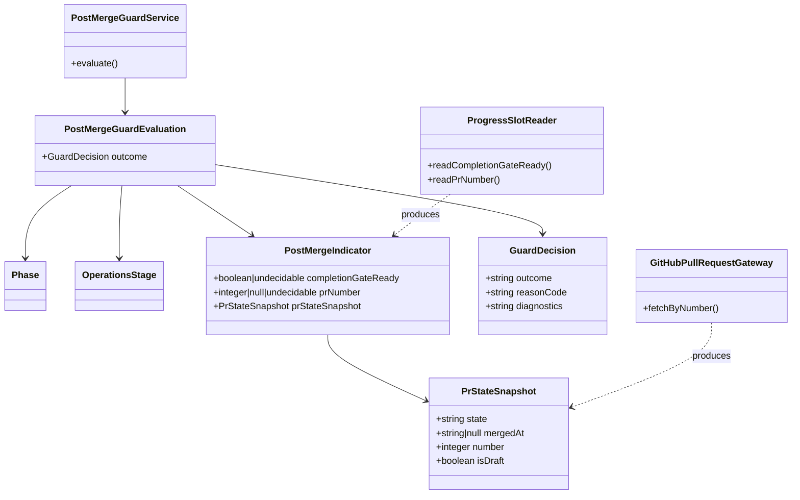

# ドメインモデル: Unit 002 - write-history.sh マージ後呼び出しガード

## 概要

Operations Phase のマージ後（7.8〜7.13 以降）に `write-history.sh` が誤って呼ばれ、削除予定の cycle ブランチに未コミットの履歴追記が残留する事象を検出・拒否するためのドメインモデル。ガード判定は「post-merge 識別の確実性」と「既存呼び出しの後方互換性」を両立するよう、引数主導の明示シグナルと GitHub 実態確認の AND 条件フォールバックで構成する（DR-001 / 関連: `phase-recovery-spec.md §5.3.4`・§5.3.6）。

**重要**: このドメインモデル設計では**コードは書かず**、構造と責務の定義のみを行います。実装は Phase 2（コード生成ステップ）で行います。

## エンティティ（Entity）

本ドメインは短命な判定プロセスであり、永続化されるエンティティは持たない。代わりに「判定プロセスの入力と結果」を値オブジェクトとして扱う。

## 値オブジェクト（Value Object）

### Phase

- **属性**: `value: string`（`inception` | `construction` | `operations`）
- **不変性**: 生成時に指定された値を変更しない。
- **等価性**: `value` の文字列一致で判定。
- **意味**: ガード判定は `operations` のみを対象とし、それ以外は常に従来動作（appended / created）。

### OperationsStage

- **属性**: `value: string | null`（`pre-merge` | `post-merge` | `null`（未指定））
- **不変性**: 呼び出し時点の引数値を保持し変更しない。
- **等価性**: `value` の文字列一致で判定。
- **意味**:
  - `post-merge` はガード第一条件の明示的シグナル。
  - `pre-merge` は「正常な pre-merge 呼び出し」の明示的シグナル（第二条件の AND 評価を回避）。
  - `null`（未指定）は後方互換のため既存呼び出しを維持しつつ、Phase が `operations` の場合は第二条件フォールバックの対象となる。
- **不正値**: `pre-merge` / `post-merge` 以外が渡された場合は `InvalidOperationsStage` として扱い、引数不正（exit 1）。

### PostMergeIndicator

- **属性**:
  - `completionGateReady: boolean | undecidable`（progress.md 読取結果。読み取り失敗・不明は `undecidable`）
  - `prNumber: integer | null | undecidable`（progress.md から取得した PR 番号。未記入 / 不正値は `null`）
  - `prStateSnapshot: PrStateSnapshot | undecidable`（`gh pr view` の結果スナップショット）
- **不変性**: 判定プロセス 1 回分の入力スナップショットとして扱い、同一判定の途中で再評価しない（gh 呼び出しは 1 回限り）。
- **等価性**: 構造的等価性（全フィールドが同値）。

### PrStateSnapshot

- **属性**:
  - `state: "OPEN" | "CLOSED" | "MERGED" | undecidable`
  - `mergedAt: string | null | undecidable`
  - `number: integer | undecidable`
  - `isDraft: boolean | undecidable`
- **不変性**: `gh` 応答のパース結果を保持し、以後の判定中は再取得しない。
- **等価性**: 構造的等価性。
- **undecidable 化条件**（§5.3.6 信頼境界契約に準拠）:
  - `gh pr view` コマンド非ゼロ終了
  - JSON パース失敗
  - 必須フィールド（`isDraft` / `state` / `number`）の欠損 or null
  - `state` が未知値
  - 取得した `number` が要求 `prNumber` と不一致

### GuardDecision

- **属性**:
  - `outcome: "reject" | "pass"`
  - `reasonCode: string`（`post-merge-history-write-forbidden` | `pre-merge-explicit` | `fallback-passes-<cause>` | `not-operations-phase`）
  - `diagnostics: string`（機械可読な診断情報。機密情報は含まない）
- **不変性**: 判定結果は決定後変更しない。
- **等価性**: `outcome` + `reasonCode` の組み合わせで判定。
- **意味**: `outcome=reject` の場合、呼び出し側は exit 3 + **機械可読メッセージ `error:post-merge-history-write-forbidden:<reason_code>:<diagnostics>` を stdout と stderr の両方に重複出力する**。stdout 出力は既存 `emit_error()`（`skills/aidlc/scripts/lib/validate.sh`）パターンとの後方互換のため必須（既存エラー出力チャネルとの一貫性）、stderr 出力は Unit 定義 / Story 1.2 受け入れ基準の「標準エラーに `error:post-merge-history-write-forbidden` 形式を出力」要件を満たすため必須。どちらのチャネルでも同一の機械可読形式を保証する。`outcome=pass` の場合、従来動作（appended / created）を継続する。

## 集約（Aggregate）

### PostMergeGuardEvaluation（判定プロセス集約）

- **集約ルート**: `GuardDecision`
- **含まれる要素**: `Phase`, `OperationsStage`, `PostMergeIndicator`, `PrStateSnapshot`
- **境界**: 1 回の `write-history.sh` 呼び出し内で閉じる短命な判定プロセス。判定結果の外部永続化はなく、**reject 時は同一の機械可読メッセージ `error:post-merge-history-write-forbidden:<reason_code>:<diagnostics>` を stdout と stderr の両方に重複出力し、exit code 3 で終了する**。これ以外の副作用は持たない（stdout 出力は既存 `emit_error` 互換、stderr 出力は Unit 定義 / Story 1.2 の受け入れ基準準拠）。
- **不変条件**:
  - `Phase != operations` の場合、`GuardDecision.outcome` は必ず `pass` かつ `reasonCode=not-operations-phase` となる。
  - `OperationsStage=post-merge` の場合、`GuardDecision.outcome` は必ず `reject` かつ `reasonCode=post-merge-history-write-forbidden`（第一条件優先）。
  - `OperationsStage=pre-merge` の場合、`GuardDecision.outcome` は必ず `pass` かつ `reasonCode=pre-merge-explicit`（第二条件フォールバックを回避）。
  - `OperationsStage=null` かつ `Phase=operations` のとき、`PostMergeIndicator` の全条件（`completionGateReady=true` AND `PrStateSnapshot` が MERGED 確定）を満たす場合のみ `reject`、それ以外は `pass`（`fallback-passes-*` のいずれかの理由）。
  - `PrStateSnapshot` が `undecidable` のいずれかの要素を含む場合、判定プロセス全体は `pass`（`fallback-passes-undecidable`）に倒す（偽陽性排除 / DR-001 の undecidable 扱い）。

## ドメインサービス

### PostMergeGuardService

- **責務**: `PostMergeGuardEvaluation` の評価を実行し `GuardDecision` を返す。
- **操作**:
  - `evaluate(phase: Phase, stage: OperationsStage, indicator: PostMergeIndicator) -> GuardDecision`
  - 入力に `PrStateSnapshot` が未解決の場合、`GitHubPullRequestGateway.fetchByNumber()` を介して 1 回だけ取得する。取得は判定ごとにキャッシュし、再呼び出ししない。

### ProgressSlotReader

- **責務**: `operations/progress.md` から `completion_gate_ready` / `pr_number` を読み取り、`PostMergeIndicator` の該当フィールドを生成する。
- **操作**:
  - `readCompletionGateReady(path: string) -> boolean | undecidable`
  - `readPrNumber(path: string) -> integer | null | undecidable`
- **ドメインルール**（`phase-recovery-spec.md §5.3.5` の意図的サブセット）:
  - `key=value` 形式、値前後の空白をトリム。
  - 重複キーは最初の出現値を採用。
  - boolean は `true`/`false` 小文字固定。それ以外は `undecidable`（format_error 相当）。
  - integer は `^[1-9][0-9]*$` のみ許容。0 / 負数 / 非数値は `undecidable`（format_error 相当）。
  - 未知キーは無視、行頭 `#` はコメントとして無視。**インラインコメント（値の後の `# ...`）も §5.3.5 の「`#` 以降はコメント」規則に従い削除してから trim する。**
- **本 Unit で対応しない §5.3.5 要素と許容根拠**:
  - 1 行内カンマ区切り併記・grammar version HTML コメント検証・独立行以外の併記は **非サポート**。検出時は `undecidable` 扱いに倒す。
  - 許容根拠: Unit 001 で規定した `operations-release.md §7.6` の手順書は固定スロット（`release_gate_ready` / `completion_gate_ready` / `pr_number`）を **独立行 `key=value` 形式で記述することを前提**としており、本ガードはこの運用合意のもとで独立行のみを検出する。手順書の記法変更（例: 1 行カンマ区切り採用）が発生する場合は Unit 001 の責務（手順書更新）と連動して本ガードのパーサを `ArtifactsStateRepository` 系の共通実装に切り替える改修を別 Unit として立てる。
  - 本方針は「ガード側は偽陽性排除（pass に倒す）を優先」というドメインルールと整合する: 独立行以外の記述を undecidable 扱いにしても、手順書が独立行を使い続ける限り偽陰性は発生しない。仮に手順書が変更された場合は、ガードが pass に倒れるため、post-merge 誤呼び出しは従来動作（appended）で検出されず、04-completion.md の §5 未コミット変更確認による検出経路にフォールバックする（二重防御）。
  - この設計上の割り切りは `phase-recovery-spec.md §5.3.5` の完全準拠を `ArtifactsStateRepository` の責務に残し、本ガードの責務を狭く保つためのものである。

### GitHubPullRequestGateway

- **責務**: `gh pr view <pr_number> --json isDraft,state,mergedAt,number` を実行し、`PrStateSnapshot` を生成する。
- **操作**:
  - `fetchByNumber(prNumber: integer) -> PrStateSnapshot`
- **ドメインルール**（`phase-recovery-spec.md §5.3.6` に準拠）:
  - 取得する最小フィールドは `isDraft`, `state`, `mergedAt`, `number`。
  - `state` の許容値は `OPEN` / `CLOSED` / `MERGED` のみ。それ以外は `undecidable`。
  - `number != prNumber` の場合 `undecidable`（repo 取り違え防止）。
  - `isDraft` / `state` / `number` のいずれかが欠損・null → `undecidable`。
  - 実行失敗（非ゼロ終了）・JSON パース失敗 → `undecidable`（従来動作継続）。
  - 1 判定プロセスあたり最大 1 回のみ呼び出す（実装側でキャッシュ管理）。

## リポジトリインターフェース

本ドメインは永続化リポジトリを持たない（プロセス内完結）。外部データソースとして `operations/progress.md`（ファイル）と GitHub API（`gh` CLI 経由）を参照するのみ。

## ドメインモデル図

## ユビキタス言語

- **post-merge**: PR がマージされた直後〜 post-merge-sync.sh 実行前の状態。cycle ブランチが削除予定となっているため、このタイミングでの履歴追記は削除される運命にある。
- **マージ前完結契約**: `phase-recovery-spec.md §5.3` で規定される、Operations Phase の判定ソースは 7.7 最終コミット時点で確定させ、7.8 以降は判定ソース（progress.md / history）を改変しないというルール。
- **第一条件（引数主）**: `--operations-stage post-merge` による明示的な post-merge シグナル。即拒否の根拠となる。
- **第二条件（AND フォールバック）**: `completion_gate_ready=true` かつ GitHub 実態確認（`state=MERGED ∧ mergedAt!=null ∧ number 一致`）が真のとき拒否の根拠となる。
- **undecidable 扱い**: 判定に必要な情報が取得できない / 矛盾する状態。DR-001 に基づき、undecidable は「従来動作継続（pass）」に倒す（偽陽性排除）。
- **exit code 3**: post-merge 拒否専用の終了コード。既存 1（引数不正）/ 2（I/O 失敗）と区別される。
- **`error:post-merge-history-write-forbidden`**: 拒否時の機械可読エラーコード。stdout と stderr の両方に同一メッセージが重複出力される（既存 `emit_error` 互換の stdout 出力 + Unit 定義 / Story 1.2 準拠の stderr 出力）。

## 不明点と質問（設計中に記録）

[Question] ドメインモデル設計に関する不明点なし。計画ファイル（unit-002-plan.md）と DR-001 / §5.3.5 / §5.3.6 の契約に従って構造を決定。

[Answer] -（不明点が発生した場合に追記）
