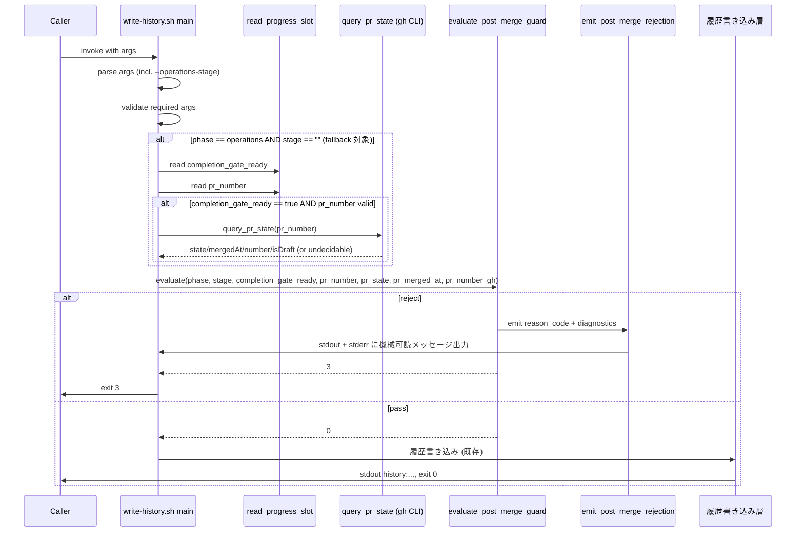

# 論理設計: Unit 002 - write-history.sh マージ後呼び出しガード

## 概要

`skills/aidlc/scripts/write-history.sh` にマージ後呼び出しガードを追加し、関連する `/write-history` スキル SKILL.md と `steps/operations/04-completion.md` を同期更新する。既存のスクリプト構造（単一ファイル・Bash 5 互換・`lib/bootstrap.sh` / `lib/validate.sh` の関数流用）を維持したまま、新規関数群をスクリプト内に追加する増分的変更とする。

**重要**: この論理設計では**コードは書かず**、コンポーネント構成とインターフェース定義のみを行います。具体的なコード（Bash 実装、fake gh）は Phase 2（コード生成ステップ）で作成します。

## アーキテクチャパターン

- **パターン**: 単一実行可能スクリプト + ライブラリ関数パターン（既存 `write-history.sh` の方針継承）
- **選定理由**:
  - 既存スクリプトが `lib/bootstrap.sh` / `lib/validate.sh` の関数を source して使う構造で、新規分離モジュールを増やすより関数追加で完結するほうが凝集度が高い。
  - Bash スクリプトは状態を持たない短命プロセスのため、DDD の完全実装は過剰。ドメインモデルの「値オブジェクト / ドメインサービス」を関数レベルのモジュール境界として表現する。
  - fake `gh` / フィクスチャを用いたテストが既存テスト資産（`skills/aidlc/scripts/tests/`）と同じ形式で書けるため、追加コストが低い。

## コンポーネント構成

### レイヤー / モジュール構成

```text
skills/aidlc/scripts/
├── write-history.sh                          # 既存（拡張対象）
│   ├── 引数パース層（既存の while/case 拡張）
│   ├── ガード判定層（新規: evaluate_post_merge_guard 系）
│   └── 履歴書き込み層（既存 resolve_filepath / format_entry / 追記）
├── lib/
│   ├── bootstrap.sh                          # 既存（変更なし）
│   ├── validate.sh                           # 既存（emit_error を流用）
│   └── （必要に応じて）post_merge_guard.sh   # 新規ヘルパー（独立ファイル化するかは Phase 2 で判断。現段階では write-history.sh 内で完結させる方針）
└── tests/
    └── test_write_history_post_merge_guard.sh   # 新規テストスクリプト
skills/write-history/
└── SKILL.md                                  # 既存（引数表 + 出力表 + 例を更新）
skills/aidlc/steps/operations/
└── 04-completion.md                          # 既存（禁止記述追加）
```

> Phase 2 で `evaluate_post_merge_guard` / `read_progress_slot` / `query_pr_state` のコードボリュームが膨らむ場合、`lib/post_merge_guard.sh` への分離を再評価する。ただし既存の lib 方針との整合上、まずは `write-history.sh` 内の関数として実装する。

### コンポーネント詳細

#### 引数パース層（既存拡張）

- **責務**: CLI 引数から `--operations-stage` を含む全引数を取得しグローバル変数にセット。不正値（`pre-merge` / `post-merge` 以外）は exit 1 で拒否。
- **依存**: 既存の while/case 構造、`emit_error()`（validate.sh）
- **公開インターフェース**:
  - 既存グローバル変数に加え、`OPERATIONS_STAGE: string` を追加（初期値は空文字）。
  - 検証関数: `validate_operations_stage(stage) -> 0|1`（`pre-merge` / `post-merge` は 0、空文字は 0（未指定扱い）、それ以外は 1）。

#### ガード判定層（新規）

- **責務**: 既存バリデーション完了後、履歴書き込み層に進む前にガード判定を行い、拒否時は exit 3 で終了する。**層分離原則**: ガード判定は受領した「正規化済み入力」のみで決定し、外部データソース（progress.md / gh CLI）への再アクセスは行わない。データ取得は呼び出し側（main）が責務を持つ。
- **依存**:
  - `emit_post_merge_rejection`（stdout + stderr の両チャネルにエラーコード出力）
- **公開インターフェース**:
  - `evaluate_post_merge_guard(phase, stage, completion_gate_ready, pr_number, pr_state, pr_merged_at, pr_number_from_gh) -> 0|3`
    - 引数はすべて正規化済み:
      - `phase`: 文字列（`inception` / `construction` / `operations`）
      - `stage`: 文字列（`pre-merge` / `post-merge` / 空文字）
      - `completion_gate_ready`: 文字列（`true` / `false` / `undecidable`）
      - `pr_number`: 整数または空文字
      - `pr_state`, `pr_merged_at`, `pr_number_from_gh`: `query_pr_state` の正規化済み結果（`undecidable` の場合はそれを表す固定文字列）
    - 0: pass（従来動作継続）
    - 3: reject（caller は exit 3 する）
  - 内部ロジックは「第一条件 → 第二条件（AND 評価） → pass」の順で評価。
- **副作用**: reject 時、`emit_post_merge_rejection` 経由で stdout と stderr の両方に `error:post-merge-history-write-forbidden:<reason_code>:<diagnostics>` を重複出力する（Unit 定義 / Story 1.2 の stderr 要件と既存 `emit_error` の stdout 互換を両立）。

#### progress.md 読取（`read_progress_slot`）

- **責務**: `operations/progress.md` から `completion_gate_ready` と `pr_number` を**独立行のみ**から読み取る。grammar のサブセット（ドメインモデル参照、§5.3.5 の「`#` 以降はコメント」を含むインラインコメント除去に対応）に従う。
- **依存**: ファイルシステム
- **呼び出し側**: main（`evaluate_post_merge_guard` への入力準備として）
- **公開インターフェース**:
  - `read_progress_slot(cycle, key) -> stdout: 値 or 空文字、return: 0（取得成功） | 1（不在 / 不正 / 対応外記法）`
    - 値が `undecidable` 相当のケース（ファイル不在、行不在、grammar 不整合、1 行カンマ区切り併記のみで独立行なし）はすべて return 1 + 空文字。
- **§5.3.5 とのずれに関する設計判断**:
  - 本関数は §5.3.5 の **意図的サブセット**（独立行 `key=value` のみ、1 行カンマ区切り併記・grammar version コメント検証は非対応）を実装する。
  - 許容根拠: Unit 001 で規定した `operations-release.md §7.6` の手順書が固定スロットを独立行で記述する運用合意のもと、ガードは独立行のみの対応で偽陰性リスクは発生しない。
  - 手順書が将来 1 行カンマ区切り併記等を採用した場合はガード側で undecidable → pass に倒れ、post-merge 誤呼び出しは 04-completion.md §5 の未コミット変更確認（二重防御）で検出される。本 Unit のスコープ内では `ArtifactsStateRepository` 系の共通パーサ化は行わない（境界維持）。
- **実装判断**: パーサを keep simple にするため `grep -E` + `sed` を使った単純抽出とする。重複キーは最初の出現を採用するため `grep` の先頭ヒットを使用。

#### GitHub PR 状態取得（`query_pr_state`）

- **責務**: `gh pr view <pr_number> --json isDraft,state,mergedAt,number` を 1 回だけ呼び出し、`PrStateSnapshot` 相当の情報を **正規化済みシェル変数セット**で返す。
- **依存**: `gh` CLI
- **呼び出し側**: main（`evaluate_post_merge_guard` への入力準備として）
- **公開インターフェース**:
  - `query_pr_state(pr_number)`
    - 成功時（return 0）: グローバル変数 `GUARD_PR_STATE`, `GUARD_PR_MERGED_AT`, `GUARD_PR_NUMBER`, `GUARD_PR_IS_DRAFT` にそれぞれ正規化済み値を格納。文字列の key=value 併記返却は行わない（ガード層の再パースを避ける）。
    - undecidable 時（return 1）: 上記 4 変数に固定文字列 `undecidable` を設定（main はこれを評価して guard 引数に渡す）。
  - 1 判定プロセス内での再呼び出しを避けるため、`GUARD_PR_QUERY_DONE` フラグで同一 `pr_number` への再呼び出しをスキップ（呼び出しは最大 1 回）。
- **失敗ハンドリング**:
  - `gh` 非ゼロ終了 / JSON パース失敗 / 必須フィールド（`isDraft` / `state` / `number`）欠損・null → return 1（全変数 `undecidable`）
  - `state` が `OPEN` / `CLOSED` / `MERGED` 以外 → return 1
  - 取得した `number` が要求 `pr_number` と不一致 → return 1
  - `mergedAt` は `state != MERGED` 時に null が正常（§5.3.6）。`state == MERGED` で `mergedAt == null` の場合は undecidable 扱い。

#### エラー出力（`emit_post_merge_rejection`）

- **責務**: 既存 `emit_error` と互換する機械可読メッセージ `error:post-merge-history-write-forbidden:<reason_code>:<diagnostics>` を **stdout と stderr の両方に重複出力**する。
- **依存**: `emit_error`（stdout 出力は既存関数を再利用）
- **公開インターフェース**:
  - `emit_post_merge_rejection(reason_code, diagnostics)` → 以下を順に実行:
    - `emit_error "post-merge-history-write-forbidden" "<reason_code>:<diagnostics>"` （stdout、既存 emit_error パターン）
    - `echo "error:post-merge-history-write-forbidden:<reason_code>:<diagnostics>" 1>&2` （stderr、Unit 定義 / Story 1.2 の stderr 要件準拠）
- **チャネル設計**: stdout / stderr ともに同一の機械可読形式を保証することで、呼び出し側が好きなチャネルから読み取れる。既存 `emit_error` の stdout 契約（後方互換）を維持しつつ、Unit 定義 / Story の stderr 受入基準も満たす。
- **診断メッセージ例**:
  - `reason_code=explicit_stage`: `stage=post-merge`
  - `reason_code=fallback_merged_confirmed`: `completion_gate_ready=true,pr=<number>,state=MERGED`
- **禁止事項**: 機密情報を含めない（PR 本文・認証情報等）。

#### テストスクリプト（新規）

- **責務**: 計画に記載の 12 テストケース（Story 1.2 5 件 + 境界・異常系 7 件）を実行し、exit code と stdout の期待値を検証する。
- **依存**:
  - fake `gh`: `mktemp -d` 経由の一時ディレクトリに `gh` スクリプトを配置し、`PATH` 先頭に差し込む。fake gh は呼び出し回数をカウンタファイルに記録し、引数に応じて設定済み JSON を返す。
  - 一時 `progress.md`: `.aidlc/cycles/<test-cycle>/operations/progress.md` をフィクスチャディレクトリに作成。
- **公開インターフェース**: シェル直接実行 (`./test_write_history_post_merge_guard.sh`)。終了コード 0 = 全パス、非ゼロ = 失敗。既存テスト（`test_*.sh`）と同じフォーマット。

## インターフェース設計

### スクリプトインターフェース設計

#### write-history.sh

##### 概要

履歴ファイルへの追記を標準化フォーマットで行う。Operations Phase のマージ後呼び出しは exit 3 で拒否する（本 Unit で追加）。

##### 引数

| 引数 | 必須/任意 | 説明 |
|------|----------|------|
| `--cycle <VERSION>` | 必須 | サイクルバージョン |
| `--phase <PHASE>` | 必須 | `inception` / `construction` / `operations` |
| `--unit <NUMBER>` | construction 時必須 | Unit 番号 |
| `--unit-name <NAME>` | construction 時必須 | Unit 名 |
| `--unit-slug <SLUG>` | construction 時必須 | Unit スラッグ |
| `--step <STEP>` | 必須 | ステップ名 |
| `--content <CONTENT>` | 必須（or --content-file） | 実行内容 |
| `--content-file <PATH>` | 必須（or --content） | 実行内容ファイル |
| `--artifacts <PATH>` | 任意（複数指定可） | 成果物パス |
| `--dry-run` | 任意 | ファイル追記せず状態のみ表示 |
| `--operations-stage <STAGE>` | 任意（新規） | `pre-merge` / `post-merge`。未指定は従来動作。未定義値は exit 1 |
| `-h, --help` | 任意 | ヘルプ表示 |

##### 成功時出力

```text
history:<filepath>:<status>
```

- status: `created` / `appended` / `would-create` / `would-append`
- 終了コード: `0`
- 出力先: stdout

##### エラー時出力

```text
error:<code>:<message>
```

- 既存 exit code:
  - `0`: 成功
  - `1`: 引数不正（未指定値・不正値・排他違反 等）
  - `2`: I/O 失敗（ファイル作成失敗 等）
- **新規 exit code**:
  - `3`: post-merge ガードによる拒否。code は固定で `post-merge-history-write-forbidden`。診断情報は `:<reason_code>:<diagnostics>` として連結。
- 出力先:
  - exit code `1` / `2`: 既存挙動どおり stdout のみ（`emit_error` 経由）。
  - exit code `3`（本 Unit 追加）: **stdout と stderr の両方に同一機械可読メッセージを重複出力**。`emit_post_merge_rejection` が両チャネル出力を担う。既存 stdout 契約（emit_error 互換）と Unit 定義 / Story 1.2 の stderr 要件を同時に満たす正式契約。

##### 使用コマンド例

```bash
# 従来呼び出し（変更なし）
./write-history.sh --cycle v1.8.0 --phase inception --step "Intent作成" --content "..."

# Operations Phase 通常（pre-merge 明示）: 従来動作
./write-history.sh --cycle v2.3.6 --phase operations --operations-stage pre-merge --step "7.5 Markdownlint完了" --content "..."

# Operations Phase マージ後（誤呼び出し）: exit 3
./write-history.sh --cycle v2.3.6 --phase operations --operations-stage post-merge --step "マージ完了記録" --content "..."
# stdout: error:post-merge-history-write-forbidden:explicit_stage:stage=post-merge
# exit code: 3
```

## データモデル概要

### ファイル形式: operations/progress.md（読取専用）

- **形式**: Markdown + 固定スロット grammar（`phase-recovery-spec.md §5.3.5` サブセット）
- **本 Unit で参照するキー**:
  - `completion_gate_ready`: boolean（`true`/`false`）
  - `pr_number`: integer（正の整数）
- **読取方針**:
  - 1 行 1 キーの独立行のみ対象
  - 値前後の空白をトリム
  - 重複時は最初の出現を採用
  - boolean 値は小文字 `true` / `false` のみ受理、それ以外は undecidable
  - integer 値は `^[1-9][0-9]*$` のみ受理、それ以外は undecidable

### fake gh 出力形式（テスト用）

```json
{
  "isDraft": false,
  "state": "MERGED",
  "mergedAt": "2026-04-19T12:34:56Z",
  "number": 581
}
```

- テストでは `PATH` 先頭に配置した fake gh が `gh pr view <n> --json ...` に対して固定 JSON を返す。
- 呼び出し回数はカウンタファイル（`<tmp>/gh-call-count`）に記録し `TC_GH_CALLED_ONCE` で検証。

## 処理フロー概要

### ガード判定付き履歴書き込みの処理フロー

**設計原則**: データ取得は main 側で完結させ、`evaluate_post_merge_guard` は正規化済み入力のみで判定する（層分離）。guard 内部での progress.md / gh CLI 再アクセスは行わない。

**ステップ**:

1. 引数パース（既存 + `--operations-stage`）。未定義値は `emit_error invalid-operations-stage` + exit 1。
2. 既存の必須引数バリデーション（`--cycle` / `--phase` / `--step` / `--content` 等）。
3. **事前データ取得（main の責務）**:
   - `PHASE == "operations"` かつ `OPERATIONS_STAGE != "post-merge"` かつ `OPERATIONS_STAGE != "pre-merge"`（＝第二条件フォールバック対象）の場合のみ:
     - `read_progress_slot(CYCLE, "completion_gate_ready")` → `$GUARD_COMPLETION_GATE_READY`（`true` / `false` / `undecidable`）
     - `read_progress_slot(CYCLE, "pr_number")` → `$GUARD_PR_NUMBER_FROM_PROGRESS`（整数文字列 / 空文字）
     - `$GUARD_COMPLETION_GATE_READY == "true"` かつ `$GUARD_PR_NUMBER_FROM_PROGRESS` が正整数の場合のみ:
       - `query_pr_state($GUARD_PR_NUMBER_FROM_PROGRESS)` を呼び `$GUARD_PR_STATE`, `$GUARD_PR_MERGED_AT`, `$GUARD_PR_NUMBER`, `$GUARD_PR_IS_DRAFT` を正規化
     - それ以外の場合: 4 変数は `undecidable` にセット（gh を呼ばない）。
   - `PHASE != "operations"` / `OPERATIONS_STAGE` が明示値の場合: データ取得スキップ、全変数は初期値（空）のまま。
4. `evaluate_post_merge_guard(PHASE, OPERATIONS_STAGE, $GUARD_COMPLETION_GATE_READY, $GUARD_PR_NUMBER_FROM_PROGRESS, $GUARD_PR_STATE, $GUARD_PR_MERGED_AT, $GUARD_PR_NUMBER)` を呼ぶ:
   1. `PHASE != "operations"` → return 0（pass）
   2. `OPERATIONS_STAGE == "post-merge"` → `emit_post_merge_rejection explicit_stage "stage=post-merge"` → return 3
   3. `OPERATIONS_STAGE == "pre-merge"` → return 0（pass）
   4. `OPERATIONS_STAGE == ""`（未指定）:
      - `$GUARD_COMPLETION_GATE_READY != "true"` → return 0
      - `$GUARD_PR_NUMBER_FROM_PROGRESS` が正整数でない → return 0
      - `$GUARD_PR_STATE == "MERGED"` AND `$GUARD_PR_MERGED_AT != ""` AND `$GUARD_PR_MERGED_AT != "undecidable"` AND `$GUARD_PR_NUMBER == $GUARD_PR_NUMBER_FROM_PROGRESS` の場合:
        - `emit_post_merge_rejection fallback_merged_confirmed "completion_gate_ready=true,pr=$GUARD_PR_NUMBER_FROM_PROGRESS,state=MERGED"` → return 3
      - それ以外（undecidable 含む）→ return 0
5. evaluate の戻り値が 3 の場合 → `main` が exit 3 で終了。
6. 戻り値が 0 の場合 → 既存の履歴書き込み層に進む（resolve_filepath / format_entry / ファイル追記 / stdout 出力）。

**関与するコンポーネント**: 引数パース層 / 事前データ取得（main + `read_progress_slot` + `query_pr_state`）/ ガード判定層（`evaluate_post_merge_guard`、正規化済み入力のみ）/ `emit_post_merge_rejection` / 既存履歴書き込み層



## 非機能要件（NFR）への対応

### 互換性

- **要件**: Inception / Construction の既存呼び出しは挙動を変えない（exit 0 系の appended / created 出力を維持）。
- **対応策**:
  - `--operations-stage` は任意引数。未指定時は従来動作。
  - ガード判定は `PHASE == operations` かつ追加条件を満たす場合のみ発動。
  - 既存 exit code `0` / `1` / `2` の意味は一切変更しない。
  - テストで Inception / Construction パスを明示的に検証（`TC_INCEPTION_PASS`、Construction は既存テスト資産で保証）。

### 明確性

- **要件**: 拒否時のエラーメッセージは機械可読（`error:post-merge-history-write-forbidden`）かつ人間可読。Unit 定義 / Story 1.2 は「標準エラーに `error:post-merge-history-write-forbidden`」を要求する。
- **対応策**:
  - 機械可読部分: `error:post-merge-history-write-forbidden:<reason_code>:<diagnostics>` の固定 grammar。
  - 出力先: **stdout と stderr の両方に重複出力**（`emit_post_merge_rejection` 経由）。これにより以下を両立:
    - stdout: 既存 `emit_error()` との一貫性（後方互換）。既存のエラー出力を stdout から読み取るツール・スクリプトがそのまま動作する。
    - stderr: Unit 定義 / Story 1.2 受け入れ基準への準拠。診断ログのパイプライン（`stderr > logfile`）でも機械可読形式が保持される。
  - 人間可読部分: 04-completion.md の禁止記述への参照が含まれる（`diagnostics` 部分または別行の補足として stderr にのみ出力してもよい）。

### 診断性

- **要件**: 拒否理由を特定できるよう、判定の根拠（引数値・progress.md 状態）を併記する。
- **対応策**:
  - `reason_code` で 2 つの条件を区別（`explicit_stage` / `fallback_merged_confirmed`）。
  - `diagnostics` に `stage=<value>`・`completion_gate_ready=<bool>`・`pr=<n>`・`state=<s>` など検証可能な key=value を含める。
  - 機密情報（PR 本文、認証トークン）は絶対に含めない（`query_pr_state` が取得するフィールドを `isDraft,state,mergedAt,number` に限定）。

## 技術選定

- **言語**: Bash 5 互換（既存スクリプト準拠、macOS デフォルト Bash 3.2 でも動作するシェル互換性に注意）。
- **フレームワーク**: なし。
- **ライブラリ**: `gh` CLI（外部依存）、`jq`（JSON パース）、`grep` / `sed` / `awk`（テキスト処理、いずれも既存スクリプトで使用中）。
- **データベース**: なし。

## 実装上の注意事項

- **gh 1 回呼び出し保証**: `GUARD_PR_QUERY_DONE` のようなグローバル変数でキャッシュし、`query_pr_state` 内で再呼び出しを防ぐ。main 側も「第二条件フォールバック対象時のみ呼び出す」条件ガードを持つため、`PHASE != operations` や `stage == post-merge/pre-merge` 明示時には gh 呼び出しは発生しない。テストで `TC_GH_CALLED_ONCE` が 1 を検証する。
- **--dry-run と exit 3 の両立**: `--dry-run` 指定時でもガード判定は先に実行する（ファイル書き込みをシミュレーションする前にガードで拒否）。これにより TC_POST_MERGE_REJECT_DRY_RUN が成立。
- **既存 `set -euo pipefail`**: `query_pr_state` 内で `gh` / `jq` が失敗した場合、`|| true` で吸収し undecidable に倒す。パイプライン失敗で script 全体が落ちないよう注意。
- **テストでの fake gh**: `PATH="$FIXTURE_DIR:$PATH"` で差し替え。テスト完了時に `trap cleanup EXIT` で一時ディレクトリを削除。
- **04-completion.md への禁止記述**: §5 以降の適切な位置に 1 箇所だけ追加し、重複を避ける。禁止の根拠として本 Unit の履歴ファイル / `phase-recovery-spec.md §5.3` への参照を含める。
- **macOS Bash 3.2 配慮**: 連想配列（`declare -A`）を使わない。既存スクリプトでも連想配列は使用していないため、本 Unit の追加関数も同方針。

## 不明点と質問（設計中に記録）

[Question] `gh pr view` の `mergedAt` フィールドが存在しない Git ホスティングクライアントとの互換性（GitHub Enterprise 等）は考慮するか?

[Answer] 対象外。本プロジェクト・AI-DLC は GitHub.com 前提。Enterprise 対応は本 Unit のスコープ外。必要になればバックログへ。

[Question] `/write-history` スキル SKILL.md の引数表フォーマットは現行 `Markdown table` か `list` か?

[Answer] 既存 SKILL.md の形式に合わせる（Phase 2 の実装時に既存 SKILL.md を読んで揃える。現在の形式は引数表ではなく箇条書きで記載されている）。
