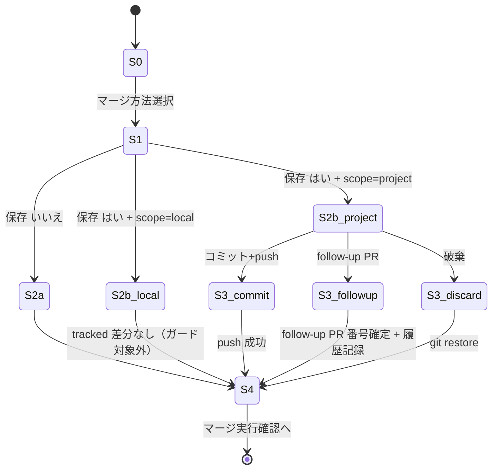

# ドメインモデル: Unit 001 - Operations 7.13 merge_method 設定保存ガード

## 概要

Operations Phase §7.13 の `merge_method=ask` フローで発生する「設定保存→マージ前の状態遷移」を状態モデルとして表現する。本 Unit はコード追加ではなく Markdown 手順書の改訂であるため、ソフトウェアエンティティは存在しない。代わりに、対象となるワークフローの状態・イベント・ガード条件を「ドメイン」として記述する。

**重要**: このドメインモデル設計ではコードは書かず、手順書改訂で実現する状態遷移の仕様定義のみを行う。実装（Markdown 追記）は Phase 2 で行う。

## ドメインとは（本 Unit における定義）

- **対象ドメイン**: Operations Phase §7.13 内の「merge_method 確定 → 設定保存 → マージ実行確認 → マージ実行」サブワークフロー
- **アクター**: AI-DLC 利用者（メタ開発者、AI エージェント、人間）
- **観測対象リソース**: ローカル `.aidlc/config.toml`、リモート PR、PR 紐付けブランチ

## 状態モデル

### 主要状態

| 状態ID | 名称 | 条件 |
|--------|------|------|
| S0 | マージ方法確定前 | `merge_method=ask` 分岐に入った直後 |
| S1 | マージ方法確定後・設定保存選択中 | ユーザーが `merge` / `squash` / `rebase` を選択、`AskUserQuestion` で保存可否を問う段階 |
| S2a | 設定保存: いいえ | `write-config.sh` 未実行、ローカル差分なし |
| S2b-local | 設定保存: はい + scope=local | `write-config.sh --scope local` 実行後。書き込み先は `.aidlc/config.local.toml`（git 管理外、`.gitignore` 対象）。tracked な差分は発生しないため、本ガードの対象外 |
| S2b-project | 設定保存: はい + scope=project | `write-config.sh --scope project` 実行後。書き込み先は `.aidlc/config.toml`（tracked）。未コミット差分が発生し、本ガードの対象となる |
| S3_commit | ガード: コミット+push 選択 | ユーザーが「コミット+push」を選択 |
| S3_followup | ガード: follow-up PR 選択 | ユーザーが「follow-up PR」を選択 |
| S3_discard | ガード: 破棄 選択 | ユーザーが「破棄」を選択 |
| S4 | マージ実行確認前 | ガード処理完了、マージ実行確認に進める状態 |

### 状態遷移

```text
S0 → [マージ方法選択(AskUserQuestion)] → S1
S1 → [設定保存 いいえ] → S2a → S4
S1 → [設定保存 はい + scope=local + write-config.sh 実行] → S2b-local → S4（tracked 差分なし、ガード対象外）
S1 → [設定保存 はい + scope=project + write-config.sh 実行] → S2b-project
S2b-project → [未コミット差分検出ガード(AskUserQuestion)] → S3_commit / S3_followup / S3_discard
S3_commit → [git add → commit → push] → S4（PR に反映済み）
S3_followup → [git stash → 新ブランチ → commit → push → gh pr create] → S4（follow-up PR 番号記録済み、現 PR は差分なし）
S3_discard → [git restore] → S4（差分ゼロ）
S4 → [マージ実行確認(AskUserQuestion)] → マージ実行 or 中断
```

### 遷移の不変条件

- **INV-1**: S4 に到達したとき、現サイクルブランチ上で tracked な `.aidlc/config.toml` の設定変更が**反映済み**または**存在しない**（未コミット差分ゼロ）。`scope=local` 経路（S2b-local）では `.aidlc/config.local.toml` が git 管理外のため本不変条件の対象外
- **INV-2**: S3_followup 経路を通った場合、`history/operations.md` に follow-up PR 番号が記録されている。gh auth 未認証等で自動作成できないときは follow-up 分岐を完了扱いにせず、ユーザーが手動で PR を作成して番号が確定するまで S4 に進まない（PR 番号未確定のまま S4 到達は禁止）
- **INV-3**: 既存の post-merge 改変禁止ルール（`04-completion.md` L42）とは独立した前段ガード。既存ルールを拡張・破壊しない
- **INV-4**: `AskUserQuestion` 呼び出しは SKILL.md「ユーザー選択」種別のため、`automation_mode`（manual / semi_auto / full_auto）に関わらず対話必須

## イベント・コマンド

### 検出イベント

| イベント名 | トリガ | 観測対象 |
|-----------|-------|---------|
| `S2bDetected` | `write-config.sh --scope project` 実行完了 | `.aidlc/config.toml` の差分有無（`git diff --quiet -- .aidlc/config.toml` の exit code）。`scope=local` 選択時はトリガされない |

### ユーザーコマンド（AskUserQuestion による選択）

| コマンド | 選択肢 | 後続状態 |
|---------|-------|---------|
| `GuardChoice` | コミット+push / follow-up PR / 破棄 | S3_commit / S3_followup / S3_discard |

## ユビキタス言語

- **merge_method 確定フロー**: 7.13 内のマージ方法を決定する処理段階。`gh_status` 分岐 + `merge_method=ask` 分岐 + 固定値分岐を含む
- **設定保存フロー**: `merge_method=ask` 時に保存可否を確認する段階
- **未コミット差分検出ガード**: `write-config.sh` 実行後に発動する、本 Unit で追加する新しいガード段階
- **3 分岐（GuardChoice）**: コミット+push / follow-up PR / 破棄の 3 択
- **follow-up PR**: 現サイクル PR の外で作成される、設定変更だけを含む別 PR。jailrun v0.3.1 の実運用手順を由来とする概念

## 外部エンティティ（参照のみ、変更なし）

- `scripts/write-config.sh`: 既存の設定書き込みスクリプト（本 Unit で変更なし）
- `AskUserQuestion`: Claude Code harness のユーザー選択プリミティブ（本 Unit で変更なし）
- `operations-release.sh merge-pr`: 既存のマージ実行スクリプト（本 Unit で変更なし）
- `/write-history` スキル: follow-up PR 番号記録用（本 Unit で変更なし）

## ドメインモデル図（状態遷移）



## 不明点と質問（設計中に記録）

[Question] `git diff --quiet .aidlc/config.toml` と `git status --porcelain .aidlc/config.toml` のどちらを検出ゲートに使うか？
[Answer] 論理設計で決定する（両者のトレードオフを比較）。原則 `git diff --quiet` は exit code で判定しやすいため優先候補。

[Question] follow-up PR の作成で使う gh コマンドを具体化する必要があるか？
[Answer] 論理設計で 1 コマンドパターンを具体化する。ユーザー環境差分（`gh auth` 不可等）の fallback 手順も併記する。

[Question] S3_discard の `git restore` はワーキングツリーの他の未コミット差分を巻き込む危険があるか？
[Answer] 論理設計で `git restore -- .aidlc/config.toml` のようにパス指定で限定することを明示する。
