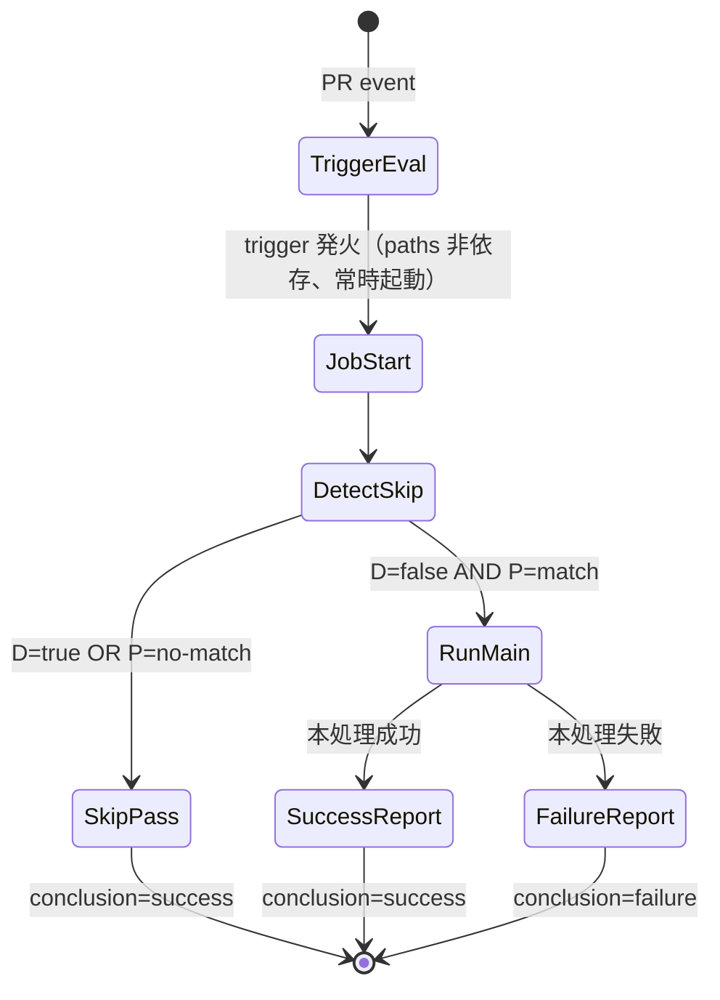

# ドメインモデル: Unit 002 - 必須 Checks の常時 PASS 報告化

## 概要

`pull_request` イベントから派生する 3 workflow / 5 required check の状態モデルを定義する。本 Unit はソフトウェアエンティティの追加ではなく、**GitHub Actions workflow 仕様の再構築**であるため、ドメインモデルは「PR 状態 × paths 該当性 × Draft 状態」の組み合わせに対する check 結果を状態遷移として表現する。

**重要**: 本ドメインモデルではコードを書かず、状態モデルとイベント仕様のみを定義する。実装（YAML 編集）は Phase 2 で行う。

## ドメインとは（本 Unit における定義）

- **対象ドメイン**: GitHub Actions の `pull_request` トリガに対する 5 required check（`Markdown Lint` / `Bash Substitution Check` / `Defaults TOML Sync Check` / `Migration Script Tests` / `Skill Reference Check`）の報告状態
- **アクター**: GitHub Actions ランナー、PR 投稿者、Branch protection 機構
- **観測対象リソース**: `.github/workflows/pr-check.yml` / `migration-tests.yml` / `skill-reference-check.yml` の workflow 定義および各 PR の `gh pr checks` 出力

## ユビキタス言語

- **必須 Check（required check）**: Branch protection で merge 必須として登録された status check 名（5 つ）
- **paths 該当**: `pull_request` イベントの workflow trigger `paths:` フィルタに、PR の変更ファイル群が 1 つでもマッチする状態
- **Draft skip**: 従来の `if: github.event.pull_request.draft == false` による job-level skip
- **skip-PASS**: 本 Unit で導入する「skip 条件下で `success` 状態として報告される空処理」
- **本処理 step**: 各 check が実行する従来の検証処理（`markdownlint` / `bash bin/check-*.sh` / `bats tests/migration/` 等）
- **採用ゲート**: 案1（補欠案）採用判定の 3 条件（仕様確認 + PASS PoC + FAIL 伝播 PoC）

## 状態モデル

### 入力次元（PR 状態の組み合わせ）

| 次元 | 値 |
|------|-----|
| `D` (Draft 状態) | `true` / `false`（Ready） |
| `P` (paths 該当性) | `match` / `no-match`（3 workflow ごとに独立判定） |
| `R` (本処理結果) | `pass` / `fail`（実 job が実行された場合のみ）|

### ケース表（4 ケース × 結果分岐）

| ケース | D | P | 期待 check 状態 | 本処理実行有無 |
|--------|---|---|---------------|---------------|
| A-pass | false | match | `success` | あり（成功）|
| A-fail | false | match | `failure` | あり（失敗）|
| B | true | match | `success`（skip-PASS）| なし |
| C | false | no-match | `success`（skip-PASS）| なし |
| D | true | no-match | `success`（skip-PASS）| なし |

**設計原則**:

- skip 条件（B / C / D）下では `success` を確実に報告する
- 本処理が実行された場合（A-pass / A-fail）は実結果を伝播する。skip-PASS が後勝ちで上書き・隠蔽してはならない（FAIL 伝播必須）

### 状態遷移

```text
[PR 作成 / synchronize / ready_for_review / edited]
    ↓
[workflow trigger 評価]
    ↓
案2: trigger は paths 非依存で常に発火 → job 起動
    ↓
[Detect skip step]
    ├─ D=true（Draft）           → set should_skip=true → skip-PASS（success）
    ├─ P=no-match（paths 非該当）→ set should_skip=true → skip-PASS（success）
    └─ それ以外（D=false かつ P=match）→ set should_skip=false → 本処理 step 実行
                                            ├─ 本処理成功 → success（A-pass）
                                            └─ 本処理失敗 → failure（A-fail）
```

### 不変条件

- **INV-1**: 5 required check はすべての PR で必ず報告される（`Expected — Waiting for status to be reported` 状態が永続化しない）
- **INV-2**: 本処理が実行され失敗した場合、対応する required check は必ず `failure` を報告する（skip-PASS による隠蔽禁止）
- **INV-3**: required check 名（job 名）は本 Unit 実装後も維持される（Branch protection 設定の変更不要）
- **INV-4**: `permissions: contents: read` を最低限維持する。`pull-requests: read` を追加する場合は changed-files 取得のためにのみ使用
- **INV-5**: skip 条件下では runner の本処理コスト（markdownlint 実行 / bats 実行 等）が発生しない（Detect skip step + skip 判定済 step の `if:` で確実に skip）

## イベント・コマンド

### トリガイベント

| イベント名 | トリガ | 観測対象 |
|-----------|-------|---------|
| `PRSynchronize` | `pull_request` の `opened` / `synchronize` / `reopened` / `ready_for_review` / `edited` | PR 番号、Draft 状態、変更ファイル一覧 |

### Job 内ステップシーケンス（案2 採用時）

| 順 | ステップ名 | 役割 | 出力 |
|----|----------|------|------|
| 1 | Detect skip | Draft 判定 + paths 該当判定 | `should_skip` (`true` / `false`) |
| 2 | Checkout | `actions/checkout@v4` | （`if: should_skip != 'true'`）|
| 3 | 本処理 | markdownlint / bash check / bats など | （`if: should_skip != 'true'`）|

## 外部エンティティ（参照のみ、変更なし）

- `actions/checkout@v4`: 本処理用 Checkout
- `DavidAnson/markdownlint-cli2-action@v18`: pr-check.yml 内 markdown-lint job
- `bin/check-bash-substitution.sh` / `bin/check-defaults-sync.sh` / `bin/check-skill-references.sh`: bash 検証スクリプト
- `bats-core` v1.11.1: migration-tests.yml の bats 実行ランタイム
- GitHub REST API `repos/{owner}/{repo}/pulls/{N}/files`: changed-files 取得（paths 判定用、案2 採用時）
- Branch protection 設定: 5 required check 名を必須として登録（変更なし）

## ドメインモデル図（状態遷移）



## 不明点と質問（設計中に記録）

[Question] paths 該当判定に GitHub REST API（`gh api repos/.../pulls/{N}/files`）を使うか、`tj-actions/changed-files` を使うか？
[Answer] 論理設計で決定。標準ツール優先のため `gh api` を第一候補とする。`tj-actions/changed-files` は外部 action 依存となるため避ける（セキュリティ・可監査性の観点）。

[Question] paths 一覧を workflow YAML 内に直書きするのと、共通スクリプトに切り出すのとどちらが望ましいか？
[Answer] 論理設計で決定。3 workflow 各々に異なる paths があるため、各 workflow の Detect skip step に直書きが妥当。共通化は本サイクル外。

[Question] 案1 の採用ゲート 3 条件をどのように検証するか？PoC を本 Unit 内で実施するのか？
[Answer] 論理設計で決定。本サイクルでは PoC を実施せず、案2 を確定採用する判断とする（運用リスクと実装複雑度を勘案）。案1 の検討は将来 Unit に切り出す。
