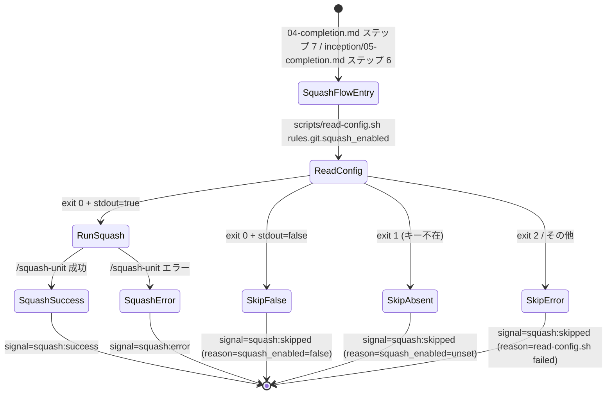

# ドメインモデル: Unit 003 - Construction Squash ステップの誤省略抑止

## 概要

`commit-flow.md`「Squash統合フロー」の状態モデルを定義する。本 Unit はソフトウェアエンティティの追加ではなく **Markdown 手順書の改訂**であるため、ドメインモデルは「Squash 実行可否の判定 → シグナル戻り値」の状態遷移として表現する。

**重要**: コードを書かず、改訂後の手順書が表現すべき状態モデル仕様のみを定義する。

## ドメインとは（本 Unit における定義）

- **対象ドメイン**: `commit-flow.md`「Squash統合フロー」の前提チェック → 実行 → 戻り値の手順
- **アクター**: AI エージェント（手順書を解釈して実行）、`scripts/read-config.sh`、`/squash-unit` スキル
- **観測対象リソース**: `.aidlc/config.toml` の `rules.git.squash_enabled` キー、`squash:*` シグナル文字列

## ユビキタス言語

- **Squash 統合フロー**: `commit-flow.md` 内の「## Squash統合フロー」セクション。フェーズ完了時に中間コミットを 1 つにまとめる手順を記述
- **前提チェック**: 本 Unit で新設する「`rules.git.squash_enabled` を確認して Squash 実行可否を決める」ステップ
- **`squash:*` シグナル**: フローの戻り値を表す機械可読な文字列。既存の 3 種類: `squash:success` / `squash:skipped` / `squash:error`
- **誤省略事故（#594）**: AI エージェントが「【オプション】」ラベルや前提チェック不在を理由に、`squash_enabled=true` でも Squash を実行しない事故

## 状態モデル

### 入力次元

| 次元 | 値 |
|------|-----|
| `S` (`rules.git.squash_enabled` の解決結果) | `true` / `false` / `key-absent` / `error` |

### `read-config.sh` exit code との対応

| 入力 | `read-config.sh` 挙動 | exit code | stdout |
|------|---------------------|-----------|--------|
| `S=true` | 値あり | 0 | `true` |
| `S=false` | 値あり | 0 | `false` |
| `S=key-absent` | キー不在 | 1 | （空） |
| `S=error` | dasel 未インストール / config ファイル未存在 等 | 2 | （空、stderr に診断） |

### ケース表（4 ケース × Squash 実行可否）

| ケース | `S` | 期待動作 | 戻り値 |
|--------|-----|---------|--------|
| Run | `true` | `/squash-unit` スキル実行 → 結果に応じて `squash:success` / `squash:error` | （実行結果次第） |
| Skip-False | `false` | Squash 実行せずフロー終了 | `squash:skipped` + ログに `reason: squash_enabled=false` |
| Skip-Absent | `key-absent` | Squash 実行せずフロー終了 | `squash:skipped` + ログに `reason: squash_enabled=unset` |
| Skip-Error | `error` | Squash 実行せずフロー終了（安全側） | `squash:skipped` + ログに `reason: read-config.sh failed` |

**設計方針**: `true` 以外（`false` / `key-absent` / `error`）はすべて `squash:skipped` に丸める。診断情報はログメッセージで補足する。

### 状態遷移

```text
[呼び出し元: 04-completion.md ステップ 7 から「Squash統合フロー」を実行]
    ↓
[前提チェック: scripts/read-config.sh rules.git.squash_enabled を実行]
    ↓
    ├─ exit 0 + stdout=true        → /squash-unit 実行 → squash:success / squash:error
    ├─ exit 0 + stdout=false       → squash:skipped (reason: squash_enabled=false)
    ├─ exit 1（キー不在）            → squash:skipped (reason: squash_enabled=unset)
    └─ exit 2 / それ以外             → squash:skipped (reason: read-config.sh failed)
    ↓
[呼び出し元: シグナルに応じた後続分岐]
    ├─ squash:success → ステップ 7a（force-push 推奨提示）→ ステップ 8 スキップ
    ├─ squash:skipped → ステップ 7a 提示しない → ステップ 8（通常コミット）へ
    └─ squash:error   → ステップ 7a 提示しない → リカバリ後ステップ 8 へ
```

### 不変条件

- **INV-1**: `S=true` のときのみ `/squash-unit` スキルが呼び出される（誤省略禁止 / 誤実行禁止）
- **INV-2**: `S` が `true` 以外のすべての値で戻り値は `squash:skipped`（新シグナル文字列を導入しない）。呼び出し元の既存分岐記述が改訂不要
- **INV-3**: 既存の `squash:success` / `squash:error` シグナルは前提チェックの追加によって変更されない（前提チェックを通過した後のみ生成される）
- **INV-4**: `04-completion.md` ステップ 7 の見出しから「【オプション】」が除去され、本文に「`squash_enabled=true` の場合は必須」が明記される（手順書解釈の誤誘導排除）
- **INV-5**: `/squash-unit` スキル本体（`SKILL.md` / `squash-unit.sh`）は変更されない（DR-006 パッチスコープ実装本体不変方針との整合）

## イベント・コマンド

### 呼び出しイベント

| イベント名 | トリガ | 観測対象 |
|-----------|-------|---------|
| `SquashFlowEntry` | `04-completion.md` ステップ 7 / `inception/05-completion.md` ステップ 6 から「Squash統合フロー」を呼び出し | `rules.git.squash_enabled` の値 |

### 戻り値シグナル

| シグナル | 条件 | 後続分岐 |
|---------|------|---------|
| `squash:success` | 前提チェック通過 + `/squash-unit` 成功 | ステップ 7a → ステップ 8 スキップ |
| `squash:skipped` | 前提チェック不通過（`S != true`）または `/squash-unit` の no-commits 検出 | ステップ 8 へ |
| `squash:error` | 前提チェック通過 + `/squash-unit` のエラー | リカバリ後ステップ 8 へ |

## 外部エンティティ（参照のみ、変更なし）

- `scripts/read-config.sh`: 既存の設定読み込みスクリプト
- `/squash-unit` スキル: 既存の squash 実行スキル（`SKILL.md` および `scripts/squash-unit.sh`）
- `04-completion.md` ステップ 7 / 7a / 8: 既存の完了処理ステップ（ステップ 7 のみ見出し改訂、7a / 8 は変更なし）
- `inception/05-completion.md` ステップ 6: Inception Phase 完了時の Squash 呼び出し（本 Unit では変更なし、ただし共通フロー改訂の副次効果として前提チェックが Inception 側にも適用される）

## ドメインモデル図（状態遷移）



**注**: `reason: ...` ログは前提チェック由来の `squash:skipped` でのみ出力される。`/squash-unit` スキル本体が出力する `squash:skipped:no-commits`（既存）には `reason: ...` 形式の追加ログは付かない。AI エージェントはシグナル文字列のみで分岐し、ログ有無で挙動を変えない。

## 不明点と質問（設計中に記録）

[Question] `read-config.sh` が exit 2（致命的エラー）を返すケース（dasel 未インストール / config ファイル未存在）でも `squash:skipped` に丸めて良いか？それとも `squash:error` に分類すべきか？
[Answer] 本 Unit では `squash:skipped` に丸める（安全側方針）。理由は `squash:error` は `/squash-unit` の実行エラーを表す既存シグナルであり、前提チェック段階のエラーは「Squash 実行を試みなかった」状態として `squash:skipped` の方が意味的に近いため。診断情報はログメッセージ（`reason: read-config.sh failed`）で補足する（exit code は含めず、本文の表記と統一）。これにより呼び出し元の既存 `squash:error` 分岐（リカバリ手順）に影響を与えない。

[Question] Inception Phase（`05-completion.md` ステップ 6）でも本前提チェックが適用されることは Unit 境界を越えるか？
[Answer] Unit 定義の境界（L20）で「共有ファイル `commit-flow.md` の前提チェック追加に伴う Inception Phase 側への同等効果は意図した副次影響として許容」と既に明記済み。本ドメインモデルでも図の `SquashFlowEntry` の入口として両方を等価に扱う。
