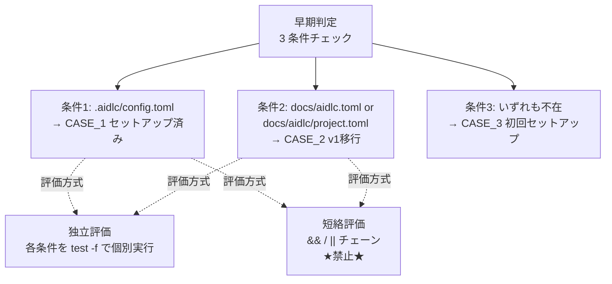
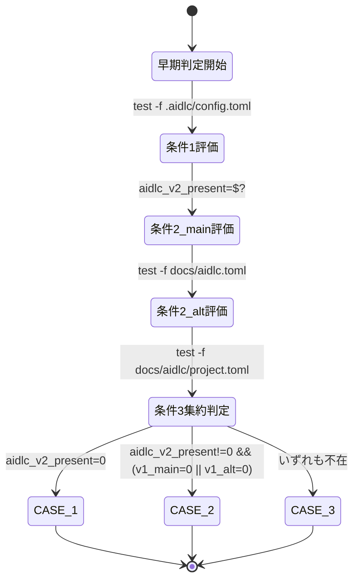

# Unit 004 設計: aidlc-setup 01-detect 独立チェック指針

> **軽量設計**: 本 Unit は patch サイクルのドキュメント改訂のみであるため、ドメインモデルと論理設計を単一ファイルに統合する（Unit 004 計画 Phase 1 の方針）。

## 1. ドメインモデル

### 1.1 概念図



### 1.2 評価方式 × 結果ケース表

| ID | `.aidlc/config.toml` | `docs/aidlc.toml` | `docs/aidlc/project.toml` | 独立評価結果 | 短絡評価結果 | 期待 CASE |
|----|---------------------|-------------------|--------------------------|---------------|---------------|-----------|
| S1 | 存在 | - | - | CASE_1 検出 | CASE_1 検出（最初の条件で確定） | CASE_1 |
| S2 | 不在 | 存在 | - | CASE_2 検出 | **CASE_3 誤判定**（条件1で false → `&&` 短絡 → 後続未評価） | CASE_2 |
| S3 | 不在 | - | 存在 | CASE_2 検出 | **CASE_3 誤判定**（同上） | CASE_2 |
| S4 | 不在 | 存在 | 存在 | CASE_2 検出 | **CASE_3 誤判定**（同上） | CASE_2 |
| S5 | 不在 | 不在 | 不在 | CASE_3 検出 | CASE_3 検出（漏れなし） | CASE_3 |

**S2 / S3 / S4 が #600 / ikeisuke/norigoro で発生した事故ケース**: `.aidlc/` 不在時に AI エージェントが `&&` / `||` チェーンで条件 1 → 条件 2 → 条件 3 を束ね、条件 1 の false で短絡が発生し v1 残骸の検出（条件 2）を漏らした。独立評価では各条件が必ず実行されるため漏れが起きない。

### 1.3 状態遷移



> **注**: 「集約判定」段階で論理 OR を使うが、これは事後判定（変数値に対する判定）であり、`test` コマンド自体の連結ではない。Unit 004 のスコープにある「`&&` / `||` チェーン禁止」は `test -f A && test -f B` のような **コマンド連結** に限定され、`if [ "$x" = 0 ] || [ "$y" = 0 ]; then` のような **変数判定の事後論理演算** は対象外。

### 1.4 不変条件（invariants）

| ID | 不変条件 | 違反時の影響 |
|----|---------|-------------|
| I1 | 3 つの条件は **すべて** 評価される（1 つも飛ばされない） | v1 残骸検出漏れ（#600） |
| I2 | 各条件の結果は独立した変数に保存される | 後段の集約判定で履歴が失われる |
| I3 | 条件 2（v1 検出）の 2 サブパスもそれぞれ独立に test される | 片方のサブパス検出漏れ |
| I4 | 既存の CASE_1 / CASE_2 / CASE_3 分類ロジック（`01-detect.md` L93-149）は **無変更** | Unit 定義 L20 境界違反 |

## 2. 論理設計

### 2.1 改訂対象ファイル

| ファイル | 改訂方針 |
|---------|---------|
| `skills/aidlc-setup/steps/01-detect.md` | セクション1「早期判定」内、3 条件リスト直後（L149-L151 間）に新規 H4 サブセクション「独立チェックの実装指針【必須】」を追加 |

他のファイル（`02-…` 以降のステップ、共通ファイル、スクリプト）は **無変更**（Unit 定義 L21-22 境界）。

### 2.2 挿入位置の特定

`01-detect.md` の現状構造:

```text
L77  ---
L79  ## 1. 実行環境の確認
L89  ### 早期判定（ユーザー確認の前に実行）
L93  #### 1. `.aidlc/config.toml` が存在する場合 → セットアップ済み（バージョン比較あり）
L127 #### 2. `docs/aidlc.toml` または `docs/aidlc/project.toml` が存在する場合 → v1移行が必要
L139 #### 3. いずれも存在しない場合 → 初回セットアップ
L149 ユーザーが「はい」と明示的に承認するまで、次のステップに進まないでください。
L151 ---
L153 ## 2. 初回セットアップの開始
```

**挿入箇所**: L149（条件 3 の最終文）と L151（セクション区切り `---`）の間に空行を挟んで H4 見出しを配置。挿入後の構造:

```text
L149 ユーザーが「はい」と明示的に承認するまで、次のステップに進まないでください。
L150 （空行）
L151 #### 独立チェックの実装指針【必須】
L152 （挿入本文）
...
LXXX ---
```

### 2.3 挿入本文（最終確定案）

挿入する Markdown 本文（ネストしたコードフェンスは外側 4 バッククォートで実装）:

````markdown
#### 独立チェックの実装指針【必須】

「早期判定」の 3 条件は **必ず独立に評価** すること。3 条件チェックの場面で `&&` / `||` での短絡評価は禁止する（`set -e` 環境のフォールバックなど他用途への適用は対象外）。

**正しい例**:

```bash
# 各条件・各サブパスを個別に test し、結果を別々の変数に保存する
test -f .aidlc/config.toml; aidlc_v2_present=$?
test -f docs/aidlc.toml; v1_main_present=$?
test -f docs/aidlc/project.toml; v1_project_present=$?
# 集約は事後判定で行う（変数値に対する論理演算はチェーン禁止の対象外）
# 例: aidlc_v2_present=0 → CASE_1, v1_main_present=0 || v1_project_present=0 → CASE_2, それ以外 → CASE_3
```

**禁止例（誤判定の原因）**:

```bash
# &&/|| で test コマンドを連結すると後続条件が評価されない場合がある
test -f .aidlc/config.toml && echo v2 || test -f docs/aidlc.toml && echo v1
```

**事例**: ikeisuke/norigoro リポジトリで `.aidlc/` 不在時に `&&` / `||` 短絡評価により条件 2（v1 残骸）の検出が漏れる事故が発生（#600）。各条件・各サブパスを独立に評価することで本事故を再発防止する。
````

### 2.4 文言要件チェックリスト（Phase 2b 検証ケース 1 と同期）

実装後、以下のすべてを満たすことを確認:

- [ ] 「3 条件チェックの場面で `&&` / `||` での短絡評価は禁止」のスコープ限定文を含む
- [ ] `test -f` の独立コマンド例が 3 個以上含まれ、各結果が別変数に保存されている
- [ ] OR 演算子（`-o`）を含まない（`grep -F ' -o ' skills/aidlc-setup/steps/01-detect.md` で対象見出し配下を検証）
- [ ] ikeisuke/norigoro 事例の 1〜2 行 reference を含む（`#600` への参照含む）
- [ ] 禁止例として `&&` / `||` チェーンの bash サンプルを含む（コードブロック内に少なくとも 1 行）

### 2.5 影響範囲分析

| 観点 | 影響 |
|------|------|
| AI エージェントの解釈 | 3 条件リスト読了 → 直後に独立評価指針を読む → 独立 `test -f` パターンで実装する流れに誘導 |
| 既存利用者（人間） | 既存ロジックは保たれているため、追加情報として機能。挙動変更なし |
| ロジック | 無変更（Unit 定義 L20 境界） |
| 他の `aidlc-setup` ステップ | 無変更（Unit 定義 L21 境界） |
| シェルスクリプト | 無変更（Unit 定義 L22 境界） |
| `skills/aidlc/steps/common/` 等の共有ファイル | 無変更（Unit 004 計画 L114 のリスク留意点） |

### 2.6 検証手順

| 検証ケース | 手段 |
|----------|------|
| 文言要件 | 2.4 のチェックリストを目視 + `grep` で確認 |
| ロジック保全（既存リスト無変更） | `git diff` で `01-detect.md` L77-149 が無変更であることを確認 |
| 境界保全（他ファイル無変更） | `git diff` で `skills/aidlc-setup/steps/02-*.md` 等が無変更であることを確認 |
| ikeisuke/norigoro 事象再現の論理確認 | 1.2 の S2 / S3 / S4 ケースで独立評価により漏れが防がれることを ケース表で確認 |
| Markdownlint | `scripts/run-markdownlint.sh v2.4.1` を実行し、改訂前後で error 数増加なしを確認（外側 4 バッククォート fence の MD040 / MD046 / MD048 検証含む） |

## 3. プロジェクトルール準拠

| ルール | 準拠状況 |
|-------|---------|
| `$(...)` コマンド置換禁止（CLAUDE.md） | 挿入本文の bash 例は `;` 区切りで `$?` を使用、`$(...)` 不使用 |
| Unit 定義 L20-22 境界 | CASE 分類ロジック・他ステップ・スクリプト無変更 |
| 軽量化方針（patch サイクル） | ドメインモデル + 論理設計を単一ファイルに統合 |
| DR-006（パッチスコープ実装本体不変） | ドキュメント改訂のみで実装本体無変更 |

## 4. 設計レビュー観点（自己点検）

| 観点 | 確認 |
|------|------|
| 構造（責務分離） | ドキュメント追記のみ。挿入位置と既存ロジックの境界が明確 |
| パターン（過剰適用） | H4 サブセクション + bash 例 2 個（正・誤）+ 事例 reference 1 段落 = 適切な情報量 |
| API 設計 | N/A（ドキュメント改訂） |
| 依存関係 | 他 Unit / 他ファイルへの依存なし、副次影響もなし |
| Intent 整合 | Intent Unit D「aidlc-setup 01-detect の独立チェック化」の成功基準を満たす |
