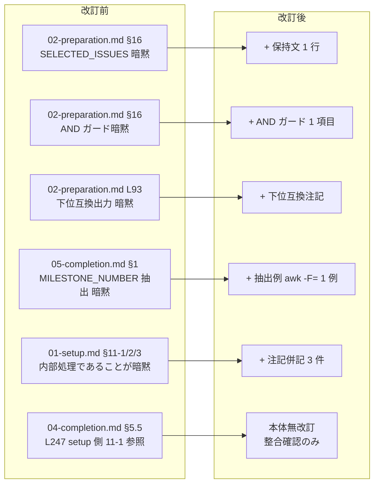

# Unit 005 設計: Milestone step.md 構造改善（4 ファイル明確化）

> **軽量設計**: 本 Unit は patch サイクルのドキュメント改訂のみであるため、ドメインモデルと論理設計を単一ファイルに統合する（Unit 004 と同方針）。

## 1. ドメインモデル

### 1.1 改訂対象 4 ファイル × 5 指摘の対応マップ

| ID | 指摘内容（empirical-prompt-tuning 由来） | 重要度 | 対象ファイル | 対象行 | 対応方法 |
|----|-----------------------------------------|--------|-------------|-------|---------|
| F1 | Issue 選択結果の `SELECTED_ISSUES` 保持手順が暗黙 | 中 | inception/02-preparation.md | L50 直後 | 1 行追記（保持文） |
| F2 | `MILESTONE_ENABLED` ガードと `SELECTED_ISSUES` 空時の結合関係が暗黙 | 低〜中 | inception/02-preparation.md | L64 末尾 | 1 項目追記（AND ガード明示） |
| F2b | `early-link:no-issues-provided` 出力の運用上の位置付けが暗黙 | 低 | inception/02-preparation.md | L93 | 既存記述に注記併記（下位互換用） |
| F3 | `MILESTONE_NUMBER` の具体的な抽出方法が暗黙 | 低 | inception/05-completion.md | L96 直後 | 抽出例コードブロック 1 個追加 |
| F4 | `setup-step11` 内部処理である見出し階層が誤認されうる | 低 | operations/01-setup.md | L165 / L174 / L191 | 各 H4 見出しに「（setup-step11 内部処理）」併記 |
| F5 | 他 3 ファイル改訂で発生する相互参照整合（軽微確認） | 軽微 | operations/04-completion.md | §5.5（特に L247） | 本体無改訂、L247「setup 側 11-1」表記の整合のみ目視確認 |

### 1.2 改訂前後の責務分離



### 1.3 不変条件（invariants）

| ID | 不変条件 | 違反時の影響 |
|----|---------|-------------|
| I1 | Milestone 運用仕様（opt-in 既定値、5 ケース判定、create/close フロー）は無変更 | Unit 定義 L22 境界違反、運用挙動変更 |
| I2 | 4 ファイル以外（特に `milestone-ops.sh` / `setup-step11.sh` / `common/` 配下）は無変更 | DR-006 違反、副次影響リスク |
| I3 | `01-setup.md` §11-1 / §11-2 / §11-3 の **番号自体は維持** | 04-completion.md L247 等の他ファイル参照が破綻 |
| I4 | 04-completion.md §5.5 本体は無改訂 | 構造審査「all OK」判定済み箇所への不要な手入れ（Unit 定義 L21） |
| I5 | bash 例に `$(...)` を含めない | CLAUDE.md プロジェクトルール違反 |

## 2. 論理設計

### 2.1 改訂対象ファイル × 改訂内容

| ファイル | 想定改訂量 | 改訂種別 |
|---------|-----------|---------|
| inception/02-preparation.md | +3 行（F1 / F2 / F2b） | 記述追加 + 既存出力への注記併記 |
| inception/05-completion.md | +4〜5 行（F3 のコードブロック） | コードブロック追加 |
| operations/01-setup.md | 3 行修正（F4） | H4 見出し末尾への注記併記 |
| operations/04-completion.md | 0 行（F5） | 整合確認のみ（本体無改訂） |

### 2.2 各改訂の本文確定案

#### F1: 02-preparation.md L50 直後挿入

**現状 L50**:
```text
- **1を選択**: 対応するIssueを選択させ、ユーザーストーリーとUnit定義に追加することを案内
```

**改訂後（L50 直後に 1 行追加）**:
```text
- **1を選択**: 対応するIssueを選択させ、ユーザーストーリーとUnit定義に追加することを案内
- **1を選択時の追加処理**: 選択した Issue 番号を改行区切りで `SELECTED_ISSUES` 変数として保持する（後続の Milestone 早期紐付けで `--issues "<SELECTED_ISSUES>"` に渡すため）
```

#### F2: 02-preparation.md L64 末尾（`MILESTONE_ENABLED` 分岐の延長）

**現状 L63-64**:
```text
- `MILESTONE_ENABLED` が `true` 以外（既定）の場合: ...
- `MILESTONE_ENABLED` が `true` の場合: 以下の `gh_status` 判定および Milestone 紐付け処理を実行する
```

**改訂後（L64 直下に 1 項目追加）**:
```text
- `MILESTONE_ENABLED` が `true` の場合: 以下の `gh_status` 判定および Milestone 紐付け処理を実行する
- 上記に加えて `SELECTED_ISSUES` が非空のときのみ early-link を呼び出す。`SELECTED_ISSUES` が空の場合は呼び出し自体をスキップする（呼び出し側 AND ガード）
```

#### F2b: 02-preparation.md L93 既存出力への注記併記

**現状 L93**:
```text
- `early-link:no-issues-provided`（`SELECTED_ISSUES` が空）
```

**改訂後**:
```text
- `early-link:no-issues-provided`（`SELECTED_ISSUES` が空。**下位互換用の出力**であり、呼び出し側 AND ガードにより実運用上は発生しない）
```

#### F3: 05-completion.md L96 直後（既存記述の具体化）

**現状 L96**:
```text
stderr に `ERROR:` 出力 + exit 1 が出る場合（closed≥1 / open≥2 / 混在）は、本ステップを中断し、運用者に手動確認を依頼する。出力された `number=<N>` を以降のステップで `MILESTONE_NUMBER` として扱う。
```

**改訂後（L96 直後に bash コードブロック追加）**:
````markdown
stderr に `ERROR:` 出力 + exit 1 が出る場合（closed≥1 / open≥2 / 混在）は、本ステップを中断し、運用者に手動確認を依頼する。出力された `number=<N>` を以降のステップで `MILESTONE_NUMBER` として扱う。

```bash
# MILESTONE_NUMBER の抽出例（ensure-create stdout から awk で抽出）
scripts/milestone-ops.sh ensure-create {{CYCLE}} | grep -oE 'number=[0-9]+' | awk -F= '{print $2}'
# 例: 出力 "milestone:v2.4.1:created:number=42" → "42" のみが標準出力される
```
````

#### F4: 01-setup.md L165 / L174 / L191 の H4 見出し改訂

**改訂前後の対比**:

| 行 | 改訂前 | 改訂後 |
|----|--------|--------|
| L165 | `#### 11-1. Milestone 状態確認（5 ケース判定 + fallback 作成）` | `#### 11-1. Milestone 状態確認（5 ケース判定 + fallback 作成）（setup-step11 内部処理）` |
| L174 | `#### 11-2. 関連 Issue/PR の Milestone 紐付け確認・補完` | `#### 11-2. 関連 Issue/PR の Milestone 紐付け確認・補完（setup-step11 内部処理）` |
| L191 | `#### 11-3. PR の Milestone 紐付け確認` | `#### 11-3. PR の Milestone 紐付け確認（setup-step11 内部処理）` |

#### F5: 04-completion.md §5.5 整合確認

- 本体無改訂
- L247「setup 側 11-1」表記が改訂後の 01-setup.md と矛盾しないことを目視確認（番号 11-1 は維持される I3 不変条件により整合維持）

### 2.3 文言要件チェックリスト（Phase 2b 検証と同期）

実装後、以下のすべてを満たすことを確認:

| # | 項目 | 検証手段 |
|---|------|---------|
| 1 | F1: 02-preparation.md L51 周辺に「1を選択時の追加処理」「`SELECTED_ISSUES` 変数として保持」の文字列を含む 1 行が追加 | `grep -n '1を選択時の追加処理' skills/aidlc/steps/inception/02-preparation.md` |
| 2 | F2: 02-preparation.md に「`SELECTED_ISSUES` が非空のときのみ early-link」「呼び出し側 AND ガード」の文字列を含む 1 項目が追加 | `grep -n '呼び出し側 AND ガード' skills/aidlc/steps/inception/02-preparation.md` |
| 3 | F2b: 02-preparation.md L93 周辺の `early-link:no-issues-provided` 出力記述に「下位互換用の出力」の注記が含まれる | `grep -n '下位互換用の出力' skills/aidlc/steps/inception/02-preparation.md` |
| 4 | F3: 05-completion.md に `awk -F=` を含む MILESTONE_NUMBER 抽出例の bash コードブロックが 1 個追加 | `grep -n 'awk -F=' skills/aidlc/steps/inception/05-completion.md` |
| 5 | F4: 01-setup.md の H4 見出しに「（setup-step11 内部処理）」が 3 件含まれる | `grep -c '（setup-step11 内部処理）' skills/aidlc/steps/operations/01-setup.md` → 3 |
| 6 | F4 副次条件: 番号 `^#### 11-1` / `^#### 11-2` / `^#### 11-3` が改訂後も保持されている | `grep -cE '^#### 11-(1\|2\|3)\.' skills/aidlc/steps/operations/01-setup.md` → 3 |
| 7 | F5: 04-completion.md は本体無改訂 | `git diff --stat skills/aidlc/steps/operations/04-completion.md` → no change |
| 8 | 4 ファイル以外無変更 | `git diff --name-only skills/` → 4 ファイルのみ |
| 9 | bash 例に `$(...)` 不使用 | `grep -F '$(' skills/aidlc/steps/inception/05-completion.md` → 0 |
| 10 | Markdownlint 0 error | `scripts/run-markdownlint.sh v2.4.1`（前例 Unit 001-004 と同手順） |

### 2.4 影響範囲分析

| 観点 | 影響 |
|------|------|
| AI エージェントの解釈 | 4 ファイルすべての該当箇所で「変数保持手順」「AND ガード」「抽出例」「内部処理であること」が明示され、白紙状態の subagent でも誤解釈を起こさない |
| 既存利用者（人間） | 既存記述は完全保全（F2b の L93 のみ既存文に注記併記）、追加情報として機能 |
| 運用ロジック | 無変更（I1 不変条件） |
| シェルスクリプト（`milestone-ops.sh` / `setup-step11.sh`） | 無変更（I2 不変条件） |
| 他のドキュメント（`guides/issue-management.md` 等） | 無変更（Unit 定義 L23 境界） |

### 2.5 検証手順

| 検証ケース | 手段 |
|----------|------|
| 文言要件 10 項目 | §2.3 のチェックリスト全項目を `grep` / 目視で確認 |
| 既存記述保全 | `git diff` で 4 ファイルの差分を確認、既存記述に意図しない改変がないこと |
| 境界保全 | `git diff --name-only skills/` で 4 ファイル以外（特に `milestone-ops.sh` / `setup-step11.sh`）が無変更 |
| 相互参照整合 | `grep -nE 'MILESTONE_NUMBER|SELECTED_ISSUES|setup-step11|11-1|11-2|11-3' skills/aidlc/steps/operations/04-completion.md` で `setup 側 11-1` 1 件のみヒットし、改訂後も保持されていること |
| Markdownlint | `scripts/run-markdownlint.sh v2.4.1` を実行し、改訂前後で error 数増加なしを確認（前例 Unit 001-004 と同手順、`npx` 直接実行は補助手段として必要時のみ） |

## 3. プロジェクトルール準拠

| ルール | 準拠状況 |
|-------|---------|
| `$(...)` コマンド置換禁止（CLAUDE.md） | F3 の bash 例は pipe + `awk -F=`、`$(...)` 不使用 |
| Unit 定義 L21-23 境界 | §5.5 本体無改訂、Milestone 運用仕様無変更、他ドキュメント波及なし |
| 軽量化方針（patch サイクル） | ドメインモデル + 論理設計を単一ファイルに統合（Unit 004 と同方針） |
| DR-006（パッチスコープ実装本体不変） | シェルスクリプト無変更、ドキュメント追記のみ |

## 4. 設計レビュー観点（自己点検）

| 観点 | 確認 |
|------|------|
| 構造（責務分離） | 4 ファイル × 5 指摘の対応関係を §1.1 表で整理、改訂前後の責務分離を §1.2 で図示 |
| パターン（過剰適用） | 各ファイル +1〜5 行の最小修正、注記併記中心で過剰な情報追加なし |
| API 設計 | 挿入する Markdown 本文の構造が各ファイル既存スタイルと一貫（H4 / 番号付きリスト / コードブロック / 既存記述への注記併記） |
| 依存関係 | 他 Unit / 他ファイルへの依存なし、副次影響もなし |
| Intent 整合 | Intent Unit E「4 ファイル明確化」の成功基準を満たす（empirical-prompt-tuning 構造審査指摘 5 件の解消） |
