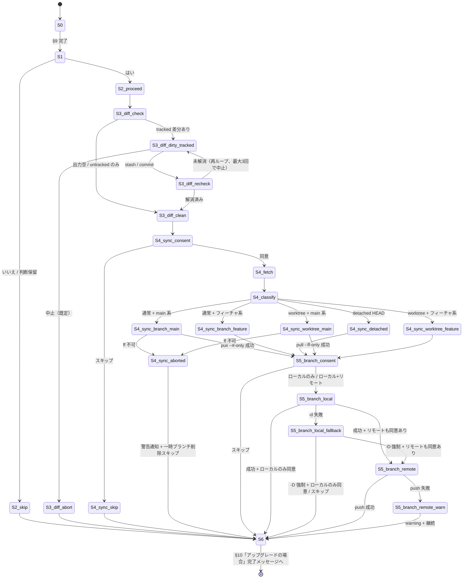

# ドメインモデル: Unit 001 - aidlc-setup マージ後フォローアップ

## 概要

`/aidlc-setup` のアップグレードフロー（ケースC）最終ステップに追加する「マージ確認 → 未コミット差分ガード → HEAD 同期 → 一時ブランチ削除」の状態遷移を仕様定義する。本 Unit はコード追加ではなく Markdown 手順書の改訂（`skills/aidlc-setup/steps/03-migrate.md`）であるため、ソフトウェアエンティティは存在しない。代わりに対象ワークフローの状態・イベント・ガード条件を「ドメイン」として記述する。

**重要**: このドメインモデル設計ではコードは書かず、手順書改訂で実現する状態遷移の仕様定義のみを行う。実装（Markdown 追記）は Phase 2 で行う。

## ドメインとは（本 Unit における定義）

- **対象ドメイン**: `/aidlc-setup` アップグレードフロー（ケースC）の最終段、§9（Git コミット）完了後 → §10（完了メッセージ）の間に発生する「マージ後フォローアップ」サブワークフロー
- **アクター**: AI-DLC 利用者（メタ開発者、外部プロジェクトでの aidlc-setup 利用者）
- **観測対象リソース**: ローカル `chore/aidlc-v<version>-upgrade` ブランチ、リモート同名ブランチ、ローカル HEAD、`origin/main` リモート参照、ワーキングツリー差分

## 実行順序の根拠（重要な構造的判断）

`/aidlc-setup` アップグレード走行時、§9 完了直後の HEAD は `chore/aidlc-v<version>-upgrade` ブランチをチェックアウト中である。この状態では git の制約により、現在チェックアウト中のブランチを `git branch -d|-D` で削除できない。したがって本フローの順序は以下に固定する:

1. **マージ確認ガード** → ユーザー意思の確認のみ（破壊操作なし）
2. **未コミット差分ガード** → `git status --porcelain` 観測、必要なら解消を促す
3. **HEAD 同期** → `git fetch origin --prune` + 5 サブ条件マトリクスに従う同期。**これによって HEAD は `chore/aidlc-v*-upgrade` から離脱**する（`origin/main` の祖先を直接指す状態 / detached HEAD / main 系ブランチ移動のいずれか）
4. **一時ブランチ削除** → HEAD が `chore/aidlc-v*-upgrade` から離脱した後にローカル + リモート削除を提案・実行

`HEAD 同期` をスキップした場合、現在ブランチが `chore/aidlc-v*-upgrade` のままとなり一時ブランチ削除は不可能になるため、その場合は「HEAD 同期をスキップしたためローカル一時ブランチは削除できません」と通知して BranchDeleteFlow をスキップする（リモート削除のみは可能だが、ローカル状態が残るため Operations Phase が想定する一貫した状態にならない。一律スキップとする）。

## 状態モデル

### 主要状態

| 状態ID | 名称 | 条件 |
|--------|------|------|
| S0 | §9 Git コミット完了直後 | アップグレード用ブランチでセットアップ差分のコミットが完了している |
| S1 | マージ確認ガード入力中 | 「PR をマージしましたか？」の `AskUserQuestion` 表示中 |
| S2_skip | マージ未完了で離脱 | ユーザーが「いいえ」または「判断保留」を選択。後続フロー全スキップ |
| S2_proceed | マージ完了で続行 | ユーザーが「はい」を選択 |
| S3_diff_check | 未コミット差分検出ガード入力中 | `git status --porcelain` 実行、tracked / untracked を分けて判定 |
| S3_diff_clean | tracked 差分なしで続行 | tracked 差分検出されず（untracked のみは注意喚起のみで継続） |
| S3_diff_dirty_tracked | tracked 差分あり、ユーザー選択中 | stash / commit / 中止 の選択肢を提示（既定中止） |
| S3_diff_recheck | 解消選択後の再検査中 | stash / commit 後に `git status --porcelain` 再実行 |
| S3_diff_abort | 中止で離脱 | 既定または明示的な中止選択。HEAD 同期 + 一時ブランチ削除全スキップ |
| S4_sync_consent | HEAD 同期同意確認中 | 「HEAD を `origin/main` に同期しますか？」の `AskUserQuestion` 表示中 |
| S4_sync_skip | HEAD 同期スキップで離脱 | スキップ選択。BranchDeleteFlow も一律スキップして S6 へ |
| S4_fetch | リモート fetch 実行 | `git fetch origin --prune` 実行 |
| S4_classify | HEAD 状態判定 | 5 サブ条件のいずれかに分類 |
| S4_sync_branch_main | 通常ブランチ（main 系）同期 | 現在ブランチが `refs/heads/main`。ff 可なら `git pull --ff-only`、ff 不可なら中断警告 |
| S4_sync_branch_feature | 通常ブランチ（フィーチャ系）同期 | 現在ブランチが main 以外。`git checkout --detach origin/main` |
| S4_sync_detached | detached HEAD 同期 | `git checkout --detach origin/main` |
| S4_sync_worktree_main | worktree（main 系 checkout）同期 | worktree かつ現在ブランチが `refs/heads/main`。ff 可なら `git pull --ff-only`、ff 不可なら中断警告 |
| S4_sync_worktree_feature | worktree（フィーチャ系 checkout）同期 | worktree かつ main 以外。`git checkout --detach origin/main` |
| S4_sync_aborted | 同期失敗で警告 | ff 不可で中断。「HEAD は同期されていません。手動対応が必要です」を通知。一時ブランチ削除はスキップ（HEAD が `chore/...` のままの可能性があるため） |
| S5_branch_consent | 一時ブランチ削除選択中 | 3 択提示中: ローカル+リモート / ローカルのみ / スキップ |
| S5_branch_local | ローカル削除実行 | `git branch -d` 実行（一次選択）。失敗時遷移先は S5_branch_local_fallback |
| S5_branch_local_fallback | -d 失敗で再確認 | `AskUserQuestion`（`-D` で強制削除する / スキップ） |
| S5_branch_remote | リモート削除実行 | `git push origin --delete` |
| S5_branch_remote_warn | リモート削除失敗で warning 継続 | push 失敗（権限なし / リモート不在）。warning 表示 + 継続 |
| S6 | §10 完了メッセージへ遷移 | フォローアップ完了。既存 §10「アップグレードの場合」完了メッセージへ |

### 状態遷移

```text
S0 → [マージ確認 AskUserQuestion(はい/いいえ/判断保留)] → S1
S1 → [いいえ / 判断保留] → S2_skip → S6
S1 → [はい] → S2_proceed → S3_diff_check
S3_diff_check → [git status --porcelain 実行]
  ├─ 出力空 → S3_diff_clean
  ├─ untracked のみ → 注意喚起 → S3_diff_clean（継続）
  └─ tracked 差分あり → S3_diff_dirty_tracked
S3_diff_dirty_tracked → [DiffResolution AskUserQuestion(中止/stash/commit)]
  ├─ 中止（既定） → S3_diff_abort → S6
  └─ stash / commit → ユーザー手動操作（または AI 代理実行）→ S3_diff_recheck
S3_diff_recheck → [git status --porcelain 再実行]
  ├─ 解消済み → S3_diff_clean
  └─ 未解消 → S3_diff_dirty_tracked（再ループ、最大 3 回で中止）
S3_diff_clean → S4_sync_consent
S4_sync_consent → [HEAD 同期 AskUserQuestion(同意/スキップ)]
  ├─ スキップ → S4_sync_skip → S6（一時ブランチ削除も一律スキップ）
  └─ 同意 → S4_fetch
S4_fetch → [git fetch origin --prune] → S4_classify
S4_classify → [HEAD 状態判定]
  └─ 5 サブ条件のいずれかへ → S4_sync_*
S4_sync_branch_main / S4_sync_worktree_main → [git pull --ff-only]
  ├─ ff 可 → S5_branch_consent
  └─ ff 不可 → S4_sync_aborted → S6
S4_sync_branch_feature / S4_sync_detached / S4_sync_worktree_feature
  → [git checkout --detach origin/main] → S5_branch_consent
S5_branch_consent → [BranchDeleteConsent AskUserQuestion(ローカル+リモート / ローカルのみ / スキップ)]
  ├─ スキップ → S6
  ├─ ローカルのみ → S5_branch_local（→ 完了で S6）
  └─ ローカル+リモート → S5_branch_local → S5_branch_remote
S5_branch_local → [git branch -d chore/aidlc-v<version>-upgrade]
  ├─ 成功 → リモート同意あり: S5_branch_remote / ローカルのみ: S6
  └─ 失敗 → S5_branch_local_fallback → [AskUserQuestion(-D / スキップ)]
        ├─ -D → [git branch -D] → リモート同意あり: S5_branch_remote / ローカルのみ: S6
        └─ スキップ → S6（リモート削除もスキップ）
S5_branch_remote → [git push origin --delete chore/aidlc-v<version>-upgrade]
  ├─ 成功 → S6
  └─ 失敗 → S5_branch_remote_warn → S6（warning + 継続）
```

### 遷移の不変条件

- **INV-1（オプトイン保証）**: S2_skip / S3_diff_abort / S4_sync_skip / S5_branch_consent スキップ いずれの離脱経路でも、ローカル / リモートの**いかなる状態も変更されない**。`AskUserQuestion` の同意選択肢を経由しない限り破壊的操作を行わない。**ただし `git fetch origin --prune` は S4_sync_consent 同意後に実行されるため、同意済みの状態で fetch が走る**（fetch は通常非破壊だが、`--prune` の副作用を手順書内に注記）。**DiffResolution の stash / commit 選択は同意とみなす**（オプトイン境界。AI 代理実行時は実行コマンドをユーザーに事前提示する。Phase 1 設計レビュー反復3 指摘 #2 対応）
- **INV-2（push 失敗の非破壊継続）**: S5_branch_remote_warn を経由した場合、warning 出力のみで例外停止せず、ローカル状態は影響を受けない（リモート側の状態は不明のまま継続）
- **INV-3（差分保護）**: S3_diff_dirty_tracked から S3_diff_clean に到達するには、ユーザーが stash / commit のいずれかで明示的に tracked 差分を解消し、S3_diff_recheck で空出力を確認した後でなければならない。既定の「中止」を選んだ場合は S3_diff_abort → S6 で離脱し、`git fetch` 含めいかなる git 操作も実行しない（fetch は非破壊だが「同期意思の確認」を兼ねるため一括スキップ）。**untracked のみは注意喚起の上で続行**（過剰反応を防ぐため）
- **INV-4（HEAD 一致条件 - 同期成功時のみ）**: S5 系 / S6 に到達した経路のうち **S4_sync_branch_main / S4_sync_worktree_main で ff 成功した場合、または S4_sync_branch_feature / S4_sync_detached / S4_sync_worktree_feature を経由した場合** に限り `git rev-parse HEAD == git rev-parse origin/main` が成立する。**S4_sync_aborted を経由した場合は HEAD は同期されておらず、S6 直前にユーザー向けサマリ通知（「HEAD は同期されていません。手動で `git reset --hard origin/main` 等を検討してください」）を必須とする**。同期失敗時は一時ブランチ削除も一律スキップ（HEAD が `chore/...` のままの可能性があり、ローカル削除が再び失敗するため）
- **INV-5（破壊的コマンド回避）**: 本フローは `git reset --hard origin/main` を**自動実行しない**。ff 不可ケースは S4_sync_aborted で中断 + 案内のみ
- **INV-6（アップグレードフロー限定）**: 本フロー全体は `/aidlc-setup` のアップグレードフロー（ケースC）でのみ実行される。初回セットアップ / 移行ケースでは到達しない（挿入位置 (a) 採用時は冒頭で明示、(b) 採用時は §10「アップグレードの場合」サブセクション内に配置することで構造的に保証）
- **INV-7（AskUserQuestion 必須性）**: 本フロー内のすべての分岐は `automation_mode`（manual / semi_auto / full_auto）に関わらず対話必須（SKILL.md「ユーザー選択」種別。ゲート承認ではない）。**full_auto 走行時もこの対話は省略しない**（破壊的 git 操作を伴うため、無人実行は許容しない）
- **INV-8（チェックアウト中ブランチ削除回避）**: BranchDeleteFlow（S5 系）は HeadSyncFlow（S4 系）の完了後にのみ到達する。HEAD 同期によって現在ブランチが `chore/aidlc-v*-upgrade` から離脱（main 系ブランチ移動 / detached HEAD / origin/main 直接指す状態）した状態で、`git branch -d|-D` 実行が安全に可能となる。HEAD 同期スキップまたは S4_sync_aborted 時は S5 系を一律スキップする
- **INV-9（一時ブランチ削除のオプトイン分離）**: BranchDeleteConsent は「ローカル+リモート」「ローカルのみ」「スキップ」の 3 択。「ローカル+リモート」と「ローカルのみ」を分離することで、push 権限を持たないユーザー環境でもローカル削除のみのオプトインが可能になる（Phase 1 設計レビュー反復1 指摘 #4 対応）
- **INV-10（再検査ループ上限）**: S3_diff_dirty_tracked → S3_diff_recheck → S3_diff_dirty_tracked のループは **最大 3 回**。3 回到達時は S3_diff_abort へ強制遷移する。3 回上限の根拠: (1) 無限ループ防止、(2) ユーザーが解消手段を 3 回提示されてもなお解消しない場合は手動対応に委ねる方が UX 上適切（疲労閾値）。カウンタは AI エージェントが内部で保持する（手順書内では「最大 3 回まで再検査します」と明示）（Phase 1 設計レビュー反復2 指摘 #2 対応）

## イベント・コマンド

### 検出イベント

| イベント名 | トリガ | 観測対象 |
|-----------|-------|---------|
| `MergeConfirmAnswered` | `AskUserQuestion`（マージ確認）回答 | 「はい」 / 「いいえ」 / 「判断保留」 |
| `WorkingTreeStatusObserved` | `git status --porcelain` 出力 | 出力空 → 差分なし / `??` のみ → untracked のみ / その他 → tracked 差分あり |
| `DiffResolutionChoice` | `AskUserQuestion`（DiffResolution）回答 | 「中止」（既定）/ 「stash」 / 「commit」 |
| `WorkingTreeRecheck` | `git status --porcelain` 再実行 | tracked 差分が解消されたかを再判定 |
| `SyncConsentAnswered` | `AskUserQuestion`（HEAD 同期同意）回答 | 「同意」 / 「スキップ」 |
| `HeadStateClassified` | `git rev-parse --git-common-dir` / `git rev-parse --git-dir` / `git symbolic-ref --short HEAD` の組み合わせ判定 | 5 サブ条件（通常-main 系 / 通常-フィーチャ系 / detached / worktree-main 系 / worktree-フィーチャ系） |
| `FfPullResult` | `git pull --ff-only` 実行結果 | exit code（0=成功、非0=ff 不可 → S4_sync_aborted） |
| `DetachCheckoutResult` | `git checkout --detach origin/main` 実行結果 | 通常成功（fetch 後の origin/main が必須） |
| `BranchDeleteConsentAnswered` | `AskUserQuestion`（BranchDeleteConsent）回答 | 「ローカル+リモート」 / 「ローカルのみ」 / 「スキップ」 |
| `LocalBranchDeleteResult` | `git branch -d` 実行結果 | exit code（0=成功、非0=`-D` フォールバック確認） |
| `LocalBranchDeleteFallbackChoice` | `AskUserQuestion`（`-D` / スキップ）回答 | 「-D で強制削除」 / 「スキップ」 |
| `RemotePushResult` | `git push origin --delete` 実行結果 | exit code（0=成功、非0=warning + 継続） |

### ユーザーコマンド（AskUserQuestion による選択）

| コマンド | 選択肢 | 後続状態 |
|---------|-------|---------|
| `MergeConfirm` | はい / いいえ / 判断保留 | S2_proceed / S2_skip / S2_skip |
| `DiffResolution` | 中止（既定） / stash / commit | S3_diff_abort / 解消後 S3_diff_recheck / 解消後 S3_diff_recheck |
| `SyncConsent` | 同意 / スキップ | S4_fetch / S4_sync_skip |
| `BranchDeleteConsent` | ローカル+リモート / ローカルのみ / スキップ | S5_branch_local（→S5_branch_remote）/ S5_branch_local（→S6）/ S6 |
| `BranchDeleteFallbackConsent`（条件付き） | -D で強制削除 / スキップ | -D 実行 / S6 |

## ユビキタス言語

- **アップグレードフロー（ケースC）**: `/aidlc-setup` の動作モードのうち、既存 v2.X.X セットアップに対するアップグレード走行を指す。`steps/03-migrate.md` 内では §10「アップグレードの場合」のメッセージブロックで言及されている
- **マージ後フォローアップ**: 本 Unit で追加する 4 機能項目（マージ確認 / 未コミット差分ガード / HEAD 同期 / 一時ブランチ削除）の総称
- **一時ブランチ**: `chore/aidlc-v<version>-upgrade` 形式のローカル + リモートブランチ。`/aidlc-setup` のアップグレード走行で生成され、PR マージ後に残存する
- **オプトイン**: ユーザーが `AskUserQuestion` で明示的に「同意」「はい」と回答した場合のみ後続処理を実行する原則
- **5 サブ条件マトリクス**: HEAD 同期時の現在の HEAD 状態を「通常ブランチ-main 系 / 通常ブランチ-フィーチャ系 / detached HEAD / worktree-main 系 / worktree-フィーチャ系」の 5 サブ条件に分類するロジック。**判定順序**: (1) worktree 判定（`--git-common-dir` vs `--git-dir`）、(2) main 系判定（`symbolic-ref --short HEAD`）。両者は独立軸であり 2x2 + detached の 5 サブ条件マトリクスを構成する（Phase 1 設計レビュー反復2 指摘 #10 対応）
- **main 系判定**: 現在ブランチ名が `refs/heads/main` であるかを `git symbolic-ref --short HEAD` で判定する。`merge-base --is-ancestor` 系判定は採用しない（フィーチャブランチがマージ後 origin/main の祖先になるケースで誤判定するため）
- **tracked 差分** vs **untracked**: `git status --porcelain` の出力先頭 2 文字で判別（`??` プレフィックスは untracked、それ以外は tracked）

## 外部エンティティ（参照のみ、変更なし）

- `AskUserQuestion`: Claude Code harness のユーザー選択プリミティブ。本 Unit で改修対象としない
- `git` CLI（標準依存）: 本 Unit の操作対象。`branch -d|-D` / `push origin --delete` / `fetch origin --prune` / `checkout --detach` / `pull --ff-only` / `status --porcelain` / `symbolic-ref --short HEAD` / `rev-parse --git-{common-,}dir` を使用
- `bin/post-merge-sync.sh`: 本 Unit のスコープ外。当該スクリプトの挙動については本 Unit では言及しない（Phase 1 設計レビュー反復1 指摘 #9 対応）。**機能重複の可能性（限定的）**: post-merge-sync.sh は本リポジトリ専用ツールであり、利用者プロジェクト環境への配布は想定しない。ただし**メタ開発者リポジトリ（=本リポジトリ）における運用検証時は**、両者が「マージ後一時ブランチ削除 + HEAD 同期」目的で並行存在することに留意（Phase 1 設計レビュー反復3 指摘 #5 対応で前提を限定）
- `skills/aidlc-migrate/steps/03-verify.md`: Unit 002 の対象。本 Unit の文面・コマンド系列を Unit 002 設計レビュー時に流用判断（**本 Unit から Unit 002 への新規依存は導入しない**）

## ドメインモデル図（状態遷移）



## 不明点と質問（設計中に記録）

[Question] 挿入位置 (a)（§9-§10 間に独立節）と (b)（§10「アップグレードの場合」サブセクション内）のどちらを採用するか？
[Answer] 一次推奨は **(b) §10「アップグレードの場合」サブセクション内に統合**。ただし指摘 #10 で要請された「実装対象 `skills/aidlc-setup/steps/03-migrate.md` の現状構造（§10 がサブセクション分割を持っているか）」の確認結果を踏まえて Phase 2 着手前に再確定する。現状確認結果: `steps/03-migrate.md` の §10 は「### 初回セットアップの場合」「### アップグレードの場合」「### 移行の場合」の見出し 3 種で分割されているがサブ番号は無い。(b) 採用時は §10「アップグレードの場合」見出し配下に「#### マージ後フォローアップ」などのサブサブセクションを追加する形となる。

[Question] ローカル削除コマンドは `-d` / `-D` のどちらを一次選択とするか？
[Answer] **`git branch -d` 一次 + 失敗時 `-D` フォールバック再確認（Phase 1 設計レビューで確定済み、Phase 2 で実装）**。理由: (1) 本リポジトリの merge_method は `merge`（マージコミット保持）でデフォルト動作下では `-d` が成功する、(2) 利用者環境によっては squash merge / rebase merge が使われる可能性があり、その場合のみ `-d` が拒否される、(3) `-D` 一律は安全装置を外すため初手としては避けたい。フォールバック発動時の文言は「`-d` で削除できませんでした（squash/rebase merge の可能性）。`-D` で強制削除しますか？」とする。

[Question] worktree 検出ロジックの具体的な手順は？
[Answer] `git rev-parse --git-common-dir` と `git rev-parse --git-dir` の比較を採用。両者が異なる場合は worktree、一致する場合はメインリポジトリ。

[Question] 「main 系 / フィーチャ系」の判定基準は？
[Answer] **`git symbolic-ref --short HEAD` の出力が `main` であるかを判定基準とする**。`merge-base --is-ancestor` 系は採用しない（マージ後 `chore/aidlc-v*-upgrade` が origin/main の祖先となり「main 系」と誤判定されるため。指摘 #1 対応）。`master` 等 main 以外のデフォルトブランチには現状未対応（v2.4.2 スコープ外。本リポジトリ + メインターゲットの利用シナリオは `main` 固定）。`symbolic-ref --short HEAD` が失敗（exit !=0）した場合は detached HEAD と判定する。

[Question] バージョン番号の取得方法は？
[Answer] **§9 までで判明している既存変数（`/aidlc-setup` のコンテキスト変数）から流用する** を採用（指摘 #15 対応）。`git branch --list` のパースは fallback としても採用しない（複雑性増）。

[Question] `AskUserQuestion` 不採用時のフォールバック設計は残すか？
[Answer] **設計レビューで `AskUserQuestion` 採用が確定したため、論理設計の「不採用時のフォールバック対話設計」セクションは Phase 2 実装時に削除する**（指摘 #11 対応）。

[Question] SKILL.md（`skills/aidlc-setup/SKILL.md`）への誘導見出し追記は必要か？
[Answer] 現状の SKILL.md は「ステップ実行」が 3 ステップ列挙で完結しており、`steps/03-migrate.md` 内のセクション追加のみで済む。**SKILL.md 改訂は不要**（Phase 2 実装でも SKILL.md は変更しない）。

[Question] `aidlc-setup` SKILL.md / steps は `automation_mode` を参照しているか？INV-7 の根拠は？
[Answer] 現状の `skills/aidlc-setup/SKILL.md` および `steps/03-migrate.md` は **`automation_mode` を参照していない**（aidlc-setup スキル全体が automation_mode 概念を持たない設計）。INV-7（full_auto 走行時も対話必須）の根拠は **将来 `automation_mode` が aidlc-setup に統合された場合のフォワード互換**として残す。現時点では INV-7 は冗長だが、本フローは破壊的 git 操作を含むため automation_mode 統合時にも無人化を許容しない方針を明示する目的で記述（Phase 1 設計レビュー反復2 指摘 #4 対応）。
