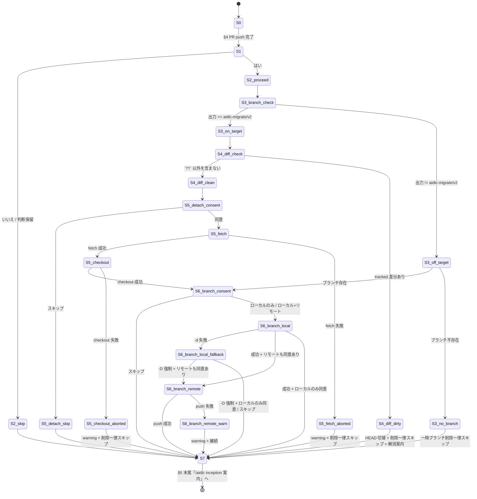

# ドメインモデル: Unit 002 - aidlc-migrate マージ後フォローアップ

## 概要

`/aidlc-migrate` の v1→v2 マイグレーション最終ステップ（`steps/03-verify.md` §4 PR push 完了直後）に追加する「マージ確認 → HEAD 切替（簡易差分チェック含む）→ 一時ブランチ削除」の状態遷移を仕様定義する。本 Unit はコード追加ではなく Markdown 手順書の改訂であり、ソフトウェアエンティティは存在しない。代わりに対象ワークフローの状態・イベント・ガード条件を「ドメイン」として記述する。

**Unit 001 との関係**: 本 Unit は Unit 001（`unit_001_setup_merge_followup_domain_model.md`）のドメインモデルを縮約再利用する。INV 番号体系は Unit 001 を流用し、本 Unit で適用しない INV-3 / INV-4 / INV-6 / INV-10 は明示的に除外する。

**重要**: このドメインモデル設計ではコードは書かず、手順書改訂で実現する状態遷移の仕様定義のみを行う。実装（Markdown 追記）は Phase 2 で行う。

## ドメインとは（本 Unit における定義）

- **対象ドメイン**: `/aidlc-migrate` の v1→v2 マイグレーションフロー最終段、§4（コミットと PR 作成）完了後 → §4 末尾（または新規 §5 末尾）の `/aidlc inception` 案内の間に発生する「マージ後フォローアップ」サブワークフロー
- **アクター**: AI-DLC v1 → v2 マイグレーション実施者（外部プロジェクトでの aidlc-migrate 利用者、メタ開発者）
- **観測対象リソース**: ローカル `aidlc-migrate/v2` ブランチ、リモート同名ブランチ、ローカル HEAD、`origin/main` リモート参照、ワーキングツリー差分（最低限の tracked のみ）

## 実行順序の根拠（Unit 001 で確立した順序原則の踏襲）

`/aidlc-migrate` 走行時、§4 PR push 完了直後の HEAD は通常 `aidlc-migrate/v2` ブランチをチェックアウト中である。git 制約により、現在チェックアウト中のブランチを `git branch -d|-D` で削除できない。したがって本フローの順序は以下に固定する:

1. **マージ確認ガード** → ユーザー意思の確認のみ（破壊操作なし）
2. **HEAD 切替（HeadDetachGuard）** → `git symbolic-ref --short HEAD` で現在ブランチ確認 + `git status --porcelain` で簡易 tracked 差分チェック + 同意取得 + `git fetch origin --prune` + `git checkout --detach origin/main`。**これによって HEAD は `aidlc-migrate/v2` から離脱**する
3. **一時ブランチ削除** → HEAD が `aidlc-migrate/v2` から離脱した後にローカル + リモート削除を提案・実行

`HEAD 切替` をスキップした場合、現在ブランチが `aidlc-migrate/v2` のままとなり一時ブランチ削除は不可能になるため、その場合は一時ブランチ削除を一律スキップする（INV-8）。

## 状態モデル

### 主要状態

| 状態ID | 名称 | 条件 |
|--------|------|------|
| S0 | §4 PR push 完了直後 | aidlc-migrate/v2 ブランチで PR push 完了 |
| S1 | マージ確認ガード入力中 | 「v1→v2 マイグレーション PR をマージしましたか？」の `AskUserQuestion` 表示中 |
| S2_skip | マージ未完了で離脱 | ユーザーが「いいえ」または「判断保留」を選択。後続フロー全スキップ |
| S2_proceed | マージ完了で続行 | ユーザーが「はい」を選択 |
| S3_branch_check | 現在ブランチ確認中 | `git symbolic-ref --short HEAD` 実行 |
| S3_on_target | aidlc-migrate/v2 チェックアウト中 | 出力 == `aidlc-migrate/v2` |
| S3_off_target | 既に他ブランチ / detached HEAD | 出力 != `aidlc-migrate/v2` または取得失敗 |
| S3_no_branch | aidlc-migrate/v2 ブランチ自体が存在しない | `git rev-parse --verify aidlc-migrate/v2` 失敗 |
| S4_diff_check | 簡易 tracked 差分チェック中 | `git status --porcelain` 実行 |
| S4_diff_clean | tracked 差分なしで続行 | 出力に `??` 以外の行を含まない |
| S4_diff_dirty | tracked 差分検出で離脱 | tracked 差分検出。HEAD 切替 + 一時ブランチ削除を一律スキップ + 解消手段（stash / commit）案内 |
| S5_detach_consent | HEAD 切替同意確認中 | 「HEAD を `origin/main` に detach しますか？」の `AskUserQuestion` 表示中 |
| S5_detach_skip | HEAD 切替スキップで離脱 | スキップ選択。一時ブランチ削除も一律スキップして S7 へ |
| S5_fetch | リモート fetch 実行 | `git fetch origin --prune` 実行 |
| S5_fetch_aborted | fetch 失敗で離脱 | ネットワークエラー等で fetch 失敗。warning 出力 + 一時ブランチ削除一律スキップ + S7 へ（Unit 002 設計レビュー反復1 指摘 #2 対応） |
| S5_checkout | detach 実行 | `git checkout --detach origin/main` 実行 |
| S5_checkout_aborted | detach 失敗で離脱 | checkout 失敗（衝突等）。warning 出力 + 一時ブランチ削除一律スキップ + S7 へ |
| S6_branch_consent | 一時ブランチ削除選択中 | 3 択提示中: ローカル+リモート / ローカルのみ / スキップ |
| S6_branch_local | ローカル削除実行 | `git branch -d aidlc-migrate/v2` 実行（一次選択） |
| S6_branch_local_fallback | -d 失敗で再確認 | `AskUserQuestion`（`-D` で強制削除する / スキップ） |
| S6_branch_remote | リモート削除実行 | `git push origin --delete aidlc-migrate/v2` |
| S6_branch_remote_warn | リモート削除失敗で warning 継続 | push 失敗（権限なし / リモート不在）。warning 表示 + 継続 |
| S7 | §5 末尾「`/aidlc inception` 案内」へ遷移 | フォローアップ完了。§4 から移動した完了案内文へ |

### 状態遷移

```text
S0 → [マージ確認 AskUserQuestion(はい/いいえ/判断保留)] → S1
S1 → [いいえ / 判断保留] → S2_skip → S7
S1 → [はい] → S2_proceed → S3_branch_check
S3_branch_check → [git symbolic-ref --short HEAD]
  ├─ 出力 == aidlc-migrate/v2 → S3_on_target → S4_diff_check
  └─ 出力 != aidlc-migrate/v2（既に他ブランチ or detached） → S3_off_target
S3_off_target → [git rev-parse --verify aidlc-migrate/v2]
  ├─ ブランチ存在 → S6_branch_consent（HEAD 切替不要、直接削除可能）
  └─ ブランチ不存在 → S3_no_branch → S7（一時ブランチ削除一律スキップ）
S4_diff_check → [git status --porcelain 実行]
  ├─ `??` 以外の行を含まない → S4_diff_clean → S5_detach_consent
  └─ tracked 差分あり → S4_diff_dirty → S7（HEAD 切替 + 一時ブランチ削除一律スキップ + 解消案内）
S5_detach_consent → [HEAD 切替 AskUserQuestion(同意/スキップ)]
  ├─ スキップ → S5_detach_skip → S7（一時ブランチ削除も一律スキップ）
  └─ 同意 → S5_fetch
S5_fetch → [git fetch origin --prune]
  ├─ 成功 → S5_checkout
  └─ 失敗（ネットワークエラー等） → S5_fetch_aborted → S7（warning + 一時ブランチ削除一律スキップ）
S5_checkout → [git checkout --detach origin/main]
  ├─ 成功 → S6_branch_consent
  └─ 失敗（衝突等） → S5_checkout_aborted → S7（warning + 一時ブランチ削除一律スキップ）
S6_branch_consent → [BranchDeleteConsent AskUserQuestion(ローカル+リモート / ローカルのみ / スキップ)]
  ├─ スキップ → S7
  ├─ ローカルのみ → S6_branch_local（→ 完了で S7）
  └─ ローカル+リモート → S6_branch_local → S6_branch_remote
S6_branch_local → [git branch -d aidlc-migrate/v2]
  ├─ 成功 → リモート同意あり: S6_branch_remote / ローカルのみ: S7
  └─ 失敗 → S6_branch_local_fallback → [AskUserQuestion(-D / スキップ)]
        ├─ -D → [git branch -D] → リモート同意あり: S6_branch_remote / ローカルのみ: S7
        └─ スキップ → S7（リモート削除もスキップ）
S6_branch_remote → [git push origin --delete aidlc-migrate/v2]
  ├─ 成功 → S7
  └─ 失敗 → S6_branch_remote_warn → S7（warning + 継続）
```

### 遷移の不変条件

> **INV 番号体系の注記**: 本 Unit は Unit 001 の INV 番号を流用し、Unit 002 で意味が変わらないものはそのまま継承する。**INV-3（差分保護フル機能）/ INV-4（HEAD 一致条件）/ INV-6（アップグレードフロー限定）/ INV-10（再検査ループ上限）は本 Unit では適用しない**（Unit 001 のみで適用）。

- **INV-1（オプトイン保証）**: S2_skip / S4_diff_dirty / S5_detach_skip / S6_branch_consent スキップ いずれの離脱経路でも、ローカル / リモートの**いかなる状態も変更されない**。`AskUserQuestion` の同意選択肢を経由しない限り破壊的操作を行わない。**ただし `git fetch origin --prune` は S5_detach_consent 同意後に実行されるため、同意済みの状態で fetch が走る**（fetch は通常非破壊だが、`--prune` の副作用を手順書内に注記）。**fetch 失敗（S5_fetch_aborted）時はリモート追跡ブランチ整理が部分実行となる可能性があるが、ローカルブランチ・HEAD・ワーキングツリーには影響しないため非破壊性は保たれる**（Unit 002 設計レビュー反復2 指摘 N3 対応）
- **INV-2（push 失敗の非破壊継続）**: S6_branch_remote_warn を経由した場合、warning 出力のみで例外停止せず、ローカル状態は影響を受けない（リモート側の状態は不明のまま継続）
- ~~**INV-3**~~: 適用外（フル差分ガードは Unit 001 のみ。本 Unit では「最低限の tracked 差分チェック → 検出時は HEAD 切替を中止」のみ）
- ~~**INV-4**~~: 適用外（5 サブ条件マトリクスを持たない。HEAD 切替は `aidlc-migrate/v2` チェックアウト中の 1 ケースのみで、`git checkout --detach origin/main` 成功時に HEAD == origin/main となる単一経路）
- **INV-5（破壊的コマンド回避）**: 本フローは `git reset --hard origin/main` を**自動実行しない**。tracked 差分検出時は S4_diff_dirty で中止 + 案内のみ
- ~~**INV-6**~~: 適用外（`steps/03-verify.md` 自体が migrate 専用ファイルのため構造的に保証され、明示の必要なし）
- **INV-7（AskUserQuestion 必須性、フォワード互換）**: 本フロー内のすべての分岐は `automation_mode`（manual / semi_auto / full_auto）に関わらず対話必須（SKILL.md「ユーザー選択」種別。ゲート承認ではない）。**現状 `aidlc-migrate` スキルは `automation_mode` を参照していない**が、将来統合された場合のフォワード互換として記述
- **INV-8（チェックアウト中ブランチ削除回避）**: BranchDeleteFlow（S6 系）は **HEAD が `aidlc-migrate/v2` をチェックアウト中でない状態** にのみ到達する。これは以下 2 経路のいずれかで保証される（Unit 002 設計レビュー反復1 指摘 #4 対応）:
  - 経路 A: S3_on_target → S4_diff_clean → S5_detach_consent 同意 → S5_fetch 成功 → S5_checkout 成功（HEAD 切替完了経路）
  - 経路 B: S3_off_target → 当該ブランチ存在確認 OK（既に他ブランチに居る経路）

  HEAD 切替スキップ / 失敗（S5_fetch_aborted / S5_checkout_aborted）/ S4_diff_dirty / S3_no_branch 時は S6 系を一律スキップする
- **INV-9（一時ブランチ削除のオプトイン分離）**: BranchDeleteConsent は「ローカル+リモート」「ローカルのみ」「スキップ」の 3 択。「ローカル+リモート」と「ローカルのみ」を分離することで、push 権限を持たないユーザー環境でもローカル削除のみのオプトインが可能（Unit 001 INV-9 を継承）
- ~~**INV-10**~~: 適用外（再検査ループは持たない。tracked 差分検出時は単発で離脱）

## イベント・コマンド

### 検出イベント

| イベント名 | トリガ | 観測対象 |
|-----------|-------|---------|
| `MergeConfirmAnswered` | `AskUserQuestion`（マージ確認）回答 | 「はい」 / 「いいえ」 / 「判断保留」 |
| `CurrentBranchObserved` | `git symbolic-ref --short HEAD` 実行 | 出力 == `aidlc-migrate/v2` / それ以外 / 取得失敗（detached） |
| `TargetBranchExistenceObserved` | `git rev-parse --verify aidlc-migrate/v2` 実行 | exit code 0 = 存在 / 非0 = 不存在 |
| `WorkingTreeStatusObserved` | `git status --porcelain` 実行 | 出力に `??` 以外の行を含むかで判定 |
| `DetachConsentAnswered` | `AskUserQuestion`（HEAD 切替同意）回答 | 「同意」 / 「スキップ」 |
| `FetchResult` | `git fetch origin --prune` 実行結果 | exit code（0=成功 → S5_checkout、非0=ネットワークエラー → S5_fetch_aborted） |
| `DetachCheckoutResult` | `git checkout --detach origin/main` 実行結果 | exit code（0=成功 → S6_branch_consent、非0=衝突等失敗 → S5_checkout_aborted） |
| `BranchDeleteConsentAnswered` | `AskUserQuestion`（BranchDeleteConsent）回答 | 「ローカル+リモート」 / 「ローカルのみ」 / 「スキップ」 |
| `LocalBranchDeleteResult` | `git branch -d` 実行結果 | exit code（0=成功、非0=`-D` フォールバック確認） |
| `LocalBranchDeleteFallbackChoice` | `AskUserQuestion`（`-D` / スキップ）回答 | 「-D で強制削除」 / 「スキップ」 |
| `RemotePushResult` | `git push origin --delete` 実行結果 | exit code（0=成功、非0=warning + 継続） |

### ユーザーコマンド（AskUserQuestion による選択）

| コマンド | 選択肢 | 後続状態 |
|---------|-------|---------|
| `MergeConfirm` | はい / いいえ / 判断保留 | S2_proceed / S2_skip / S2_skip |
| `DetachConsent` | 同意 / スキップ | S5_fetch / S5_detach_skip |
| `BranchDeleteConsent` | ローカル+リモート / ローカルのみ / スキップ | S6_branch_local（→S6_branch_remote）/ S6_branch_local（→S7）/ S7 |
| `BranchDeleteFallbackConsent`（条件付き） | -D で強制削除 / スキップ | -D 実行 / S7 |

## ユビキタス言語

- **v1→v2 マイグレーション**: AI-DLC v1（旧形式）から v2（現行形式）への移行作業。`/aidlc-migrate` スキルが担当する一回限りのマイグレーション
- **マージ後フォローアップ**: 本 Unit で追加する 3 機能項目（マージ確認 / HEAD 切替（簡易差分チェック含む）/ 一時ブランチ削除）の総称
- **一時ブランチ**: `aidlc-migrate/v2` 形式のローカル + リモートブランチ。`/aidlc-migrate` 走行で生成され、PR マージ後に残存する（v1→v2 マイグレーション専用、固定名）
- **オプトイン**: ユーザーが `AskUserQuestion` で明示的に「同意」「はい」と回答した場合のみ後続処理を実行する原則
- **HEAD 切替（detach）**: 本 Unit における「HEAD 同期」の縮約版。`git checkout --detach origin/main` の単一コマンドのみで、Unit 001 の 5 サブ条件マトリクスは持たない
- **簡易 tracked 差分チェック**: `git status --porcelain` の出力先頭 2 文字で `??` 以外の行（tracked 差分）を検出する単発チェック。Unit 001 の DiffResolution（stash/commit/中止 + 再検査ループ）は持たない
- **tracked 差分** vs **untracked**: `git status --porcelain` の出力先頭 2 文字で判別（`??` プレフィックスは untracked、それ以外は tracked）

### Unit 001 → Unit 002 概念縮約マッピング（Unit 002 設計レビュー反復1 指摘 #10 対応）

| Unit 001 概念 | Unit 002 概念 | 縮約理由 |
|--------------|---------------|---------|
| HEAD 同期（HeadSyncFlow + HeadStateClassifier + HeadSyncConsentGuard） | HEAD 切替（HeadDetachGuard 単一コンポーネント） | 5 サブ条件マトリクス不要、`origin/main` への detach 単一コマンドのみ |
| UncommittedDiffGuard（フル機能：stash/commit/中止 + 再検査ループ） | 簡易 tracked 差分チェック（`git status --porcelain` 単発判定） | 検出時は中止のみ、解消手段は案内に限定 |
| 5 サブ条件マトリクス（通常-main / 通常-フィーチャ / detached / worktree-main / worktree-フィーチャ） | 1 ケース対応（`aidlc-migrate/v2` チェックアウト中のみ HEAD 切替） | migrate のフロー特性上、対象は固定 1 ケース |
| `SyncConsent`（対話 UI 名） | `DetachConsent`（対話 UI 名、改名） | スコープ縮小（同期 → detach 単一動作）に伴う改名（指摘 #7 対応） |
| `chore/aidlc-v<version>-upgrade`（プレースホルダ付き） | `aidlc-migrate/v2`（固定名） | v1→v2 マイグレーション専用、バージョン展開不要 |

## 外部エンティティ（参照のみ、変更なし）

- `AskUserQuestion`: Claude Code harness のユーザー選択プリミティブ。本 Unit で改修対象としない
- `git` CLI（標準依存）: 本 Unit の操作対象。`branch -d|-D` / `push origin --delete` / `fetch origin --prune` / `checkout --detach` / `status --porcelain` / `symbolic-ref --short HEAD` / `rev-parse --verify` を使用
- `bin/post-merge-sync.sh`: 本 Unit のスコープ外。当該スクリプトの挙動については本 Unit では言及しない
- `skills/aidlc-setup/steps/03-migrate.md`: Unit 001 で確定した実装。本 Unit の文面・コマンド系列は Unit 001 から流用する（具体的な行番号マッピングは論理設計を参照）

## ドメインモデル図（状態遷移）



## 不明点と質問（設計中に記録）

[Question] 挿入位置は `steps/03-verify.md` の §4 の後に新規 §5 を追加する形でよいか？§4 末尾の `/aidlc inception` 案内文の扱いは？
[Answer] 計画書 Phase 1 で確定済み: §4 の後に新規 §5「マージ後フォローアップ」を追加し、§4 末尾の `/aidlc inception` 案内文（line 67-74）は §5 末尾に移動する。これにより「PR push → §5 マージ後フォローアップ → `/aidlc inception` 案内」の直線的な流れを維持する。

[Question] HEAD 切替コマンドは `git checkout --detach origin/main` 単一でよいか？Unit 001 のような main 系判定 + ff-only は不要か？
[Answer] 不要。本 Unit のスコープ縮小方針（Unit 定義および計画書 §スコープ）により、HEAD 切替は `aidlc-migrate/v2` チェックアウト中 → `origin/main` への detach の 1 ケースのみ。main 系判定 / worktree 判定 / ff-only は Unit 001 のみで実装する。

[Question] `aidlc-migrate/v2` ブランチが既に削除済み（または存在しない）状態で本フローに入った場合の動作は？
[Answer] `git rev-parse --verify aidlc-migrate/v2` で存在確認し、不存在時は S3_no_branch → S7 で一時ブランチ削除を一律スキップする（既に削除済みなら何もしない）。

[Question] 簡易 tracked 差分チェックで untracked のみ検出時はどう扱うか？
[Answer] **続行扱い**（Unit 001 の方針を踏襲）。`git status --porcelain` の出力先頭 2 文字 `??` の行は untracked であり、HEAD 切替（detach）への影響は低い。`??` 以外の行（tracked 差分）が含まれる場合のみ S4_diff_dirty に遷移する。

[Question] tracked 差分検出時の解消案内（stash / commit）は AI 代理実行か手動操作か？
[Answer] 本 Unit では**案内のみ**。Unit 001 のような DiffResolution（3 択 + 再検査ループ）は持たないため、案内文を表示して S7 へ離脱する。ユーザーは手動で stash / commit して再走行（再度 `/aidlc-migrate` の §5 を再開する）。

[Question] ローカル削除コマンドは `-d` / `-D` のどちらを一次選択とするか？
[Answer] **`git branch -d` 一次 + 失敗時 `-D` フォールバック再確認**（Unit 001 の方針を踏襲）。理由: (1) 本リポジトリの merge_method は `merge`（マージコミット保持）でデフォルト動作下では `-d` が成功する、(2) 利用者環境によっては squash merge / rebase merge が使われる可能性があり、その場合のみ `-d` が拒否される、(3) `-D` 一律は安全装置を外すため初手としては避けたい。

[Question] SKILL.md（`skills/aidlc-migrate/SKILL.md`）への誘導見出し追記は必要か？
[Answer] Phase 1 設計成果物として確認する。現状の SKILL.md は 3 ステップ列挙で完結しており、`steps/03-verify.md` 内のセクション追加のみで済む見込み。**SKILL.md 改訂は不要**（最終確認は Phase 1 設計レビューで実施）。

[Question] `aidlc-migrate` SKILL.md / steps は `automation_mode` を参照しているか？INV-7 の根拠は？
[Answer] 現状の `skills/aidlc-migrate/SKILL.md` および `steps/03-verify.md` は **`automation_mode` を参照していない**（aidlc-migrate スキル全体が automation_mode 概念を持たない設計、Unit 001 と同様）。INV-7 の根拠は **将来 `automation_mode` が aidlc-migrate に統合された場合のフォワード互換**として残す。本フローは破壊的 git 操作を含むため automation_mode 統合時にも無人化を許容しない方針を明示する目的で記述。
