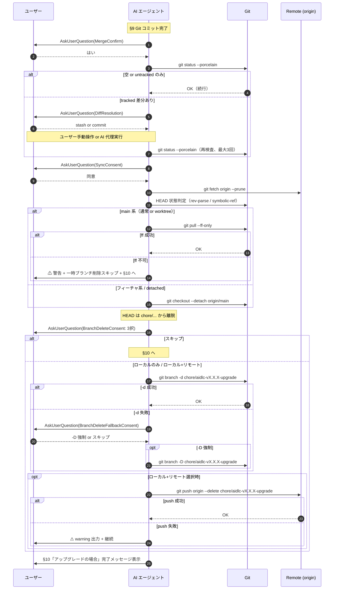

# 論理設計: Unit 001 - aidlc-setup マージ後フォローアップ

## 概要

ドメインモデル（`unit_001_setup_merge_followup_domain_model.md`）で定義した状態遷移を、Markdown 手順書（`skills/aidlc-setup/steps/03-migrate.md`）への追記として実現する論理設計。本 Unit は実装コードを書かず、追記する手順書セクションの構造・対話 UI 仕様・git コマンド系列マトリクスを定義する。

**重要**: この論理設計ではコードは書かず、コンポーネント構成（手順書セクション構造）とインターフェース定義（対話 UI / git コマンド）のみを行う。具体的な Markdown 文面は Phase 2 で作成する。

## アーキテクチャパターン

- **採用パターン**: **手順書ガイド型ワークフロー**（Markdown 手順書による分岐フロー記述）
- **選定理由**: 本 Unit はコード追加ではなく Markdown 手順書改訂のため、ソフトウェアアーキテクチャパターンではなく「ガイドフロー設計」として扱う。AI エージェントが手順書を逐次解釈して `AskUserQuestion` と git コマンドを発行する形式は v2.4.1 以前の Operations / Construction フェーズで確立済みのパターンに準拠

## 実装対象 §10 の現状構造（確認済み）

`skills/aidlc-setup/steps/03-migrate.md` の §10 は以下の見出し構造を持つ:

```text
## 10. 完了メッセージと次のステップ
  ### 初回セットアップの場合
  ### アップグレードの場合
  ### 移行の場合
```

サブ番号（§10.1 等）は付与されておらず、`### <ケース>` 見出しで分割されている。`### アップグレードの場合` 見出し配下にメッセージブロックがあり、その後ろに `### 次のステップ: サイクル開始` 等の補足セクションが続く。

## コンポーネント構成

### 改訂対象ファイルの節構造（一次案: (b) サブセクション統合方式）

```text
skills/aidlc-setup/steps/03-migrate.md
├── §8b. cycles git管理外オプション案内（既存、変更なし）
├── §9. Git コミット（既存、変更なし）
└── §10. 完了メッセージと次のステップ
    ├── ### 初回セットアップの場合（既存メッセージ、変更なし）
    ├── ### アップグレードの場合（改訂対象）
    │   ├── #### マージ後フォローアップ（新規追加 ★ 本 Unit のスコープ） ← **メッセージブロックの前段に挿入**
    │   │   ├── 適用条件の明示（アップグレードフローのみ実行）
    │   │   ├── マージ確認ガード（順序 1）
    │   │   ├── 未コミット差分ガード（順序 2）
    │   │   ├── HEAD 同期案内（順序 3、5 サブ条件マトリクス）
    │   │   └── 一時ブランチ削除案内（順序 4、HEAD 同期完了後にのみ実行）
    │   └── （既存メッセージ）「AI-DLCのアップグレードが完了しました！…」+ 「セットアップは完了です。このセッションはここで終了してください。」（指摘 #3 対応で配置位置明示）
    └── ### 移行の場合（既存メッセージ、変更なし）

スコープ外:
- skills/aidlc-setup/SKILL.md（変更なし。「ステップ実行」3 ステップ構造で完結）
```

**実行順序の根拠**: HEAD 同期によって現在ブランチが `chore/aidlc-v*-upgrade` から離脱した後にのみ、ローカル一時ブランチ削除（`git branch -d|-D`）が安全に可能となる（指摘 #2 対応）。

### 代替案（(a) §9 と §10 の間に独立節として配置）

```text
├── §9. Git コミット（既存）
├── §9.5 マージ後フォローアップ（新規 ★ 独立節）★ アップグレード時のみ実行を冒頭で明示
│   ├── 適用条件の明示
│   ├── マージ確認ガード
│   ├── 未コミット差分ガード
│   ├── HEAD 同期案内
│   └── 一時ブランチ削除案内
└── §10. 完了メッセージ（既存、リナンバなし）
```

設計レビューで (a) / (b) のどちらを採用するか確定する。**一次推奨は (b)**（理由: (1) 構造的にアップグレードケース限定が保証される、(2) §10 以降のリナンバ不要、(3) §10「アップグレードの場合」見出し配下にサブサブセクションを追加するだけで実現可能）。

### コンポーネント詳細

#### MergeConfirmGuard（マージ確認ガード）

- **責務**: ユーザーに「PR をマージしましたか？」を 1 回確認し、後続フローの実行可否を分岐
- **依存**: `AskUserQuestion`（Claude Code harness）
- **公開インターフェース**:
  - 入力: `AskUserQuestion` の選択肢（はい / いいえ / 判断保留）
  - 出力: 「はい」→ UncommittedDiffGuard へ進行、「いいえ」/「判断保留」→ §10 完了メッセージへ離脱
  - 副作用: なし（ガードのみ、状態変更なし）

#### UncommittedDiffGuard（未コミット差分ガード）

- **責務**: HEAD 同期前にワーキングツリーの **tracked 差分のみ** を検出し、差分ありの場合は対処をユーザーに選択させる
- **依存**: `git status --porcelain`、`AskUserQuestion`
- **事前条件**: なし
- **判定ロジック**: `git status --porcelain` の出力を行ごとに分類
  - 出力空 → 差分なし、続行
  - 全行が `??` プレフィックス（untracked のみ）→ 注意喚起メッセージ表示後に続行（指摘 #3 対応）
  - `??` 以外を含む（tracked 差分あり）→ DiffResolution 提示
- **公開インターフェース**:
  - 出力: 続行（HEAD 同期へ）or 中止（§10 完了メッセージへ離脱）
  - 副作用: なし
- **再検査ループ**: stash / commit 選択後は `git status --porcelain` を再実行し、tracked 差分が解消されるまで最大 3 回ループ。3 回後も解消しない場合は中止扱いで離脱（指摘 #5 対応）

#### HeadSyncConsentGuard（HEAD 同期同意ガード）

- **責務**: HEAD 同期実行前にユーザー同意を取得し、`git fetch` を含む通信操作を不要に走らせない
- **依存**: `AskUserQuestion`
- **公開インターフェース**:
  - 入力: `AskUserQuestion` の選択肢（同意 / スキップ）
  - 出力: 同意 → fetch + 同期、スキップ → §10 完了メッセージへ離脱（一時ブランチ削除も一律スキップ）
- **副作用**: なし

#### HeadStateClassifier（現在 HEAD 状態判定）

- **責務**: 現在の HEAD 状態を 5 サブ条件に分類（通常ブランチ-main 系 / 通常ブランチ-フィーチャ系 / detached HEAD / worktree-main 系 / worktree-フィーチャ系）。**分類のみを責務とし、`origin/main` 参照は行わない**（Phase 1 設計レビュー反復3 指摘 #7 対応）
- **依存**: `git rev-parse --git-common-dir`、`git rev-parse --git-dir`、`git symbolic-ref --short HEAD`
- **事前条件**: なし（fetch 要件は HeadSyncFlow 側に集約）
- **判定ロジック**:
  1. `git rev-parse --git-common-dir` と `git rev-parse --git-dir` を比較 → 不一致なら worktree、一致ならメインリポジトリ
  2. `git symbolic-ref --short HEAD` 実行 → 成功時の出力が `main` なら main 系、それ以外なら フィーチャ系
  3. `git symbolic-ref --short HEAD` が失敗（exit !=0）→ detached HEAD（worktree かどうかは関係なく detached HEAD は単一ケース）
- **判定基準（指摘 #1 対応）**: `merge-base --is-ancestor HEAD origin/main` は採用しない（マージ後 `chore/aidlc-v*-upgrade` が origin/main の祖先となり main 系と誤判定するため）

#### HeadSyncFlow（HEAD 同期フロー）

- **責務**: HeadStateClassifier の判定結果に応じた git コマンドを実行し、ローカル HEAD を `origin/main` に揃える
- **依存**: `git pull --ff-only`、`git checkout --detach origin/main`
- **事前条件**: HeadSyncConsentGuard で同意済み、`git fetch origin --prune` 実行済み（origin/main がローカルに存在することを保証。Phase 1 設計レビュー反復3 指摘 #7 で HeadStateClassifier から HeadSyncFlow に移動）、HeadStateClassifier 判定済み
- **公開インターフェース**:
  - 入力: HeadStateClassifier の出力（5 サブ条件）
  - 出力: 同期成功（HEAD == origin/main）→ BranchDeleteFlow へ、ff 不可で中断 → 警告通知 → §10 完了メッセージへ離脱（一時ブランチ削除はスキップ。指摘 #6 対応）
  - 副作用: HEAD 移動

#### BranchDeleteFlow（一時ブランチ削除フロー）

- **責務**: HEAD 同期完了後（HEAD が `chore/aidlc-v*-upgrade` から離脱した状態）に、`chore/aidlc-v<version>-upgrade` のローカル + リモート削除を提案・実行
- **事前条件**: HEAD 同期成功完了（指摘 #2 対応）
- **依存**: `AskUserQuestion`（同意取得）、`git branch -d`、`git branch -D`、`git push origin --delete`
- **公開インターフェース**:
  - 入力1: `AskUserQuestion`（BranchDeleteConsent: ローカル+リモート / ローカルのみ / スキップ）（指摘 #4 対応で 3 択化）
  - 入力2（フォールバック条件付き）: `AskUserQuestion`（BranchDeleteFallbackConsent: `-D` で強制削除 / スキップ）
  - 出力: ローカル削除結果、リモート削除結果（push 失敗時 warning）
  - 副作用: 同意時のみローカル + リモートブランチ削除

## インターフェース設計

### 対話 UI（AskUserQuestion 仕様）

#### マージ確認ガード（MergeConfirm）

- **質問**: 「`/aidlc-setup` で作成したアップグレード PR をマージしましたか？」
- **選択肢（multiSelect: false）**:
  - 「はい（マージ済み）」→ UncommittedDiffGuard へ
  - 「いいえ（未マージ）」→ §10 完了メッセージへ離脱
  - 「判断保留」→ §10 完了メッセージへ離脱
- **header**: "マージ確認"（12文字以内）

#### 未コミット差分ガード（DiffResolution）

- **発動条件**: `git status --porcelain` 出力に tracked 差分が含まれる（`??` 以外の行が存在する）
- **質問**: 「未コミット差分（tracked）が検出されました。HEAD 同期前にどう処理しますか？」
- **選択肢**:
  - 「中止（既定）」→ §10 完了メッセージへ離脱
  - 「stash で退避」→ ユーザー手動操作 or AI 代理実行（`git stash push -u`）→ 再検査
  - 「commit する」→ ユーザー手動操作 or AI 代理実行（`git add -A && git commit`）→ 再検査
- **header**: "差分解消"
- **再検査**: 解消選択後に `git status --porcelain` を最大 3 回まで再実行（指摘 #5 対応）

#### HEAD 同期同意（SyncConsent）

- **質問**: 「ローカル HEAD を `origin/main` に同期しますか？（`git fetch origin --prune` を含みます）」
- **選択肢**: 「同意」 / 「スキップ」
- **header**: "HEAD同期"
- **description（同意選択肢）**: 「現在ブランチが main 以外（`chore/aidlc-v*-upgrade` 含むフィーチャ系）の場合、HEAD は detached 状態に移行します。元のブランチに戻るには `git checkout <branch-name>` を実行してください」（指摘 #5 対応で副作用説明を補足）
- **後続状態**: 同意 → fetch + 同期、スキップ → §10 完了メッセージへ離脱（一時ブランチ削除もスキップ）

#### 一時ブランチ削除案内（BranchDeleteConsent）

- **発動条件**: HEAD 同期成功完了（指摘 #2 対応で順序固定）
- **質問**: 「アップグレード用一時ブランチ（`chore/aidlc-v<version>-upgrade`）を削除しますか？」
- **選択肢（指摘 #4 対応で 3 択化）**:
  - 「ローカル + リモート両方を削除」→ ローカル削除 → リモート削除
  - 「ローカルのみ削除」→ ローカル削除のみ
  - 「スキップ」→ §10 完了メッセージへ離脱
- **header**: "ブランチ削除"

#### 一時ブランチ削除フォールバック（BranchDeleteFallbackConsent）

- **発動条件**: `git branch -d` が exit code !=0 で失敗（squash/rebase merge 等で未マージ判定）
- **質問**: 「`-d` で削除できませんでした（squash/rebase merge の可能性）。`-D` で強制削除しますか？」
- **選択肢**: 「`-D` で強制削除」 / 「スキップ」
- **header**: "強制削除確認"
- **後続状態**: `-D` で強制削除 → BranchDeleteConsent の選択値（リモートも同意済みかどうか）に従って分岐、スキップ → §10 完了メッセージへ離脱

### git コマンド系列マトリクス

#### HEAD 同期 - 5 サブ条件マトリクス

| 現在の HEAD 状態 | 検出ロジック | 一次選択コマンド | フォールバック | 破壊性 | 到達現実性 |
|-----------------|-------------|----------------|--------------|--------|------------|
| 通常ブランチ（main 系） | `--git-common-dir` == `--git-dir` AND `symbolic-ref --short HEAD` == `main` | `git pull --ff-only` | ff 不可 → 警告通知 + 一時ブランチ削除スキップ + §10 へ離脱 | 非破壊 | 異常経路（§9 後にユーザーが手動で main に切替えた場合） |
| 通常ブランチ（フィーチャ系） | `--git-common-dir` == `--git-dir` AND `symbolic-ref --short HEAD` 成功 AND 値 != `main` | `git checkout --detach origin/main` | - | 非破壊（HEAD 移動） | **典型**（メインリポジトリ + `chore/aidlc-v*-upgrade` チェックアウト中） |
| detached HEAD | `symbolic-ref --short HEAD` exit !=0 | `git checkout --detach origin/main` | - | 非破壊 | レア（§9 後に detached 化されている異例ケース） |
| worktree（main 系 checkout） | `--git-common-dir` != `--git-dir` AND `symbolic-ref --short HEAD` == `main` | `git pull --ff-only` | ff 不可 → 警告通知 + 一時ブランチ削除スキップ + §10 へ離脱 | 非破壊 | 異常経路（worktree で main を直接 checkout している例外運用） |
| worktree（フィーチャ系 checkout） | `--git-common-dir` != `--git-dir` AND `symbolic-ref --short HEAD` 成功 AND 値 != `main` | `git checkout --detach origin/main` | - | 非破壊（HEAD 移動。tracked 差分は事前ガード済、untracked は配置上書きリスク残存。git checkout が衝突検知時は失敗するため安全側） | **典型**（worktree + `chore/aidlc-v*-upgrade` チェックアウト中、本リポジトリのメタ開発標準） |

**到達現実性の凡例**（Phase 1 設計レビュー反復3 指摘 #4 対応）: 「典型」 = `/aidlc-setup` アップグレード走行直後（§9 完了直後）の通常状態 / 「異常経路」 = ユーザーが §9 と本フローの間で手動操作した場合のみ到達 / 「レア」 = §9 完了直後では発生しにくい異例。

**破壊性（worktree フィーチャ系の補足、Phase 1 設計レビュー反復3 指摘 #6 対応）**: tracked 差分は UncommittedDiffGuard で事前防御済み。untracked のみは続行する設計のため `git checkout` 時に origin/main 側との衝突発生可能性が残るが、`git checkout` は衝突検知時に失敗するため安全側で停止する（サイレント上書きにはならない）。

**`git -C <worktree-path>` は使用しない**: 現在の作業ディレクトリ（=対象 worktree）で直接実行する前提。

**`git reset --hard origin/main` は本フローで自動実行しない**（指摘 #5 / INV-5）。

**worktree main 系での `git pull --ff-only` 挙動補足（指摘 #8 対応）**: git の worktree 設計では各 worktree が独立した HEAD を持つため、`git pull --ff-only` を当該 worktree 内で実行してもメインリポジトリの HEAD には影響しない（worktree が `main` ブランチをチェックアウト中の場合、当該 worktree 内の `main` HEAD のみが更新される）。共有される refs は `refs/remotes/origin/...` のみ。本フローではこの挙動を前提とし、worktree-main 系でも `git pull --ff-only` を採用する。

#### 一時ブランチ削除 - コマンド系列

| ステップ | コマンド | 失敗時動作 |
|---------|---------|-----------|
| ローカル削除（事前条件: HEAD が chore/... から離脱済み） | `git branch -d chore/aidlc-v<version>-upgrade` | 失敗時 → BranchDeleteFallbackConsent → 「-D で強制削除」選択時 `git branch -D` 実行、「スキップ」選択時はスキップ |
| リモート削除（条件: ローカル+リモート選択時のみ） | `git push origin --delete chore/aidlc-v<version>-upgrade` | 失敗時 → warning 出力（`⚠ リモートブランチ削除に失敗しました（push 権限なし or リモート不在の可能性）`）+ 継続（exit 0 相当） |

#### HEAD 同期前段 - fetch コマンド

| ステップ | コマンド | 副作用 |
|---------|---------|--------|
| リモート取得（事前条件: SyncConsent 同意済み） | `git fetch origin --prune` | リモートで削除されたブランチに対応するローカル追跡ブランチ（`refs/remotes/origin/...`）が整理される。**ローカルブランチ自体には影響しない**（指摘 #12 対応で具体注記文面確定） |

#### `git status --porcelain` の出力解析（指摘 #3 対応）

| 出力パターン | 判定 | 動作 |
|-------------|------|------|
| 出力空 | 差分なし | HEAD 同期同意ガードへ進行 |
| 全行が `??` プレフィックス | untracked のみ | 注意喚起（「untracked ファイルが検出されました（一覧表示）。HEAD 同期は続行します」）+ HEAD 同期同意ガードへ進行 |
| `??` 以外を含む | tracked 差分あり | DiffResolution 提示 |

## スクリプトインターフェース設計（該当する場合）

本 Unit ではシェルスクリプトを新規作成しない。手順書内に bash コードブロック形式で git コマンドを列挙するのみ。

## データモデル概要

本 Unit ではデータベース・ファイル形式を新規定義しない。`chore/aidlc-v<version>-upgrade` のブランチ名規約は既存 `/aidlc-setup` の生成規約に従う（変更なし）。

## 処理フロー概要

### マージ後フォローアップの処理フロー

**ステップ**:

1. §9 Git コミット完了直後、本フローへ進入（アップグレードフロー（ケースC）のみ）
2. **MergeConfirmGuard**: マージ済みかをユーザーに確認
3. 「いいえ」/「判断保留」 → §10「アップグレードの場合」完了メッセージへ離脱
4. 「はい」 → **UncommittedDiffGuard**:
   1. `git status --porcelain` 実行
   2. 空 / untracked のみ → 続行
   3. tracked 差分あり → DiffResolution（既定: 中止 → 離脱、stash / commit → ユーザー操作後再検査、最大 3 回ループ）
5. **HeadSyncConsentGuard**: 同期意思を確認
   - 「スキップ」 → §10 完了メッセージへ離脱（一時ブランチ削除もスキップ）
   - 「同意」 → 続行
6. **HEAD 同期実行**:
   1. `git fetch origin --prune` 実行（副作用注記済み）
   2. **HeadStateClassifier** で現在の HEAD 状態を 5 サブ条件に分類
   3. マトリクスに従い git コマンド実行
   4. 成功時 → **BranchDeleteFlow** へ
   5. ff 不可時 → 警告通知（「HEAD は同期されていません。手動で `git reset --hard origin/main` 等を検討してください」）→ §10 完了メッセージへ離脱（一時ブランチ削除はスキップ）
7. **BranchDeleteFlow**（事前条件: HEAD 同期成功完了）:
   1. BranchDeleteConsent（3 択）
   2. 「スキップ」 → §10 完了メッセージへ
   3. 「ローカルのみ削除」 → ローカル削除（`-d` → 失敗時 `-D` 再確認）→ §10 完了メッセージへ
   4. 「ローカル+リモート両方」 → ローカル削除 → リモート削除（失敗時 warning + 継続）→ §10 完了メッセージへ

**関与するコンポーネント**: MergeConfirmGuard / UncommittedDiffGuard / HeadSyncConsentGuard / HeadStateClassifier / HeadSyncFlow / BranchDeleteFlow



## 非機能要件（NFR）への対応

### パフォーマンス

- **要件**: 追加処理は対話 + 数回の git コマンド呼び出しのみ。setup フロー全体への影響は無視できる程度
- **対応策**: `git fetch origin --prune` がネットワーク I/O を伴うため、HeadSyncConsentGuard で同意取得後にのみ実行する（不要な fetch を避ける）

### セキュリティ

- **要件**: リモート push 権限がないユーザー環境で実行された場合に warning のみで停止しない（破壊的変更を起こさない）
- **対応策**: `git push origin --delete` 失敗時は warning 出力 + 継続。ローカル状態には影響しない。BranchDeleteConsent の「ローカルのみ」選択肢により push 権限不在ユーザーでも安全にローカル削除のみ実行可能（指摘 #4 対応）

### 可用性

- **要件**: 既存 setup フロー（コミットまで）は本 Unit の処理失敗時にも完了している必要がある
- **対応策**: 本フロー全体を §9 Git コミット完了**後**に配置。本フロー内で例外が発生しても §9 のコミットは既に完了している。本フロー全段はオプトインで、スキップしてもセットアップは完了済みとなる

### 互換性

- **要件**: 既存 §10 完了メッセージ・§10「移行の場合」「初回セットアップの場合」とは干渉しない
- **対応策**: 一次案 (b) では §10「アップグレードの場合」見出し配下のサブサブセクションとして配置することで、構造的に他ケースとの干渉を排除

### 自動化モード適合性（フォワード互換要件、Phase 1 設計レビュー反復3 指摘 #9 対応）

- **要件**: 将来 `automation_mode` が aidlc-setup に統合された場合、`automation_mode=full_auto` 時も本フローは対話必須
- **現状**: `skills/aidlc-setup/SKILL.md` および `steps/03-migrate.md` は `automation_mode` を参照していない（aidlc-setup スキル全体が automation_mode 概念を持たない）。本要件は予防的方針として記述
- **根拠**: 本フローは `git branch -D` / `git pull --ff-only` / `git checkout --detach` 等の HEAD・ブランチ・リモート状態を変更する操作を含むため、無人実行は許容しない。`AskUserQuestion` は SKILL.md「ユーザー選択」種別であり、`automation_mode` に関わらず常に対話必須となる（INV-7）

## 技術選定

- **言語**: Markdown（手順書）+ bash コードブロック内での git コマンド記述
- **フレームワーク**: なし（Claude Code harness の手順解釈による）
- **ライブラリ**: なし
- **対話 UI**: **`AskUserQuestion`（Claude Code 提供）を採用確定**（指摘 #11 対応で代替案削除）

## 実装上の注意事項

### 安全性

- ローカル削除の `-d` → `-D` フォールバックは必ず再確認（`AskUserQuestion`）を経由する。`-D` 一律実行は禁止
- `git reset --hard origin/main` は本フローで自動実行しない。ff 不可時は警告通知 + 一時ブランチ削除スキップ + §10 へ離脱
- `git fetch origin --prune` の副作用（リモート追跡ブランチ整理）を手順書内に必ず注記。注記文面例: 「`git fetch --prune` はリモートで削除されたブランチに対応するローカル追跡ブランチ（`refs/remotes/origin/...`）を整理します。**ローカルブランチ自体には影響しません**」（指摘 #12 対応）
- `git status --porcelain` の untracked 過剰反応を防ぐため、出力先頭 2 文字 `??` の行を別扱いとする（指摘 #3 対応）
- HEAD 同期失敗時（ff 不可）は明示的な警告通知をユーザーに表示し、一時ブランチ削除を一律スキップ（指摘 #6 対応）
- 一時ブランチ削除は HEAD 同期成功後にのみ到達（指摘 #2 対応で順序固定）

### 保守性

- 5 サブ条件マトリクスは可読性のため表形式で記述
- Mermaid 状態遷移図 / シーケンス図を併記し、フローの全体像を把握しやすくする
- アップグレードフロー（ケースC）限定の明示は、挿入位置 (a) 採用時はセクション冒頭、(b) 採用時はサブセクション位置で構造的に保証
- 処理フロー記述では章番号を直接参照せず「§10 完了メッセージへ離脱」のように章番号非依存で記述（指摘 #14 対応）
- **再検査ループ 3 回上限の手順書表現**: 手順書には「最大 3 回まで再検査します（3 回到達時は中止扱いで離脱）」と注記する。カウンタ管理は AI エージェントが内部で行い、手順書には実装詳細を露出しない（Phase 1 設計レビュー反復3 指摘 #3 対応）

### バージョン取得（指摘 #15 対応）

- `chore/aidlc-v<version>-upgrade` の `<version>` 部分は **§9 までで判明している `/aidlc-setup` のコンテキスト変数から流用** する
- `git branch --list` のパースは fallback としても採用しない
- **Markdown 表記**: 手順書 Markdown 上は `chore/aidlc-v<version>-upgrade` プレースホルダで記述する。AI エージェントが実行時に §9 で確定したバージョン文字列に展開する。bash コードブロック内のコマンドも同じプレースホルダ表記とし、コンテキスト変数置換は AI エージェントの責務とする（指摘 #7 対応）

### Unit 002 への波及

- 本 Unit で確定するメッセージテキスト・git コマンド系列は、Unit 002（aidlc-migrate）の設計レビュー時に流用可否を判断
- 本 Unit から Unit 002 への新規依存は導入しない

### メタ開発時の検証境界

- 本 Unit は手順書追加が主体で、実走行検証はスコープ外
- 検証は手順書 walkthrough + markdownlint で間接実施
- 実走行検証は Operations Phase リリース後の運用検証（別リポジトリでの v2.4.1 → v2.4.2 アップグレード走行）に委ねる

## 不明点と質問（設計中に記録）

[Question] 挿入位置 (a)（独立節）と (b)（サブセクション統合）の最終確定は？
[Answer] **(b) §10「アップグレードの場合」見出し配下に「#### マージ後フォローアップ」サブサブセクションを追加** を確定。`steps/03-migrate.md` の §10 既存構造を確認した結果、`### アップグレードの場合` 見出し配下にメッセージブロックがあり、その前段にサブサブセクション「#### マージ後フォローアップ」を追加する形となる（既存メッセージは後段に残す）。リナンバ不要、(b) の前提が成立する。

[Question] worktree 検出ロジックの確認方法は？
[Answer] `git rev-parse --git-common-dir` と `git rev-parse --git-dir` の比較を採用。worktree の場合は前者がメインリポジトリの `.git` を指し、後者は `<main>/worktrees/<name>` を指すため不一致になる。

[Question] HEAD 同期失敗（ff 不可）時にユーザー案内する文言は？
[Answer] 「⚠ `git pull --ff-only` が失敗しました（fast-forward 不可）。HEAD は `origin/main` に同期されていません。divergence 状況を確認するには以下を参照してください:
- `git log --oneline HEAD..origin/main`（ローカルに未取得のリモートコミット）
- `git log --oneline origin/main..HEAD`（リモートに未push のローカルコミット）
HEAD 強制同期が必要な場合は手動で `git reset --hard origin/main` 等を検討してください。本フローでは破壊的操作を行わず、一時ブランチ削除もスキップします」（指摘 #6 対応で divergence 確認手順を追加）。Phase 2 実装時に最終文面を確定。

[Question] DiffResolution の stash / commit は AI 代理実行 or ユーザー手動操作？
[Answer] 一次案: **AI 代理実行を推奨**（`git stash push -u` / `git add -A && git commit`）。手動操作は再検査ループで対応可能だが、運用負荷を下げるため AI 代理実行を一次選択とする。Phase 2 実装で最終確定。

[Question] BranchDeleteConsent で「ローカル+リモート両方」と「ローカルのみ」の選択肢に紛れがないか？
[Answer] 文言を「ローカル + リモート両方を削除」「ローカルのみ削除」「スキップ」と明示し、push 権限不在ユーザーが「ローカルのみ削除」を選びやすい説明を `description` フィールドに添える（指摘 #4 対応）。
