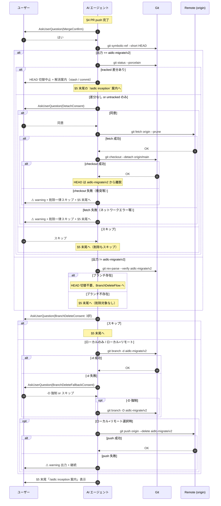

# 論理設計: Unit 002 - aidlc-migrate マージ後フォローアップ

## 概要

ドメインモデル（`unit_002_migrate_merge_followup_domain_model.md`）で定義した状態遷移を、Markdown 手順書（`skills/aidlc-migrate/steps/03-verify.md`）への追記として実現する論理設計。本 Unit は実装コードを書かず、追加する手順書セクション（新規 §5）の構造・対話 UI 仕様・git コマンド系列を定義する。

**重要**: この論理設計ではコードは書かず、コンポーネント構成（手順書セクション構造）とインターフェース定義（対話 UI / git コマンド）のみを行う。具体的な Markdown 文面は Phase 2 で作成する。

**Unit 001 流用の方針**: 文面・コマンド系列・3 択 UI は Unit 001（`skills/aidlc-setup/steps/03-migrate.md` 内の §10「アップグレードの場合」「#### マージ後フォローアップ」サブサブセクション）から流用する。具体的な行番号マッピングは下記「Unit 001 03-migrate.md からの流用箇所マッピング表」を参照。

## アーキテクチャパターン

- **採用パターン**: **手順書ガイド型ワークフロー**（Markdown 手順書による分岐フロー記述。Unit 001 の論理設計を踏襲）
- **選定理由**: Unit 001 と同じく、本 Unit はコード追加ではなく Markdown 手順書改訂のため。Unit 001 で確立したパターンを流用することで設計の一貫性を保つ

## 実装対象 §4 の現状構造（確認済み）

`skills/aidlc-migrate/steps/03-verify.md` の現状は以下の見出し構造を持つ（実ファイル参照: line 1-74）:

```text
# ステップ3: 検証と完了
## 1. 移行後検証                  # line 3-23
## 2. 一時ファイルの削除          # line 25-31
## 3. 完了メッセージ              # line 33-44（v1→v2 移行完了通知）
## 4. コミットとPR作成            # line 46-74
   （§4 配下の番号付き手順 1〜4、Markdown レベルではサブセクション化されていない数字付きリスト項目）
   1. 変更差分を確認              # line 50-53
   2. 全変更をステージしてコミット # line 55-59
   3. リモートにプッシュしてPRを作成 # line 61-65
   4. PRマージ後、新しいサイクル案内 # line 67-74（`/aidlc inception` 案内）
```

§4 末尾の `/aidlc inception` 案内文（line 67-74）は、本 Unit で **新規 §5 末尾に移動** する（Unit 002 設計レビュー反復1 指摘 #8 対応で Markdown 構造表記を正確化）。

## コンポーネント構成

### 改訂対象ファイルの節構造

```text
skills/aidlc-migrate/steps/03-verify.md
├── §1. 移行後検証（既存、変更なし）
├── §2. 一時ファイルの削除（既存、変更なし）
├── §3. 完了メッセージ（既存、変更なし）
├── §4. コミットとPR作成（部分改訂）
│   ├── §4 既存記述（番号付き手順 1〜3）
│   └── ~~§4 番号付き手順 4「PRマージ後 /aidlc inception 案内」~~ ← **削除して §5 末尾に移動**
└── §5. マージ後フォローアップ（新規追加 ★ 本 Unit のスコープ）
    ├── 適用条件の明示（v1→v2 マイグレーション完了 PR マージ後のオプション）
    ├── 5.1 マージ確認ガード（順序 1）
    ├── 5.2 HEAD 切替（順序 2: 簡易 tracked 差分チェック含む）
    └── 5.3 一時ブランチ削除（順序 3、HEAD 切替成功後にのみ実行）
    └── （§4 から移動）「PRをマージ後、新しいサイクルを開始するには /aidlc inception」案内

スコープ外:
- skills/aidlc-migrate/SKILL.md（Phase 1 設計レビューで改訂要否を最終確認、現状は 3 ステップ列挙で完結しており変更不要見込み）
```

**実行順序の根拠**: HEAD 切替によって現在ブランチが `aidlc-migrate/v2` から離脱した後にのみ、ローカル一時ブランチ削除（`git branch -d|-D`）が安全に可能となる（INV-8）。

### コンポーネント詳細

#### MergeConfirmGuard（マージ確認ガード）

- **責務**: ユーザーに「v1→v2 マイグレーション PR をマージしましたか？」を 1 回確認し、後続フローの実行可否を分岐
- **依存**: `AskUserQuestion`（Claude Code harness）
- **公開インターフェース**:
  - 入力: `AskUserQuestion` の選択肢（はい / いいえ / 判断保留）
  - 出力: 「はい」→ HeadDetachGuard へ進行、「いいえ」/「判断保留」→ §5 末尾の `/aidlc inception` 案内へ離脱
  - 副作用: なし（ガードのみ、状態変更なし）

#### HeadDetachGuard（HEAD 切替ガード、Unit 001 の HeadSyncConsentGuard + HeadStateClassifier + HeadSyncFlow の縮約版）

- **責務**: 現在ブランチが `aidlc-migrate/v2` であるかを判定し、必要に応じて `git checkout --detach origin/main` を実行して HEAD を一時ブランチから離脱させる。本 Unit のスコープでは HEAD 切替は単一ケース（`origin/main` への detach）のみ対応
- **依存**: `git symbolic-ref --short HEAD`、`git rev-parse --verify`、`git status --porcelain`、`git fetch origin --prune`、`git checkout --detach origin/main`、`AskUserQuestion`
- **判定 + 実行ロジック（4 ケース分岐、計画書 §実行順序より）**:
  1. **`git symbolic-ref --short HEAD` 出力 == `aidlc-migrate/v2` の場合**:
     - **簡易 tracked 差分チェック**: `git status --porcelain` 実行 → `??` 以外の行を含む場合は HEAD 切替を中止し、解消案内（stash / commit）を表示して §5 末尾の `/aidlc inception` 案内へ離脱（一時ブランチ削除も一律スキップ）
     - tracked 差分なし → DetachConsent（同意 / スキップ）
       - 同意 → `git fetch origin --prune` → `git checkout --detach origin/main` → BranchDeleteFlow へ
       - スキップ → §5 末尾の `/aidlc inception` 案内へ離脱（一時ブランチ削除も一律スキップ）
  2. **出力 != `aidlc-migrate/v2` の場合（既に他ブランチ / detached HEAD）**:
     - `git rev-parse --verify aidlc-migrate/v2` でブランチ存在確認
       - 存在 → HEAD 切替不要で BranchDeleteFlow へ直接進む（チェックアウト中でないため `git branch -d` 実行可能）
       - 不存在 → S3_no_branch（次項参照）
  3. **`aidlc-migrate/v2` ブランチ自体が存在しない場合**:
     - 削除対象がないため一時ブランチ削除を一律スキップして §5 末尾の `/aidlc inception` 案内へ離脱
- **判定基準（INV-7 適用注記）**: `merge-base --is-ancestor HEAD origin/main` は採用しない（Unit 001 と同じ理由：マージ後 `aidlc-migrate/v2` が origin/main の祖先となり誤判定するため）。`git symbolic-ref --short HEAD` で直接判定する
- **公開インターフェース**:
  - 入力1: 現在ブランチ取得（git）
  - 入力2: `AskUserQuestion`（DetachConsent: 同意 / スキップ）（ケース 1 で tracked 差分なしの場合のみ）
  - 出力: BranchDeleteFlow へ進行 / 一時ブランチ削除一律スキップで §5 末尾離脱
  - 副作用: 同意経路のみで HEAD 移動

#### BranchDeleteFlow（一時ブランチ削除フロー、Unit 001 と同等）

- **責務**: HEAD 切替完了後（HEAD が `aidlc-migrate/v2` から離脱した状態）または既に他ブランチの場合に、`aidlc-migrate/v2` のローカル + リモート削除を提案・実行
- **事前条件**: HEAD 切替成功完了 OR 既に `aidlc-migrate/v2` 以外のブランチに居る + 当該ブランチが存在する
- **依存**: `AskUserQuestion`（同意取得）、`git branch -d`、`git branch -D`、`git push origin --delete`
- **公開インターフェース**:
  - 入力1: `AskUserQuestion`（BranchDeleteConsent: ローカル+リモート / ローカルのみ / スキップ）
  - 入力2（フォールバック条件付き）: `AskUserQuestion`（BranchDeleteFallbackConsent: `-D` で強制削除 / スキップ）
  - 出力: ローカル削除結果、リモート削除結果（push 失敗時 warning）
  - 副作用: 同意時のみローカル + リモートブランチ削除

## インターフェース設計

### 対話 UI（AskUserQuestion 仕様、Unit 001 から流用 + 文言調整）

#### マージ確認ガード（MergeConfirm）

- **質問**: 「`/aidlc-migrate` で作成した v1→v2 マイグレーション PR をマージしましたか？」
- **選択肢（multiSelect: false）**:
  - 「はい（マージ済み）」→ HeadDetachGuard へ
  - 「いいえ（未マージ）」→ §5 末尾の `/aidlc inception` 案内へ離脱
  - 「判断保留」→ §5 末尾の `/aidlc inception` 案内へ離脱
- **header**: "マージ確認"

> **note（共通制約）**: 本論理設計の `AskUserQuestion` header はすべて 12 文字以内制約を満たす（指摘 #5 対応で本注記を共通化）。各 header の文字数: "マージ確認"（5）/ "HEAD切替"（6）/ "ブランチ削除"（6）/ "強制削除確認"（6）。

#### HEAD 切替同意（DetachConsent）

- **発動条件**: 現在ブランチが `aidlc-migrate/v2` AND tracked 差分なし
- **質問**: 「ローカル HEAD を `origin/main` に detach して一時ブランチ削除を可能にしますか？（`git fetch origin --prune` を含みます）」
- **選択肢**: 「同意」 / 「スキップ」
- **header**: "HEAD切替"
- **description（同意選択肢）**: 「現在の `aidlc-migrate/v2` から detached HEAD 状態に移行します。元のブランチに戻るには `git checkout aidlc-migrate/v2` を実行してください」（Unit 001 line 163 の SyncConsent description を migrate 文脈に流用 + 簡素化。Unit 001 の「条件付き description（main 系 / フィーチャ系判定）」は Unit 002 では HEAD == `aidlc-migrate/v2` チェックアウト中の単一ケースのみが発動条件のため不要、無条件文面に変更（指摘 #3 対応））
- **後続状態**: 同意 → fetch + detach → BranchDeleteFlow、スキップ → §5 末尾の `/aidlc inception` 案内へ離脱（一時ブランチ削除もスキップ）

#### 一時ブランチ削除案内（BranchDeleteConsent、Unit 001 から流用 + ブランチ名固定）

- **発動条件**: HEAD 切替成功完了（または既に `aidlc-migrate/v2` 以外のブランチでブランチ存在）
- **質問**: 「v1→v2 マイグレーション用一時ブランチ（`aidlc-migrate/v2`）を削除しますか？」
- **選択肢（3 択）**:
  - 「ローカル + リモート両方を削除」→ ローカル削除 → リモート削除
  - 「ローカルのみ削除」→ ローカル削除のみ
  - 「スキップ」→ §5 末尾の `/aidlc inception` 案内へ離脱
- **header**: "ブランチ削除"

#### 一時ブランチ削除フォールバック（BranchDeleteFallbackConsent、Unit 001 から流用）

- **発動条件**: `git branch -d` が exit code !=0 で失敗（squash/rebase merge 等で未マージ判定）
- **質問**: 「`-d` で削除できませんでした（squash/rebase merge の可能性）。`-D` で強制削除しますか？」
- **選択肢**: 「`-D` で強制削除」 / 「スキップ」
- **header**: "強制削除確認"
- **後続状態**: `-D` で強制削除 → BranchDeleteConsent の選択値（リモートも同意済みかどうか）に従って分岐、スキップ → §5 末尾の `/aidlc inception` 案内へ離脱

### git コマンド系列

#### HEAD 切替コマンド（単一ケースのみ、Unit 001 の 5 サブ条件マトリクスは持たない）

| ステップ | コマンド | 副作用 | 失敗時動作 |
|---------|---------|--------|-----------|
| 現在ブランチ取得 | `git symbolic-ref --short HEAD` | なし（読み取りのみ） | exit !=0 → detached HEAD 扱い → BranchDeleteFlow へ直接進む（ブランチ存在確認後） |
| ブランチ存在確認 | `git rev-parse --verify aidlc-migrate/v2` | なし（読み取りのみ） | exit !=0 → 削除対象なし → 一律スキップで §5 末尾離脱 |
| 簡易 tracked 差分チェック | `git status --porcelain` | なし（読み取りのみ） | `??` 以外の行を含む → HEAD 切替中止 + 解消案内 + §5 末尾離脱 |
| リモート取得 | `git fetch origin --prune` | リモートで削除されたブランチに対応するローカル追跡ブランチ（`refs/remotes/origin/...`）が整理される。**ローカルブランチ自体には影響しない**（注記正本：本表 + ドメインモデル INV-1 + 「実装上の注意事項 §安全性」は本注記を参照する。指摘 #9 対応） | ネットワークエラー時 → ドメインモデル S5_fetch_aborted へ遷移 → warning + 一時ブランチ削除一律スキップ + §5 末尾離脱（指摘 #2 対応） |
| HEAD detach | `git checkout --detach origin/main` | HEAD が `origin/main` の commit に detach された状態へ移行 | 失敗時 → ドメインモデル S5_checkout_aborted へ遷移 → warning + 一時ブランチ削除一律スキップ + §5 末尾離脱（指摘 #2 対応） |

**`git reset --hard origin/main` は本フローで自動実行しない**（INV-5、Unit 001 と同じ）。

#### 一時ブランチ削除 - コマンド系列（Unit 001 と同等、ブランチ名のみ固定）

| ステップ | コマンド | 失敗時動作 |
|---------|---------|-----------|
| ローカル削除（事前条件: HEAD が `aidlc-migrate/v2` から離脱済み OR 元から他ブランチ） | `git branch -d aidlc-migrate/v2` | 失敗時 → BranchDeleteFallbackConsent → 「-D で強制削除」選択時 `git branch -D` 実行、「スキップ」選択時はスキップ |
| リモート削除（条件: ローカル+リモート選択時のみ） | `git push origin --delete aidlc-migrate/v2` | 失敗時 → warning 出力（`⚠ リモートブランチ削除に失敗しました（push 権限なし or リモート不在の可能性）`）+ 継続（exit 0 相当） |

#### `git status --porcelain` の出力解析（簡易版、Unit 001 から流用 + 簡略化）

| 出力パターン | 判定 | 動作 |
|-------------|------|------|
| 出力空 | 差分なし | DetachConsent へ進行 |
| 全行が `??` プレフィックス | untracked のみ | DetachConsent へ進行（注意喚起なしでも可、Unit 001 と異なり untracked のみは静かに通過） |
| `??` 以外を含む | tracked 差分あり | HEAD 切替中止 + 解消案内（stash / commit）+ §5 末尾離脱 |

## Unit 001 03-migrate.md からの流用箇所マッピング表

> **目的**: Phase 2 実装時に Unit 001 の `skills/aidlc-setup/steps/03-migrate.md` 内のどのセクションをどう Unit 002 の `skills/aidlc-migrate/steps/03-verify.md` 新規 §5 に流用するかを明示する。
>
> **行番号の整合性（指摘 #1 対応）**: Unit 001 03-migrate.md の行番号は本論理設計作成時点（v2.4.2 cycle/v2.4.2 ブランチ HEAD = ea500e14 直後）の値。Phase 2 実装時に当該ファイルを再読込し、行番号がずれている場合はセクション見出し（`#####` 単位）を主として参照する。

| 流用元（Unit 001 03-migrate.md） | 行番号 | Unit 002 該当箇所 | 文言調整内容 |
|--------------------------------|--------|------------------|------------|
| `##### 1. マージ確認ガード` | line 82-94 | §5.1 マージ確認 | 質問文を「`/aidlc-migrate` で作成した v1→v2 マイグレーション PR をマージしましたか？」に変更。選択肢（はい/いいえ/判断保留）は流用 |
| `##### 3. HEAD 同期案内` の同意質問文 + description | line 118-131 | §5.2 HEAD 切替 | 質問文を「ローカル HEAD を `origin/main` に detach して一時ブランチ削除を可能にしますか？」に変更。description は条件付き表現（main 系/フィーチャ系判定）を削除し無条件文面に変更（指摘 #3 対応）。`SyncConsent` → `DetachConsent` 改名 |
| `git fetch origin --prune` 副作用注記 | line 131 | §5.2 HEAD 切替（git コマンド系列表） | そのまま流用（リモート追跡ブランチ整理の注記文面、注記正本は git コマンド系列表） |
| 5 サブ条件マトリクス（HEAD 状態判定 + コマンド分岐） | line 152-160 | **削除（Unit 002 では不要）** | Unit 002 は `aidlc-migrate/v2` チェックアウト中の 1 ケースのみ対応。マトリクス削除、`git checkout --detach origin/main` 単一コマンドのみ |
| `##### 2. 未コミット差分ガード` の `git status --porcelain` 出力解析 | line 96-117 | §5.2 簡易差分チェック | 「中止 / stash / commit」3 択 + 再検査ループ（最大 3 回）は削除し、「tracked 差分検出 → 中止 + 案内 + §5 末尾離脱」の単発判定に縮約 |
| `##### 4. 一時ブランチ削除案内` 3 択（BranchDeleteConsent） | line 179-198 | §5.3 ブランチ削除 | ブランチ名を `aidlc-migrate/v2` 固定に変更（`<version>` プレースホルダ削除）。3 択 UI と質問文構造は流用 |
| ローカル削除フォールバック（BranchDeleteFallbackConsent） | line 200-210 | §5.3 削除フォールバック | そのまま流用、ブランチ名のみ `aidlc-migrate/v2` に変更 |
| リモート削除失敗時の warning 文面 | line 212-220 | §5.3 リモート削除 | そのまま流用、ブランチ名のみ変更 |

**Phase 2 実装時の流用方針**: 上記マッピング表に従い、Unit 001 03-migrate.md の該当箇所を Markdown レベルでコピー後、ブランチ名・質問文・スコープ縮小（再検査ループ削除等）を反映する。文言の詳細調整は Phase 2 実装で確定。

## スクリプトインターフェース設計（該当する場合）

本 Unit ではシェルスクリプトを新規作成しない。手順書内に bash コードブロック形式で git コマンドを列挙するのみ。

## データモデル概要

本 Unit ではデータベース・ファイル形式を新規定義しない。`aidlc-migrate/v2` のブランチ名規約は既存 `/aidlc-migrate` の生成規約に従う（変更なし、固定名）。

## 処理フロー概要

### マージ後フォローアップの処理フロー

**ステップ**:

1. §4 PR push 完了直後、本フロー（§5）へ進入
2. **MergeConfirmGuard**: マージ済みかをユーザーに確認
3. 「いいえ」/「判断保留」 → §5 末尾の `/aidlc inception` 案内へ離脱
4. 「はい」 → **HeadDetachGuard**:
   1. `git symbolic-ref --short HEAD` で現在ブランチ取得
   2. 出力 == `aidlc-migrate/v2`:
      - `git status --porcelain` で簡易 tracked 差分チェック
      - `??` 以外を含む → HEAD 切替中止 + 解消案内 → §5 末尾離脱（一時ブランチ削除もスキップ）
      - 差分なし → **DetachConsent**（同意 / スキップ）
        - スキップ → §5 末尾離脱（一時ブランチ削除もスキップ）
        - 同意 → `git fetch origin --prune`
          - fetch 成功 → `git checkout --detach origin/main`
            - checkout 成功 → **BranchDeleteFlow** へ
            - checkout 失敗（衝突等）→ warning + 削除一律スキップ + §5 末尾離脱（指摘 #2 対応）
          - fetch 失敗（ネットワークエラー等）→ warning + 削除一律スキップ + §5 末尾離脱（指摘 #2 対応）
   3. 出力 != `aidlc-migrate/v2`:
      - `git rev-parse --verify aidlc-migrate/v2` でブランチ存在確認
      - 存在 → HEAD 切替不要で **BranchDeleteFlow** へ直接進む（INV-8 経路 B）
      - 不存在 → S3_no_branch → §5 末尾離脱（削除対象なし）
5. **BranchDeleteFlow**（事前条件: HEAD 切替成功完了 OR 既に他ブランチ + ブランチ存在）:
   1. BranchDeleteConsent（3 択）
   2. 「スキップ」 → §5 末尾離脱
   3. 「ローカルのみ削除」 → ローカル削除（`-d` → 失敗時 `-D` 再確認）→ §5 末尾離脱
   4. 「ローカル+リモート両方」 → ローカル削除 → リモート削除（失敗時 warning + 継続）→ §5 末尾離脱

**関与するコンポーネント**: MergeConfirmGuard / HeadDetachGuard / BranchDeleteFlow



## 非機能要件（NFR）への対応

### パフォーマンス

- **要件**: 追加処理は対話 + 数回の git コマンド呼び出しのみ
- **対応策**: `git fetch origin --prune` がネットワーク I/O を伴うため、DetachConsent で同意取得後にのみ実行する（不要な fetch を避ける）

### セキュリティ

- **要件**: リモート push 権限がないユーザー環境で実行された場合に warning のみで停止しない（破壊的変更を起こさない）
- **対応策**: `git push origin --delete` 失敗時は warning 出力 + 継続。ローカル状態には影響しない。BranchDeleteConsent の「ローカルのみ」選択肢により push 権限不在ユーザーでも安全にローカル削除のみ実行可能（INV-9）

### 可用性

- **要件**: 既存 migrate フロー（PR push まで）は本 Unit の処理失敗時にも完了している必要がある
- **対応策**: 本フロー全体を §4 PR push 完了**後**に配置。本フロー内で例外が発生しても §4 の PR push は既に完了している。本フロー全段はオプトインで、スキップしても migrate は完了済みとなる

### 互換性

- **要件**: 既存 §1〜§4 とは干渉しない
- **対応策**: 新規 §5 として追加し、既存節の番号は変更しない。§4 末尾の `/aidlc inception` 案内のみ §5 末尾に移動

### 自動化モード適合性（フォワード互換要件）

- **要件**: 将来 `automation_mode` が aidlc-migrate に統合された場合、`automation_mode=full_auto` 時も本フローは対話必須
- **現状**: `skills/aidlc-migrate/SKILL.md` および `steps/03-verify.md` は `automation_mode` を参照していない（aidlc-migrate スキル全体が automation_mode 概念を持たない、Unit 001 と同様）。本要件は予防的方針として記述
- **根拠**: 本フローは `git branch -D` / `git checkout --detach` / `git push origin --delete` 等の HEAD・ブランチ・リモート状態を変更する操作を含むため、無人実行は許容しない。`AskUserQuestion` は SKILL.md「ユーザー選択」種別であり、`automation_mode` に関わらず常に対話必須となる（INV-7）

## 技術選定

- **言語**: Markdown（手順書）+ bash コードブロック内での git コマンド記述
- **フレームワーク**: なし（Claude Code harness の手順解釈による）
- **ライブラリ**: なし
- **対話 UI**: **`AskUserQuestion`（Claude Code 提供）を採用確定**（Unit 001 と同じ）

## 実装上の注意事項

### 安全性

- ローカル削除の `-d` → `-D` フォールバックは必ず再確認（`AskUserQuestion`）を経由する。`-D` 一律実行は禁止
- `git reset --hard origin/main` は本フローで自動実行しない。tracked 差分検出時は HEAD 切替を中止 + 解消案内のみ
- `git fetch origin --prune` の副作用（リモート追跡ブランチ整理）を手順書内に必ず注記。注記文面例: 「`git fetch --prune` はリモートで削除されたブランチに対応するローカル追跡ブランチ（`refs/remotes/origin/...`）を整理します。**ローカルブランチ自体には影響しません**」（Unit 001 から流用）
- HEAD 切替スキップ時または tracked 差分検出時は一時ブランチ削除を一律スキップ（INV-8）
- 一時ブランチ削除は HEAD 切替成功後にのみ到達（INV-8 で順序固定）

### 保守性

- 4 ケース分岐（aidlc-migrate/v2 チェックアウト中 + 同意 / + スキップ・差分検出 / 既に他ブランチ / ブランチ不存在）は計画書 §実行順序の状態遷移図と本論理設計の Mermaid 図で可視化
- ブランチ名 `aidlc-migrate/v2` は固定（`<version>` プレースホルダなし）
- アップグレードフロー（ケースC）限定の明示は不要（`steps/03-verify.md` 自体が migrate 専用ファイルのため構造的に保証）
- 処理フロー記述では章番号を直接参照せず「§5 末尾離脱」のように章番号非依存で記述

### Unit 001 との差分（スコープ縮小）

- 5 サブ条件マトリクス削除（1 ケースのみ）
- DiffResolution（stash/commit/中止 + 再検査ループ）削除（簡易 tracked 差分チェックの単発判定のみ）
- main 系判定 / worktree 判定 / ff-only 削除（detach 単一コマンドのみ）

### メタ開発時の検証境界

- 本 Unit は手順書追加が主体で、実走行検証はスコープ外
- 検証は手順書 walkthrough + markdownlint で間接実施
- 実走行検証は Operations Phase リリース後の運用検証（外部リポジトリでの v1→v2 マイグレーション走行）に委ねる

## 不明点と質問（設計中に記録）

[Question] 挿入位置は §4 の後に新規 §5 を追加する形で確定でよいか？
[Answer] **確定**。`steps/03-verify.md` の §4 の後（line 74 直後）に新規 §5「マージ後フォローアップ」を追加し、§4 末尾の `/aidlc inception` 案内文（line 67-74）を §5 末尾に移動する。これにより「PR push → §5 マージ後フォローアップ → `/aidlc inception` 案内」の直線的な流れを維持する。

[Question] §4 から §5 末尾への `/aidlc inception` 案内文の移動は破壊的変更ではないか？
[Answer] 既存ユーザー視点では「PR push 完了 → `/aidlc inception` 案内」の流れが「PR push 完了 → §5 マージ後フォローアップ（オプトイン、すべてスキップ可能）→ `/aidlc inception` 案内」に変わるのみ。スキップ選択時は実質的に変更なしの体験となるため、破壊的変更ではない。

[Question] SKILL.md（`skills/aidlc-migrate/SKILL.md`）への誘導見出し追記は必要か？
[Answer] Phase 1 設計成果物として確認する。現状の SKILL.md は 3 ステップ列挙で完結しており、`steps/03-verify.md` 内のセクション追加のみで済む見込み。**SKILL.md 改訂は不要**を一次推奨とし、最終確認は Phase 2 実装着手前に再評価する。

[Question] ブランチ名 `aidlc-migrate/v2` は固定でよいか？将来的な v2→v3 マイグレーション拡張は？
[Answer] 本 Unit のスコープでは固定とする。v2.4.2 では v1→v2 マイグレーションのみが migrate 対象であり、ブランチ名固定で問題なし。将来 v2→v3 等の追加マイグレーションが導入される場合、ブランチ名固定の前提を再評価する必要がある（リスクとして計画書に記述済み）。

[Question] 簡易 tracked 差分チェックで untracked のみ検出時の扱いは？
[Answer] **静かに続行**（Unit 001 と異なり注意喚起メッセージは省略）。本 Unit は最低限の安全性確保のみがスコープのため、untracked のみは HEAD 切替（detach）への影響が低く、追加の対話を増やさない方針とする。
