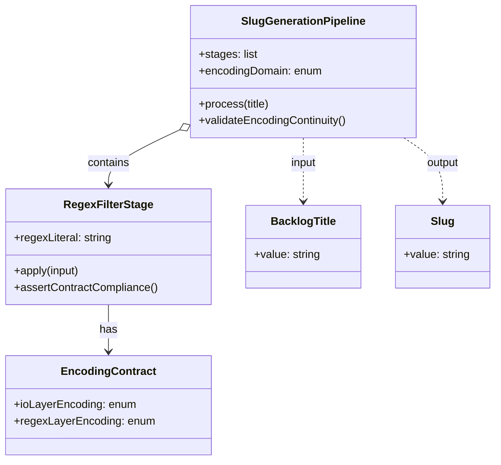

# ドメインモデル: migrate-backlog.sh の UTF-8 対応（Unit 003）

## 概要

`migrate-backlog.sh` の `generate_slug()` がバックログタイトル（UTF-8 多言語混在）から正規化済みの slug を生成する処理について、**Perl invocation のエンコーディング契約** が slug 生成パイプライン全段の整合性を支配することをドメインとして整理する。

**重要**: 本ドメインモデルでは**コードは書かず**、slug 生成の概念モデル（パイプライン段階・エンコーディング契約・整合性ルール）のみを定義する。

## エンティティ（Entity）

### `SlugGenerationPipeline`

タイトル → slug 変換の一連の段階を表す論理単位。`migrate-backlog.sh:generate_slug()` 関数全体に対応する。

- **ID**: 関数識別子（`generate_slug`）
- **属性**:
  - `stages`: ordered list — `lowercase` / `regex_filter` / `space_to_hyphen` / `dedup_hyphen` / `trim_hyphen` / `truncate` の 6 段階
  - `encodingDomain`: enum — `utf8_clean` / `byte_oriented`（パイプライン全段で UTF-8 を維持できているか）
- **振る舞い**:
  - `process(title)`: タイトルを受け取り slug を返す（パイプライン段階を順次適用）
  - `validateEncodingContinuity()`: 各段階の入出力で UTF-8 シーケンスが整合性を保つか検証

### `RegexFilterStage`

パイプライン中の `perl -pe ...` 段階に対応する識別された段階。本 Unit の修正対象。

- **ID**: 段階識別子（`regex_filter` / 関数内 L75 周辺）
- **属性**:
  - `regexLiteral`: string — `[^a-z0-9一-龯ぁ-んァ-ヶー ]` の正規表現リテラル
  - `encodingContract`: `EncodingContract`（値オブジェクト、後述）
- **振る舞い**:
  - `apply(input)`: 入力文字列に対し regex を適用し、許容文字以外を削除した文字列を返す
  - `assertContractCompliance()`: 入出力の UTF-8 整合性を契約上保証できるかを判定

## 値オブジェクト（Value Object）

### `EncodingContract`

`RegexFilterStage` の入出力エンコーディング契約を表す不変値。

- **属性**:
  - `ioLayerEncoding`: enum — `utf8`（`-CSD`）/ `latin1_default`
  - `regexLayerEncoding`: enum — `utf8`（`-Mutf8`）/ `latin1_default`
- **不変性**: 一度確立した契約は同一実行内で変化しない。契約変更には新しい `EncodingContract` の生成が必要
- **等価性**: `(ioLayerEncoding, regexLayerEncoding)` ペアの完全一致
- **整合性ルール**:
  - `(utf8, utf8)` → 正しい契約。Unicode コードポイント単位での regex 評価とバイト整合した IO
  - `(utf8, latin1_default)` → 不整合。IO は UTF-8 だが regex がバイト単位で評価され、マルチバイト境界を分断（**修正前の状態**）
  - `(latin1_default, utf8)` → 不整合。regex は UTF-8 解釈だが IO がバイト単位で扱う
  - `(latin1_default, latin1_default)` → Latin-1 想定（本 Unit のスコープ外）

### `BacklogTitle`

`migrate-backlog.sh` への入力となるバックログタイトル文字列。

- **属性**: `value: string`（UTF-8 多言語混在を含み得る）
- **不変性**: 入力タイトルは変換途中で書き換えない
- **等価性**: バイト列としての完全一致

### `Slug`

`generate_slug()` の出力。タイトルから正規化された短い識別子。

- **属性**:
  - `value: string`（小文字英数字・日本語の主要範囲・ハイフンのみで構成、最大 50 文字）
- **不変性**: 一度生成された slug は変換しない
- **等価性**: 文字列値の完全一致
- **整合性ルール**: 不正な UTF-8 バイトシーケンスを含まない（パイプライン全段で UTF-8 整合性を維持した結果として保証される）

## 集約（Aggregate）

### `BacklogSlugGeneration`

タイトルから slug への変換 1 回分を表す集約。

- **集約ルート**: `SlugGenerationPipeline`
- **含まれる要素**: `BacklogTitle`（入力）、`RegexFilterStage`（中間段階の代表）、`EncodingContract`（契約）、`Slug`（出力）
- **境界**: 1 回の `generate_slug()` 呼び出し
- **不変条件**:
  - パイプライン全段の出力が UTF-8 整合性を保つには、`RegexFilterStage` の `EncodingContract` が `(utf8, utf8)` でなければならない
  - `(utf8, latin1_default)` 契約下では Slug 整合性が以下のいずれかの形で破られる（OR 条件、入力依存で発生形態が異なる）:
    - 後段 `space_to_hyphen`（`tr ' ' '-'`）が不正 UTF-8 シーケンスを受けて `Illegal byte sequence` を発生（fullwidth カッコ等の多バイト境界が分断されたケース）
    - regex 段階でバイト単位評価により日本語末尾文字を範囲外として削除し、stderr エラーは出ないが slug 後半が欠落（半角主体タイトルで日本語末尾を含むケース）
  - 入力タイトルに ASCII 範囲外文字（fullwidth カッコ・日本語等）を含む場合のみ、上記契約違反が顕在化する（ASCII のみのタイトルでは契約違反が顕在化しない）

## ドメインサービス

### `SlugGenerationService`

`SlugGenerationPipeline` を起動する **実行コンテキスト管理** の論理的なサービス。Pipeline は段階定義と契約検証を担い、Service は Bash サブシェル起動・パイプ接続・終了コード回収という実行環境の責務を持つ（責務分離による Pipeline と Service の役割差別化）。

- **責務**: Bash 実行コンテキストでパイプライン段階間の連結（パイプ）を管理し、契約違反時のエラーコード（`tr` の `Illegal byte sequence` 等）を上位層に伝搬する
- **操作**:
  - `generateSlug(title: BacklogTitle) -> Slug` — Pipeline を Bash パイプで連結起動し、各段階の終了コードを束ねて slug を返す（`migrate-backlog.sh:generate_slug()` 関数の論理表現）
  - `propagateContractViolation(stage, exitCode)` — 契約違反検出時の伝搬経路（修正前は `tr` の non-zero exit が pipefail なし bash で flush されるため、Pipeline 内部での顕在化は呼び出し元への可視性が低い。修正後はそもそも違反が発生しないため伝搬不要）
- **将来の再利用シナリオ**: 同様のスラッグ生成パターン（バックログ移行 / カテゴリ自動分類 / Issue タイトル正規化等）を別スクリプトに導入する場合、`EncodingContract` 値オブジェクトと本サービスの責務分離は再利用可能（DEPRECATED 解除サイクル後の参照価値）

## 現サイクル時点のエンコーディング契約状態

集約の不変条件と契約状態の対応（4 状態網羅）:

| 状態 | ioLayerEncoding | regexLayerEncoding | パイプライン整合性 | 本 Unit 扱い | 備考 |
|------|-----------------|---------------------|------------------|-----------|------|
| 修正前（v2.4.2 以前） | `utf8`（暗黙、ロケール依存） | `latin1_default` | 不整合 → `Illegal byte sequence` または slug 欠落（OR） | スコープ内（修正対象） | Issue #610 で報告された不具合 |
| 修正後（本 Unit） | `utf8`（`-CSD` で明示） | `utf8`（`-Mutf8` で明示） | 整合 → ASCII 範囲外文字含むタイトルも安全に処理 | スコープ内（実装目標） | Unit 003 のゴール |
| `(latin1_default, utf8)` | `latin1_default` | `utf8`（`-Mutf8` のみ指定） | 不整合 → IO 層で UTF-8 マルチバイト境界が分断され regex 入力時点で破損 | スコープ外 | `-Mutf8` のみ指定するパターンは Perl 標準慣習に反するため運用上想定しない |
| `(latin1_default, latin1_default)` | `latin1_default` | `latin1_default` | Latin-1 環境としては整合（ただし日本語入力には対応不能） | スコープ外 | Latin-1 ロケール運用は本 Unit の UTF-8 化目標とは独立。本スクリプトの利用前提（ja_JP.UTF-8 等の UTF-8 ロケール）と相容れない |

## ユビキタス言語

本 Unit および関連ドキュメントで使用する共通用語:

- **slug**: タイトルから派生した URL/ファイル名安全な短い識別子（小文字英数字・主要日本語・ハイフン）
- **slug 生成パイプライン**: `tr` → `perl` → `tr` → `sed` → `cut` の 6 段階の文字列変換チェーン
- **エンコーディング契約**: Perl invocation の IO 層と regex 層のエンコーディング指定 (`-CSD` / `-Mutf8`) の組み合わせ
- **IO 層**: STDIN / STDOUT / STDERR のバイト列エンコーディング扱い（`-CSD` で UTF-8 化）
- **regex 層**: Perl ソースコード内の正規表現リテラルの文字列解釈（`-Mutf8` または `use utf8;` で UTF-8 化）
- **マルチバイト境界の分断**: `latin1_default` regex 層で UTF-8 多バイト文字の途中バイトのみが削除され、不正な UTF-8 シーケンスが残る現象
- **後方互換 (DEPRECATED)**: 本スクリプトは v2.0.0 で削除予定だが、削除前のユーザー利用シナリオを保護するため最小修正を適用

## ドメインモデル図

## 不明点と質問

[Question] `一-龯` の具体的なコードポイント範囲（U+9FA5 / U+9FAF / U+9FFF のいずれか）はドメインモデルで確定すべきか
[Answer] ドメインモデルでは確定しない。「CJK 統合漢字の主要範囲」と論理レベルで記述し、Phase 2 実装時に Perl 実測（`perl -CSD -Mutf8 -e 'printf "U+%04X\n", ord("龯")'`）でコードポイントを確認し design.md に記録する。本 Unit のスコープは「契約成立」であり、CJK 範囲の精緻化は対象外（既存 regex リテラル維持）

[Question] `EncodingContract` の値オブジェクトに `(latin1_default, utf8)` 状態を含める必要はあるか
[Answer] 含める。修正前後の対比を網羅するために定義上は記述するが、本 Unit のスコープでは扱わない（`-Mutf8` のみ指定して `-CSD` を省略するパターンは想定外）。ドメインモデル上の網羅性のために残す
