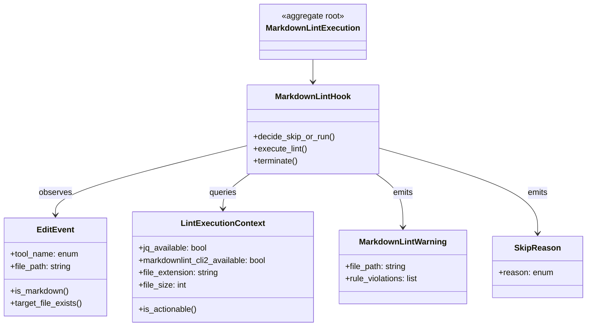

# ドメインモデル: Unit 004 markdownlint PostToolUse hook 追加と Operations §7.5 削除

## 概要

`.claude/settings.json` の PostToolUse に追加する markdownlint hook の振る舞いと、Operations Phase §7.5（手動 lint ステップ）削除に伴う「lint 検証パイプライン」の概念モデルを定義する。**コードは書かず**、構造と責務のみを記述する。

**重要**: 本ドメインは Claude Code エージェントランタイムが提供する hook 実行基盤に乗る。エンティティはドメインの抽象（hook 実行プロセス・編集イベント・lint 結果）であり、実装は Phase 2 で `bin/check-markdownlint.sh` として具現化する。

## エンティティ（Entity）

### EditEvent（編集イベント）

- **ID**: `tool_name + file_path + timestamp` の組（hook 起動ごとにユニーク。永続化はせず prosess scope）
- **属性**:
  - `tool_name`: enum {Edit, Write} - Claude Code の編集系ツール識別子
  - `file_path`: string - 編集対象ファイルの絶対 or 相対パス
- **振る舞い**:
  - `is_markdown()`: 拡張子が `.md` か判定（true → MarkdownLintHook 実行対象）
  - `target_file_exists()`: file_path で示すファイルが実在するか判定
  - `target_file_size()`: ファイルサイズ取得（バイト）

### MarkdownLintHook（PostToolUse hook プロセス）

- **ID**: `bin/check-markdownlint.sh` の起動ごとのプロセス ID（Unix プロセス）
- **属性**:
  - `tool_availability`: LintExecutionContext 参照（jq / markdownlint-cli2 の存在確認結果）
  - `event`: EditEvent 参照
- **振る舞い**:
  - `decide_skip_or_run()`: EditEvent と LintExecutionContext から実行可否を判定（不変条件参照）
  - `execute_lint()`: `markdownlint-cli2 <file_path>` を呼び出し、stderr に出力を流す
  - `emit_warning()`: 違反検出時のみ stderr に警告メッセージを出力
  - `terminate(exit_code)`: 常に exit 0 で終了（warn-only 契約）

### LintExecutionContext（実行環境）

- **ID**: hook 起動時のスナップショット（`PATH`, `PWD`, インストール状況）
- **属性**:
  - `jq_available`: bool - `command -v jq` の検出結果
  - `markdownlint_cli2_resolution`: enum {`direct`, `npx`, `none`} - markdownlint-cli2 の解決方法。`direct` = `command -v markdownlint-cli2` 成功、`npx` = npx fallback（`command -v npx` + `npx --no-install markdownlint-cli2 --version` 成功）、`none` = どちらも不可
  - `file_extension`: string - 編集対象ファイルの拡張子（`.md` / 他）
  - `file_size`: int - 編集対象ファイルのサイズ（bytes）
  - `file_exists`: bool - 編集対象ファイルの存在
- **振る舞い**:
  - `is_actionable()`: 上記5属性すべてが lint 実行を許可するか判定
    - 不変条件: `jq_available=true ∧ markdownlint_cli2_resolution ∈ {direct, npx} ∧ file_extension=".md" ∧ file_exists=true ∧ file_size ≤ 1MB`

## 値オブジェクト（Value Object）

### MarkdownLintWarning（違反警告）

- **属性**:
  - `file_path`: string
  - `rule_violations`: list of (rule_id, line, message) - markdownlint-cli2 の出力形式
- **不変性**: 1回の hook 実行で生成される警告セットは不変
- **等価性**: `file_path + rule_id + line + message` の組すべてが一致する場合に等価とする（同一ルール違反でも line / message が異なれば別個の警告として扱う、差分検知・再通知判定の誤集約防止）
- **本 Unit での使用**: hook は警告を stderr に流すのみで永続化せず、同値判定ロジックは持たない。等価性定義はドメインの正しさを担保する目的のみであり、実装には現れない

### SkipReason（スキップ理由）

- **属性**: enum {`extension_mismatch`, `file_not_found`, `file_too_large`, `jq_missing`, `markdownlint_missing`, `tool_name_mismatch`, `empty_file_path`}
- **不変性**: 一度判定したら変わらない
- **等価性**: enum 値の同一性

## 集約（Aggregate）

### MarkdownLintExecution（hook 実行集約）

- **集約ルート**: MarkdownLintHook
- **含まれる要素**: EditEvent, LintExecutionContext, MarkdownLintWarning（違反検出時のみ）, SkipReason（スキップ時のみ）
- **境界**: 1回の PostToolUse hook 起動 〜 終了（exit 0 まで）
- **不変条件**:
  - **常に exit 0**（編集ブロック禁止）
  - **依存ツール不在時の出力契約（既存 hook と統一）**:
    - `jq` 不在 → stderr に「⚠ check-markdownlint: jq が見つかりません。hookが動作不能です。」を出力（既存 `check-utf8-corruption.sh` の `for cmd in jq file grep` ループと同方針。hook の機能不全をユーザー / エージェントに通知）→ exit 0
    - `markdownlint-cli2` 解決失敗（直接バイナリ + npx fallback の両方が利用不可） → **静かにスキップ（出力なし）** → exit 0（Issue #609「未インストール時はスキップ」と整合。`markdownlint-cli2` は任意ツールのため、未インストールは正常状態として扱う）
  - **その他のスキップ理由**（拡張子不一致 / ファイル不在 / 1MB 超 / tool_name 不一致 / file_path 空）: 出力なし → exit 0
  - 違反検出時のみ stderr に markdownlint-cli2 の出力を流す（実装詳細は論理設計参照）
  - JSON 解析失敗（`jq` 経由で `tool_name` が取れない等）: スキップ扱い（出力なし、exit 0）。設計判断として「JSON 不正は Claude Code ランタイムの責任範囲」と扱い、本 hook では握り潰す

## ドメインサービス

### HookEntryDispatcher（hook エントリディスパッチャ）

- **責務**: Claude Code が `.claude/settings.json` に基づき PostToolUse に登録された複数の hook を順序判定して並列起動する
- **操作**:
  - `dispatch_post_tool_use(tool_name, tool_input)`: matcher 一致する全 hook エントリを並列起動
- **注**: このサービスは Claude Code ランタイム側の責務であり、本 Unit では実装対象外。本 Unit は登録設定（`.claude/settings.json`）のみを変更する。

### Operations75Coordinator（Operations §7.5 廃止調整役）

- **責務**: Operations Phase §7.5 の手動 lint ステップを廃止し、hook による即時検出に移譲する
- **操作**:
  - `remove_step_75()`: `operations-release.md` の §7.5 関連記述削除、`02-deploy.md` のサブステップ列挙更新
  - `remove_lint_subcommand()`: `operations-release.sh` の `lint` サブコマンド削除
  - `preserve_history()`: 過去サイクル `.aidlc/cycles/v*/history/` 配下の §7.5 言及は変更しない（履歴改変禁止）
- **注**: 本サービスは概念モデル上の役割であり、実体は手作業の編集タスクの集合。

## リポジトリインターフェース

本 Unit にはエンティティの永続化は存在しない。`MarkdownLintExecution` は実行ごとに生成・破棄される transient な集約。`.claude/settings.json` の hooks 設定のみが「永続化された設定リポジトリ」に相当する。

### ClaudeSettingsRepository（設定リポジトリ）

- **対象集約**: `.claude/settings.json` の hooks 配列
- **操作**:
  - read_post_tool_use_hooks() - PostToolUse 配列を読み取り
  - append_post_tool_use_entry(matcher, command) - 新規エントリ追加
- **実装**: 既存 JSON ファイルへの編集（手作業 + jq 構文チェック）

## ファクトリ

本 Unit ではファクトリを使用しない（hook プロセスは Claude Code ランタイムが起動）。

## ドメインモデル図

## ユビキタス言語

- **PostToolUse hook**: Claude Code のツール実行直後に起動するシェルスクリプト。`.claude/settings.json` の `hooks.PostToolUse` 配列で登録される
- **matcher**: hook 起動条件のツール名フィルタ（regex）。例: `"Write"`（Write のみ）/ `"Edit|Write"`（Edit と Write 両方）
- **warn-only hook**: 違反検出時も exit 0 を返す hook。編集を中断せず警告のみ出す
- **safe-skip**: 依存ツール不在・対象外ファイル等で hook が静かに（出力なしで）終了する挙動
- **§7.5（Operations Phase）**: `skills/aidlc/steps/operations/operations-release.md` のサブステップ番号 7.5 = 手動 markdownlint 実行ステップ。本 Unit で廃止
- **欠番（gap 維持）**: §7.5 削除後、§7.6 / §7.7 / §7.8〜§7.13 の番号は変更しない方針。renumber せず gap として残す

## 不明点と質問（設計中に記録）

[Question] hook が違反検出した際、Claude Code エージェントは stderr の警告を自動的に拾って次のサイクルで対応するか？
[Answer] Claude Code は PostToolUse hook の stderr 出力をエージェントコンテキストに反映する仕様（system-reminder として表示される可能性）。本 Unit ではエージェント側の挙動は前提とせず、hook が stderr に出力さえすればユーザー側にも目視で見える前提で設計する。

[Question] 1MB 超ファイルのスキップ閾値は既存 hook と同じか？
[Answer] 既存 `bin/check-utf8-corruption.sh` の `MAX_SIZE=1048576` と同じ閾値を採用（1024×1024）。Markdown ファイルで 1MB 超は通常稀。
