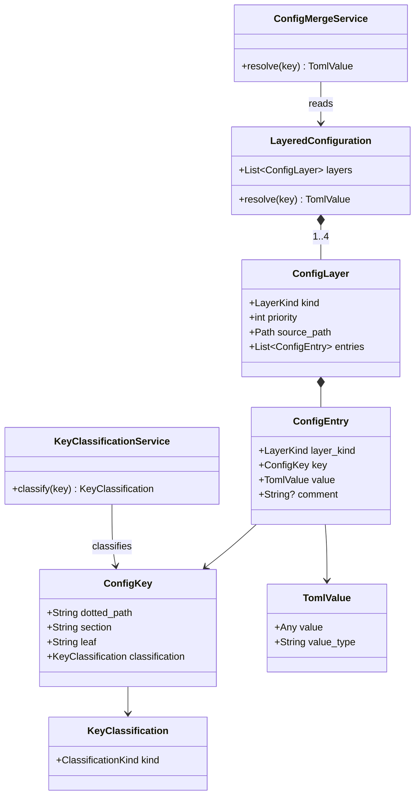

# ドメインモデル: Unit 001 個人好みキーの defaults.toml 集約

## 概要

AI-DLC スターターキットの **4 階層設定システム** における「個人好み（IndividualPreference）」と「プロジェクト強制（ProjectMandatory）」の責務分離を表現するドメインモデル。本 Unit はこのモデルに基づき、`config.toml.template`（project 共有層に書き込まれる雛形）から個人好みキーを除去し、`defaults.toml`（最低優先度の skill 内蔵層）に既定値を寄せる責務分離を実装する。

**重要**: このドメインモデル設計では**コードは書かず**、構造と責務の定義のみを行う。実装は Phase 2（コード生成）で行う。

## エンティティ（Entity）

### ConfigKey

設定キーを一意に識別するエンティティ。TOML のセクション + 葉キーで構成される完全パス（dotted path）で同定する。

- **ID**: `dotted_path`（例: `rules.reviewing.mode`）
- **属性**:
  - `dotted_path`: String — TOML 完全パス。識別子。
  - `section`: String — TOML セクション部（例: `rules.reviewing`）
  - `leaf`: String — 葉キー名（例: `mode`）
  - `value_type`: String — `string` / `boolean` / `array` 等の TOML 型
  - `current_value`: TomlValue — 現在の値（層によって異なる）
  - `classification`: KeyClassification — 「個人好み」か「プロジェクト強制」かの分類（値オブジェクト）
- **振る舞い**:
  - `is_individual_preference()`: Boolean — `classification == IndividualPreference` を返す
  - `is_target_of_unit_001()`: Boolean — 本 Unit 001 が除去対象とする 7 キーかを返す（`classification == IndividualPreference` かつ Unit 001 正規定義に列挙されているキーのみ）

### ConfigEntry

ある層（`ConfigLayer`）における特定 `ConfigKey` の値の存在を表すエンティティ。「層 × キー」が ID。

- **ID**: `(layer_kind, dotted_path)` の複合キー
- **属性**:
  - `layer_kind`: LayerKind — `defaults` / `user_global` / `project_shared` / `project_local`
  - `key`: ConfigKey
  - `value`: TomlValue
  - `comment`: String? — TOML コメント（先行コメント / 末尾コメント）
- **振る舞い**:
  - `is_redundant_with_defaults()`: Boolean — defaults 層の同キー値と完全一致する場合 true（Unit 001 では「project 共有層の値が defaults と完全一致する」場合に template から除去できる根拠となる）

### ConfigLayer

4 階層のうち 1 層を表すエンティティ。物理ファイルパスと優先度を持つ。

- **ID**: `layer_kind`
- **属性**:
  - `layer_kind`: LayerKind
  - `priority`: Integer — 0（最低 / defaults）〜 3（最高 / project_local）
  - `source_path`: Path — 例: `skills/aidlc/config/defaults.toml` / `~/.aidlc/config.toml` / `.aidlc/config.toml` / `.aidlc/config.local.toml`
  - `entries`: List<ConfigEntry>
- **振る舞い**:
  - `find_entry(key)`: ConfigEntry? — 指定キーのエントリを返す（不在時 None）
  - `is_optional()`: Boolean — 本層が「無くてもシステムが機能する」層か（defaults 以外は optional）

## 値オブジェクト（Value Object）

### KeyClassification

`ConfigKey` の責務分類。本 Unit のスコープ判定に使う中核 VO。

- **属性**: `kind`: ClassificationKind = `IndividualPreference` | `ProjectMandatory` | `Undecided`
- **不変性**: 同一 `dotted_path` に対する `KeyClassification` はサイクル中で固定（変更時は新規 VO を生成）
- **等価性**: `kind` が等しければ等価
- **取り得る値の意味**:
  - `IndividualPreference`: 開発者個人 / 環境 / マシン依存で揺れる選好。user-global 推奨。Unit 001 が除去対象とする 7 キーが該当
  - `ProjectMandatory`: チーム / プロジェクト全員で統一すべき。project 共有層に書く必要があり template に残す
  - `Undecided`: 監査対象。本 Unit のスコープ外（Issue #592 で個別判断）

### LayerKind

層の種別を表す列挙型 VO。

- **取り得る値**: `defaults` / `user_global` / `project_shared` / `project_local`
- **不変性**: 列挙体のため変化しない
- **等価性**: 値の同一性

### TomlValue

TOML プリミティブ値のラッパー VO。

- **取り得る型**: `String` / `Boolean` / `Integer` / `Float` / `Array<TomlValue>` / `Table`
- **不変性**: 一度生成された値は変更されない
- **等価性**: 値および型の完全一致（配列は要素順含む完全一致 — 既存「配列値は完全置換」仕様 / DR-005 と整合）

## 集約（Aggregate）

### LayeredConfiguration

4 階層全体を 1 つのまとまりとして扱う集約。集約ルートは本集約自身（より上位の概念は存在しない）。

- **集約ルート**: `LayeredConfiguration`
- **含まれる要素**: `List<ConfigLayer>`（最大 4 件、`priority` で順序保持）
- **境界**: 4 階層の整合性。「同一キーが複数層に存在する場合のマージ結果が 1 つに決まる」ことを保証する範囲
- **不変条件**:
  1. **defaults 層は必ず存在**: `priority=0` の層が常に 1 件存在する
  2. **層の優先度は単調増加**: 同 priority の層は存在しない
  3. **マージ結果の決定性**: 同一キーが複数層に出現した場合、`priority` が最大の層の値が採用される（ただし配列値は層をまたいだマージを行わず完全置換）
  4. **`IndividualPreference` キーは defaults 層に既定値を持つべき**: 本 Unit 001 完了後の不変条件として加わる（Unit 001 の DoD）

## ドメインサービス

### KeyClassificationService

`ConfigKey` を `KeyClassification` に分類する。本 Unit のスコープ判定の中核。

- **責務**: 任意の `ConfigKey` に対して `IndividualPreference` / `ProjectMandatory` / `Undecided` を返す
- **操作**:
  - `classify(key: ConfigKey)`: KeyClassification — Unit 001 スコープでは以下の 7 キーが `IndividualPreference`、それ以外は `ProjectMandatory` または `Undecided`:
    - `rules.reviewing.mode`
    - `rules.reviewing.tools`
    - `rules.automation.mode`
    - `rules.git.squash_enabled`
    - `rules.git.ai_author`
    - `rules.git.ai_author_auto_detect`
    - `rules.linting.enabled`
- **判定根拠の所在**: user_stories.md ストーリー 1 の正規定義およびUnit 001 計画の対象キー表を Single Source of Truth とする

### ConfigMergeService

4 階層をマージし、各キーの最終値を解決する。**本 Unit では本サービスを変更しない**（既存実装の挙動維持）。

- **責務**: `LayeredConfiguration` 集約を入力として、各キーの最終値（4 階層マージ結果）を返す
- **操作**:
  - `resolve(key)`: TomlValue — 優先度最大の層の値を返す（不在時は defaults を返す）
  - `resolve_all()`: Map<dotted_path, TomlValue> — 全キーの最終値を一度に返す（既存 `read-config.sh --keys` バッチに対応）
- **既存実装**: `skills/aidlc/scripts/read-config.sh` および `skills/aidlc/scripts/lib/bootstrap.sh`。本 Unit ではこの実装に変更を加えない（後方互換 NFR の保証）

### TemplateGenerationService

`config.toml.template` から新規 project の `.aidlc/config.toml` を生成するサービス。本 Unit では template 入力ファイルを変更するのみで、サービス本体は既存のまま。

- **責務**: `config.toml.template` を読み、プレースホルダ展開して project_shared 層の初期 `.aidlc/config.toml` を生成
- **操作**:
  - `generate(template_path, vars) -> Path` — 既存 `aidlc-setup` ウィザード内部の責務
- **本 Unit との関係**: 本 Unit は `config.toml.template` から `IndividualPreference` キーを削除する。これによりサービスの**入力**が変わるが**サービス自身**は変更しない

## リポジトリインターフェース

本 Unit のスコープでは新規リポジトリインターフェースを定義しない。`ConfigEntry` / `ConfigLayer` の永続化は `dasel` + ファイル I/O（既存 `bootstrap.sh` / `read-config.sh`）が担い、本 Unit では既存実装を変更しない。

## ファクトリ

不要。本 Unit のオブジェクトは TOML パースに伴う直接的な再構築のみで、複雑な初期化ロジックは持たない。

## 参考概念（実装非対象）

以下は概念整理のための参考モデルであり、Unit 001 では**コード実装も別途のクラス／インターフェース定義も行わない**。テストや設計議論で「正規 7 キーの Source of Truth がどこにあるか」を語る際の語彙として用いる。

### IndividualPreferenceKeyCatalog（参考概念）

`KeyClassificationService` が「個人好み 7 キー」と分類するキー集合の概念。

- **役割**: 「7 キーが何であるか」を一意に決める Source of Truth が `user_stories.md` ストーリー 1 の正規定義であることを表現する
- **物理的所在**: 別途のコードファイルは作らない。bats テストでは hard-coded リストとして埋め込み、`user_stories.md` との一致は**設計レビュー時の人手照合**でのみ担保する（自動同期メカニズムは Unit 001 では導入しない）
- **将来の拡張**: 本サイクル後に「正規 7 キーを単一ファイルから生成する」自動化を導入する場合、この参考概念が具象化される候補となる（v2.5.0 ではスコープ外）

## ドメインモデル図

## ユビキタス言語

このドメインで使用する共通用語:

- **個人好み（Individual Preference）**: 開発者個人・環境・マシンに依存して値が揺れる設定キー。チーム共有すべきでない。本 Unit 001 では 7 キーが該当
- **プロジェクト強制（Project Mandatory）**: チーム全員で統一する必要がある設定キー。project 共有層（`config.toml.template` 経由）に書く
- **4 階層マージ**: defaults（最低）→ user-global → project_shared → project_local（最高）の優先度で値を解決する仕組み
- **Source of Truth（SoT）**: 同一概念を複数箇所に重複保持しないという設計原則。本 Unit における 7 キーの SoT は `user_stories.md` ストーリー 1 の正規定義
- **正本／同期コピー**: `defaults.toml` は `skills/aidlc/config/defaults.toml`（正本）と `skills/aidlc-setup/config/defaults.toml`（同期コピー）の 2 箇所に存在し、`bin/check-defaults-sync.sh` で同期が監視される
- **後方互換**: 既存プロジェクトの project_shared 層に `IndividualPreference` キーが残っていても 4 階層マージで読み取れる（破壊的変更なし）状態

## 不明点と質問

[Question] 7 キーのうち `rules.reviewing.tools = ["codex"]` は配列値だが、4 階層マージで「配列は完全置換」のルールは本 Unit でも変わらないか
[Answer] 変わらない（DR-005 / 既存 `ConfigMergeService` 仕様 / Unit 003 計画 NFR）。本 Unit ではマージサービス自体を変更しないため、配列の完全置換は既存仕様のまま維持される

[Question] `skills/aidlc-setup/config/defaults.toml`（同期コピー）は集約モデルでどう扱うか
[Answer] 概念上は同一の `defaults` 層を表す物理上の二重化。`bin/check-defaults-sync.sh` が「コピーが正本と一致する」ことを保証する不変条件を担う。本 Unit では正本を編集しないため新規不整合は発生しない見込みだが、ステップ 3 で `check-defaults-sync.sh` を回帰防止のため明示的に実行する
