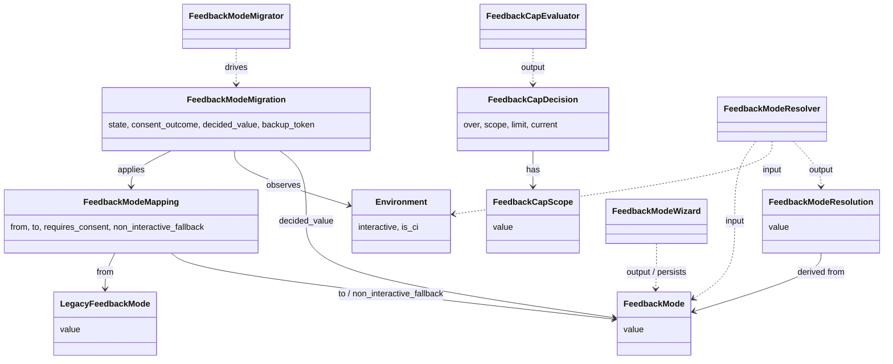

# ドメインモデル: Unit 001 feedback_mode 5 値拡張 + マイグレーション + 初回 wizard

## 概要

`rules.retrospective.feedback_mode` の値・環境・cap の概念を値オブジェクトとして固定し、
旧→新値のマイグレーションを集約として扱うことで、Unit 002〜004 が依存する共有契約の
正本（Single Source of Truth）を提供するためのドメインモデル。

**重要**: このドメインモデル設計では**コードは書かず**、構造と責務の定義のみを行います。

---

## 値オブジェクト（Value Object）

### FeedbackMode

v2.5.1 で正規の feedback_mode を表す不変な enum 値。

- **属性**: `value: string`（5 値のいずれか）
- **値域**: `interactive` / `local-issue-only` / `mirror-only` / `local-and-mirror` / `disabled`
- **不変性**: 一度生成された FeedbackMode は変更されない。値の変更は新しい FeedbackMode を生成する
- **等価性**: `value` の文字列一致で判定（NFKC 正規化前提、ASCII のみ）
- **構築時バリデーション**: 値域外を渡した場合は構築失敗（Unit 002〜004 が `feedback_mode_resolve` 経由で受け取った値はバリデーション通過済みであることを保証）

### LegacyFeedbackMode

v2.5.0 までの旧 feedback_mode を表す不変な enum 値。マイグレーション処理の入力としてのみ使用する。

- **属性**: `value: string`
- **値域**: `silent` / `mirror` / `disabled`
- **等価性**: 値の文字列一致

### FeedbackModeMapping

旧→新の写像規則 1 件を表す不変な値オブジェクト。Intent §「主要設計判断 4」の表を直接モデル化する。

- **属性**:
  - `from: LegacyFeedbackMode | "absent"`（旧値、または key 不在）
  - `to: FeedbackMode`（新値）
  - `requires_consent: boolean`（動作変更を伴うため明示同意が必要か）
  - `non_interactive_fallback: FeedbackMode`（同意取得不能時の保守的フォールバック）
- **不変条件**: `requires_consent=true` ⇒ `non_interactive_fallback ≠ to`（非対話時は必ず別の保守的値に倒す）

### Environment

スクリプトが動作している環境の対話可否を表す。

- **属性**: `interactive: boolean`
- **判定基準（単一化 / `is_interactive_env()` 関数で正規化）**:
  - `[ -t 0 ] && [ -t 1 ]`（stdin/stdout が tty）が必須
  - **かつ** `CI` / `GITHUB_ACTIONS` / `AIDLC_NON_INTERACTIVE` のいずれかが設定されている場合は `interactive=false` に強制（CI ガード）
- **副次属性**: `is_ci: boolean`（観測補助 / `CI` または `GITHUB_ACTIONS` が設定されているか）
- **正本**: `feedback-mode.sh` の `is_interactive_env()` 関数。resolve / wizard / migrate のすべての経路で本関数を呼び出して判定する（判定基準の文書間二重化を禁止）

### FeedbackModeResolution

`config 値 + 環境` を入力として、retrospective 起票処理が分岐に使う「実行モード」を表す。
**値域は最終実行モード 4 値のみ**（`interactive` をシグナルとして返さない）。
wizard 起動要否は別の値オブジェクト `FeedbackModeWizardRequirement` で表現する。

- **属性**: `value: string`（実行モード）
- **値域**: `mirror_only` / `local_only` / `both` / `disabled`
- **派生規則**:

  | FeedbackMode | Environment.interactive | resolution |
  |--------------|------------------------|------------|
  | `interactive` | true | `disabled`（resolve 時点では wizard 未起動。呼出側が `FeedbackModeWizardRequirement.required=true` を見て wizard 起動 → wizard 後の確定値で再 resolve） |
  | `interactive` | false | `disabled`（保守的フォールバック、wizard 起動不可） |
  | `local-issue-only` | - | `local_only` |
  | `mirror-only` | - | `mirror_only` |
  | `local-and-mirror` | - | `both` |
  | `disabled` | - | `disabled` |

- **不変性**: 入力が同じなら常に同じ値を返す純粋関数的な性質
- **設計判断**: 呼出側は必ず `FeedbackModeWizardRequirement` を先に評価し、`required=true` なら wizard を起動して確定値で再 resolve してから本値を消費する。これにより resolve の値域から `interactive` シグナルを排除し、Unit 002〜004 の分岐を 4 値の確定モードのみに固定する

### FeedbackModeWizardRequirement

`config 値 + 環境` から、wizard 起動が必要かを判定する不変な値オブジェクト。

- **属性**:
  - `required: boolean`（wizard 起動が必要か）
  - `reason: "interactive_mode_with_tty" | "not_required"`
- **派生規則**:

  | FeedbackMode | Environment.interactive | required | reason |
  |--------------|------------------------|----------|--------|
  | `interactive` | true | true | `interactive_mode_with_tty` |
  | `interactive` | false | false | `not_required`（非対話のため `disabled` フォールバック） |
  | その他 4 値 | - | false | `not_required` |

- **不変性**: 入力が同じなら常に同じ値を返す純粋関数的な性質

### FeedbackCapScope

cap の「何に対する上限か」を表す不変な enum 値。Intent §「主要設計判断 5」を直接モデル化する。

- **属性**: `value: string`
- **値域**: `combined`（合算）/ `local`（プロダクト Issue のみ）/ `mirror`（upstream Issue のみ）/ `none`（cap 不適用）

### FeedbackCapDecision

`mode + 現在の起票数` を入力として、起票可否と適用範囲を返す不変な値オブジェクト。

- **属性**:
  - `over: boolean`（cap を超えているか）
  - `scope: FeedbackCapScope`（適用範囲）
  - `limit: integer`（適用された上限値、`feedback_max_per_cycle`）
  - `current: integer`（現在の起票数）
- **呼出前提条件（不変条件 / 指摘 #2 対応）**:
  - 呼出側は事前に `FeedbackModeWizardRequirement.required` を評価し、`true` なら wizard を起動して確定値を得てから本値オブジェクトを構築する
  - 本値オブジェクトに `mode=interactive` を入力した場合は **暫定値**（`scope=none / over=false`）を返すのみで、再帰評価は **行わない**（純粋関数性を保つ / 呼出順序の責任は呼出側）
  - 機械的契約: `feedback_mode_requires_wizard(mode, env) == "true"` の場合は wizard を呼び、その戻り値で `mode` を上書きしてから cap_check を呼ぶ
- **派生規則**:

  | FeedbackMode | scope | over の判定 |
  |--------------|-------|------------|
  | `interactive` | `none` | `false`（**暫定値**。呼出側が wizard 起動 → 確定値で再 check するまでの placeholder） |
  | `local-issue-only` | `local` | `current >= limit` |
  | `mirror-only` | `mirror` | `current >= limit` |
  | `local-and-mirror` | `combined` | `current >= limit`（合算） |
  | `disabled` | `none` | `false`（cap 不適用） |
  | 未知値 | `none` | `true`（保守的に「起票させない」） |

---

## 集約（Aggregate）

### FeedbackModeMigration

旧→新写像のマイグレーション 1 サイクルを表現する集約。`aidlc-migrate` 実行時に 1 回生成され、
旧値検出 → 同意取得 → 確定 → 適用 → rollback の状態遷移を保護する。

- **集約ルート**: `FeedbackModeMigration`
- **含まれる要素**:
  - `mapping: FeedbackModeMapping`（写像規則 1 件）
  - `environment: Environment`（実行環境）
  - `state: MigrationState`（状態列挙: `detected` → `consent_pending` → `consent_resolved` → `applying` → `applied` / `aborted` / `rolled_back`）
  - `consent_outcome: "accepted" | "rejected" | "not_required" | "non_interactive_fallback"`
  - `decided_value: FeedbackMode | null`（同意フェーズの結果として確定した値）
  - `backup_token: string | null`（書込み前バックアップの識別子。`aidlc-migrate --rollback` で参照される）
- **境界**: 単一の `.aidlc/config.toml` 書き換えトランザクションを保護
- **不変条件**:
  1. `mapping.requires_consent=false` ⇒ `consent_outcome ∈ {"not_required"}`
  2. `mapping.requires_consent=true ∧ environment.interactive=false` ⇒ `consent_outcome="non_interactive_fallback"` ∧ `decided_value = mapping.non_interactive_fallback`
  3. `state="applying"` への遷移時、必ず `backup_token` が設定済み（rollback の発火粒度を保証）
  4. `state="aborted"` ⇒ `decided_value=null` かつ書込みは行われていない
  5. `state="rolled_back"` ⇒ 書込みが部分的に行われたが、`.aidlc/config.toml.backup-<timestamp>` から復元済み
- **状態遷移図**:

  ```text
  detected
    └─→ requires_consent=false ─→ consent_resolved (outcome=not_required)
    └─→ interactive ─→ consent_pending ─┬─→ consent_resolved (accepted)
    │                                    └─→ consent_resolved (rejected, decided_value=non_interactive_fallback)
    └─→ non_interactive ─→ consent_resolved (non_interactive_fallback, decided_value=non_interactive_fallback)

  consent_resolved ─→ applying ─┬─→ applied
                                └─→ rolled_back（書込み失敗時）
  consent_pending ─→ aborted（SIGINT 等のユーザー中断、書込み開始前）
  ```

---

## ドメインサービス

### FeedbackModeResolver

`FeedbackMode + Environment` から `FeedbackModeResolution` を計算する純粋関数のサービス。

- **責務**: Intent §「主要設計判断 5」の派生規則表を機械的に評価する
- **操作**:
  - `resolve(mode: FeedbackMode, env: Environment) → FeedbackModeResolution`
- **副作用**: なし
- **障害伝播**: 未知値は `disabled` に丸める（保守的フォールバック）+ stderr 警告

### FeedbackModeWizard

純シェル対話（`read -p`）による 5 値選択 + 設定保存を行うサービス。Operations 04-completion §1.5
の直前から Unit 002 が呼び出す。**Unit 001 では AskUserQuestion ツールに依存しない**（bash から直接
呼べないため。指摘 #6 への対応）。Claude Code エージェントから呼び出される場合の AskUserQuestion 経由
連携は将来の拡張点として保留する。

- **責務**:
  - 5 値（および「振り返り自体を実施しない＝disabled」を含む選択肢）の提示
  - ユーザー選択結果を `.aidlc/config.toml`（個人設定優先 / `--scope local`）へ保存
  - 設定保存後は確定値（FeedbackMode）を stdout に 1 行返す
- **操作**:
  - `launch() → FeedbackMode`（保存済み）
- **前提**: `is_interactive_env() == true`。非対話環境では呼び出してはならない（呼び出し側でガード / 呼ばれた場合は exit 2 で拒否）
- **副作用**: `.aidlc/config.toml.local` への書込み（write-config.sh 経由）
- **対話手段**: `read -p` ベースの数値選択。AskUserQuestion 依存はしない
- **障害伝播**: ユーザー中断（SIGINT / Ctrl-D）→ 既存値を維持して exit 1 / 設定保存失敗 → 上位に exit 1 で伝播 / 引数エラー → exit 2

### FeedbackCapEvaluator

`FeedbackMode + 現在の起票数` から `FeedbackCapDecision` を計算する純粋関数のサービス。

- **責務**: Intent §「主要設計判断 5」の cap 適用範囲表を機械的に評価する
- **操作**:
  - `check(mode: FeedbackMode, current: integer, limit: integer) → FeedbackCapDecision`
- **副作用**: なし
- **障害伝播**: 未知値は `over=true / scope=none`（保守的に「起票させない」）+ stderr 警告

### FeedbackModeMigrator

`FeedbackModeMigration` 集約を駆動するサービス。`aidlc-migrate` 実行時に 1 回起動される。
**対話手段は `read -p`（純シェル対話）に固定**（Unit 001 範囲では AskUserQuestion 非依存 / 指摘 #6 対応）。

- **責務**:
  - 旧値検出（`read-config.sh` 経由）
  - 写像規則の解決
  - 同意取得（`is_interactive_env() == true` のときのみ `read -p` で同意プロンプト / 非対話時 fallback 適用）
  - 確定値を **manifest に積み込む**（実書込みは `migrate-apply-config.sh` に委譲 / 指摘 #4 対応）
  - バックアップ作成および書込失敗時の rollback は **上位 aidlc-migrate の責務**（本サービスは積み込みのみ）
- **操作**:
  - `run() → FeedbackModeMigration`（最終状態を返す）
- **副作用**: 同意プロンプト + manifest への積み込み（書換 / バックアップ / rollback は本サービス外）
- **境界**: 旧値検出 + 同意取得 + manifest 積み込みは本サービス内、実書込みは `migrate-apply-config.sh`、バックアップ / rollback は aidlc-migrate 上位（3 層責務分離）
- **対話依存**: `read -p` のみ。AskUserQuestion / 外部 CLI への依存はなし

---

## リポジトリインターフェース

### ConfigRepository

`.aidlc/config.toml` および 4 階層（defaults → ~/.aidlc → project → local）への読み書きを抽象化する
リポジトリ。既存 `read-config.sh` / `write-config.sh` を直接ラップする想定（新規バックエンドは作らない）。

- **対象集約**: 設定値（key / value）。Unit 001 では `rules.retrospective.feedback_mode` のみ
- **操作**:
  - `get(key) → string | absent`（存在しなければ absent シンボル）
  - `set(key, value, scope) → void`（書込み失敗時は raise）
  - `get_legacy(key) → LegacyFeedbackMode | absent`（旧値検出専用、`silent` / `mirror` / `disabled` のみ受理）

### MigrationBackupRepository

`aidlc-migrate` のバックアップ機能を抽象化する。**新規実装は不要**（既存機能をそのまま使う）。

- **操作**:
  - `create_backup() → backup_token`
  - `restore(backup_token) → void`

---

## ファクトリ

### FeedbackModeMappingFactory

旧→新の写像規則を Intent §「主要設計判断 4」の表から構築する。

- **生成対象**: `FeedbackModeMapping` のリスト
- **生成ロジック概要**:
  - 表の各行を `FeedbackModeMapping(from, to, requires_consent, non_interactive_fallback)` に変換
  - 値:
    - `silent` → `interactive`（requires_consent=true / fallback=`disabled`）
    - `mirror` → `mirror-only`（requires_consent=false / fallback=`mirror-only`）
    - `disabled` → `disabled`（requires_consent=false / fallback=`disabled`）
    - `absent` → `interactive`（requires_consent=true / fallback=`disabled`）

---

## ドメインモデル図



---

## ユビキタス言語

- **feedback_mode**: 振り返り Issue 起票方針を表す設定値の一般名称
- **interactive モード**: feedback_mode = `interactive`。次回 04-completion §1.5 実行時に wizard を起動して 5 値のいずれかに確定させる中間状態
- **mirror Issue**: AI-DLC Starter Kit upstream リポジトリへの起票（既存 v2.5.0 概念）
- **local Issue**: 消費プロジェクト自身のリポジトリへの起票（v2.5.1 で新規導入）
- **mirror_state**: 個別 Problem の Issue 起票状態（既存 v2.5.0 概念、Unit 002 の責務）
- **写像（mapping）**: v2.5.0 旧値 → v2.5.1 新値の対応規則
- **同意プロンプト**: 動作変更を伴うマイグレーションでユーザーに明示同意を求める対話
- **非対話 fallback**: 非対話環境で同意プロンプトが起動できない場合に、保守的な値（`disabled`）に倒す動作
- **rollback 発火**: 書込み失敗時に `aidlc-migrate --rollback` を呼び出してバックアップを復元する動作
- **cap**: `feedback_max_per_cycle` で定義される、1 サイクル内の起票上限
- **cap scope**: cap が適用される対象（合算 / 単独）

---

## 不明点と質問（設計中に記録）

[Question] interactive 状態で wizard が起動できない（非対話 + 既存値が `interactive`）場合の cap scope は `none` か、保守的に `combined` 相当の `over=true` を返すか
[Answer] FeedbackModeResolver が `interactive × 非対話` を `disabled` に解決する → cap scope=`none` / over=`false`（cap 不適用、起票しない）。`disabled` への帰着で一貫させる。

[Question] 4 階層マージ（defaults / ~/.aidlc / project / local）で旧値（silent 等）が混在した場合の優先度
[Answer] read-config.sh のマージ順（低→高: defaults → ~/.aidlc → project → local）に従う。最終的に解決された値が `silent` / `mirror` / `disabled` の場合は LegacyFeedbackMode として正規化処理に通す。aidlc-migrate は project 階層の `.aidlc/config.toml` のみを書換対象とする（個人設定 .aidlc/config.local.toml は触らない）。

[Question] FeedbackModeWizard が選択結果を保存するスコープ（project / local）の既定値
[Answer] `local`（個人設定 = `.aidlc/config.local.toml`）。理由: 振り返り起票方針はチーム共有よりも個人嗜好に近く、ダウンストリーム消費プロジェクトでは PR に含めたくないため。write-config.sh の既定スコープと整合。
