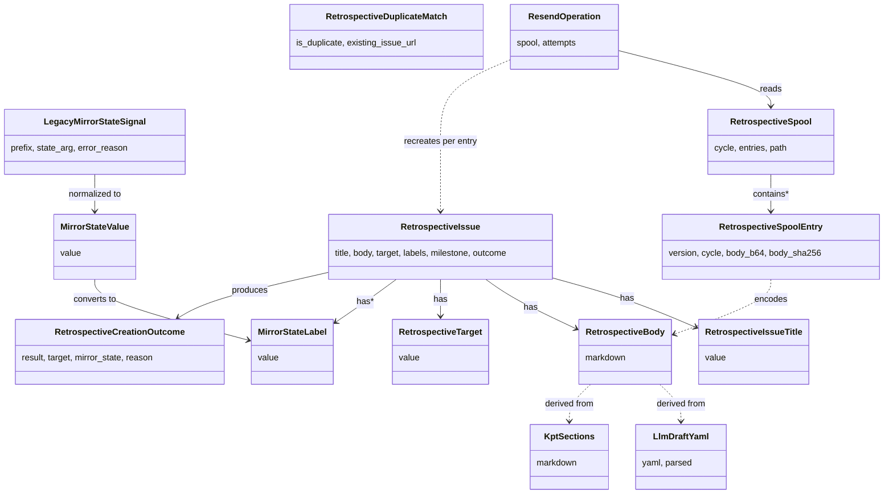

# ドメインモデル: Unit 002 retrospective Issue 一本化 + spool + mirror_state ラベル化

## 概要

retrospective 振り返りを GitHub Issue 起票で完結させるための共有関数（`retrospective_body_compose` / `retrospective_issue_create`）と、`gh` 不可時のスプール / 再送、`mirror_state` のラベル化、互換アダプタ層が依拠するドメイン構造を定義する。Unit 003（LLM 下書き prefill）/ Unit 004（predecessor 検索）が依存する共有契約（命名規約・本文構造・状態語彙）の正本（Single Source of Truth）を提供する。

**重要**: このドメインモデル設計では**コードは書かず**、構造と責務の定義のみを行います。実装は Phase 2（コード生成）で行います。

---

## 値オブジェクト（Value Object）

### RetrospectiveIssueTitle

retrospective Issue のタイトルを表す不変な値オブジェクト。重複検出のキーとなる。

- **属性**: `value: string`
- **構造**: `Retrospective: <CYCLE>` の固定フォーマット（共有契約 6.2 の本文 H1 と整合）
- **不変性**: 一度生成された値は変更されない
- **等価性**: 文字列の正規化後一致（前後空白 trim + NFKC 正規化前提、ASCII のみ）
- **設計判断**: タイトル空間をサイクル単位に固定することで、`gh issue list --milestone <CYCLE> --label retrospective` の結果と機械的に対応付ける（重複検出の根拠）

### RetrospectiveBody

retrospective Issue の本文 Markdown を表す不変な値オブジェクト。共有契約 6.2 の構造を保護する。

- **属性**: `markdown: string`
- **構造制約（不変条件）**: 以下のセクションを順序固定で含む
  1. H1 `# Retrospective: <CYCLE>`
  2. H2 `## Keep / Try / Problem`（KPT セクション）
  3. H2 `## 問題項目（Problem）`（Problem 配列、各 Problem ごとに「主因切り分け」表 + `skill_caused_judgment` YAML）
  4. 末尾 YAML ブロック: `mirror_state` + `human_reviewed`
- **不変性**: 構築後は変更しない（更新は Unit 003 が `gh issue edit` で行う、Unit 002 範囲外）
- **等価性**: `markdown` の文字列一致

### LlmDraftYaml

Unit 003 から渡される LLM 下書き YAML（Intent §6.3 スキーマ）を表す不変な値オブジェクト。

- **属性**: `yaml: string`（YAML テキスト）+ `parsed: ProblemDraft[]`（パース済み配列）
- **スキーマ**（Intent §6.3 準拠）: `problem_drafts[].{problem_id, primary_cause, primary_cause_reason, skill_caused_judgment.{q1_answer,q1_quote,...}, confidence}`
- **値域チェック**:
  - `primary_cause ∈ {"product", "ai_dlc", "both"}`
  - `qN_answer ∈ {"yes", "no"}`
  - `confidence ∈ {"high", "medium", "low"}`（任意、省略可）
- **空 YAML 受容**: 空文字列 / 空 array は LLM 失敗フォールバックとして受理（全フィールド空 + `primary_cause="product"` 仮置きのデフォルトに展開）
- **部分欠損受容**: 必須フィールド欠損時は警告 + 空文字列フォールバック（`retrospective_body_compose` が exit 0 で続行）

### KptSections

KPT 部分（Keep / Try / Problem の Markdown）を表す不変な値オブジェクト。

- **属性**: `markdown: string`
- **由来**: `templates/retrospective_template.md` 展開済みの内容
- **不変条件**: 末尾改行を必ず 1 つ持つ（本文連結時の境界保護）

### MirrorStateValue

`mirror_state` の canonical 値を表す不変な enum 値オブジェクト。Intent §6.2 / Plan §「`mirror_state` 状態語彙 canonical 仕様」を直接モデル化する。

- **属性**: `value: string`
- **値域（canonical）**: `""` / `pending` / `created` / `skipped:max_exceeded` / `skipped:duplicate` / `error`
- **等価性**: 文字列一致
- **不変条件**: 値域外は構築失敗（呼出側は `MirrorStateNormalizer` を経由して構築する）

### MirrorStateLabel

GitHub Issue ラベル文字列を表す不変な値オブジェクト。

- **属性**: `value: string`
- **構造**: `mirror-state:<canonical>`（`canonical` の `:` を `-` に置換）
- **値域**: `mirror-state:pending` / `mirror-state:created` / `mirror-state:skipped-max-exceeded` / `mirror-state:skipped-duplicate` / `mirror-state:error`
- **特殊ケース**: `MirrorStateValue.value=""` の場合はラベル付与なし（ラベル不在で「未起票」を表現）
- **等価性**: 文字列一致

### LegacyMirrorStateSignal

互換アダプタ層が受け取る v2.5.0 旧プレフィックス出力（`mirror\tsent\t...` / `send-failed` / `recorded:*`）を表す不変な値オブジェクト。

- **属性**:
  - `prefix: "sent" | "send-failed" | "recorded"`
  - `state_arg: string | null`（`recorded:pending` / `recorded:skipped` の場合のみ）
  - `error_reason: string | null`（`send-failed` の reason 文字列）
- **役割**: 互換アダプタが旧出力を canonical `MirrorStateValue` に変換するための入力契約
- **正規化規則**: Plan §「旧語彙正規化規則」の写像表に従い `MirrorStateNormalizer` で `MirrorStateValue` に変換

### RetrospectiveTarget

起票先を表す不変な enum 値オブジェクト。Unit 001 `feedback_mode_resolve` の戻り値（`local_only` / `mirror_only` / `both` / `disabled`）を Issue 起票の文脈に翻訳する。

- **属性**: `value: string`
- **値域**: `local` / `mirror` / `both` / `none`
- **派生規則**:

  | feedback_mode（Unit 001 解決後） | RetrospectiveTarget |
  |----------------------------------|---------------------|
  | `local_only` | `local` |
  | `mirror_only` | `mirror` |
  | `both` | `both` |
  | `disabled` | `none` |

- **不変性**: 入力が同じなら常に同じ値を返す純粋関数的派生

### RetrospectiveCreationOutcome

`retrospective_issue_create()` の結果を表す不変な値オブジェクト。Plan §「`retrospective_issue_create()` 出力契約」を直接モデル化する。

- **属性**:
  - `result: "created" | "skipped" | "spooled" | "failed"`
  - `target: RetrospectiveTarget`
  - `local_issue_url: string | null`
  - `mirror_issue_url: string | null`
  - `existing_issue_url: string | null`（重複検出時のみ）
  - `mirror_state: MirrorStateValue`
  - `reason: string | null`（`skipped` / `failed` の場合に詳細）
  - `spool_path: string | null`（`spooled` の場合のみ）
- **不変条件**:
  1. `result="created" ∧ target ∈ {local, mirror}` ⇒ 対応する `*_issue_url` が非 null かつもう一方は null
  2. `result="created" ∧ target=both` ⇒ `local_issue_url` と `mirror_issue_url` の両方が非 null
  3. `result="spooled"` ⇒ `spool_path` 非 null + `mirror_state=pending`
  4. `result="skipped" ∧ reason="duplicate"` ⇒ `existing_issue_url` 非 null + `mirror_state="skipped:duplicate"`
  5. `result="failed"` ⇒ `mirror_state="error"` + `reason` 非 null
- **exit code 写像（指摘 #4 対応）**: `result ∈ {created, skipped, spooled}` → exit 0、`result="failed"` → exit 1、引数エラー → exit 2

### RetrospectiveSpoolEntry

スプールファイル内の 1 エントリを表す不変な値オブジェクト。Plan §「スプールファイル形式」NDJSON スキーマを直接モデル化する（指摘 #2 / #6 反映で `id` / `retry_target` / `partial_state` を追加）。

- **属性**:
  - `id: string`（UUID v4 / エントリ一意識別子）
  - `version: string`（現在 `"1"`）
  - `cycle: string`
  - `feedback_mode: string`（5 値正規化後）
  - `attempted_at: string`（ISO8601）
  - `target: RetrospectiveTarget`
  - `retry_target: RetrospectiveTarget`（再送時の対象 / partial 起票時は `mirror` 単独）
  - `partial_state: { local_created: string | null, mirror_created: string | null }`（partial 起票時の URL 保持）
  - `attempt_reason: string`（`gh-not-available` / `gh-rate-limit` / `mirror-failed-after-local-created` / etc.）
  - `body_b64: string`（`RetrospectiveBody.markdown` の base64）
  - `body_sha256: string`（hex）
- **不変条件**:
  1. `body_b64` の base64 デコード結果の SHA256 が `body_sha256` と一致(integrity)
  2. `feedback_mode` は Unit 001 `feedback_mode_normalize` を通過した正規化値
  3. `attempt_reason` は再送可能エラーコードのみ（fatal は spool しない）
  4. `id` はエントリ間で一意（UUID v4 形式）
  5. `partial_state.local_created` 非 null ⇒ `retry_target ∈ {mirror}`（local は再起票しない）
  6. `partial_state.mirror_created` 非 null ⇒ `retry_target ∈ {local}`（通常 partial は local 成功 / mirror 失敗のため発生頻度は低いが構造的に許容）
- **整合性検証**: 読取時に `body_sha256` 一致を必須要件とする（不一致時は当該エントリを skip + 警告 / 設計フェーズで `--strict` フラグでの停止モード検討）
- **削除規約（指摘 #6）**: 起票成功後の spool 削除は `id` をキーに行う（行番号ベース削除を禁止）

### RetrospectiveDuplicateMatch

重複検出結果を表す不変な値オブジェクト。

- **属性**:
  - `is_duplicate: boolean`
  - `existing_issue_url: string | null`（重複時のみ）
- **派生条件**: `gh issue list --label retrospective --milestone <CYCLE> --state all` の結果から `RetrospectiveIssueTitle` 一致を検索

---

## 集約（Aggregate）

### RetrospectiveIssue

GitHub に起票される 1 件の retrospective Issue を表す集約。起票後は GitHub 側が真とし、ローカル側は本集約を「起票要求 + 結果」のスナップショットとして保持する。

- **集約ルート**: `RetrospectiveIssue`
- **含まれる要素**:
  - `title: RetrospectiveIssueTitle`
  - `body: RetrospectiveBody`
  - `target: RetrospectiveTarget`（local / mirror / both）
  - `labels: { RetrospectiveLabel, MirrorStateLabel }`
  - `milestone: string`（`<CYCLE>`）
  - `cycle: string`
  - `outcome: RetrospectiveCreationOutcome | null`（起票試行後に設定）
- **境界**: 1 回の `retrospective_issue_create()` 呼び出しで構築・処理される単位
- **不変条件**:
  1. `target=both` の場合、起票は **local 先行 / mirror 後**の固定順序（部分起票時の幂等性保護）
  2. 同一 `(cycle, title)` での Issue は二重起票しない（重複検出を構築前に必ず実行）
  3. `outcome=null` の状態で集約を破棄してはならない（起票試行の記録漏れ防止）
- **状態遷移**: `built → checking_duplicate → creating → outcome_recorded`

### RetrospectiveSpool

複数の `RetrospectiveSpoolEntry` を保持するスプールファイル全体を表す集約。

- **集約ルート**: `RetrospectiveSpool`
- **含まれる要素**:
  - `cycle: string`
  - `version: string`
  - `entries: RetrospectiveSpoolEntry[]`
  - `path: string`（`cycles/<CYCLE>/history/retrospective-spool.md`）
- **境界**: 単一スプールファイルの NDJSON fenced block 内エントリの読み書きトランザクション
- **不変条件**:
  1. ヘッダ `<!-- retrospective-spool v1 -->` は必ず 1 行目に存在
  2. 機械可読部分は ` ```ndjson ... ``` ` fenced block 1 個に閉じ込められ、block 外には機械可読データを書き込まない
  3. `version` フィールドが entries 全体で一貫（混在時は警告）
  4. 追記は fenced block 末尾の閉じ ` ``` ` の前に新エントリ 1 行を挿入する操作のみ（中間挿入禁止）
- **状態遷移**: `loaded → modified → persisted`（インプレース上書き）

### ResendOperation

1 回の再送実行（`retrospective-resend.sh` 1 起動）を表す集約。

- **集約ルート**: `ResendOperation`
- **含まれる要素**:
  - `spool: RetrospectiveSpool`
  - `attempts: { entry: RetrospectiveSpoolEntry, outcome: RetrospectiveCreationOutcome }[]`
  - `cycle: string`（`--cycle` 指定時 / 未指定時は最新 cycle 自動決定）
  - `dry_run: boolean`
- **境界**: 1 回の再送コマンド実行
- **不変条件**:
  1. 起票成功（`outcome.result=created`）したエントリのみ spool から **id をキーに**削除する（部分失敗時の残存保証）
  2. `outcome.result=spooled` は **再送経路では発生しない**（再送中は `gh_status=available` を呼出側が確認している前提 / 違反時は警告 + skip）
  3. `dry_run=true` 時は spool への変更を行わない
- **終了コード規約（plan / logical design と同期）**:
  - `0`: 全エントリが `created` または `skipped` で完結（failed が 0 件のみ）
  - `1`: `failed` が 1 件以上含まれる（部分失敗 / 上位はエラー扱い）/ 中断 / 致命的失敗
  - `2`: 引数エラー / spool 不正 / cycle 不在
- **状態遷移**: `loaded → executing → completed`

---

## ドメインサービス

### RetrospectiveBodyComposer

`LlmDraftYaml + KptSections + cycle` から `RetrospectiveBody` を構築する純粋関数のサービス。

- **責務**: 共有契約 6.2 の章立てを機械的に評価し、`human_reviewed:false` を初期値で埋め込む
- **操作**:
  - `compose(draft: LlmDraftYaml, kpt: KptSections, cycle: string) → RetrospectiveBody`
- **副作用**: なし
- **障害伝播**:
  - YAML パース失敗 → exit 2（`compose` は失敗、上位は本文構築不能として処理中止）
  - 必須フィールド欠損 → 警告 + 空文字列フォールバック（exit 0）
  - 値域違反 → 警告 + 既定値仮置き（`primary_cause="product"` / `qN_answer="no"` / quote=""）（exit 0）
- **設計判断**: パース失敗以外は exit 0 + 警告で続行する（振り返り内容の消失を避ける）

### RetrospectiveTargetResolver

`feedback_mode + Environment` から `RetrospectiveTarget` を計算する純粋関数のサービス。Unit 001 `feedback_mode_resolve()` の戻り値を Issue 起票文脈に翻訳する薄いラッパー。

- **責務**: Unit 001 解決済の `local_only` / `mirror_only` / `both` / `disabled` を `local` / `mirror` / `both` / `none` に写像する
- **操作**:
  - `resolve(feedback_mode: string, env: Environment) → RetrospectiveTarget`
- **副作用**: なし
- **障害伝播**: Unit 001 解決失敗（exit 非 0）はそのまま上位に伝播

### RetrospectiveDuplicateDetector

`RetrospectiveIssueTitle + cycle` から `RetrospectiveDuplicateMatch` を返すサービス。

- **責務**: `gh issue list --label retrospective --milestone <CYCLE> --state all` の結果からタイトル一致を検出する
- **操作**:
  - `detect(title: RetrospectiveIssueTitle, cycle: string) → RetrospectiveDuplicateMatch`
- **副作用**: GitHub API 呼び出し（読み取りのみ）
- **障害伝播**: `gh_status != available` → 呼出側の責務として `RetrospectiveSpool` 経路へ転送（本サービスは検出のみ）

### MirrorStateNormalizer

`LegacyMirrorStateSignal` ⇄ `MirrorStateValue` ⇄ `MirrorStateLabel` の双方向変換を行うサービス。**正規化責務の所在を 1 箇所に集約**（Plan §「正規化責務の所在」）。

- **責務**:
  - 旧プレフィックス出力 → canonical 値（読み取り側互換）
  - canonical 値 → ラベル文字列（書き込み側）
  - ラベル文字列 → canonical 値（読み取り側）
  - ラベル経路と YAML 経路の優先順位判定（ラベル真 / YAML fallback）
- **操作**:
  - `from_legacy(signal: LegacyMirrorStateSignal) → MirrorStateValue`
  - `to_label(value: MirrorStateValue) → MirrorStateLabel | null`（`""` → null）
  - `from_label(label: string) → MirrorStateValue`
  - `reconcile(label_value: MirrorStateValue | null, yaml_value: MirrorStateValue) → MirrorStateValue`（不整合時は label を採用 + stderr 警告）
- **副作用**: なし（純粋関数）
- **障害伝播**: 未知ラベル / 未知 canonical 値 → 警告 + `error` 仮置き（exit 0）

### RetrospectiveSpoolWriter

`RetrospectiveSpoolEntry` を `RetrospectiveSpool` に追記するサービス。**排他ロック付き**（指摘 #6 反映）。

- **責務**:
  - 既存ファイル不存在時はヘッダ + 空 fenced block を生成して追記
  - 既存ファイル存在時は fenced block 末尾の閉じ ` ``` ` の前に新エントリ 1 行を挿入
  - 書込み中は `flock` 相当のロックで排他制御
- **操作**:
  - `append(spool_path: string, entry: RetrospectiveSpoolEntry) → void`
- **副作用**: ファイル書き込み（一時ファイル + 原子的 `mv` 置換）
- **障害伝播**:
  - ロック取得不能（5 秒タイムアウト） → exit 1 + stderr 警告
  - 書き込み失敗 → exit 1（呼出側が起票結果を `failed` に転換）

### RetrospectiveSpoolReader

`RetrospectiveSpool` を読み取り、`RetrospectiveSpoolEntry[]` にデコードするサービス。

- **責務**:
  - ヘッダ確認 → fenced block 抽出 → 各行 JSON.parse → integrity 検証
- **操作**:
  - `read(spool_path: string) → RetrospectiveSpool`
- **副作用**: なし（読み取り専用）
- **障害伝播**:
  - ヘッダ不在 → exit 2（fatal）
  - JSON パース失敗 1 行 → 警告 + 当該行 skip
  - SHA256 不一致 → 警告 + 当該行 skip（既定）。設計フェーズで「停止」オプションを検討

### RetrospectiveSpoolCompactor

起票成功後、`RetrospectiveSpool` から特定エントリを **id をキーに**削除するサービス。**排他ロック付き**（指摘 #6 反映）。

- **操作**:
  - `remove_entries_by_id(spool_path: string, ids: string[]) → void`
- **副作用**: ファイル書き込み（一時ファイル + 原子的 `mv` 置換 / 全エントリ削除時は fenced block 内を空に保つ / ヘッダは維持）
- **障害伝播**:
  - ロック取得不能 → exit 1 + stderr 警告
  - 書き込み失敗 → exit 1
- **設計判断**: id ベース削除により、行番号変動による誤削除や複数プロセス並行操作時の race condition を排除

### IssueCreator

`gh` CLI 経由で GitHub Issue を起票するサービス。

- **責務**:
  - `gh issue create --title ... --body-file ... --label retrospective,mirror-state:<value> --milestone <CYCLE>` を実行
  - `target=both` の場合は local / mirror の 2 リポに対し順次起票
- **操作**:
  - `create(issue: RetrospectiveIssue) → RetrospectiveCreationOutcome`
- **副作用**: GitHub Issue の新規作成
- **障害伝播**:
  - `gh_status != available` → 呼出側の責務として `RetrospectiveSpool` 経路へ転送
  - `gh` 起票失敗（rate-limit / network / unknown） → `RetrospectiveCreationOutcome.result=failed` で返す（exit 1）

### LegacyAdapterTranslator

互換アダプタ層（`retrospective-generate.sh` / `retrospective-mirror.sh`）が呼ばれた際、新フローの結果を旧プレフィックス出力に逆変換するサービス。

- **責務**:
  - `RetrospectiveCreationOutcome` → 旧 `mirror\tsent\t<idx>\t<url>` / `mirror\tsend-failed\t<idx>\t<reason>` / `mirror\trecorded\t<idx>\t<state>` への写像
  - `result=created/spooled/skipped/failed` を旧語彙に丸める（Plan §「互換アダプタ層 保証範囲」表に従う）
- **操作**:
  - `to_generate_legacy(outcome: RetrospectiveCreationOutcome) → string`（旧 generate stdout 行）
  - `to_mirror_legacy(outcome: RetrospectiveCreationOutcome, idx: integer) → string`（旧 mirror stdout 行）
- **副作用**: なし
- **境界**: 互換アダプタ層内部でのみ呼び出される。新フロー（§1.5 改修後）からは呼ばない

---

## リポジトリインターフェース

### RetrospectiveIssueRepository

GitHub Issue の永続化を抽象化する。`gh` CLI を直接ラップする想定（新規バックエンドは作らない）。

- **対象集約**: `RetrospectiveIssue`
- **操作**:
  - `create(issue: RetrospectiveIssue) → RetrospectiveCreationOutcome`（起票）
  - `find_by_title_and_cycle(title: RetrospectiveIssueTitle, cycle: string) → RetrospectiveIssue | absent`（重複検出）
  - `view(issue_url: string) → RetrospectiveIssue`（読み取り、Unit 003 update フックの起点）
- **障害伝播**: `gh_status != available` → 呼出側がスプール経路へ転送

### RetrospectiveSpoolRepository

スプールファイルの永続化を抽象化する。

- **対象集約**: `RetrospectiveSpool`
- **操作**:
  - `load(cycle: string) → RetrospectiveSpool`（読み取り、不在時は空 spool）
  - `append(cycle: string, entry: RetrospectiveSpoolEntry) → void`
  - `remove_entries(cycle: string, entries: RetrospectiveSpoolEntry[]) → void`
- **障害伝播**: 書き込み失敗 → exit 1

### RetrospectiveLegacyFileRepository

v2.5.0 以前の `cycles/<PREV_CYCLE>/operations/retrospective.md` ファイルを **読み取り専用**で参照する。

- **対象**: 旧 retrospective.md ファイル
- **操作**:
  - `read(cycle: string) → string | absent`（既存ファイル読み取り）
- **設計判断**: 書き込み操作は提供しない（v2.5.1 では新規生成しないため）。Intent §「リスク 4」の「読み取り専用パーサで継続サポート（v2.5.0 互換）」を担保

---

## ファクトリ

### RetrospectiveIssueFactory

`cycle + LlmDraftYaml + KptSections + RetrospectiveTarget` から `RetrospectiveIssue` を構築するファクトリ。

- **生成対象**: `RetrospectiveIssue`
- **生成ロジック概要**:
  1. `RetrospectiveBodyComposer.compose()` で `RetrospectiveBody` を構築
  2. `RetrospectiveIssueTitle = "Retrospective: <CYCLE>"` を生成
  3. ラベルセット `{retrospective, mirror-state:pending}`（初期値）を構築（起票成功後 `mirror-state:created` に書き換え）
  4. `RetrospectiveDuplicateDetector` で重複検出 → 重複時は `RetrospectiveCreationOutcome(result=skipped, reason=duplicate)` を返す
  5. 重複なし → `RetrospectiveIssue` 集約を構築

### RetrospectiveSpoolEntryFactory

`RetrospectiveIssue + attempt_reason + (optional) partial_state` から `RetrospectiveSpoolEntry` を構築するファクトリ。

- **生成ロジック概要**:
  1. `id = uuid_v4()`（`uuidgen` または `/dev/urandom` フォールバック）
  2. `body_b64 = base64(issue.body.markdown)`
  3. `body_sha256 = hex(sha256(issue.body.markdown))`
  4. `attempted_at = ISO8601(now)`
  5. `version = "1"`
  6. `retry_target` は呼出側から指定。partial 起票（local 成功 / mirror 失敗）時は `mirror`、通常時は `target` と同値
  7. `partial_state` は呼出側から指定（partial 起票でない場合は `{local_created: null, mirror_created: null}`）

---

## ドメインモデル図



---

## ユビキタス言語

- **retrospective Issue**: 振り返り内容を 1 サイクルあたり 1 件の GitHub Issue として永続化したもの（v2.5.1 で新規導入される唯一の振り返り永続化先）
- **本文構造（共有契約 6.2）**: KPT + Problem 配列 + 主因切り分け + skill_caused_judgment + mirror_state YAML を含む Markdown 構造
- **mirror_state**: retrospective Issue の起票試行状態を表す canonical 値（`""` / `pending` / `created` / `skipped:max_exceeded` / `skipped:duplicate` / `error`）
- **mirror_state ラベル**: GitHub Issue ラベル `mirror-state:<value>`（canonical 値の `:` を `-` に置換）
- **target（起票先）**: `local` / `mirror` / `both` / `none` の 4 値。Unit 001 `feedback_mode_resolve` の出力を翻訳した値
- **prefill フック（起票前）**: Unit 003 が LLM 推論で生成した `LlmDraftYaml` を Unit 002 の本文構築に渡す経路
- **update フック（起票後）**: Unit 003 が起票後の Issue に対し `gh issue edit` で `human_reviewed:true` 更新と差分コメント追記を行う経路。Unit 002 は `issue_url` 引き渡しのみ
- **スプール（spool）**: `gh_status != available` 時に起票内容を `cycles/<CYCLE>/history/retrospective-spool.md` の NDJSON fenced block に追記する待機経路
- **再送（resend）**: `retrospective-resend.sh` がスプールエントリを順次起票する処理
- **重複検出**: `gh issue list --label retrospective --milestone <CYCLE>` でタイトル一致を確認し、二重起票を防ぐ仕組み
- **互換アダプタ層**: `retrospective-generate.sh` / `retrospective-mirror.sh` の旧 stdout プレフィックス契約を保持しつつ、内部処理を `retrospective-issue.sh` に委譲するラッパー
- **legacy retrospective.md**: v2.5.0 以前のローカルファイル経路（`cycles/<PREV_CYCLE>/operations/retrospective.md`）。v2.5.1 では新規生成せず、読み取り専用で参照のみ維持

---

## 確定事項（Phase 1 設計で決定済 / SSOT）

本セクションは Phase 1 設計フェーズで確定した事項を SSOT として固定する。論理設計（`logical-designs/`）と plan（`plans/unit-002-plan.md`）の決定はすべて本セクションと同期する。

### partial 起票の表現

`target=both` 起票で local 成功 / mirror 失敗の部分起票が発生した場合:

- `RetrospectiveCreationOutcome`: `result=failed` + `local_issue_url=<URL>` + `mirror_issue_url=null` + `mirror_state=error` + `reason=mirror-failed-after-local-created`（exit 1）
- spool エントリは `retry_target=mirror` + `partial_state.local_created=<URL>` で記録
- 再送時は mirror のみ起票試行（local は再起票しない）

### スプール SHA256 不一致時の挙動

既定は **skip + 警告**（再送経路の前進を優先 / 振り返り内容消失リスクを避ける）。`--strict` フラグで停止モード（exit 1）を提供（実装フェーズで詳細確定）。

### 互換アダプタ層 `retrospective-mirror.sh recorded:pending` の扱い

**確定**: 旧 `recorded:pending` は canonical `created` 互換扱い + warn を出す（**意味が完全には一致しない非保証マッピング**）。canonical 中間語彙 `legacy-deferred` は導入しない（v2.7.x で旧フロー削除予定のため）。詳細は plan §「互換アダプタ層 旧→新 意味マッピング」および logical design §「旧→新 意味マッピング」を参照。

### `feedback_mode=local-and-mirror` で local / mirror リポが同一の場合の縮退

**確定**: OWNER/REPO 一致と判定した場合は **local 起票のみ** に縮退し、`target=local` + `mirror_state=created` で記録する。Intent §「ターゲットユーザー」のメタ開発リポジトリ想定で自リポへの二重起票を防ぐ。OWNER/REPO 解決:

- local リポ: `git remote get-url origin` から OWNER/REPO 抽出
- mirror リポ: 固定値 `ikeisuke/ai-dlc-starter-kit`（upstream / `lib/retrospective-issue.sh` 内 `MIRROR_REPO` 定数）

動的設定（config.toml 経由）は本サイクルでは導入しない。

### Unit 003 フック契約

**確定**:

- `retrospective_prefill_hook(cycle, kpt_md_path)`: 任意 / 未定義時 no-op / 失敗時 空 YAML フォールバック
- `retrospective_update_hook(issue_url, cycle)`: 任意 / 未定義時 no-op / 失敗時 警告のみ

詳細は logical design §「Unit 003 フック契約」を参照。

### YAML パース手段

**確定**: awk による段階的パースを第一候補。複雑なネスト（problem_drafts[]）が awk で扱いにくい場合は yq へ切り替える判断を実装フェーズで行う。

### スプール書込みの安全性

**確定**: `mktemp` で一時ファイルに新内容を書き、`mv` で原子的に置き換える方式（`sed -i` 不使用）。`flock` 相当の排他ロック付き、ロック取得不能 5 秒タイムアウト → exit 1。

### `retrospective-validate.sh --apply` の新仕様

**確定**: `--apply` は **常に stdout に新本文を返却**（実ファイル書き換えは行わない）。呼出側がリダイレクトで一時ファイルに書き出し、`mv` で原本を上書きする責務を持つ。`retrospective_body_compose` → validate `--apply` → `retrospective_issue_create` の直列パイプラインで完結（再パース不要）。
