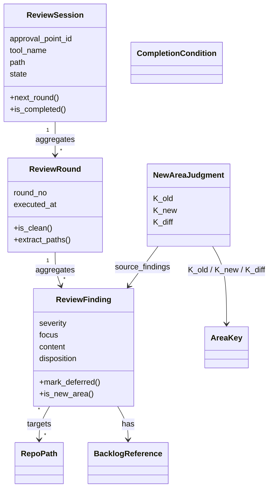

# ドメインモデル: Unit 001 review-flow 5R 化と defer 自動化

## 概要

AI レビューサイクル（review-flow）における round / 完了条件 / defer 判定 / 新領域判定のドメイン語彙と関係を整理する。本 Unit は実装言語コードを生成しないドキュメント改修だが、ドキュメントが規定する手順は AI agent と外部 CLI（gh / codex）が協働する状態機械として振る舞うため、その状態機械を「論理ドメイン」として明示する。

**重要**: このドメインモデル設計では**コードは書かず**、構造と責務の定義のみを行う。実装は Phase 2（コード生成ステップ）で行う。

## エンティティ（Entity）

### ReviewSession

- **ID**: `(承認ポイント ID, セッション開始時刻)` の組（codex セッション ID は外部参照キー）
- **属性**:
  - `approval_point_id`: string - 承認ポイント識別子（例: `construction.plan.approval`）
  - `started_at`: timestamp - セッション開始時刻
  - `tool_name`: string|none - 使用 CLI（`codex` 等、none はパス 2/3）
  - `path`: 1 | 2 | 3 - 処理パス（1=外部 CLI / 2=セルフ / 3=ユーザー直行）
  - `automation_mode`: `manual` | `semi_auto` - セミオートゲート判定の入力（ファクトリ入力から保持）
  - `rounds`: List<ReviewRound> - 反復レビュー履歴
  - `state`: `in_progress` | `completed` | `aborted`
- **振る舞い**:
  - `next_round()`: 反復上限（5R）に達しないかを判定し、未達なら ReviewRound を 1 件追加
  - `is_completed()`: 完了条件「`CompletionCondition.evaluate(rounds)` が `completed` を返す」を判定（具体仕様は `CompletionCondition` 値オブジェクト参照）
  - `should_invoke_decision_flow()`: 5R 終了後に未対応指摘があるかを判定（指摘対応判断フローへ遷移するか）

### ReviewRound

- **ID**: `(ReviewSession.id, round_no)` の組
- **属性**:
  - `round_no`: integer - ラウンド番号（1〜5）
  - `findings`: List<ReviewFinding> - 検出された指摘
  - `executed_at`: timestamp - 実行時刻
- **振る舞い**:
  - `is_clean()`: `findings` が空または全件 defer 化されているかを判定（完了条件評価の基本単位）
  - `extract_paths()`: review-summary 「内容」列のパス記法規約（repo-relative + backtick）に従いパスを抽出

### ReviewFinding

- **ID**: `(ReviewRound.id, finding_no)` の組
- **属性**:
  - `severity`: 高 | 中 | 低
  - `focus`: code | security | architecture | inception
  - `content`: string - 指摘内容
  - `target_paths`: List<RepoPath> - 指摘対象のパス
  - `disposition`: `pending` | `resolved` | `technical_blocker` | `out_of_scope` | `deferred_round4plus`
  - `backlog_ref`: BacklogReference | none - Issue 番号 / `PENDING_MANUAL` / `SECURITY_PRIVATE` / `-`
- **振る舞い**:
  - `mark_deferred()`: defer 判定（OUT_OF_SCOPE / TECHNICAL_BLOCKER）を記録し、Issue 起票を要求
  - `is_new_area(K_old, K_new)`: Round 4+ で発生した場合に新領域判定（領域キー差分による準機械判定）

## 値オブジェクト（Value Object）

### RepoPath

- **属性**: `value`: string - リポジトリ相対パス（先頭 `/` 不可、絶対パス不可）
- **不変性**: パスは生成時に正規化（先頭/末尾空白除去、絶対パス禁止）して以降変更しない
- **等価性**: `value` の文字列完全一致

### AreaKey

- **属性**: `value`: string - 領域キー（例: `scripts/lib`, `steps/common`, `templates`）
- **不変性**: User Stories §1C「境界条件」テーブルで定義された有限集合 + フォールバック規則による導出値のみ受け入れる
- **等価性**: `value` の文字列完全一致

### CompletionCondition

- **属性**:
  - `single_round_clean`: boolean - Round 1 単独で `is_clean()` が真（1R clean 特例適用判定の元データ）
  - `last_two_rounds_clean`: boolean - 最後 2 round 連続で指摘ゼロまたは defer 化が達成されたか
- **不変性**:
  - `rounds.size == 1 && rounds[0].is_clean()` → 1R clean 特例で完了（`single_round_clean = true`）
  - `rounds.size >= 2 && last_two_rounds_clean` → 通常完了
  - その他は未完了
- **等価性**: 上記 2 属性の組
- **判定単一仕様**: 完了 = (1R clean 特例) OR (最後 2 round 連続クリーン)。`ReviewCompletionEvaluator` / `ReviewSession.is_completed()` / 論理設計ユースケースは本仕様で統一する

### IssueLabel

- **属性**: `name`: string - ラベル名
- **不変性**: 必須ラベル `backlog`, `type:defer-from-review`, `type:new-area-from-round4plus` は生成後変更不可。任意ラベル（`unit:NNN`、`priority:medium` 等）は補助的に追加可
- **等価性**: `name` の文字列完全一致

### BacklogReference

- **属性**: `kind`: `issue_ref` | `pending_manual` | `security_private` | `none`、`issue_number`: integer | none
- **不変性**: 起票成功時のみ `issue_ref` + `issue_number` の組を保持。失敗時は `pending_manual`、security focus は `security_private`
- **等価性**: `kind` + `issue_number`（あれば）

## 集約（Aggregate）

### ReviewSessionAggregate

- **集約ルート**: ReviewSession
- **含まれる要素**: ReviewSession、ReviewRound[]、ReviewFinding[]
- **境界**: 1 つの承認ポイントにおける一貫した反復レビュー状態
- **不変条件**:
  - `rounds.size <= 5`（5R 上限）
  - 完了判定は単一仕様（`CompletionCondition` 参照）から導出: (1R clean 特例) OR (最後 2 round 連続クリーン)。Round 1 で `is_clean()` のときは Round 1 単独から、Round 2 以降は末尾 2 round から導出される
  - すべての ReviewFinding は ReviewRound に属し、ReviewRound は ReviewSession に属する（Aggregate 越境参照禁止）
  - `state == completed` の遷移後は新規 ReviewRound を追加しない

### NewAreaJudgmentAggregate

- **集約ルート**: NewAreaJudgment
- **含まれる要素**: `K_old`: Set<AreaKey>、`K_new`: Set<AreaKey>、`K_diff`: Set<AreaKey>、`source_findings`: List<ReviewFinding>
- **境界**: 1 つの ReviewSession で Round 4 以降に到達したときの一回限りの判定
- **不変条件**:
  - `K_diff = K_new - K_old`（必ず差集合として導出）
  - 同じ ReviewSession 内で複数回判定する場合、各判定はそれまでの全 round 履歴を集約して導出（増分更新は許容するが内容は等価でなければならない）
  - ReviewFinding が NewAreaJudgment 結果に基づき `deferred_round4plus` に遷移すると、同 round 内で対応せず Issue 起票のみを行う

## ドメインサービス

### ReviewCompletionEvaluator

- **責務**: ReviewSession の完了条件を `CompletionCondition` の判定単一仕様に従って評価する
- **操作**: `evaluate(session: ReviewSession) -> {completed, in_progress, decision_required}` - 以下の単一規則で判定:
  - `rounds.size == 1 && rounds[0].is_clean()` → `completed`（1R clean 特例）
  - `rounds.size >= 2 && last_two_rounds_clean` → `completed`
  - `rounds.size >= 5 && unresolved_count > 0` → `decision_required`（指摘対応判断フローへ遷移）
  - 上記いずれにも該当しない → `in_progress`

### DeferIssueRegistrar

- **責務**: `disposition` が `out_of_scope` または `technical_blocker` に遷移した ReviewFinding に対して、必須ラベル付き Issue を起票し、起票後ラベル検証を行う
- **操作**:
  - `register(finding: ReviewFinding) -> BacklogReference` - `gh issue create --label backlog,type:defer-from-review` で起票し、`gh issue view --json labels` で必須ラベル両方の付与を確認。失敗時は `pending_manual` を返す
  - 失敗時の `pending_manual` は warn 継続し、review 自体は中断しない

### NewAreaDetector

- **責務**: Round 4 以降の指摘について、`K_old` と `K_new` の差集合を計算し、新領域指摘を識別する
- **操作**:
  - `extract_paths(round: ReviewRound) -> List<RepoPath>` - 「内容」列の backtick 規約に従いパス抽出。違反時は warn + 当該指摘を除外
  - `normalize(path: RepoPath) -> AreaKey` - 境界条件テーブル + フォールバック規則で領域キーに正規化
  - `detect(rounds: List<ReviewRound>) -> NewAreaJudgment` - K_old / K_new / K_diff を計算し source_findings を抽出

### NewAreaIssueRegistrar

- **責務**: NewAreaJudgment.K_diff に該当する Round 4+ 指摘を `gh issue create --label backlog,type:new-area-from-round4plus` で起票し、起票後ラベル検証する
- **操作**: `register(judgment: NewAreaJudgment) -> List<BacklogReference>` - 各新領域指摘について Issue 起票・検証。失敗時は `pending_manual` 扱い

### ScopeProtectionGuard

- **責務**: `out_of_scope` 選択時に Intent「含まれるもの」への該当性を判定し、該当時はユーザー確認を必須化する
- **操作**: `evaluate(finding: ReviewFinding, intent: Intent) -> {pass, user_confirmation_required, fallback}` - 該当・非該当・判定不能の 3 状態を返す。判定不能時はユーザー確認にフォールバック

## リポジトリインターフェース

### ReviewSummaryRepository

- **対象集約**: ReviewSessionAggregate
- **操作**:
  - `find_by_unit(unit_no) -> ReviewSummary` - Unit 番号でレビューサマリを取得
  - `append_set(unit_no, set: ReviewSet)` - 既存 review-summary に `---` 区切りで Set を追記
  - `record_new_area_judgment(unit_no, judgment)` - `## Round 4 新領域判定` セクションに JSON 配列で K_old / K_new / K_diff を記録
- **注**: 「計画承認前」のレビューはレビューサマリ非生成（review-flow.md §レビューサマリファイル）

### IssueRegistry

- **対象集約**: BacklogReference（外部 Issue ストア）
- **操作**:
  - `create(title, labels, body) -> issue_number | error` - `gh issue create`
  - `verify_labels(issue_number, required_labels) -> bool` - `gh issue view --json labels` で必須ラベル両方の付与確認

## ファクトリ（必要な場合のみ）

### ReviewSessionFactory

- **生成対象**: ReviewSession
- **生成ロジック概要**: 以下を入力に空の `rounds` を持つ ReviewSession を生成する。codex セッション ID は Round 1 完了時に外部参照として記録
  - `approval_point_id`
  - `ReviewRoutingDecision`（`selected_path`, `tool_name`）
  - `automation_mode`（`ReviewSession.automation_mode` 属性として保持）
- **属性対応**: ファクトリの 3 入力はすべて生成後 ReviewSession に保持される（`automation_mode` も ReviewSession 属性として明示）

## ドメインモデル図

## ユビキタス言語

このドメインで使用する共通用語:

- **Round（ラウンド）**: 1 回分の AI レビュー反復実行単位（指摘検出→修正→再レビューで 1 巡）
- **5R**: review round 上限が 5 回であることを示すサイクル ID（v2.5.2 以降）
- **完了条件**: (1R clean 特例: Round 1 で指摘ゼロまたは defer 化) OR (最後 2 round 連続で指摘ゼロまたは defer 化された状態)。v2.5.2 改定後の単一仕様 — `CompletionCondition` / `ReviewCompletionEvaluator` / `ReviewSession.is_completed()` がすべて同仕様で記述される
- **defer**: 当該サイクルでの修正を行わず、次サイクルへ繰り越す指摘の判定。`OUT_OF_SCOPE` または `TECHNICAL_BLOCKER` を含む
- **新領域指摘**: Round 4 以降に発生し、Round 1〜3 の領域キー集合に含まれない領域キーに該当する指摘（千日手予兆として自動 backlog 化）
- **領域キー（AreaKey）**: パスをディレクトリ階層に基づいて正規化した識別子（例: `steps/common`、`scripts/lib`）
- **PENDING_MANUAL**: Issue 起票が `gh` CLI 等の外部要因で失敗した場合のラベル検証待ち状態
- **SECURITY_PRIVATE**: focus=security の OUT_OF_SCOPE 指摘を非公開管理する場合のバックログ列値
- **`backlog,type:defer-from-review`**: defer 起票時の必須ラベル組
- **`backlog,type:new-area-from-round4plus`**: Round 4+ 新領域指摘起票時の必須ラベル組
- **計画承認前レビュー**: 計画ファイル作成直後に行うレビュー。レビューサマリの生成対象外

## 不明点と質問（設計中に記録）

[Question] 計画承認前のレビューは「レビューサマリ非生成」ルールだが、Round 4+ 新領域判定が発生した場合の K_old/K_new/K_diff 記録先はどこにすべきか？  
[Answer] 計画承認前のレビュー単独で Round 4 に到達することは現実的にない（指摘 0 で 1〜2 round で完了するのが大半）。万一発生した場合は `history/construction_unit{NN}.md` に手動で K_old/K_new/K_diff を記録する運用とし、本サイクルでは review-summary に統一しない（計画承認前のサマリ非生成ルールを破らない）。Phase 2 で review-flow.md にこの運用を明記する。

[Question] `automation_mode=full_auto` 時の defer 自動 Issue 起票は、ユーザー確認なしで進めてよいか？  
[Answer] full_auto は本サイクルでは未スコープ（`semi_auto` / `manual` のみ）。defer 起票自体は AI agent が機械的に行う運用で、`automation_mode` に依らず実施する（ストーリー 1B/1C の受け入れ基準より）。スコープ保護確認のみ `automation_mode` に依らずユーザー確認必須（既存 review-flow.md の挙動を維持）。
