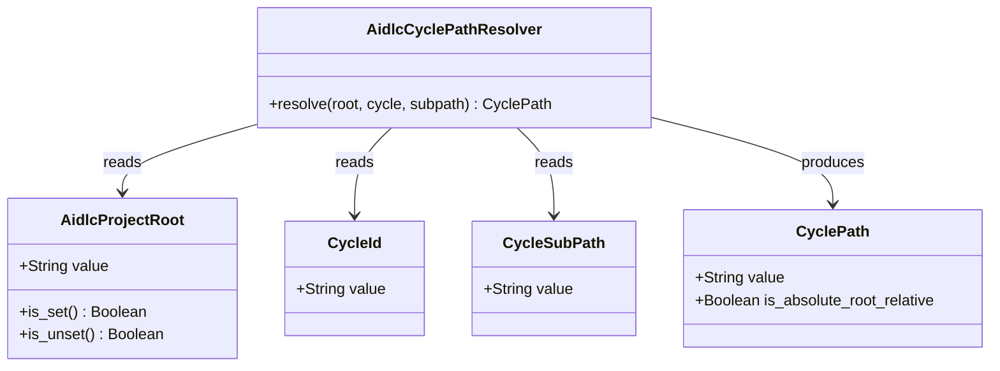

# ドメインモデル: AIDLC_PROJECT_ROOT 横断 path resolution リファクタ

## 概要

producer (`__retro_spool_path`) と consumer (`retrospective-resend.sh` / `predecessor-issue.sh`) の双方で AIDLC_PROJECT_ROOT を解釈する path 解決ロジックを単一のドメインサービス `aidlc_cycle_path` に集約する。本ドメインの責務は「サイクル相対 path の文字列生成」のみ。validation・絶対化・存在チェックは呼び出し側責務（DR-007）。

**重要**: このドメインモデル設計では**コードは書かず**、構造と責務の定義のみを行います。実装は Phase 2 で行います。

## エンティティ（Entity）

本 Unit は CLI helper のリファクタであり、永続化を伴うエンティティは存在しない。AI-DLC の `Cycle`（cycle ディレクトリ）と `RetrospectiveSpool`（spool ファイル）は既存ドメインの Entity だが、本 Unit のスコープは「これらへの path を生成する関数」に限定されるため、Entity 設計は範囲外。

## 値オブジェクト（Value Object）

### `AidlcProjectRoot`

- **属性**:
  - `value`: `String` - 環境変数 `AIDLC_PROJECT_ROOT` の値（空文字 / 未設定 / 任意の文字列）
- **不変性**: helper 関数の引数として一度参照された後は本関数内で書き換えない（呼び出し側のシェル変数の扱いには介入しない）
- **等価性**: 文字列値の完全一致（trim・正規化なし。DR-007）
- **判定述語**:
  - `is_set()`: `value` が非空のとき真
  - `is_unset()`: `value` が空文字または未設定のとき真

### `CycleId`

- **属性**:
  - `value`: `String` - サイクル識別子（例: `v2.5.2`）。バリデーションは呼び出し側責務（既存 `__retro_validate_cycle` に委譲）
- **不変性**: helper 内で書き換えない
- **等価性**: 文字列完全一致

### `CycleSubPath`

- **属性**:
  - `value`: `String` - cycle ディレクトリ配下の相対 path（例: `history/retrospective-spool.md`、`operations/retrospective.md`）
- **不変性**: helper 内で書き換えない
- **等価性**: 文字列完全一致

### `CyclePath`

- **属性**:
  - `value`: `String` - 解決済み path 文字列
  - `is_absolute_root_relative`: `Boolean`（派生）- AIDLC_PROJECT_ROOT 設定下で生成された path のとき真、未設定下で cwd 相対 path を生成したとき偽
- **不変性**: 1 度生成された値は変更されない
- **等価性**: `value` の文字列完全一致

## 集約（Aggregate）

本 Unit には集約（永続化境界 + 不変条件 + 整合性ルートを併せ持つ複合構造）は存在しない。helper は純粋関数であり、状態は持たない。

## ドメインサービス

### `AidlcCyclePathResolver`

- **責務**: `AidlcProjectRoot` / `CycleId` / `CycleSubPath` の 3 値から `CyclePath` を生成する path 解決ドメインサービス
- **操作**:
  - `resolve(root: AidlcProjectRoot, cycle: CycleId, subpath: CycleSubPath) -> CyclePath` -
    - `root.is_set()` が真 → `<root.value>/.aidlc/cycles/<cycle.value>/<subpath.value>` を生成
    - `root.is_unset()` が真 → `.aidlc/cycles/<cycle.value>/<subpath.value>` を生成（cwd 相対）
    - 文字列連結のみ。trim / 絶対化 / 存在チェックは行わない（DR-007）
- **不変条件**:
  - `INV-1`: producer/consumer が同一の `(root, cycle, subpath)` で `resolve` を呼び出した場合、必ず同一の `CyclePath.value` が返る（producer/consumer 整合性）
  - `INV-2`: 出力に対して `realpath` 等の正規化を施さない（呼び出し側の透明性確保 / 後方互換性）
  - `INV-3`: 副作用なし（純粋関数 / I/O なし）

## リポジトリインターフェース

該当なし（永続化境界が存在しない）。

## ファクトリ

該当なし（値オブジェクトのコンストラクタで足りる）。

## ドメインモデル図

## ユビキタス言語

- **AIDLC_PROJECT_ROOT**: AI-DLC を別リポで利用する際にプロジェクトルートを差し替えるための環境変数。値そのものを基準として扱い、絶対パス化・正規化を行わない（DR-007）
- **producer**: cycle path を生成する側（`__retro_spool_path` が代表）。本 Unit 後は `aidlc-paths.sh` を呼び出す
- **consumer**: cycle path を消費する側（`retrospective-resend.sh` / `predecessor-issue.sh` が代表）。本 Unit 後は同一の `aidlc-paths.sh` を呼び出す
- **producer/consumer 整合性**: 同一の `AIDLC_PROJECT_ROOT` / `cycle` / `subpath` 入力に対して、producer と consumer が必ず同一の path を返すこと（`INV-1`）
- **path resolution helper**: `aidlc-paths.sh` および本 Unit で導入する `aidlc_cycle_path` 関数の総称
- **後方互換性**: AIDLC_PROJECT_ROOT 未設定時の挙動が v2.5.1 と完全一致すること

## 不明点と質問

該当なし（DR-007 で helper 責務範囲が明確化されており、本ドメインモデルはその範囲を踏襲する）。
