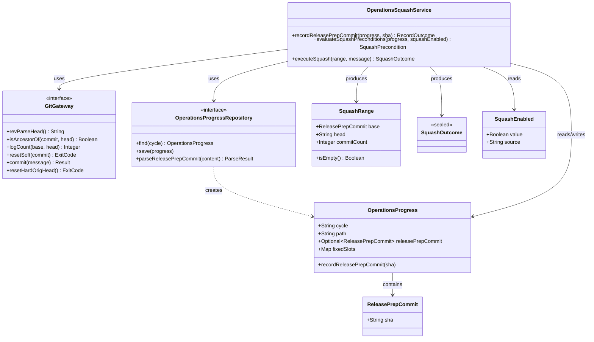

# ドメインモデル: Operations Phase 7.12 PR レビュー反映コミットの squash 統合

## 概要

Operations Phase の §7.7（最終コミット）から §7.13（PR マージ）までの間に発生する複数 round のレビュー反映コミットを 1 コミットに統合するためのドメイン。`progress.md` の独立スロット `<!-- release_prep_commit: <40 桁 SHA> -->` を起点とし、`HEAD` までの追加コミットを `git reset --soft` 方式で squash する。本ドメインの責務は「Squash 起点の永続化」と「Squash 実行 + 異常系の rollback」のみ。

**重要**: このドメインモデル設計では**コードは書かず**、構造と責務の定義のみを行います。実装は Phase 2 で行います。

## エンティティ（Entity）

### `OperationsProgress`

- **ID**: cycle 識別子（例: `v2.5.2`）に対応する `progress.md` ファイルのパス
- **属性**:
  - `cycle`: `String` - 識別子
  - `path`: `String` - `.aidlc/cycles/<cycle>/operations/progress.md` の相対 path
  - `releasePrepCommit`: `Optional<ReleasePrepCommit>` - HTML コメント形式の独立スロット値（パース済み）
  - `fixedSlots`: `Map<String, String>` - grammar v1 でパースされる既存 3 スロット（本 Unit のスコープ外、参照のみ）
- **振る舞い**:
  - `recordReleasePrepCommit(sha)`: HTML コメント形式 slot を記録 / 更新（既存行があれば更新、なければ末尾追加）。書き込みは Repository に委譲、本メソッドは整合性ルールのみ
- **不変条件**:
  - `INV-1`: `releasePrepCommit` が値を持つ場合、`^[0-9a-f]{40}$` を満たす（バリデーションは Repository の構築時に責任）
  - `INV-2`: `<!-- release_prep_commit: ... -->` 行は progress.md 内に最大 1 つ（複数あれば最初を採用）

> **設計レビュー round 1 #3 反映**: `parseReleasePrepCommit()` メソッドは **Repository 側に一本化**（`OperationsProgressRepository.parseReleasePrepCommit()`）。Entity 側からは削除し、Entity は Repository が構築した `releasePrepCommit` 値を保持・不変条件チェックする責務のみ。

## 値オブジェクト（Value Object）

### `ReleasePrepCommit`

- **属性**:
  - `sha`: `String` - 40 桁 hex SHA（`^[0-9a-f]{40}$`）
- **不変性**: 一度生成された値は変更されない（更新時は新インスタンスで置き換え）
- **等価性**: SHA 文字列の完全一致
- **判定述語**: なし（純粋な値オブジェクト / 設計レビュー round 1 #2 反映: `isAncestorOfHEAD` 等の git 実行メソッドはインフラ層 `GitGateway` の責務に移譲）

### `GitGateway`（インフラ抽象 / インターフェース）

- **責務**: git コマンド実行の薄いラッパー。ドメイン層から git 実装を隔離する
- **操作**:
  - `revParseHead() -> String`: `git rev-parse HEAD`
  - `isAncestorOf(commit, head): Boolean`: `git merge-base --is-ancestor`
  - `logCount(base, head): Integer`: `git log <base>..<head> --oneline | wc -l`
  - `resetSoft(commit): ExitCode`: `git reset --soft <commit>`
  - `commit(message): Result<String>`: `git commit -m <message>` 成功時は新 HEAD SHA
  - `resetHardOrigHead(): ExitCode`: `git reset --hard ORIG_HEAD`

### `SquashRange`

- **属性**:
  - `base`: `ReleasePrepCommit` - Squash 起点
  - `head`: `String` - 対象 HEAD SHA
  - `commitCount`: `Integer` - `git log <base>..<head>` のコミット数
- **不変性**: 1 度生成された値は変更されない
- **等価性**: `(base.sha, head)` のタプル比較
- **判定述語**:
  - `isEmpty()`: `commitCount == 0`

### `SquashOutcome`

不変な状態オブジェクト。以下のいずれかの sealed type:

| 種別 | 属性 | 意味 |
|------|------|------|
| `Success` | `newSha: String` | Squash 実行成功（新コミット SHA） |
| `Skipped` | `reason: String` | スキップ（reason は内部 log 用 / 外部シグナルは固定 `squash:skipped`） |
| `Failed` | `reason: String` (例: `format_error` / `git_op_failed:<exit_code>`) / `recoveryHint: String` | Squash 失敗（rollback 後の状態） |

- **不変性**: 1 度生成されたら変更不可
- **等価性**: 種別 + 全属性の完全一致

### `SquashEnabled`

- **属性**:
  - `value`: `Boolean` - `rules.git.squash_enabled` の値
  - `source`: `String` - 値取得元（`config:true` / `config:false` / `unset` / `read-config-failed`）
- **不変性**: 取得後は変更不可
- **等価性**: `(value, source)` のタプル比較

## 集約（Aggregate）

本 Unit には集約（永続化境界 + 不変条件 + 整合性ルートを併せ持つ複合構造）は最小限のみ存在する。

### `OperationsSquashContext`（集約ルート）

- **集約ルート**: `OperationsProgress`（progress.md ファイル）
- **含まれる要素**: `ReleasePrepCommit`（slot 値）、`SquashEnabled`（設定値）
- **境界**: 1 サイクル分の Squash 操作の整合性
- **不変条件**:
  - `INV-3`: `release_prep_commit` slot が更新された後、Squash 操作の起点はこの値で固定される（操作中の slot 変更は許可しない）
  - `INV-4`: Squash 操作中の異常時の rollback 契約は以下の通り（設計レビュー round 1 #5 反映）:
    - **`git reset --soft <base>` 失敗時**: HEAD は変更されていないため rollback 不要（作業ツリー・HEAD は元状態のまま）。即座に `SquashOutcome.Failed` を返す
    - **`git commit` 失敗時**: 直前の `reset --soft` 成功で `ORIG_HEAD` が Squash 開始前の HEAD を指している。`git reset --hard ORIG_HEAD` を実行して作業ツリー + HEAD を Squash 開始前に復旧する
    - **rollback の前提条件**: `reset --soft` 成功 AND `commit` 失敗の組み合わせのみで `reset --hard ORIG_HEAD` を実行する（条件付き実行）

## ドメインサービス

### `OperationsSquashService`

- **責務**: §7.12.5 の判定 + Squash 実行 + rollback の一連のドメインロジック
- **操作**:
  - `recordReleasePrepCommit(progress: OperationsProgress, headSha: String) -> RecordOutcome`:
    - progress.md の `release_prep_commit` slot を更新（既存値を上書き）または新規追加
    - 戻り値: `RecordOutcome.Recorded(sha)` / `RecordOutcome.Updated(sha)` / `RecordOutcome.Failed(reason)`
  - `evaluateSquashPreconditions(progress, squashEnabled) -> SquashPrecondition`:
    - 前提チェック（`squash_enabled` 値判定 / slot 取得 / 対象数判定）
    - 戻り値: `SquashPrecondition.Ready(range)` / `SquashPrecondition.Disabled` / `SquashPrecondition.Missing` / `SquashPrecondition.NoCommits` / `SquashPrecondition.FormatError`
  - `executeSquash(range: SquashRange, message: String) -> SquashOutcome`:
    - `git reset --soft <base> && git commit -m <message>` を実行
    - 失敗時 `git reset --hard ORIG_HEAD` で rollback
    - 戻り値: `SquashOutcome.Success(newSha)` / `SquashOutcome.Failed(reason, recoveryHint)`

## リポジトリインターフェース

### `OperationsProgressRepository`

- **対象集約**: `OperationsSquashContext`
- **操作**:
  - `find(cycle): OperationsProgress` - cycle から progress.md をロード（内部で `parseReleasePrepCommit` を呼ぶ）
  - `save(progress)` - HTML コメント slot 更新を反映
  - `parseReleasePrepCommit(progressFileContent) -> ParseResult` - slot 値抽出（grammar v1 とは別系統 / 2 段階判定）

#### `ParseResult`（パース結果の sealed type / 設計レビュー round 1 #4 反映）

| 種別 | 属性 | 意味 |
|------|------|------|
| `Missing` | （なし） | 行不在 OR 値空 OR コメント全不在 |
| `Found` | `commit: ReleasePrepCommit` | 40 桁 hex SHA を取得 |
| `FormatError` | `rawValue: String` | 行は存在し値も非空だが、`^[0-9a-f]{40}$` に合致しない |

**2 段階判定アルゴリズム**:

1. **行存在判定**: progress.md 内に `<!-- release_prep_commit:` プレフィックスの行が存在するか判定（コロン直後の空白有無を問わない / 空値 `<!-- release_prep_commit: -->` も「行存在」として扱う）。bash 実装例: `grep -cE '^<!-- release_prep_commit:( |$)' progress.md`（コロン後にスペース or 行末で終わる行をマッチ）
2. **値抽出 + 厳格バリデーション**:
   - 行不在 → `Missing`
   - 行存在 + 値空 (`<!-- release_prep_commit: -->` / `<!-- release_prep_commit:  -->` / コロン直後の値部分が空白のみ) → `Missing`
   - 行存在 + 値非空 + `^[0-9a-f]{40}$` 合致 → `Found(sha)`
   - 行存在 + 値非空 + 正規表現非合致 → `FormatError(rawValue)`

## ファクトリ

該当なし（値オブジェクトのコンストラクタで足りる）。

## ドメインモデル図

## ユビキタス言語

- **release_prep_commit**: §7.7（最終コミット）完了時点の commit hash。Squash 操作の起点として `progress.md` の HTML コメント形式 slot で永続化される（DR-009）
- **HTML コメント形式 slot**: `<!-- release_prep_commit: <40 桁 SHA> -->` 形式の独立スロット。grammar v1（key=value）のパース対象外で別系統の正規表現でパースする
- **Squash 起点**: `release_prep_commit` slot の値（commit SHA）
- **Squash 範囲**: `<release_prep_commit>..HEAD` の追加コミット集合
- **rollback 保証**: Squash 失敗時に `git reset --hard ORIG_HEAD` で作業ツリーが Squash 開始前の状態に戻ること（DR-008）
- **外部シグナル**: stdout に出力する状態文字列（`squash:skipped` / `squash:success:<sha>` / `squash:failed:reason=*`）。`commit-flow.md` 既存契約と整合
- **内部 reason**: stderr に `info\treason\t<value>` 形式で出力する skip 理由（外部シグナルとは別経路）

## 不明点と質問

該当なし（DR-008 / DR-009 で重要な決定が確定済）。
