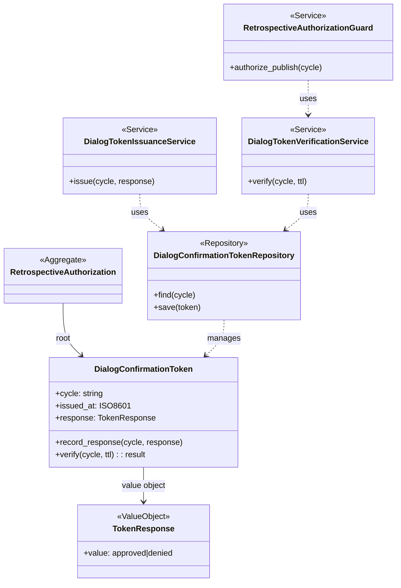

# ドメインモデル: Unit 001 振り返り対話強制ガード強化

## 概要

Operations Phase §1 振り返りステップにおける「対話必須ガード」のドメインモデル。AI エージェントの auto mode 動作下で対話を経ない振り返り Issue 起票を構造的に防止するため、**対話確認トークンの発行 / 検証 / 起票前認可**の最小モデルに縮約する。

> **モデルの抽象度**: 本 Unit は docs / steps / shell 関数追加が中心の小規模 Unit のため、DDD の集約・サービス・リポジトリ抽象は最小に留める。セッション遷移・対話フェーズ管理等は「将来拡張」セクションに分離する。

**重要**: このドメインモデル設計では**コードは書かず**、構造と責務の定義のみを行う。実装は Phase 2（コード生成ステップ）で行う。

## エンティティ（Entity）

### DialogConfirmationToken（対話確認トークン）

- **ID**: `cycle`（サイクルバージョン文字列、例: `v2.5.3`）
- **属性**:
  - `cycle`: 文字列 - サイクル識別子（許可文字: `^[A-Za-z0-9._-]+$`、`/` および `..` 禁止 / path traversal 予防）
  - `issued_at`: ISO 8601 / UTC タイムスタンプ - トークン発行時刻（AskUserQuestion 応答得た直後に書き出された時刻）
  - `response`: `TokenResponse` 値オブジェクト - ユーザーの応答結果（`approved` / `denied`）
- **振る舞い**:
  - `record_response(cycle, response)`: トークンを発行する。応答内容（approved/denied）の両方を受理し記録（実装: `retrospective_dialog_token_record_response` 関数）
  - `verify(cycle, ttl_seconds)`: トークンの有効性を検証する（鮮度・応答内容）。検証失敗時は `dialog_required` 例外（exit 4）を返す
  - `is_fresh(now, ttl_seconds)`: `now - issued_at <= ttl_seconds` で鮮度を判定
  - `is_approved()`: `response == "approved"` を判定

> **命名統一**: 関数名を `record_response` とし、approved / denied の両方を受理する責務を明示する。「mark_approved」という命名は approved のみ受理を示唆するため避ける（設計レビュー Round 1 指摘 #2 反映）。

## 値オブジェクト（Value Object）

### TokenResponse（トークン応答）

- **属性**: `value`: `approved` | `denied`
- **不変性**: 一度書き出されると上書きされるまで変更不可
- **等価性**: `value` 文字列の一致

## 集約（Aggregate）

### RetrospectiveAuthorization（振り返り起票認可）集約

- **集約ルート**: `DialogConfirmationToken`
- **含まれる要素**: `DialogConfirmationToken` + `TokenResponse`
- **境界**: 単一サイクル内の振り返り起票認可状態（`gh issue create` 直前の最終認可点）
- **不変条件**:
  - `feedback_mode` が `mirror` で `gh issue create` 副作用が発生する経路において、`DialogConfirmationToken` が存在し `is_fresh()` かつ `is_approved()` を満たすこと
  - トークンの TTL は `AIDLC_RETRO_TOKEN_TTL_SECONDS=300` 秒（環境変数で上書き可）
  - サイクルあたり 1 トークン（`cycle` を ID とするため）

## ドメインサービス

### DialogTokenIssuanceService（対話確認トークン発行サービス）

- **責務**: AskUserQuestion 応答得た直後に `DialogConfirmationToken` を発行・永続化する
- **操作**:
  - `issue(cycle, response)` - トークン書き出し（実装: `retrospective_dialog_token_record_response` 関数）

### DialogTokenVerificationService（対話確認トークン検証サービス）

- **責務**: `gh issue create` 副作用の前に `DialogConfirmationToken` を検証する
- **操作**:
  - `verify(cycle, ttl_seconds)` - トークン読み取り + 鮮度判定 + 応答判定（実装: `retrospective_dialog_token_verify` 関数）。失敗時の exit code / reason 値分類は論理設計「障害分類」セクション参照

### RetrospectiveAuthorizationGuard（振り返り起票認可ガード）

- **責務**: `gh issue create` 副作用の発生前に `DialogTokenVerificationService` を呼び出して認可を判定する
- **操作**:
  - `authorize_publish(cycle)` - 認可成功 / 失敗を判定。失敗時は副作用をブロック（実装: `retrospective_issue_create` 関数内、`gh issue create` 直前で呼び出し）

## リポジトリインターフェース

### DialogConfirmationTokenRepository

- **対象集約**: `RetrospectiveAuthorization`
- **操作**:
  - `find(cycle)` - サイクルに対応するトークン読み取り
  - `save(token)` - トークン永続化（umask 077 でユーザーのみ書き込み可）
  - `delete(cycle)` - トークン削除（後始末用 / 本 Unit 必須要件外）
- **永続化先**: ファイルシステム（`${TMPDIR:-/tmp}/aidlc-retro-confirmed-${cycle}.flag`）
- **事前条件**: `cycle` の文字種制限（`^[A-Za-z0-9._-]+$`）を満たすこと。違反時は実装側で reject（exit 1 / `error\tinvalid_cycle`）

## ファクトリ（必要な場合のみ）

不要。`DialogConfirmationToken` は `DialogTokenIssuanceService.issue()` で生成、`DialogTokenVerificationService.verify()` で読み取り、双方が単純な 2 行ファイル形式で十分。

## ドメインモデル図（最小モデル）

## 将来拡張（本 Unit スコープ外）

以下の要素は本 Unit のスコープ外とし、必要時に別 Unit で拡張する:

- **RetrospectiveDialogSession**: feedback_mode / automation_mode / current_phase 等を集約するセッションエンティティ。複数フェーズ間での状態遷移管理が必要になった場合に追加
- **DialogPhase**: KPT_collection / root_cause_classification / storage_selection / mirror_decision / publish_authorization の対話フェーズ列挙
- **DialogTopic**: 確認済みトピック集合の管理
- **AbstractOperation**: `retrospective_publish` / `retrospective_state_mutation` / `dialog_bypass` の抽象操作値オブジェクト（手順記述レベルでは計画ファイル「実装マッピング表」で扱う）
- **複数経路への verify 適用**: `retrospective_update_hook`（`gh issue edit`）/ Step 5 mirror フロー（`retrospective-mirror.sh send`）等への verify 拡張

## ユビキタス言語

- **対話必須（Dialog Required）**: 振り返りの判断要素（KPT / 主因切り分け / 格納先 / mirror 送信 / 起票）について、AI エージェントの auto mode に関わらずユーザー対話を経て決定すべき性質
- **対話バイパス（Dialog Bypass）**: AskUserQuestion 応答を経ずに `retrospective publish` 系副作用を実行する経路（禁止対象 / 計画ファイル抽象操作レベル禁止表参照）
- **対話確認トークン（Dialog Confirmation Token）**: ユーザーが AskUserQuestion で起票実行を承認 / 拒否したことを示す短命の証跡。ファイルシステム上の TTL 付きファイル形式で実装
- **起票前認可（Pre-Publish Authorization）**: `gh issue create` 副作用の発生直前に対話確認トークンを検証する仕組み（実行時ガード本体）
- **責務分離原則（Separation of Concerns Principle）**: 規範（SoT）= SKILL.md / 手順 = 04-completion.md / 実行時ガード = retrospective-issue.sh / 検証例 = fixture という 4 レイヤの責務分離

## 不明点と質問（設計中に記録）

[Question] DDD モデルとして集約・リポジトリまで定義する必要があるか

[Answer] Unit 001 の実装は実質「shell 関数 2 つ追加 + retrospective_issue_create に組み込み」で完結する小規模改修。DDD の本格適用は過剰だが、既存テンプレート（domain_model_template.md）に準拠し最小要素のみ定義する方針とした（設計レビュー Round 1 指摘 #4 反映で縮約済み）。将来拡張として複数経路への verify 適用が必要になった際に再評価する。

[Question] cycle の文字種制限の根拠

[Answer] `cycle` 文字列は `${TMPDIR:-/tmp}/aidlc-retro-confirmed-${cycle}.flag` のファイル名構築に使用される。Path traversal 予防のため、許可文字を `^[A-Za-z0-9._-]+$` に限定し、`/` および `..` を含む値は reject する。AI-DLC のサイクル命名規則（`v<major>.<minor>.<patch>`）はこの制限を満たすため、運用上の影響なし（設計レビュー Round 1 指摘 #3 反映）。

[Question] approved / denied 両方を扱う関数命名の妥当性

[Answer] 当初 `mark_approved` という命名を検討したが、approved のみ受理を示唆する命名と「denied も受理する」契約が不整合（設計レビュー Round 1 指摘 #2）。`record_response` という中立命名に変更し、関数の責務を「ユーザー応答の記録」と明示する。`record_response` は approved / denied の両方を引数として受け取り、`verify` 側で `is_approved()` を判定する責務分離となる。
