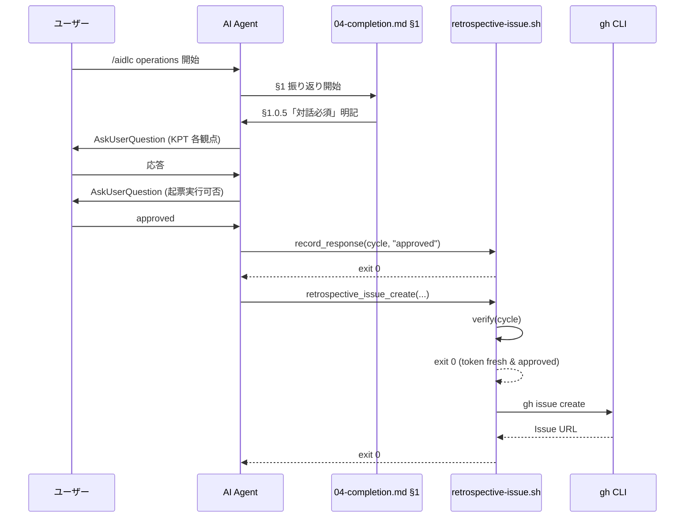

# 論理設計: Unit 001 振り返り対話強制ガード強化

## 概要

Operations Phase §1 振り返り対話強制ガード強化の論理設計。文書ガード（規範=SKILL.md / 手順=04-completion.md）と実行時ガード（retrospective-issue.sh）の二段防御構造、および検証例（fixture）を 4 レイヤに分離した責務構造で定義する。

**重要**: この論理設計では**コードは書かず**、コンポーネント構成とインターフェース定義のみを行う。具体的なコード（実装スクリプト、テスト記述等）は Phase 2（コード生成ステップ）で作成する。

## アーキテクチャパターン

**4 レイヤ責務分離パターン**: 規範（SoT）/ 手順 / 実行時ガード / 検証例 の 4 層に責務を分離し、SoT 一元化と実装詳細隠蔽を両立する。

選定理由:
- 文書ガードのみではバイパス可能性が残り（Codex Round 1 指摘 #1）、実行時ガードの追加が必要
- 規範・手順・実行時ガード・検証例が分散すると SoT が不明確化（Codex Round 1 指摘 #2）するため、責務分離を明文化
- 実装詳細（コマンド名）への過結合を避けるため抽象操作レベルの記述と実装マッピング表を分離（Codex Round 1 指摘 #3）

## feedback_mode / target 別の verify 呼出真理表【設計レビュー Round 1 指摘 #1 / コードレビュー Round 1 指摘 #2 反映】

`feedback_mode` および内部解決される `target` 別に `retrospective_issue_create` 呼出 / `gh issue create` 副作用 / verify 検証実行の関係を統一する。設計成果物・計画ファイル・実装手順は本表を SoT として参照する。

`feedback_mode` から `target` への解決は `__retro_resolve_target` 関数が担う。代表的なマッピング: `disabled` → `none` / `silent` → `none`（→ `retrospective_issue_create` は target=none で early return） / `mirror-only` → `mirror` / `local-only` → `local` / `local-and-mirror` → `both` / `interactive` → wizard 解決後 `none` / `mirror` / `local` / `both` のいずれか。

| feedback_mode | __retro_resolve_target | retrospective_issue_create 呼出 | target=none early return | gh issue create 副作用 | verify 呼出 | record_response 呼出 |
|---|---|---|---|---|---|---|
| `disabled` | `none` | あり（即時 early return） | あり | なし | なし（early return 後）| なし |
| `silent` | `none` | あり（即時 early return） | あり | なし | なし | なし |
| `mirror-only` | `mirror` | あり | なし | あり（mirror リポへ）| あり（gh issue create 直前で必須）| あり |
| `local-only` | `local` | あり | なし | あり（local リポへ）| あり（gh issue create 直前で必須）| あり |
| `local-and-mirror` | `both` | あり | なし | あり（local + mirror 両方）| あり（gh issue create 直前で必須）| あり |
| `interactive`（wizard 解決後 mirror/local/both） | `mirror` / `local` / `both` | あり | なし | あり | あり | あり |

> **設計判断**: verify は **`target != none` のすべての経路** で `gh issue create` 直前に実装する。`disabled` / `silent` は target=none で early return するため verify 到達なし。`local` / `mirror` / `both` のいずれの target でも対話確認トークンが必須となる（対話必須ガードは「振り返り Issue 起票全般」に適用される設計）。
>
> **target=local のみのケースも verify 必須とする根拠**: 「振り返り内容を外部システム（GitHub Issue）に永続化する副作用」は local リポへの起票も含む（mirror リポと local リポは外部 GitHub という観点で同等）。Layer 2「抽象操作レベルの禁止対象」テーブルの `retrospective publish` も local / mirror を区別しない。
>
> **後方互換性**: `silent` / `disabled` 経路は完全互換（target=none early return）。`mirror` / `local` / `both` 経路は対話確認トークン未発行時 exit 4 で fail（破壊的変更だが、AI-DLC 内の唯一の正規呼び出し経路 §1.5 Step 4 が改修により発行手順を追加するため運用影響なし）。`retrospective-resend.sh` は `AIDLC_RETRO_RESEND_INTERNAL_BYPASS=1` + `AIDLC_RETRO_FORCE_TARGET` 併設条件で verify を bypass する内部 sentinel を提供する（resend は過去の対話を経た起票試行の再送のため）。
>
> **将来拡張**: Step 5 mirror フロー（`retrospective-mirror.sh send`）/ `retrospective_update_hook`（`gh issue edit`）等への verify 拡張は次サイクル候補（ドメインモデル「将来拡張」セクション参照）。

## コンポーネント構成

### レイヤー / モジュール構成

```text
Unit 001 振り返り対話強制ガード強化
├── Layer 1: 規範（SoT）
│   └── skills/aidlc/SKILL.md「AskUserQuestion 使用ルール」節
│       ├── インタラクション種別と対応方法テーブル（既存 + 「振り返り内容の決定」行追加）
│       ├── auto mode 適用外の補足
│       └── Operations §1 への参照リンク
├── Layer 2: 手順
│   └── skills/aidlc/steps/operations/04-completion.md §1
│       ├── §1.0 feedback_mode テーブル + 「silent でも対話必須」補足（追加）
│       ├── §1.0.5 対話必須ガード節（新設）
│       │   ├── SoT への参照リンク（SKILL.md）
│       │   ├── 禁止事項リスト（抽象操作レベル）
│       │   ├── 必須事項リスト
│       │   └── 抽象操作レベル禁止表 + 実装マッピング表
│       └── §1.5 Step 4 直前の AskUserQuestion + retrospective_dialog_token_record_response 呼出記述（追加）
├── Layer 3: 実行時ガード
│   └── skills/aidlc/scripts/lib/retrospective-issue.sh
│       ├── 定数 AIDLC_RETRO_TOKEN_TTL_SECONDS（新規）
│       ├── retrospective_dialog_token_record_response 関数（新規 / 発行）
│       ├── retrospective_dialog_token_verify 関数（新規 / 検証）
│       └── retrospective_issue_create 関数（既存 + verify 呼出組み込み）
└── Layer 4: 検証例
    └── .aidlc/cycles/v2.5.3/construction/fixtures/operations-mirror-autodialog.md
        ├── 正常パターン例（対話 → トークン書出 → 起票成功）
        ├── アンチパターン例（auto mode 独断 → トークン未書出 → exit 4 ブロック）
        └── ガード文言予防ポイント解説
```

### コンポーネント詳細

#### Layer 1: SKILL.md「AskUserQuestion 使用ルール」節（規範 / SoT）

- **責務**: 対話分類の正本定義。全 AI-DLC スキル / steps が参照する規範
- **依存**: なし（ルートレベルの規範）
- **公開インターフェース**:
  - 「インタラクション種別と対応方法」テーブル（マークダウン形式）
  - auto mode 適用外の補足文
  - Operations §1 へのリンク参照

#### Layer 2: 04-completion.md §1（手順）

- **責務**: Operations Phase §1 振り返りの実行手順。Layer 1 の SoT を参照する形で対話必須を実体化
- **依存**: Layer 1（SKILL.md）への参照リンク、Layer 3（retrospective-issue.sh）の関数呼出
- **公開インターフェース**:
  - §1.0.5 節の手順記述（禁止事項 + 必須事項リスト）
  - §1.5 Step 4 直前の `retrospective_dialog_token_record_response` 呼出契約
  - 抽象操作レベル禁止表 + 実装マッピング表

#### Layer 3: retrospective-issue.sh（実行時ガード）

- **責務**: 文書ガードのバイパス防止。発行・検証・既存起票関数への組み込みを単一ファイルに集約（凝集度確保）
- **依存**: 既存 helper（`feedback-mode.sh` 等）、bash 4+ / `stat` または `date -r` 標準コマンド
- **公開インターフェース**:
  - `retrospective_dialog_token_record_response(cycle, response)` 関数（新規）
  - `retrospective_dialog_token_verify(cycle)` 関数（新規）
  - `retrospective_issue_create(...)` 関数（既存 + verify 組み込み）

#### Layer 4: operations-mirror-autodialog.md（検証例 / fixture）

- **責務**: ガード文言が予防すべき具体パターンを正常 / アンチの両側で例示
- **依存**: Layer 1〜3 を参照する読み物
- **公開インターフェース**:
  - 正常パターン例（手順実行記録）
  - アンチパターン例（jailrun #70 再現と exit 4 阻止の解説）
  - ガード文言の予防ポイント

## インターフェース設計

### コマンド（シェル関数）

#### `retrospective_dialog_token_record_response`

- **パラメータ**:
  - `$1` (cycle): 文字列、必須 - サイクルバージョン（例: `v2.5.3`、許可文字: `^[A-Za-z0-9._-]+$`）
  - `$2` (response): 文字列、必須 - `approved` または `denied`（両方を受理）
- **事前条件**:
  - `cycle` が許可文字パターンに一致すること（`/` および `..` 含まないこと）
  - `response` が `approved` / `denied` のいずれかであること
- **戻り値（exit code）**:
  - 0: 成功
  - 1: 引数不正（`invalid_cycle` / `invalid_response` / `missing_args`）
  - 2: ファイル書き込み失敗（`write_failed`）
- **副作用**: `${TMPDIR:-/tmp}/aidlc-retro-confirmed-${cycle}.flag` ファイルに 2 行（タイムスタンプ + response）を書き出す（umask 077）
- **stderr 出力（exit code 非 0 時）**:
  - `error\tinvalid_cycle\t<value>` (exit 1)
  - `error\tinvalid_response\t<value>` (exit 1)
  - `error\tmissing_args\tcycle and response required` (exit 1)
  - `error\twrite_failed\t<path>` (exit 2)

#### `retrospective_dialog_token_verify`

- **パラメータ**:
  - `$1` (cycle): 文字列、必須 - サイクルバージョン
- **事前条件**:
  - `cycle` が許可文字パターンに一致すること
- **戻り値（exit code）**:
  - 0: 検証成功（トークン存在 + 鮮度内 + `approved`）
  - 1: 引数不正（`invalid_cycle` / `missing_args`）
  - 4: 業務拒否または I/O 異常（**起票ブロックの統一 exit code**、reason 値で詳細分類）
- **副作用**: なし（読み取り専用）
- **stderr 出力（exit 4 時）**: `error\t<reason>\t[<detail>]` の TSV 1 行
  - 業務拒否系（reason 値）:
    - `dialog_required\ttoken_missing`: トークンファイル不在
    - `dialog_required\ttoken_stale\t<age_seconds>`: TTL 切れ
    - `dialog_required\ttoken_denied`: response が `denied`
  - I/O 異常系（reason 値）:
    - `dialog_required\ttoken_io_error\t<errno_or_msg>`: トークンファイル読み取り失敗
    - `dialog_required\ttoken_parse_error\t<line_or_field>`: ファイル形式不正（行数不足 / タイムスタンプ解釈失敗 / response 値不正等）

> **障害分類の設計判断**（設計レビュー Round 1 指摘 #5 反映）: 業務拒否（`token_missing` / `token_stale` / `token_denied`）と I/O 異常（`token_io_error` / `token_parse_error`）は **どちらも起票ブロックという観点で同等** のため exit code 4 に統一する。呼び出し元での分岐が必要な場合は stderr の reason 値で判定。詳細分類により呼び出し元のリカバリ戦略の実装余地を残す（例: `token_io_error` は再発時に retry を試みる、`token_denied` は明示的なユーザー拒否として再対話を即時要求等）。

#### `retrospective_issue_create`（既存改修）

- **パラメータ**: 既存（変更なし）
- **戻り値**: 既存（exit 0/1/2）+ exit 4（新規 / 対話確認トークン検証失敗）
- **副作用変更点**: `gh issue create` 直前に `retrospective_dialog_token_verify "$cycle"` を呼び出し、exit 4 時は起票せず exit 4 で終了

### 設定値（環境変数）

#### `AIDLC_RETRO_TOKEN_TTL_SECONDS`

- **デフォルト**: `300`（5 分）
- **意味**: 対話確認トークンの鮮度上限（秒）
- **設定方法**: 環境変数で上書き可能（例: `AIDLC_RETRO_TOKEN_TTL_SECONDS=600 retrospective_issue_create ...`）

## スクリプトインターフェース設計

### `skills/aidlc/scripts/lib/retrospective-issue.sh`（既存ファイルへの追加）

#### 概要

振り返り Issue 起票関数群を提供する共有ライブラリ。Unit 001 で対話確認トークンの発行 / 検証 / 起票関数への組み込みを追加する。

#### 追加関数 1: `retrospective_dialog_token_record_response`

- **引数**:
  - `cycle`（必須 / 第 1 引数）: サイクル文字列（許可文字: `^[A-Za-z0-9._-]+$`）
  - `response`（必須 / 第 2 引数）: `approved` または `denied`
- **使用例**:
  ```bash
  retrospective_dialog_token_record_response "v2.5.3" "approved"
  ```

#### 追加関数 2: `retrospective_dialog_token_verify`

- **引数**:
  - `cycle`（必須 / 第 1 引数）: サイクル文字列（許可文字: `^[A-Za-z0-9._-]+$`）
- **使用例**:
  ```bash
  retrospective_dialog_token_verify "v2.5.3" || exit $?
  ```

#### 既存関数改修: `retrospective_issue_create`

- **改修箇所**: `gh issue create` 呼出の直前に以下を追加
  ```bash
  retrospective_dialog_token_verify "$cycle" || return 4
  ```
- **後方互換性**: 上記「feedback_mode 別の verify 呼出真理表」参照

## データモデル概要

### ファイル形式: 対話確認トークンファイル

- **形式**: プレーンテキスト 2 行
- **パス**: `${TMPDIR:-/tmp}/aidlc-retro-confirmed-${cycle}.flag`
- **行 1**: ISO 8601 / UTC タイムスタンプ（例: `2026-05-07T05:30:00Z`）
- **行 2**: `approved` または `denied`
- **権限**: umask 077 適用後の 0600（ユーザーのみ読み書き可）
- **`cycle` 文字種制限**: `^[A-Za-z0-9._-]+$` のみ許可、`/` および `..` 禁止（path traversal 予防 / 設計レビュー Round 1 指摘 #3）

### マークダウンドキュメント変更点

- **SKILL.md「AskUserQuestion 使用ルール」テーブル**: 既存 3 行 → 4 行（「振り返り内容の決定」行追加）
- **04-completion.md §1.0**: feedback_mode テーブル直後に補足 1 段落追加
- **04-completion.md §1.0.5**: 新節（禁止事項 + 必須事項 + 禁止表 + マッピング表）約 30〜50 行
- **04-completion.md §1.5 Step 4**: 直前に AskUserQuestion + 関数呼出記述 追加（約 5〜10 行）

## 処理フロー概要

### ユースケース 1: 正常系（mirror モード / 対話を経た振り返り起票）

**前提**: `feedback_mode=mirror`

**ステップ**:
1. ユーザーが §1.1 KPT 観点を 1 項目ずつ AskUserQuestion で確認
2. ユーザーが §1.2 主因切り分けを AskUserQuestion で確認
3. ユーザーが §1.3 格納先選択を AskUserQuestion で確認
4. §1.5 Step 4 で AI agent が「この内容で Issue を起票してよいか」を AskUserQuestion で確認 → 応答 `approved`
5. AI agent が `retrospective_dialog_token_record_response "v2.5.3" "approved"` を呼び出し → exit 0
6. AI agent が `retrospective_issue_create ...` を呼び出し
7. `retrospective_issue_create` 内部で `retrospective_dialog_token_verify "v2.5.3"` が exit 0（成功）
8. `gh issue create` が実行されて Issue 起票成功

**関与するコンポーネント**: Layer 2（04-completion.md §1）、Layer 3（retrospective-issue.sh）

### ユースケース 2: 異常系（auto mode 独断起票の阻止）

**前提**: `feedback_mode=mirror`、AI agent auto mode

**ステップ**:
1. AI agent（auto mode）が §1.1〜§1.4 を独断で進行（AskUserQuestion 呼び出さず）
2. AI agent が `retrospective_issue_create ...` を直接呼び出し（`record_response` も未呼出）
3. `retrospective_issue_create` 内部で `retrospective_dialog_token_verify "v2.5.3"` が exit 4 / reason=`token_missing` で fail
4. `gh issue create` は実行されず、`error\tdialog_required\ttoken_missing` を stderr に出力
5. AI agent は exit 4 を受けて `gh issue create` 副作用を発生させない

**関与するコンポーネント**: Layer 3（retrospective-issue.sh）



### ユースケース 3: TTL 切れ（長時間放置後の保護）

**前提**: `feedback_mode=mirror`

**ステップ**:
1. ユーザーが起票確認 AskUserQuestion で `approved` 応答
2. `retrospective_dialog_token_record_response` で書き出し
3. AI agent が他作業で 600 秒（10 分）以上経過
4. AI agent が `retrospective_issue_create` を呼び出し
5. `retrospective_dialog_token_verify` で TTL 切れ判定 → exit 4 / reason=`token_stale`
6. `gh issue create` 実行されず、AI agent は再対話を実施

**関与するコンポーネント**: Layer 3（retrospective-issue.sh）

### ユースケース 4: I/O 異常（ファイル破損 / 解釈失敗）

**前提**: `feedback_mode=mirror`、トークンファイルが何らかの理由で破損

**ステップ**:
1. ユーザーが起票確認後、トークンファイルが第三者プロセス / OS 障害等で破損
2. AI agent が `retrospective_issue_create` を呼び出し
3. `retrospective_dialog_token_verify` がファイル読み取り失敗または形式不正を検出
   - 読み取り失敗 → exit 4 / reason=`token_io_error`
   - 形式不正（行数不足 / タイムスタンプ解釈失敗 / response 値不正） → exit 4 / reason=`token_parse_error`
4. `gh issue create` 実行されず、AI agent は再対話 + 再書出を実施（再 record_response 呼出）

**関与するコンポーネント**: Layer 3（retrospective-issue.sh）

### ユースケース 5: silent モード（対話あり / 起票なし）

**前提**: `feedback_mode=silent`

**ステップ**:
1. ユーザーが §1.1〜§1.4 を AskUserQuestion で確認（対話必須は silent でも維持）
2. §1.5 実施（ローカル記録のみ）
3. `retrospective_issue_create` 呼出されるが、内部分岐で `gh issue create` を実行しない
4. verify 呼出は `gh issue create` 直前のため到達せず（影響なし）
5. ローカル記録完了

**関与するコンポーネント**: Layer 2（04-completion.md §1）、Layer 3（retrospective-issue.sh / verify 不到達）

## 非機能要件（NFR）への対応

### パフォーマンス

- **要件**: ランタイム性能影響なし（Unit 定義 NFR より）
- **対応策**: トークン検証は `stat` または `date -r` + 文字列比較のみで O(1)。`retrospective_issue_create` 呼出 1 回あたり数ミリ秒程度の追加コスト。手順改訂部分はランタイムに直接影響なし

### セキュリティ

- **要件**: 機密情報マスクポリシー維持（Unit 定義 NFR より）
- **対応策**:
  - トークンファイルは `${TMPDIR:-/tmp}` 配下、umask 077 適用で 0600 権限
  - トークン内容にサイクル名以外の機密情報を含めない（タイムスタンプ + `approved`/`denied` のみ）
  - `cycle` 文字種制限（`^[A-Za-z0-9._-]+$`）で path traversal 予防（設計レビュー Round 1 指摘 #3）
  - 既存の機密情報マスクポリシー（review-flow.md 参照）を維持

### スケーラビリティ

- **要件**: 影響なし（Unit 定義 NFR より）
- **対応策**: サイクルあたり 1 トークン、ファイルシステム書き込み 1 回。スケーラビリティ問題なし

### 可用性

- **要件**: 影響なし（Unit 定義 NFR より）
- **対応策**:
  - トークン検証失敗時は exit 4 で明確にブロック（誤った起票成功扱いを避ける）
  - I/O 異常 / 業務拒否を reason 値で詳細分類し、呼び出し元のリカバリ余地を確保
  - 既存の `feedback_mode=silent` / `mirror` 正常 / `disabled` 経路は破壊しない

## 技術選定

- **言語**: bash 4+（既存 `retrospective-issue.sh` と同じ）
- **フレームワーク**: なし（標準 bash 関数）
- **ライブラリ**: なし（`stat` / `date` / `mkdir` / 標準コマンドのみ、BSD/GNU 差異対応は `date -r <file> +%s` で portable に統一）
- **データベース**: ファイルシステム（`${TMPDIR:-/tmp}`）

## 実装上の注意事項

### セキュリティ上の注意点

- トークンファイルの権限を 0600 に設定（umask 077）し、他ユーザーからの読み取りを防止
- トークン内容には機密情報（API トークン / パスワード等）を絶対に含めない
- `cycle` 文字種制限により path traversal を予防（許可文字: `^[A-Za-z0-9._-]+$`）。違反値は exit 1 / `invalid_cycle` で reject
- マルチユーザー環境で `${TMPDIR}` が共有される場合、ファイル名にユーザー識別子を含めるか別途検討（本 Unit ではシングルユーザー前提でスコープ外）

### パフォーマンス上の注意点

- BSD / GNU `stat` のプラットフォーム差異を避けるため、`date -r <file> +%s` を採用（より portable）
- TTL 計算は秒単位の整数演算で十分

### 保守性・拡張性に関する注意点

- 抽象操作レベル（`retrospective_publish` / `retrospective_state_mutation` / `dialog_bypass`）と具体実装（`gh issue create` 等）を計画ファイルおよび 04-completion.md §1.0.5 の「実装マッピング表」で明示分離。将来の実装変更時は表のみを更新
- `retrospective-issue.sh` への発行 / 検証関数集約により、トークンスキーマ変更時の影響範囲を 1 ファイルに閉じる
- 後続 Unit 003 / 004 の計画への申し送り事項は計画ファイルで受け入れ条件 ID（`AC-U003-RETRO-GUARD-IMMUTABLE-1〜3` / `AC-U004-RETRO-GUARD-IMMUTABLE-1〜2`）として固定。統合レビューで回帰チェック

### 既存テストへの影響

- `bin/tests/` および `tests/` 配下に `retrospective_issue_create` を呼び出す BATS テストがある場合、対話確認トークンファイルの事前生成（`retrospective_dialog_token_record_response` 呼び出し）を `setup` フェーズに追加する必要あり
- Phase 2 ステップ 5 で grep + 補修を実施。検出されない場合は履歴に「該当テスト未検出」と明記

## 不明点と質問（設計中に記録）

[Question] BSD / GNU `stat` のプラットフォーム差異の取り扱い

[Answer] `date -r <file> +%s` を採用することで BSD / GNU 両対応する（より portable）。`stat -c '%Y'` / `stat -f '%m'` のフォールバックパターンも同等だが、`date -r` の方が 1 行で済むため実装簡素化のため優先。実装時に動作確認を行う。

[Question] `retrospective_issue_create` 呼び出し側の既存契約への影響

[Answer] 既存呼び出し側で対話確認トークンを発行していない経路は exit 4 で fail する破壊的変更となる。ただし AI-DLC 内の唯一の正規呼び出し経路は 04-completion.md §1.5 Step 4 のみで、本 Unit で同箇所を改修して発行手順を追加するため、AI-DLC 内では問題なし。外部スクリプト / プロジェクトが直接 `retrospective_issue_create` を呼び出すケースは `feedback_mode=disabled` 設定で回避可能、または対話確認トークンファイルを事前生成する運用で対応可能。後方互換性破壊は受容範囲（本 Unit はガード強化が目的）。

[Question] 統合レビュー回帰チェックの実施タイミング

[Answer] 統合レビューは `reviewing-construction-integration` スキルが Phase 2 完了後に実行。本 Unit 完了時の統合レビュー、および後続 Unit 003 / Unit 004 完了時の統合レビューで `AC-U*-RETRO-GUARD-IMMUTABLE-*` の 5 受け入れ条件を回帰チェックする。具体的には:
- §1.0.5 の禁止/必須事項リスト + 抽象操作レベル禁止表 + 実装マッピング表が `04-completion.md` に存在すること
- §1.5 Step 4 直前に `retrospective_dialog_token_record_response` 呼出記述が存在すること
- `retrospective_dialog_token_verify` 関数が `retrospective-issue.sh` に存在し、`retrospective_issue_create` から呼び出されていること
- 上記 5 条件の grep / コードリファレンスチェックを行う

[Question] verify が `silent` モードで呼ばれない事の妥当性

[Answer] `silent` モードでは `retrospective_issue_create` が内部分岐で `gh issue create` を実行しないため、verify は到達不要。verify を `gh issue create` 直前にのみ実装することで「外部副作用ブロック」と「内部処理通過」を分離できる。`silent` モードでもローカル記録は対話を経て確定する手順記述（§1.0.5 必須事項リスト）でガードする。これは「文書ガードと実行時ガードの責務分離」原則と整合（実行時ガードは外部副作用境界のみ）。
