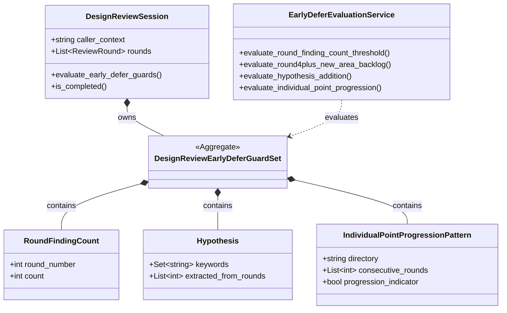

# ドメインモデル: Unit 003 — 設計レビュー特化の早期 defer ガイド

## 概要

設計レビュー（Construction Phase の `reviewing-construction-design` フェーズ）における **早期 defer 判断** を支援するドメインモデル。Round 別指摘件数 / 設計仮説の根本見直し / 議論個別点漸進パターンを概念として定義し、5R 到達前にユーザー判断を促す。

**重要**: このドメインモデル設計では **コードは書かず**、`skills/aidlc/steps/common/review-flow.md` に追記する自然言語ガイドの構造と責務の定義のみを行う。実装は Phase 2（review-flow.md 改訂）で行う。

## 適用範囲ガード

本ドメインモデルが定義する概念は **すべて Construction Phase の設計レビュー（`reviewing-construction-design`）にのみ適用** される。Inception / Operations / Construction コードレビュー / 統合レビューには副次的に適用しない。

### caller_context との対応（不変条件として固定 / Round 1 review 指摘 #4 反映）

本ドメインモデルでは新規 enum を導入せず、既存 SoT である `skills/aidlc/steps/common/review-routing.md` §3「CallerContext マッピング」テーブルの `caller_context` 列を直接参照する。本ガイドの適用判定は以下の対応表を不変条件として固定する:

| caller_context（既存 SoT） | 本ガイド適用 |
|---------------------------|-------------|
| `設計レビュー` | **適用** |
| `計画承認前` | 非適用 |
| `コード生成後` | 非適用 |
| `統合とレビュー` | 非適用 |
| `Intent 承認前` | 非適用 |
| `ストーリー承認前` | 非適用 |
| `Unit 定義承認前` | 非適用 |
| `デプロイ計画承認前` | 非適用 |
| `PR マージ前` | 非適用 |

`caller_context` 列の文言が将来変更された場合は同 PR 内で本対応表を改訂する（変更連動ルール）。

## エンティティ（Entity）

### DesignReviewSession

既存 `ReviewSession`（review-flow.md「完了条件の判定単一仕様」で定義）の **subtype** として概念整理する。データ構造の追加なし、属性追加なし。あくまで「`caller_context = 設計レビュー` の ReviewSession に対して、本ガイドの早期 defer ガード群が適用される」という適用範囲の表明として位置づける。

- **ID**: 既存 `ReviewSession` の識別（caller_context + Unit 番号 + Round 配列）
- **属性**:
  - `caller_context`: `string` - 既存 review-routing.md §3 で定義された値を参照（本ガイド適用判定は「適用範囲ガード § caller_context との対応」を参照）
  - `rounds`: `List<ReviewRound>` - 既存定義（review-flow.md）と同一
- **振る舞い**:
  - `evaluate_early_defer_guards()`: 各 Round 完了時（**完了条件判定直後**）に 4 系統ガード（**Round 別指摘件数閾値** / 既存 Round 4+ 新領域 backlog 化 / 新規仮説追加 / 議論個別点漸進）を評価し、該当時にユーザー判断を促す（自然言語手順、AI レビュワー / メインエージェントが実施）
  - `is_completed()`: 既存 `ReviewSession.is_completed()` を継承（`last_round_clean` ベース）。**本ガイドは完了条件の置き換えではなく、5R 到達前の予兆検出として機能する**

## 値オブジェクト（Value Object）

> **注**: 既存 SoT `caller_context`（review-routing.md §3）を直接参照する方針（Round 1 review 指摘 #4 反映）のため、`Phase` enum の新規導入は行わない。本ガイドの適用判定は「適用範囲ガード § caller_context との対応」テーブルを不変条件として固定する。

### RoundFindingCount

各 Round における指摘総件数を表す。早期 defer ガイドの数値閾値判定の入力。

- **属性**:
  - `round_number`: `int` - 1〜5
  - `count`: `int` - 当該 Round の指摘総件数（重要度問わず、全件カウント）
- **不変性**: Round 終了時に確定し、以降変更不可
- **等価性**: `round_number` の一致で同一視

### Hypothesis

設計仮説（指摘対象キーワード集合）を表す。新規仮説追加検出（Round 4 以降）の入力。

- **属性**:
  - `keywords`: `Set<string>` - 指摘対象から抽出した語彙集合（H_old / H_new の各メンバーは本値オブジェクトのインスタンス）
  - `extracted_from_rounds`: `List<int>` - 抽出元 Round 番号のリスト（H_old は `[1, 2, 3]`、H_new は `[4, 5]` など）
- **不変性**: 抽出処理完了後は変更不可
- **等価性**: `keywords` 集合の同一性（順序は問わない）
- **語彙境界**（review-flow.md 改訂時に定義する自然言語ルール、本ドメインモデルでは概念のみ表現）:
  - 含む: ドメインモデル要素名（エンティティ / 値オブジェクト / 集約 / ドメインイベント）、責務境界用語（責務 / 境界 / 役割 / レイヤ）、追加削除動詞（追加 / 削除 / 統合 / 分離）、アーキテクチャ用語（依存方向 / インターフェース / 抽象化）
  - 含まない: 形容詞、副詞、一般的な修正動詞（直す / 変える 等）

### IndividualPointProgressionPattern

議論個別点漸進パターン（連続 round で同一ディレクトリ内重複 + 修正範囲漸進）を表す。

- **属性**:
  - `directory`: `string` - 連続 round で重複した指摘対象ディレクトリ（領域キー正規化前のパス、例: `design-artifacts/logical-designs/`）
  - `consecutive_rounds`: `List<int>` - 連続して当該ディレクトリ内指摘が発生した Round 番号
  - `progression_indicator`: `bool` - 修正範囲が漸進的に拡大しているか（true なら警告対象）
- **不変性**: 検出時点で確定
- **等価性**: `directory` + `consecutive_rounds` の組合せで同一視

## 集約（Aggregate）

### DesignReviewEarlyDeferGuardSet

DesignReviewSession に紐づく早期 defer ガード群のまとまり。**4 系統ガード**（Round 1 review 指摘 #2 反映）を 1 集約として束ね、判定順序・排他/併記ルールを保証する:

1. Round 別指摘件数閾値（Round 3 ≥ 5 件 / Round 4 ≥ 3 件）— `RoundFindingCount` を入力
2. 既存 Round 4+ 新領域 backlog 化（パス領域、機械判定）— review-flow.md 既存フローを呼び出し
3. 新規仮説追加検出（設計仮説、自然言語）— `Hypothesis` を入力
4. 議論個別点漸進パターン検出（自然言語）— `IndividualPointProgressionPattern` を入力

- **集約ルート**: `DesignReviewSession`
- **含まれる要素**:
  - `RoundFindingCount`（各 Round 1 件、最大 5 件）
  - `Hypothesis`（H_old: 1 件、H_new: 1 件、Round 4 以降に発生）
  - `IndividualPointProgressionPattern`（複数件、連続 round で検出）
- **境界**: 1 つの DesignReviewSession に閉じる（他 session との相互参照なし）
- **不変条件**:
  - **適用範囲不変条件**: `caller_context = 設計レビュー` の DesignReviewSession にのみ本集約は存在する。他 caller_context では空集合
  - **判定順序の一貫性（4 系統）**: ガードの判定順序は常に「1. Round 別指摘件数閾値 → 2. 既存 Round 4+ 新領域 backlog 化（review-flow.md 既存フロー） → 3. 設計仮説追加検出 → 4. 議論個別点漸進パターン検出」で固定。順序変更は不変条件違反
  - **発火タイミング**: 各 Round の `is_completed()` 判定直後に本集約を評価する（既存「指摘対応判断フロー」は 5R 後 unresolved 時のみ実行されるため、本集約はそこには配置せず独立タイミングで動作する。詳細は論理設計 § 配置位置を参照）
  - **排他/二重記録回避（仕様統一、Round 1 review 指摘 #3 反映）**: 同一指摘について複数系統で検出された場合、**指摘単位の記録は上位優先順位の 1 セクションのみ**で行う。下位系統セクションには当該指摘の個別行を生成せず、別枠の **集計行**（`## Round N 早期 defer ガード吸収サマリ` セクションに「優先順位 N で吸収: <件数> 件」を 1 行記録）のみで集計する

## ドメインサービス

### EarlyDeferEvaluationService

Round 完了時（`is_completed()` 判定直後）に DesignReviewEarlyDeferGuardSet を評価し、警告/ユーザー判断要求を生成する自然言語手順。本サービスは AI レビュワー / メインエージェントの判断責務として表現され、自動判定スクリプトは導入しない（Intent 制約）。

- **責務**: Round 完了時に 4 系統ガード（Round 1 review 指摘 #2 反映で 3 系統 → 4 系統に拡張）を判定順序通りに評価し、出力（警告 / AskUserQuestion / review-summary 記録）を一意化する
- **操作（4 系統と 1 対 1 対応）**:
  1. `evaluate_round_finding_count_threshold(round, count)`: Round 3 で count ≥ 5 → OUT_OF_SCOPE 化推奨アラート（review-summary 末尾 `## Round N OUT_OF_SCOPE 推奨アラート` + `AskUserQuestion`）/ Round 4 で count ≥ 3 → 千日手予兆警告（review-summary 末尾 `## Round N 千日手予兆警告` + `AskUserQuestion`）
  2. `evaluate_round4plus_new_area_backlog(rounds)`: 既存 review-flow.md「Round 4 以降の新領域指摘の自動 backlog 化フロー」を呼び出し（K_old / K_new / K_diff 機械判定 → 自動 Issue 起票）
  3. `evaluate_hypothesis_addition(h_old, h_new)`: H_new - H_old を計算 → 設計仮説の根本見直しに該当するか判定 → 該当時 `AskUserQuestion` で「修正続行 / OUT_OF_SCOPE 化」（review-summary 末尾 `## Round N 新規仮説追加判定`）
  4. `evaluate_individual_point_progression(rounds)`: 連続 round の指摘対象パスが同一ディレクトリ内重複 + 修正範囲漸進パターンを検出 → 警告（review-summary 末尾 `## Round N 漸進パターン警告`）

## 既存ガードとの配置関係

本ドメインモデルは既存ガード（review-flow.md 内）と以下の関係を持つ:

| 既存ガード | 関係 | 配置 |
|----------|------|------|
| 完了条件の判定単一仕様（`last_round_clean`、5R 上限） | 直交（置き換えなし） | 本ガイドは 5R 到達前の予兆検出として機能 |
| 既存千日手検出（過去 5R 中 3R 連続同種） | 包含関係（本ガイドが前倒し） | 本ガイドの早期検出が defer 化されない場合に既存ガードが発動 |
| Round 4 以降の新領域指摘の自動 backlog 化フロー | 連動（優先順位 2 で評価、件数閾値が優先順位 1） | パス領域ベース（機械判定）。本ガイドの新規仮説追加検出は設計仮説ベース（自然言語）で、優先順位 3 で残差評価。議論個別点漸進パターン検出は優先順位 4 |
| defer 自動 Issue 起票フロー | 利用関係 | 本ガイドの判定結果が「OUT_OF_SCOPE 化」となった場合、既存 defer 起票フローに合流 |
| スコープ保護確認 | 利用関係 | OUT_OF_SCOPE 判定時に既存スコープ保護確認フローを通る |

## ドメインモデル図

注: `caller_context` は既存 SoT（review-routing.md §3 CallerContext マッピング）の値を直接参照する文字列属性であり、本ドメインモデルでは新規 enum を導入しない（Round 1 review 指摘 #4 反映）。本ガイドの適用判定は「適用範囲ガード § caller_context との対応」テーブルを不変条件として固定する。

## リポジトリインターフェース

本ドメインモデルは自然言語ガイドの概念構造を表現するため、リポジトリ層は持たない（永続化は review-summary ファイルへの追記で行われ、これは review-flow.md 既存フローが担う）。

## ファクトリ

不要（DesignReviewSession は既存 ReviewSession の subtype として概念上扱うのみで、新規生成ロジックは持たない）。

## ユビキタス言語

このドメインで使用する共通用語:

- **早期 defer ガイド**: 5R 到達前にユーザー判断（OUT_OF_SCOPE 化）を促すための予兆検出群
- **Round 別指摘件数閾値**: Round 3 で 5 件以上 → 推奨アラート / Round 4 で 3 件以上 → 千日手予兆警告
- **設計仮説の根本見直し**: ドメインモデル全体の再構成 / 責務境界の引き直し / 主要エンティティの追加削除を含む変更要求
- **議論個別点漸進パターン**: 連続 round で指摘対象が同一ディレクトリ内重複 + 修正範囲が漸進的に拡大していくパターン
- **判定順序**: 4 系統ガードの評価順序「1. Round 別指摘件数閾値 → 2. 既存 Round 4+ 新領域 backlog 化 → 3. 設計仮説追加検出 → 4. 議論個別点漸進パターン検出」（固定、Round 1 review 指摘 #2 反映）
- **適用範囲ガード**: 本ガイドが Construction Phase の設計レビューにのみ適用されるという制約

## 不明点と質問（設計中に記録）

> **注**: 本セクションは設計中の Q/A 記録用。Round 1〜3 設計レビューで確定した事項は下記「Resolved Decisions」セクションに集約する。

### Resolved Decisions（Round 1〜3 設計レビューで確定した事項）

| # | テーマ | 確定内容 | 確定根拠 |
|---|--------|---------|---------|
| 1 | `Phase` enum の扱い | 新規 enum を **導入しない**。既存 SoT `skills/aidlc/steps/common/review-routing.md` §3 CallerContext マッピングの `caller_context` 列を直接文字列属性として参照する。本ガイドの適用判定は「適用範囲ガード § caller_context との対応」テーブルを不変条件として固定する | Round 1 設計レビュー指摘 #4（既存 SoT との整合性確保、機械可読な対応表固定） |
| 2 | `EarlyDeferEvaluationService` の命名 | 自然言語手順だが、概念整理上「Service」名を採用する。実装は AI レビュワー / メインエージェントの判断ロジックとして表現され、自動判定スクリプトは導入しない（Intent 制約準拠） | 設計フェーズ初期判断（DDD 用語の概念整理上の便宜と Intent 制約の両立） |
| 3 | 4 系統判定順序 | 「1. Round 別指摘件数閾値 → 2. 既存 Round 4+ 新領域 backlog 化 → 3. 設計仮説追加検出 → 4. 議論個別点漸進パターン検出」を不変条件として固定 | Round 1 設計レビュー指摘 #2（3 系統 → 4 系統に拡張、件数閾値が優先順位 1） |
| 4 | 排他/二重記録回避方式 | 「指摘単位の個別行記録は上位優先順位の 1 セクションのみ + 別枠の集計サマリ（`## Round N 早期 defer ガード吸収サマリ`）に系統別件数を集計」で統一 | Round 1 設計レビュー指摘 #3（仕様の衝突解消） |
