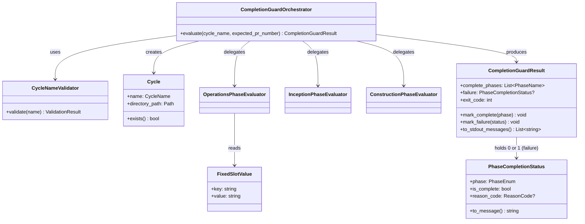

# ドメインモデル: cycle/* PR の 3 Phase 完了 CI ガード追加

## 概要

cycle ごとの AI-DLC 3 Phase（Inception / Construction / Operations）完了状態を判定し、不完全状態のサイクル PR が main にマージされることを CI で防ぐためのドメインモデル。判定ロジックは AI 駆動開発のサイクル成果物（progress.md / Unit 定義 / 固定スロット）を入力とする。

**重要**: コードは書かず、構造と責務の定義のみ。

## ユビキタス言語

| 用語 | 定義 |
|------|------|
| **Cycle** | AI-DLC のサイクル単位（例: `v2.5.6`、`waf/v1.0.0`）。bare cycle ID（`cycle/` prefix 除去後の値）で識別 |
| **Phase** | サイクルを構成する 3 段階: Inception / Construction / Operations |
| **PhaseCompletionStatus** | 各 Phase の完了状態（`complete` / `incomplete`）と、incomplete 時の `reason_code` を持つ判定結果 |
| **CycleArtifacts** | サイクルディレクトリ `.aidlc/cycles/{cycle}/` 配下の成果物群（progress.md / Unit 定義 / history） |
| **InceptionProgressMd** | `inception/progress.md`（Inception Phase の進捗管理ファイル）。`## ステップ一覧` テーブルから状態を抽出 |
| **UnitDefinition** | `story-artifacts/units/*.md`（各 Unit の定義ファイル）。`## 実装状態` セクション内の `- **状態**: <値>` 行から状態抽出 |
| **OperationsProgressMd** | `operations/progress.md`（Operations Phase の進捗管理ファイル）。ステップ7行（状態は「完了」or「PR準備完了」のいずれかを許容、`operations-release.md §7.6` 参照）+ 固定スロット 3 項目を持つ |
| **FixedSlot** | Operations Phase の復帰判定用スロット 3 項目: `release_gate_ready` / `completion_gate_ready` / `pr_number`。grammar v1（SoT: `skills/aidlc/steps/common/phase-recovery-spec.md §5.3.5`）。**grammar 仕様（要点）**: 各行 `key=value` 形式、値前後の空白許容、1 行内に `,` 区切りで複数 `key=value` 許容、`#` 以降コメント除去、重複キーは first-win、未知キー無視、HTML コメント・見出し行は無視。grammar v1 マーカー `<!-- fixed-slot-grammar: v1 -->` 以降を対象とする |
| **PrNumber** | PR 番号（正の整数、`^[1-9][0-9]*$`）。`--pr-number` オプションで CLI に渡される期待値と、`operations/progress.md` の `pr_number=<N>` から抽出された実値の 2 種を区別 |
| **CompletionGuardResult** | 3 Phase 全体の判定結果。**fail-fast 設計**（中指摘 #1 対応）: 最初に検出された incomplete Phase の `PhaseCompletionStatus` 1 件のみを保持。complete 時は 3 Phase 分の `phase:complete` メッセージを保持 |
| **ReasonCode** | Phase 内 incomplete 時の機械可読理由コード（**snake_case 統一**、中指摘 #2 対応）: `progress_md_missing` / `step_incomplete` / `no_units_defined` / `unit_status_pending` / `fixed_slot_missing` / `fixed_slot_unmet` / `pr_number_mismatch` / `step7_not_complete` |
| **CliErrorCode** | CLI 入力検証エラーコード（**kebab-case 統一**、中指摘 #2 対応）: `invalid-cycle` / `cycle-prefix-not-allowed` / `cycle-not-found` / `invalid-pr-number`。`ReasonCode` とは概念的に分離（前者は CLI 引数、後者は Phase 完了状態） |

## エンティティ（Entity）

### Cycle

- **ID**: cycle 名（文字列、例: `v2.5.6` / `waf/v1.0.0`）。bare ID 想定で、先頭の `cycle/` prefix を含む値は **CycleNameValidator** で reject される
- **属性**:
  - `name`: string - bare cycle ID
  - `directory_path`: Path - `.aidlc/cycles/{name}/` を指す絶対 or 相対パス
- **振る舞い**:
  - `exists()`: directory_path が実在するか確認
  - `inception_dir()` / `construction_dir()` / `operations_dir()` / `story_artifacts_units_dir()`: 各 Phase の成果物ディレクトリパスを返す

### PhaseCompletionStatus

- **ID**: `(cycle.name, phase_name)` の複合キー
- **属性**:
  - `phase`: enum - `inception` / `construction` / `operations`
  - `is_complete`: bool - 完了か未完了か
  - `reason_code`: string? - incomplete 時の理由コード（complete 時は null）
  - `details`: dict? - reason_code に応じた追加情報（slot 名 / unit slug / expected vs actual 等）
- **振る舞い**:
  - `to_message()`: 機械可読メッセージ文字列を生成（例: `operations:incomplete:reason=fixed_slot_unmet:slot=release_gate_ready:expected=true:actual=false`）

### CompletionGuardResult

- **ID**: `(cycle.name, evaluation_timestamp)` の複合キー（メモリ上のみ、永続化なし）
- **属性**:
  - `cycle`: Cycle
  - `complete_phases`: List<PhaseName> - 既に完了確認した Phase 群（fail-fast 中の中間結果）
  - `failure`: PhaseCompletionStatus? - 最初に検出された incomplete Phase の status（complete 時は null）
  - `expected_pr_number`: PrNumber? - `--pr-number` 指定時の期待 PR 番号
  - `exit_code`: int - 0 (all complete) / 1 (any incomplete) / 2 (input invalid)
- **振る舞い**（**fail-fast 設計**）:
  - `mark_complete(phase)`: complete_phases に追加
  - `mark_failure(status)`: failure に最初の incomplete をセット、以降は記録しない
  - `to_stdout_messages()`: failure があれば 1 行のみ出力（例: `operations:incomplete:reason=fixed_slot_unmet:slot=release_gate_ready:expected=true:actual=false`）。failure が null なら complete_phases から `inception:complete` / `construction:complete` / `operations:complete` の 3 行を出力

## 値オブジェクト（Value Object）

### CycleName

- **属性**: `value`: string
- **不変性**: 一度生成されたら変更不可。`CycleNameValidator` を通過した値のみ生成可能
- **等価性**: `value` の文字列同値で判定
- **境界条件**:
  - 先頭が `cycle/` で始まる値は `cycle-prefix-not-allowed` で reject（Round 4 codex 指摘 #1 対応）
  - その他は既存の `validate_cycle()`（`skills/aidlc/scripts/lib/validate.sh:39`）で検証（1〜2 セグメント、git ref 形式適合、`.lock` 拒否、パストラバーサル拒否）

### FixedSlotValue

- **属性**: `key`: string（`release_gate_ready` / `completion_gate_ready` / `pr_number`）, `value`: string
- **不変性**: parse 後は read-only
- **等価性**: `(key, value)` ペアで判定
- **値ドメイン**:
  - `release_gate_ready` / `completion_gate_ready`: boolean リテラル `true` / `false`（小文字固定、grammar v1）
  - `pr_number`: 正の整数文字列（`^[1-9][0-9]*$`）
- **不正値**:
  - boolean スロットに `true` / `false` 以外 → `fixed_slot_unmet`（`actual=<value>`）
  - `pr_number` が pattern 不一致 → `fixed_slot_unmet`（`actual=<value>`）

### PrNumber

- **属性**: `value`: int
- **不変性**: parse 後は read-only
- **等価性**: 整数同値
- **境界条件**: 1 以上の正の整数

### ReasonCode（Phase incomplete 用、snake_case）

- **属性**: `value`: string（snake_case 統一）
- **列挙値**:
  - Inception: `progress_md_missing`, `step_incomplete`
  - Construction: `no_units_defined`, `unit_status_pending`
  - Operations: `progress_md_missing`, `step7_not_complete`, `fixed_slot_missing`, `fixed_slot_unmet`, `pr_number_mismatch`

### CliErrorCode（CLI 入力エラー用、kebab-case）

- **属性**: `value`: string（kebab-case 統一）
- **列挙値**: `invalid-cycle`, `cycle-prefix-not-allowed`, `cycle-not-found`, `invalid-pr-number`
- **責務分離**（中指摘 #2）: `ReasonCode`（Phase 状態）と独立。出力形式も異なる:
  - ReasonCode: `<phase>:incomplete:reason=<reason_code>:...`
  - CliErrorCode: `error:<cli_error_code>:<value>:...`

## 集約（Aggregate）

### Cycle 集約

- **集約ルート**: Cycle
- **含まれる要素**: Cycle, CycleName, InceptionProgressMd, List<UnitDefinition>, OperationsProgressMd
- **境界**: 1 つの cycle ディレクトリ配下の全成果物
- **不変条件**:
  - cycle.name は `CycleNameValidator` を通過した値のみ
  - directory_path は `.aidlc/cycles/{name}/` 形式

### CompletionGuardEvaluation 集約（fail-fast モデル）

- **集約ルート**: CompletionGuardResult
- **含まれる要素**: CompletionGuardResult, complete_phases (List<PhaseName>), failure (PhaseCompletionStatus?), expected_pr_number?
- **境界**: 1 回の CLI 実行に対する判定結果
- **不変条件**（**fail-fast**、Round 2 codex 指摘 #4 対応）:
  - 評価順は inception → construction → operations 固定
  - failure が non-null になった時点で以降の Phase は評価しない
  - failure が null の場合 complete_phases は `[inception, construction, operations]` の 3 件すべて
  - exit_code は 3 Phase 集約の結果と整合（all complete → 0、any incomplete → 1、input error → 2）

## ドメインサービス

### CycleNameValidator

- **責務**: cycle 名の validation。`cycle/` prefix の明示拒否 + 既存 `validate_cycle()` の delegation
- **操作**:
  - `validate(name: string)`: ValidationResult を返す（`Ok(CycleName)` / `Err(reason_code, value)`）

### InceptionPhaseEvaluator

- **責務**: Inception Phase の完了判定
- **操作**:
  - `evaluate(cycle: Cycle)`: PhaseCompletionStatus を返す
  - 判定ロジック: `inception/progress.md` の `## ステップ一覧` テーブルから各ステップの状態を抽出。「完了」「スキップ」以外が 1 つでもあれば incomplete

### ConstructionPhaseEvaluator

- **責務**: Construction Phase の完了判定
- **操作**:
  - `evaluate(cycle: Cycle)`: PhaseCompletionStatus を返す
  - 判定ロジック: `story-artifacts/units/*.md` を `find` で列挙（bash 3.2 互換、`-print -quit` で 0 件判定可能）。0 件は `no_units_defined` で incomplete。1 件以上の場合、各 Unit 定義ファイルの `## 実装状態` セクション内 `- **状態**: <値>` を抽出し、「完了」「取り下げ」以外が 1 つでもあれば `unit_status_pending` で incomplete

### OperationsPhaseEvaluator

- **責務**: Operations Phase の完了判定
- **操作**:
  - `evaluate(cycle: Cycle, expected_pr_number?: PrNumber)`: PhaseCompletionStatus を返す
  - 判定ロジック（**高指摘 #1 対応**: ステップ7状態は「完了」/「PR準備完了」両方を許容、**完了判定の実体は固定スロット 3 項目で担保**）:
    1. `operations/progress.md` 存在確認（不在 → `progress_md_missing`）
    2. ステップ7行存在確認（行不在 → `step7_not_complete:status=row_missing`）
    3. ステップ7状態が「完了」or「PR準備完了」のいずれか（`operations-release.md §7.6` SoT、両者は同義）（その他 → `step7_not_complete:status=<value>`）
    4. **FixedSlotParser** で固定スロット行を抽出（grammar v1 awk パーサ、高指摘 #2 対応）。3 項目（`release_gate_ready` / `completion_gate_ready` / `pr_number`）の存在確認（行欠損 → `fixed_slot_missing:slot=<name>`）
    5. 各スロット値の充足確認:
       - `release_gate_ready` / `completion_gate_ready` が `true`（small case 固定）か（不一致 → `fixed_slot_unmet:slot=<name>:expected=true:actual=<value>`）
       - `pr_number` が `^[1-9][0-9]*$` パターンか（不一致 → `fixed_slot_unmet:slot=pr_number:expected=positive_integer:actual=<value>`）
    6. `expected_pr_number` 指定時のみ `pr_number=<N>` の値一致確認（不一致 → `pr_number_mismatch:expected=<E>:actual=<A>`）

### FixedSlotParser

- **責務**: `operations/progress.md` から grammar v1 準拠の固定スロット 3 項目を抽出（**高指摘 #2 対応**）
- **操作**:
  - `parse(progress_md_path: Path)`: Map<key, value> を返す
- **grammar v1 仕様**（SoT: `phase-recovery-spec.md §5.3.5`）:
  1. `<!-- fixed-slot-grammar: v1 -->` 以降の行を対象とする。**マーカー行不在時は parse 対象なし**（fail-safe 撤回、Round 2 codex 指摘 #2 対応）。3 項目すべてが見つからない扱いとなり、後段の `evaluate_operations()` で `fixed_slot_missing:slot=<name>` を返す。これは SoT「grammar セクションが存在する場合のみパースする」原則に整合
  2. 各行の処理:
     - HTML コメント `<!-- ... -->` 行はスキップ
     - `## ` で始まる見出し行はスキップ
     - 空行スキップ
     - 行内の `#` 以降を除去（コメント）
     - `,` 区切りで複数 `key=value` ペアを分割
     - 各ペアを `=` で split、key と value 両方の前後空白を trim
     - 既知キー（`release_gate_ready` / `completion_gate_ready` / `pr_number`）のみ Map に格納
     - 既存キーが既に Map にある場合は **first-win**（無視）
     - 未知キーは無視
- **bash 実装方針**: `awk` の単一プロセスで上記ロジックを実装（associative array 不使用、key/value をワークファイル経由 or 連番変数で管理）

### CompletionGuardOrchestrator

- **責務**: 3 Phase Evaluator の順次実行と **fail-fast 集約**（中指摘 #1 対応）。CLI のエントリポイント相当
- **操作**:
  - `evaluate(cycle_name: string, expected_pr_number?: int)`:
    1. CycleNameValidator で validate（fail → CompletionGuardResult.exit_code=2 + CliError 出力 → return）
    2. Cycle.exists() 確認（不在 → exit_code=2 + `error:cycle-not-found:...` → return）
    3. **fail-fast**: Inception → Construction → Operations を順次評価。incomplete を検出した時点で `result.mark_failure(status)` し残りの Phase は評価しない
    4. failure があれば exit_code=1、なければ exit_code=0
    5. CompletionGuardResult を返す（CLI 層が exit_code と stdout messages を出力）

## リポジトリインターフェース

このドメインは永続化を持たない（読み取りのみ）。リポジトリ概念は **CycleArtifactsRepository** として読み取り専用 facade で表現:

### CycleArtifactsRepository

- **対象集約**: Cycle 集約
- **操作**:
  - `find_inception_progress(cycle: Cycle)`: InceptionProgressMd? を返す
  - `find_unit_definitions(cycle: Cycle)`: List<UnitDefinition> を返す（0 件可）
  - `find_operations_progress(cycle: Cycle)`: OperationsProgressMd? を返す
- **実装**: bash 関数群として `bin/check-cycle-phase-completion.sh` 内に実装

## ドメインモデル図

## 不明点と質問（設計中に記録）

[Question] FixedSlotValue の grammar v1 で「コメント `<!-- fixed-slot-grammar: v1 -->` が見つからない場合」の扱いは?
[Answer] **マーカー不在時は parse 対象なし**（Round 2 codex 指摘 #2 対応 / SoT 準拠）。`parse_fixed_slots()` は何も出力せず、後段 `evaluate_operations()` で 3 項目すべてが見つからない扱いとなり `fixed_slot_missing:slot=<name>` を返す。SoT「grammar セクションが存在する場合のみパースする」原則に整合。旧方針（マーカー無視で `key=value` 行のみ判定）は撤回

[Question] `--pr-number` 未指定時に `pr_number=<N>` の N 自体が不正形式（例: `pr_number=abc`）の場合の判定は?
[Answer] `fixed_slot_unmet:slot=pr_number:expected=positive_integer:actual=abc` を返す（既に値ドメイン違反として fixed_slot_unmet で吸収する設計）。
