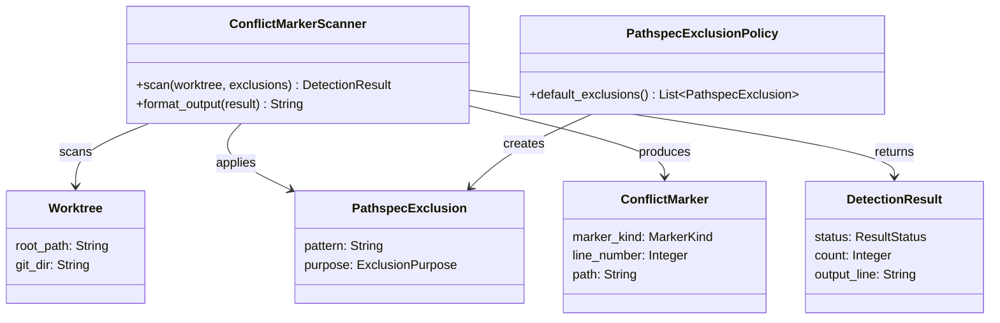

# ドメインモデル: main-repo-health-check の fixture 誤検出除外

## 概要

`check_conflict_marker` の検出対象境界を「real conflict（実害あり）」と「intentional sample（fixture / docs 引用）」に分離するためのドメイン概念を整理する。本 Unit はパススペック除外フィルタを介して両者を識別可能にする。

**重要**: このドメインモデル設計では**コードは書かず**、構造と責務の定義のみを行います。実装は Phase 2（コード生成ステップ）で行います。

## エンティティ（Entity）

このドメインに永続化対象の Entity は存在しない。`check_conflict_marker` は Worktree のスナップショットを評価する純関数的なドメインサービスとして表現する。

## 値オブジェクト（Value Object）

### ConflictMarker

- **属性**: `marker_kind`: enum `{StartMarker, SeparatorMarker, EndMarker}` - Git の diff3 マーカー種別 / `line_number`: Integer - 検出された行番号 / `path`: String - リポジトリ相対パス
- **不変性**: 一度検出された conflict marker は時点固定。再 scan 時は新しい `ConflictMarker` を生成する
- **等価性**: `(path, line_number, marker_kind)` の三組で等価判定。同一行に複数種別が来ることはない

### Worktree

- **属性**: `root_path`: String - main worktree のルート絶対パス / `git_dir`: String - `.git` パス（main / worktree いずれも対象）
- **不変性**: `git rev-parse --show-toplevel` で解決された時点の値で固定
- **等価性**: `root_path` の文字列等価

### PathspecExclusion

- **属性**: `pattern`: String - `:(exclude)<glob>` 形式の pathspec 文字列 / `purpose`: enum `{FixtureSelfReference, HistoricalDesignDocs}` - 除外目的の分類
- **不変性**: 一度確定した除外パターンは Phase 2 で値として固定（コード上は文字列定数）
- **等価性**: `pattern` の文字列等価

### DetectionResult

- **属性**: `status`: enum `{Ok, Warning, Error}` / `count`: Integer ≥ 0 / `output_line`: String - `health-check:conflict-marker:{status}:count={N}` または `error:git-grep-failed`
- **不変性**: 検出 1 回に対し 1 つの結果オブジェクト。`status=Error` 時は `count=0` 固定
- **等価性**: `(status, count)` の組

## 集約（Aggregate）

### ConflictMarkerScan

- **集約ルート**: `ConflictMarkerScanner`（ドメインサービスとして表現）
- **含まれる要素**: `Worktree` / `List<PathspecExclusion>` / `List<ConflictMarker>` / `DetectionResult`
- **境界**: 1 回の scan 実行サイクルがこの集約の境界。scan 完了で集約は dispose される（永続化なし）
- **不変条件**:
  - `DetectionResult.count` は `List<ConflictMarker>` の要素数と一致する（`status=Ok` で count=0、`status=Warning` で count≥1）
  - `List<PathspecExclusion>` は scan の入力として与えられ、scan 中に変更されない
  - 除外パスにマッチしたファイル内の conflict marker は `List<ConflictMarker>` に含まれない
  - `git grep` のエラー時（exit≥2）は `DetectionResult.status=Error`、`List<ConflictMarker>` は空となる

## ドメインサービス

### ConflictMarkerScanner

- **責務**: 与えられた `Worktree` と `PathspecExclusion` 集合を入力として `git grep` 経由で conflict marker を scan し、`DetectionResult` を返す
- **操作**:
  - `scan(worktree, exclusions) -> DetectionResult` - 除外を適用した上で marker を検出
  - `format_output(result) -> String` - 既存出力フォーマット（`health-check:conflict-marker:{status}:count={N}`）に整形

### PathspecExclusionPolicy

- **責務**: 「除外すべきパス」のドメインルールを保持する。本 Unit では以下 2 種を確定:
  - `FixtureSelfReference`: `tests/main-repo-health-check.bats`（conflict-marker 検出機能自身の bats fixture。意図的に marker を含む）
  - `HistoricalDesignDocs`: `.aidlc/cycles/**/design-artifacts/**`（過去サイクルの設計ドキュメント中の conflict-marker fixture サンプル）
- **操作**:
  - `default_exclusions() -> List<PathspecExclusion>` - 上記 2 種を返す
- **拡張ガイドライン**: 新規除外を追加する判断基準は「意図的に conflict marker を含むファイル群か」。誤検出の発生パスが拡張された場合は別 Unit でレビューを要する（本 Unit の境界外）

## リポジトリインターフェース

このドメインに永続化対象 Aggregate は存在しないため、Repository は定義しない。`Worktree` の解決は Git 標準コマンド（`git rev-parse`）に委譲する。

## ファクトリ

ファクトリは導入しない。`PathspecExclusion` は文字列リテラルから直接構築する単純値オブジェクトであり、`ConflictMarkerScanner` は外部入力（Worktree + Exclusions）からそのまま scan を実行する純関数的サービスとして表現する。

## ドメインモデル図

## ユビキタス言語

- **conflict marker（コンフリクトマーカー）**: Git のマージ衝突時に挿入される `<<<<<<<` / `=======` / `>>>>>>>` の 3 種行マーカー。本ドキュメントでは `^<<<<<<< ` / `^>>>>>>> ` / `^=======$` の正規表現に一致する行を指す
- **real conflict（実コンフリクト）**: ユーザーが解消すべき未解決のマージ衝突。検出されると warning 通知される
- **fixture（フィクスチャ）**: テスト目的で意図的に conflict marker を含む bats テストファイル群（`tests/main-repo-health-check.bats`）
- **historical design docs（過去サイクル設計ドキュメント）**: 過去サイクルで作成された設計ドキュメントに、説明目的で記録された conflict marker のサンプル（`.aidlc/cycles/**/design-artifacts/**`）
- **pathspec exclusion（パススペック除外）**: `git grep -- ':(exclude)<glob>'` 形式で git の検索対象から特定パスを除外する仕組み。git 2.13+ で標準サポートされる
- **detection result（検出結果）**: 1 回の scan あたりの最終出力。`ok:count=0` / `warning:count=N` / `error:git-grep-failed` のいずれかにマッピングされる

## 不明点と質問

[Question] 受け入れテスト (b) 実コンフリクト検出維持の path 選択は、worktree 内の除外対象外 path に置くか、`mktemp -d` で worktree 外を使うか、どちらが妥当か？

[Answer] 論理設計で確定する。worktree 内の除外対象外 path（例: `bin/__tmp_conflict_fixture.txt`）は git grep の対象になるため検出力検証として最も忠実だが、テスト後のクリーンアップが必要。`mktemp -d` で別 worktree を作成 → fixture 配置 → 当該 worktree で `check_conflict_marker` を実行する方がクリーンで bats のテンポラリディレクトリ規約に整合する（既存テストも `BATS_TEST_TMPDIR` を活用）。論理設計では後者を推奨する。
