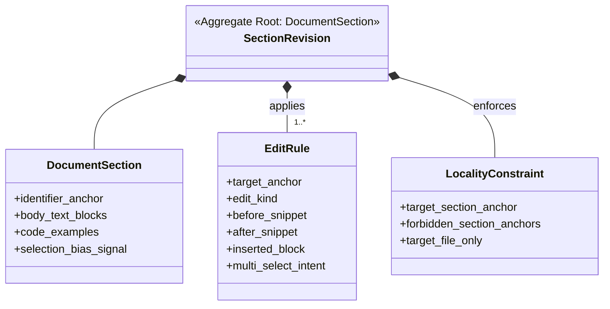

# ドメインモデル: Unit 004 - Inception Issue 選択フローで複数選択を前提化

## 概要

Inception Phase 02-preparation §16「GitHub Issue 確認」を「**ガイダンスドキュメントセクション**」というドメインとして捉え、その文言・推奨例を局所改訂する。本 Unit は Markdown 文言修正のみのため、ドメインモデルは **3 要素**（Document Section / Edit Rule / Locality Constraint）の軽量モデルとする。

**重要**: 本ドメインモデルでは**コードは書かず**、改訂対象の構造と局所性制約のみを定義する。

## 軽量モデル: 3 要素

### Document Section（ドキュメントセクション、ルート概念）

`steps/inception/02-preparation.md` の §16「GitHub Issue 確認」サブセクションを表す。本 Unit の単一の編集対象。

- **識別子**: ファイル相対パス + 見出しアンカー（`steps/inception/02-preparation.md` # `## 16. GitHub Issue確認` 系の見出し）
- **状態**:
  - `body_text_blocks`: ドキュメントセクション内の自然言語ブロック（ユーザー対話文 / AI 向けアクション説明 / Milestone 紐付け説明 等）
  - `code_examples`: ドキュメントセクション内のコードフェンスブロック群（実行コマンド / 対話例の擬似テキスト 等）
  - `selection_bias_signal`: 文言が暗示する選択肢数のスタンス（`single` / `multi` / `neutral`）。本 Unit の責務は `single` → `multi` へ移行
- **不変条件**:
  - 改訂後のドキュメントセクションは `selection_bias_signal == multi` を満たす
  - ドキュメントセクション内の既存ブロック（Milestone 紐付け説明等）の意味的整合性が壊れない

### Edit Rule（編集ルール、値オブジェクト）

ドキュメントセクションへの改訂を表す不変の値オブジェクト。本 Unit では 3 件の Edit Rule を適用する（論理設計側で具体化）。

- **属性**:
  - `target_anchor`: 構造アンカー（見出し名 + ブロック識別 + 箇条書き番号 等。**行番号には依存しない**）
  - `edit_kind`: `text_replace` / `block_insert_after` のいずれか
  - `before_snippet` / `after_snippet`: 文言差分（`text_replace` 時）
  - `inserted_block`: 挿入する新規ブロック（`block_insert_after` 時）
  - `multi_select_intent`: Enum{`explicit_multi_clarification` | `recommended_pattern_addition` | `none`} - 本ルールが「複数選択前提」をどう支えるか
- **不変性**: 一度作られた Edit Rule は編集されない。改訂時は新しいルールを生成する
- **等価性**: `target_anchor` + `edit_kind` の組合せで判定

### Locality Constraint（局所性制約、値オブジェクト）

本 Unit の改訂が §16 周辺に限定されることを表す制約。

- **属性**:
  - `target_section_anchor`: `02-preparation.md ## 16. GitHub Issue確認`
  - `forbidden_section_anchors`: List<String> - 波及禁止アンカー（`## 15. Depth Level確認` / `## 17. バックログ確認` / 他ステップの全見出し）
  - `target_file_only`: True - 編集ファイルは `skills/aidlc/steps/inception/02-preparation.md` の 1 件のみ
- **検証手順**: 論理設計の「局所性検証インターフェース」セクションを参照（§16 セクション境界の前後で範囲外差分が発生していないかを直接判定）
- **等価性**: `target_section_anchor` で判定

## 集約（Aggregate）

### SectionRevision（セクション改訂集約）

本 Unit が変更を加える単位。`Document Section`（ルート） + 適用対象の `Edit Rule` 群 + `Locality Constraint` からなる。

- **集約ルート**: `Document Section`（§16）
- **含まれる要素**:
  - `Edit Rule` × 3（複数選択可明示文言 × 2 + AskUserQuestion 推奨パターンブロック × 1）
  - `Locality Constraint` × 1
- **境界**: `Locality Constraint.target_section_anchor` で表現される範囲（§16 内）
- **不変条件**:
  - 改訂後の `Document Section.selection_bias_signal == multi`
  - すべての `Edit Rule.target_anchor` が `Locality Constraint.target_section_anchor` の内部に含まれる
  - `Locality Constraint.forbidden_section_anchors` への波及がない

## 参考概念（本 Unit のドメイン責務外）

以下は影響範囲の説明として参考に挙げるが、ドメインモデルの公式構成要素ではない。

### AI エージェント解釈挙動（参考概念）

AI エージェントが §16 を読み込んで `AskUserQuestion(multiSelect)` の値を推論する挙動。本 Unit はガイダンス改訂を通じて間接的に影響を与えるが、AI 推論挙動自体は **ドメイン責務範囲外**（LLM 側の挙動であり、本ドキュメント仕様の境界の外）。

- 観測対象: v2.5.6 以降の Inception Phase 実行時の `AskUserQuestion` 構築挙動
- 観測タイミング: 補助基準（後続サイクルの振り返り材料、本サイクル DoD 外）

### Markdown 編集サービス（参考概念）

Phase 2 で Edit Rule を実 Markdown ファイルに適用する論理サービス。実装は Edit ツールの直接利用であり、独立したサービスとして抽象化する必要はない。

### Guidance ファイル永続化（参考概念）

Markdown ファイルへの保存。Git の通常コミットフローで担保され、独立リポジトリインターフェースとして抽象化不要。

## ファクトリ

本 Unit ではファクトリは不要（編集対象が既存の §16 のみで、新規 Document Section の生成はない）。

## ドメインモデル図

## ユビキタス言語

- **§16**: `steps/inception/02-preparation.md` の「GitHub Issue 確認」サブセクション。本 Unit の単一の編集対象
- **複数選択前提（multi-select premise）**: `AskUserQuestion` を `multiSelect: true` で構成することが標準的だと示すスタンス
- **単一選択バイアス（single-select bias）**: 文言が暗黙に単数形を示すことで、AI エージェントが `multiSelect: false` を選びやすくなる現象（v2.5.6 サイクル開始時に観測）
- **構造アンカー（structural anchor）**: 行番号ではなく見出し / 箇条書き番号 / ブロック種別で位置を指定する識別方法（前後編集に強い）
- **局所性（Locality）**: 修正が §16 周辺に限定され、他セクションへ波及していない状態
- **ガイダンス改訂世代（Guidance Revision Generation）**: §16 の文言改訂版を識別する論理的世代番号（本 Unit は世代 +1）

## 不明点と質問（設計中に記録）

[Question] `AskUserQuestion` 呼び出し例の `language` フェンスは `bash` / `text` / `pseudo` のどれにすべきか？
[Answer] `text` フェンスを使用し、論理コール記法とする。理由: `AskUserQuestion` は AI エージェントが内部で構築する論理コールであり、シェル実行不可。L40-48 の対応確認テキストブロックも `text` フェンスを使用しており、整合する。

[Question] 「複数選択可」明示文言は対応確認テキストブロックと「1を選択」アクション説明の両方に入れるか？
[Answer] **両方**に入れる。対応確認テキストブロックはユーザー向け対話テキスト（AI が読み上げる候補）、「1を選択」アクション説明は AI 向けアクション説明（natural language guidance）。両方に明示することで、ユーザー対話と AI アクション設計の両面で複数選択前提が共有される。

[Question] AskUserQuestion 推奨パターンの options 個数制約はどう記述するか？
[Answer] AskUserQuestion ツールの実仕様に従い「options は最大 4 件、5 件以上の Issue がある場合は重要度・関連度の高い 4 件を掲載し、それ以外は Other（自動付与）で受け付け」と記述する。Other は AskUserQuestion 自体が自動付与するため、明示的に options に書く必要はない。

## 影響範囲（参考）

- 直接編集対象: `skills/aidlc/steps/inception/02-preparation.md` の §16 内
- 派生反映: プラグインキャッシュ（`/Users/keisuke/.claude/plugins/cache/ai-dlc-starter-kit/aidlc/<commit>/skills/aidlc/steps/inception/02-preparation.md`）→ 次回プラグイン更新で同期、本 Unit の責務外
