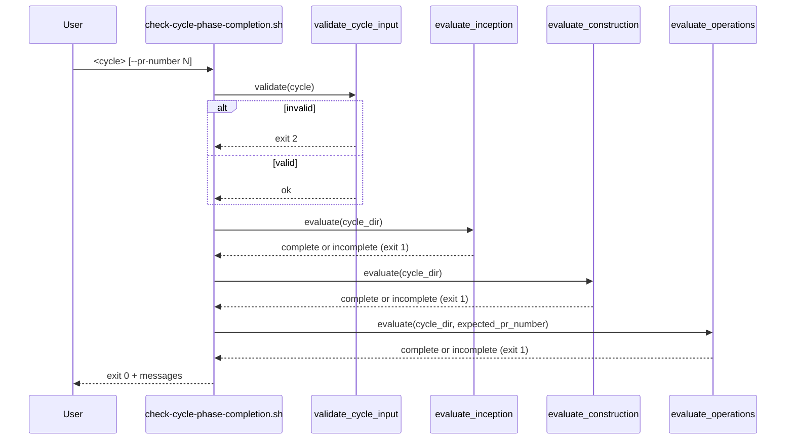

# 論理設計: cycle/* PR の 3 Phase 完了 CI ガード追加

## 概要

bash 製 CLI スクリプト + GitHub Actions workflow + bats テスト + ruleset doc から構成される Unit。CLI は判定オーケストレーション、共有ヘルパー再利用、CI トリガ条件分岐の責務を持つ。

**重要**: コードは書かず、コンポーネント構成とインターフェース定義のみ。

## アーキテクチャパターン

**Pipeline + Domain Service Pattern**: CLI エントリポイント → CycleNameValidator → 各 PhaseEvaluator（順次実行）→ ResultAggregator → stdout/exit code。各 Evaluator は独立した bash 関数として実装し、Single Responsibility Principle を維持する。

選定理由: 3 Phase の判定は独立しており順次実行で十分（並行化メリットなし、軽量チェック）。bash 関数による分割で shellcheck / 単体テスト容易性を確保。

## コンポーネント構成

### レイヤー / モジュール構成

```text
bin/
└── check-cycle-phase-completion.sh   # CLI エントリポイント
    ├── parse_args()                  # 引数パース・--help・--pr-number
    ├── validate_cycle_input()        # cycle/ prefix 拒否 + validate_cycle() 呼び出し
    ├── evaluate_inception()          # InceptionPhaseEvaluator
    ├── evaluate_construction()       # ConstructionPhaseEvaluator
    ├── evaluate_operations()         # OperationsPhaseEvaluator
    ├── emit_status()                 # PhaseCompletionStatus メッセージ整形
    └── main()                        # オーケストレーション

skills/aidlc/scripts/lib/
└── validate.sh                       # 既存、validate_cycle() を source して再利用

.github/workflows/
├── cycle-phase-completion-check.yml  # 新設: pull_request トリガ + cycle/* job 条件
└── migration-tests.yml               # 改修: PATHS_REGEX + bats 実行行追加

tests/
├── check-cycle-phase-completion.bats # 新設: 11 ケースの受け入れテスト
└── fixtures/
    └── cycle-phase-completion/       # 新設: 各テストケース用の cycle ディレクトリ群
        ├── completion/               # (a) 全 Phase 完了
        ├── inception-incomplete/     # (b) Inception 未完
        ├── construction-incomplete/  # (c) Construction 未完
        ├── operations-slot-unmet/    # (d) release_gate_ready=false
        ├── operations-pr-mismatch/   # (e) pr_number 不一致
        ├── operations-pr-missing/    # (g) pr_number 行欠損
        ├── construction-no-units/    # (i) units/*.md 0 件
        ├── operations-step7-pr-ready/ # (j) ステップ7状態が「PR準備完了」の正常系
        └── operations-grammar-v1-detail/ # (k) grammar v1 詳細 (カンマ併記/コメント/重複/未知キー混在の正常系)
                                       # (f, h) は invalid cycle / cycle/ prefix で fixture 不要

docs/
└── cycle-phase-completion-check-ruleset.md  # 新設: Ruleset 必須化手順
```

### コンポーネント詳細

#### `bin/check-cycle-phase-completion.sh`

- **責務**: CLI エントリポイント。引数解析・cycle 検証・3 Phase 評価のオーケストレーション・終了コード決定
- **依存**:
  - `skills/aidlc/scripts/lib/validate.sh`（`source` で `validate_cycle()` を取り込み）
  - `git`（`validate_cycle()` 内部で使用）
  - `awk` / `find`（標準ツール、外部依存追加なし。grammar v1 パースは `awk` 単一プロセスに統一、`grep -E` 単独は使わない）
- **公開インターフェース**: `bin/check-cycle-phase-completion.sh <cycle> [--pr-number N] [--help]`

#### `evaluate_inception()`

- **責務**: Inception Phase 完了判定
- **入力**: `$1`: inception ディレクトリパス
- **出力**: stdout に PhaseCompletionStatus メッセージ、戻り値 0 (complete) / 1 (incomplete)
- **判定ロジック**（**高指摘 #3 対応**: ヘッダ行・罫線行混入を防ぐデータ行限定マッチ）:
  1. `inception/progress.md` 存在確認（不在 → `inception:incomplete:reason=progress_md_missing`、return 1）
  2. **`## ステップ一覧` セクション抽出**: 単一 awk で「`## ステップ一覧` 開始フラグ ON → 次の `## ` 行で OFF（exit）」の状態管理。inclusive range `/.../,/.../` は使わない
  3. **データ行限定マッチ**: 範囲内で `^\|[[:space:]]*[0-9]+\.` パターンに一致する行のみ対象（罫線 `|---|`、ヘッダ `| ステップ | 状態 |` は除外）
  4. 各データ行から状態列を `awk -F'|' '{gsub(/^[[:space:]]+|[[:space:]]+$/, "", $3); print $3}'` で抽出（trim）
  5. 「完了」「スキップ」以外の状態が 1 つでもあれば `inception:incomplete:reason=step_incomplete:step=<row_num>:status=<value>`、return 1（最初の不一致で early exit）
  6. 全データ行が「完了」or「スキップ」なら `inception:complete`、return 0

#### `evaluate_construction()`

- **責務**: Construction Phase 完了判定
- **入力**: `$1`: cycle ディレクトリパス
- **出力**: stdout PhaseCompletionStatus、戻り値 0/1
- **判定ロジック**:
  1. `find "${cycle_dir}/story-artifacts/units" -maxdepth 1 -type f -name '*.md' -print -quit` で 1 件以上存在するか確認
  2. 0 件 → `construction:incomplete:reason=no_units_defined`、return 1
  3. 1 件以上の場合、各 `units/*.md` を `find ... -name '*.md'` で列挙し順次処理
  4. 各 Unit ファイルから状態行抽出: 高指摘 #3 同様に inclusive range は使わず、単一 awk で `## 実装状態` 開始フラグ ON → 次の `## ` で OFF（exit）の状態管理。範囲内で `^- \*\*状態\*\*:` パターンの行のみ対象
  5. 状態値が「完了」「取り下げ」以外なら `construction:incomplete:reason=unit_status_pending:unit=<basename>:status=<value>`、return 1
  6. 全 Unit が「完了」or「取り下げ」なら `construction:complete`、return 0

#### `evaluate_operations()`

- **責務**: Operations Phase 完了判定
- **入力**: `$1`: cycle ディレクトリパス、`$2`: expected_pr_number（空文字列で未指定）
- **出力**: stdout PhaseCompletionStatus、戻り値 0/1
- **判定ロジック**（**高指摘 #1 対応**: ステップ7状態は「完了」/「PR準備完了」両方許容、**完了判定の実体は固定スロット 3 項目で担保**。**高指摘 #2 対応**: 固定スロットは `parse_fixed_slots()`（grammar v1 awk パーサ）経由）:
  1. `operations/progress.md` 存在確認（不在 → `operations:incomplete:reason=progress_md_missing`、return 1）
  2. **ステップ7行存在確認**: `evaluate_inception()` と同じデータ行限定マッチで `## ステップ一覧` から `^\|[[:space:]]*7\.` パターンの行を抽出。行不在 → `operations:incomplete:reason=step7_not_complete:status=row_missing`、return 1（命名統一: 詳細属性は `status=` キーで統一、Round 3 codex 低指摘対応）
  3. **ステップ7状態判定**: 状態列を trim して取得。`完了` または `PR準備完了` のいずれかに一致するかチェック（SoT: `operations-release.md §7.6` 「ステップ7『完了』 = `PR準備完了` と同義」）。両者以外 → `operations:incomplete:reason=step7_not_complete:status=<value>`、return 1
  4. **固定スロット parse**: `parse_fixed_slots "${cycle_dir}/operations/progress.md"` を呼び出し、3 項目（`release_gate_ready` / `completion_gate_ready` / `pr_number`）の値を取得（grammar v1 awk パーサ、後述）
  5. 3 項目の存在確認（key 不在 → `operations:incomplete:reason=fixed_slot_missing:slot=<name>`、return 1）
  6. 各値の充足確認:
     - `release_gate_ready` / `completion_gate_ready` が `true`（小文字固定）か（不一致 → `operations:incomplete:reason=fixed_slot_unmet:slot=<name>:expected=true:actual=<value>`、return 1）
     - `pr_number` が `^[1-9][0-9]*$` か（不一致 → `fixed_slot_unmet:slot=pr_number:expected=positive_integer:actual=<value>`、return 1）
  7. `expected_pr_number` 指定時のみ、actual との一致確認（不一致 → `operations:incomplete:reason=pr_number_mismatch:expected=<E>:actual=<A>`、return 1）
  8. 全合格なら `operations:complete`、return 0

#### `parse_fixed_slots()`（grammar v1 awk パーサ、高指摘 #2 対応）

- **責務**: `operations/progress.md` から固定スロット 3 項目を grammar v1 準拠で抽出
- **入力**: `$1`: progress.md パス
- **出力**: stdout に `key=value` 形式の行を最大 3 件（ヒットした順、first-win）。例: `release_gate_ready=true\ncompletion_gate_ready=true\npr_number=668`
- **awk 実装方針**（bash 3.2 互換、associative array 不使用）:
  1. **マーカー検出**: `<!-- fixed-slot-grammar: v1 -->` を含む行を検出したら `in_grammar=1`、以降の行を対象とする。**マーカー不在時は parse 対象なし**（`in_grammar=0` のまま、Round 2 codex 指摘 #2 対応）。3 項目すべてが見つからない扱いとなり、`evaluate_operations()` で `fixed_slot_missing:slot=<name>` を返す。SoT「grammar セクションが存在する場合のみパースする」原則に整合
  2. **行スキップ**:
     - HTML コメント行（`/^[[:space:]]*<!--/`）スキップ
     - 見出し行（`/^##/`）スキップ
     - 空行スキップ
  3. **コメント除去**: 行内の `#` 以降を削除（`sub(/#.*$/, "")`）
  4. **複数 key=value 分割**: `,` で split し各ペアを処理
  5. **各ペアの処理**:
     - `=` で split、key と value を取得
     - 両方 trim（`gsub(/^[[:space:]]+|[[:space:]]+$/, "")`）
     - key が `release_gate_ready` / `completion_gate_ready` / `pr_number` のいずれか **かつ first-win**（既出 key 用フラグ変数 `seen_release` / `seen_completion` / `seen_pr` で管理）なら出力
- **first-win 管理（associative array 不使用）**: bash 連想配列なし環境のため、awk 内で `seen_release=0` / `seen_completion=0` / `seen_pr=0` の独立 flag を持ち、各 key 検出時に flag を 1 にして再出力を抑止
- **呼び出し側の取得方法**: caller は `parse_fixed_slots <path>` の出力を `while read line` で受け、`${line%%=*}` / `${line#*=}` で分解して bash 変数 `slot_release` / `slot_completion` / `slot_pr` に代入（bash 3.2 互換）

#### `validate_cycle_input()`

- **責務**: CLI 引数の cycle 値を検証
- **入力**: `$1`: cycle 値
- **出力**: stdout エラーメッセージ（invalid 時）、戻り値 0 (valid) / 2 (invalid)
- **判定ロジック**:
  1. **`cycle/` prefix 早期拒否**（Round 4 codex 指摘 #1）: `[[ "$1" == cycle/* ]]` なら `error:cycle-prefix-not-allowed:<value>:hint=strip-cycle-prefix-before-passing`、return 2
  2. `validate_cycle "$1"` を呼び出し、戻り値 0 なら通過、1 なら `error:invalid-cycle:<value>`、return 2

#### `.github/workflows/cycle-phase-completion-check.yml`

- **責務**: PR イベントで CLI を CI 実行
- **依存**: `actions/checkout@v4`、bash 標準ツール、`git` (`actions/checkout` で利用可能）
- **公開インターフェース**: GitHub Actions workflow（`pull_request` イベント、`branches: [main]`）

#### `tests/check-cycle-phase-completion.bats`

- **責務**: CLI の受け入れテスト 11 ケース
- **依存**: bats-core 1.11.1（既存 migration-tests と同バージョン）、`tests/fixtures/cycle-phase-completion/` 配下の fixture cycle ディレクトリ群

#### `docs/cycle-phase-completion-check-ruleset.md`

- **責務**: Repository Ruleset 必須化手順 doc
- **依存**: なし（独立ドキュメント）

## インターフェース設計

### スクリプトインターフェース設計

#### `bin/check-cycle-phase-completion.sh`

**概要**: cycle の 3 Phase 完了状態を判定する CLI

**引数**:

| 引数 | 必須/任意 | 説明 |
|------|----------|------|
| `<cycle>` | 必須 | bare cycle ID（例: `v2.5.6` / `waf/v1.0.0`）。`cycle/` prefix を含む値は reject される |
| `--pr-number N` | 任意 | 期待 PR 番号（正の整数）。指定時のみ Operations の `pr_number` 一致検証を実施 |
| `--help` | 任意 | usage 表示後 exit 0 |

**成功時出力**（exit 0、3 Phase 全完了）:

```text
inception:complete
construction:complete
operations:complete
```

- 終了コード: `0`
- 出力先: stdout

**エラー時出力**（exit 1、いずれかの Phase 未完了）:

最初に incomplete を検出した Phase の status メッセージのみを出力（早期 return）:

```text
inception:incomplete:reason=step_incomplete:step=2:status=未着手
```

または:

```text
operations:incomplete:reason=fixed_slot_unmet:slot=release_gate_ready:expected=true:actual=false
```

または:

```text
construction:incomplete:reason=no_units_defined
```

- 終了コード: `1`
- 出力先: stdout

**入力エラー時出力**（exit 2）:

```text
error:invalid-cycle:UPPER
```

または:

```text
error:cycle-prefix-not-allowed:cycle/v2.5.6:hint=strip-cycle-prefix-before-passing
```

または:

```text
error:cycle-not-found:.aidlc/cycles/v9.99.99
```

- 終了コード: `2`
- 出力先: stdout

**使用コマンド**:

```bash
# CI（pr_number 一致検証あり）
bin/check-cycle-phase-completion.sh "${GITHUB_HEAD_REF#cycle/}" --pr-number "${PR_NUMBER}"

# ローカル dry-run（pr_number 一致検証なし、その他は CI 同等）
bin/check-cycle-phase-completion.sh v2.5.6

# ヘルプ
bin/check-cycle-phase-completion.sh --help
```

### Workflow YAML 構造

```yaml
name: Cycle Phase Completion Check

on:
  pull_request:
    types: [opened, synchronize, reopened, ready_for_review]
    branches: [main]

permissions:
  contents: read

jobs:
  cycle-phase-completion:
    name: Cycle Phase Completion
    runs-on: ubuntu-latest
    if: startsWith(github.head_ref, 'cycle/')
    steps:
      - uses: actions/checkout@v4
      - name: Verify Phase Completion
        env:
          HEAD_REF: ${{ github.head_ref }}
          PR_NUMBER: ${{ github.event.pull_request.number }}
        run: |
          set -eu
          CYCLE="${HEAD_REF#cycle/}"
          bin/check-cycle-phase-completion.sh "${CYCLE}" --pr-number "${PR_NUMBER}"
```

設計ポイント:

- `if: startsWith(github.head_ref, 'cycle/')` で `cycle/*` 以外の PR では job 自体を skip（CI checks 一覧で `Cycle Phase Completion` が `skipped` 表示）
- `${HEAD_REF#cycle/}` で bash parameter expansion で prefix 除去（quote 内で展開、shell injection 対策）
- `set -eu` でエラー伝搬

## データモデル概要

### ファイル形式

#### `inception/progress.md`

既存形式（`v2.5.6/inception/progress.md` 参照）。判定対象は `## ステップ一覧` テーブル:

```markdown
## ステップ一覧

| ステップ | 状態 | 成果物 | 完了日 |
|---------|------|--------|--------|
| 1. Intent明確化 | 完了 | requirements/intent.md | 2026-05-09 |
| ...
```

#### `story-artifacts/units/*.md`

既存形式（`v2.5.6/story-artifacts/units/002-health-check-fixture-exclusion.md` 参照）。判定対象は `## 実装状態` セクション内の状態行:

```markdown
## 実装状態

有効値: 未着手 | 進行中 | 完了 | 取り下げ

- **状態**: 完了
```

#### `operations/progress.md`

既存形式（`v2.5.5/operations/progress.md` 参照）。判定対象は (1) `## ステップ一覧` テーブルのステップ7 行と (2) `## 固定スロット（Operations 復帰判定用）` セクション:

```markdown
## ステップ一覧

| ステップ | 状態 | ...
| 7. リリース準備 | 完了 | ...    # または「PR準備完了」（両者は SoT 上同義、operations-release.md §7.6 参照）

## 固定スロット（Operations 復帰判定用）

<!-- fixed-slot-grammar: v1 -->
release_gate_ready=true
completion_gate_ready=true
pr_number=668
```

## 処理フロー概要

### CLI 起動から判定完了までのフロー

**ステップ**:

1. `parse_args()`: `<cycle>` / `--pr-number` / `--help` をパース。引数不足や `--help` は usage 表示
2. `validate_cycle_input()`: `cycle/` prefix 拒否 → `validate_cycle()` 呼び出し（fail → exit 2）
3. cycle ディレクトリ存在確認: `[ -d ".aidlc/cycles/${cycle}" ]`（不在 → exit 2）
4. `evaluate_inception()` 呼び出し（exit 1 で早期 return）
5. `evaluate_construction()` 呼び出し（exit 1 で早期 return）
6. `evaluate_operations()` 呼び出し（exit 1 で早期 return）
7. 全 Phase complete → 3 行のメッセージを stdout 出力 + exit 0

**関与するコンポーネント**: `parse_args`, `validate_cycle_input`, `evaluate_inception`, `evaluate_construction`, `evaluate_operations`, `main`



## 非機能要件（NFR）への対応

### パフォーマンス

- **要件**: CI ジョブ実行時間 30 秒以内
- **対応策**: 軽量シェルチェックのみ（外部 API 呼び出しなし、ファイル I/O は小規模 markdown 数件）。`actions/checkout@v4` の clone 時間を含めても 30 秒以内は十分達成可能

### セキュリティ

- **要件**: PR `head_ref` 由来の cycle 名サニタイズ
- **対応策**:
  - workflow 側: `${{ github.head_ref }}` を環境変数 `HEAD_REF` 経由で受け取り、`"${HEAD_REF#cycle/}"` で quote 内展開（shell injection 防止）
  - CLI 側: `validate_cycle_input()` で cycle/ prefix 早期拒否 + `validate_cycle()` 形式検証
  - eval / 動的 source 不使用

### 可用性

- **要件**: 既存 workflow と独立、コンフリクトなし
- **対応策**: 新規 workflow ファイルとして独立配置。既存 workflow の改修は `migration-tests.yml` の PATHS_REGEX + bats 実行行追加のみ（最小侵襲）

### 互換性

- **要件**: bash 3.2（macOS デフォルト）+ bash 5.x（GitHub Actions）両対応
- **対応策**:
  - `nullglob` 不使用、`*.md` グロブの代わりに `find ... -print -quit` で 0 件判定
  - associative array 不使用（bash 3.2 未サポート）
  - `[[ ]]` / parameter expansion / `getopts` 等は両対応

## 技術選定

- **言語**: bash 3.2+ 互換シェルスクリプト
- **テストフレームワーク**: bats-core 1.11.1（既存 migration-tests と同バージョン）
- **CI**: GitHub Actions ubuntu-latest
- **追加依存**: なし（既存 `validate.sh` の `validate_cycle()` を再利用、`git` / `awk` / `grep` / `find` の標準ツールのみ）

## 実装上の注意事項

- **shellcheck**: `bin/check-cycle-phase-completion.sh` を shellcheck clean に保つ（warning も含む）
- **markdown 解析**: `awk` の範囲指定 `/pattern1/,/pattern2/` は両端 inclusive。次セクションヘッダ `^## ` を排他するため `/^## (?!ステップ一覧)/` 等の hack ではなく、別 awk 文で `## ` で始まる行に到達したら break する書き方を選ぶ
- **大小文字**: 状態値「完了」/ 「スキップ」/ 「未着手」等は全角・半角混在の可能性なし（既存テンプレート由来）。ただし末尾空白・改行コード差は trim 必須
- **エラーメッセージ**: stdout 出力で統一（CI ログとローカル dry-run の出力経路を同一にし、bats アサーション容易性を確保）
- **return vs exit**: 各 evaluator 関数は `return 0/1` で呼び出し元に状態通知、`main()` で `exit` を呼ぶ（関数ライブラリ化を可能にする）

## 不明点と質問（設計中に記録）

[Question] `## ステップ一覧` テーブルの状態列が「進行中」「未着手」「未完了」「失敗」等、定義外の値だった場合の扱いは?
[Answer] 定義外の値は全て incomplete 扱い（「完了」「スキップ」以外）として `step_incomplete:status=<value>` で返す。Inception 進行中が想定外なので fail-safe 側に倒す。

[Question] Operations のステップ7行の表記揺れ（例: 「7. リリース準備」と「7.リリース準備」の半角スペース有無）への対応は?
[Answer] `awk '/^\| *7\./'` のような柔軟マッチで対応（半角スペース 0 件以上を許容）。完全一致は要求しない。

[Question] `--pr-number` の値検証（負数・0・非数値）は?
[Answer] CLI レイヤで `^[1-9][0-9]*$` パターンチェック。不一致時は exit 2 + `error:invalid-pr-number:<value>`。bats ケースには含めない（境界条件、Phase 2 で実装時に shellcheck 同等品質で対応）。
