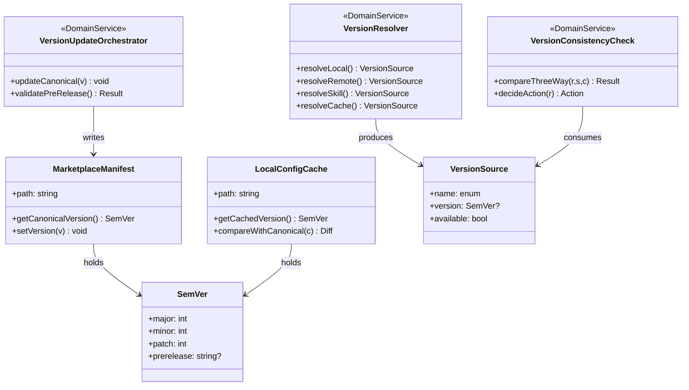

# ドメインモデル: marketplace.json への version SoT 一本化

## 概要

ai-dlc-starter-kit の「version 参照」コンテキストにおける Source of Truth（SoT）を `.claude-plugin/marketplace.json` に一本化し、参照系（確認 / 表示 / 比較）と更新系（リリース時 bump / CI ガード）の責務を整理する。本ドメインモデルは構造と責務のみを定義し、実装コードは Phase 2 で生成する。

**重要**: このドメインモデル設計では**コードは書かず**、構造と責務の定義のみを行う。

## 境界（Bounded Context）

`Version Reference Context` を以下の責務で定義する:

- **正本 SoT 提供**: `marketplace.json.metadata.version` を単一の正本値として提供する
- **キャッシュ値管理**: `config.toml.starter_kit_version` を「ローカルキャッシュ値」（アップグレード差分検出用）として明確化する
- **更新フロー**: `bin/update-version.sh` を更新主体とし、SoT を確実に bump する
- **整合性ガード**: pre-release / CI で SoT 未更新を検出する

**Unit 境界外（触らない）**:

- `aidlc-migrate` の主たる version 比較ロジック（journal ベースの hash / version 比較、エントリポイント挙動）
- `config.toml.starter_kit_version` の用途（ローカルキャッシュ値としての位置付けは維持し、キー削除等の用途見直しは行わない）

**Unit 境界内（fallback 参照ファイルパスのみ / コンテキスト独立性を保つ）**:

- `aidlc-migrate` の fallback 参照（`migrate-apply-config.sh` / `migrate-verify.sh` の `_version_txt="${SCRIPT_DIR}/../../aidlc/version.txt"`）は、削除する `version.txt` 系ファイルへの単なるバインド
- 切替方式: **migrate コンテキスト内で完結**。`skills/aidlc/scripts/lib/version.sh` を直接 `source` してはならない（コンテキスト境界違反 / 逆依存）
- 代替案: migrate スクリプト内に `jq -r '.metadata.version'` のインライン呼び出しを記述する（migrate は既に jq を必須依存として使っているため新規依存は発生しない）。複数箇所で利用するなら `skills/aidlc-migrate/scripts/lib/` 配下に小規模ヘルパーを追加（aidlc lib への依存なし）
- 制約: migrate の主ロジック（journal ベース判定）は不変（GATE-2 (C) 採用 / 指摘 #1 対応）

## エンティティ（Entity）

### MarketplaceManifest

- **ID**: ファイルパス（`.claude-plugin/marketplace.json`）
- **属性**:
  - `name`: string - プラグイン名（"ai-dlc-starter-kit"）
  - `metadata.version`: SemVer - **本コンテキストの正本 version 値**
  - `plugins[]`: list - プラグイン構成（version 参照対象外）
- **振る舞い**:
  - `getCanonicalVersion()`: 正本 version を返す
  - `setVersion(newVersion)`: version を更新する（`bin/update-version.sh` 経由のみ）
  - `validateVersion()`: SemVer フォーマット検証

### LocalConfigCache

- **ID**: ファイルパス（`.aidlc/config.toml`）
- **属性**:
  - `starter_kit_version`: SemVer - **アップグレード差分検出のためのローカルキャッシュ値**
- **振る舞い**:
  - `getCachedVersion()`: キャッシュ値を返す（正本判定には使わない）
  - `compareWithCanonical(canonical)`: 正本と差分があるか判定
- **注意**: 本エンティティは「正本」ではない。正本判定は `MarketplaceManifest.getCanonicalVersion()` に委譲する

## 値オブジェクト（Value Object）

### SemVer

- **属性**: `major.minor.patch[-prerelease]`（既存 `validate_semver()` パターン継続）
- **不変性**: 一度生成された SemVer は変更不可
- **等価性**: 文字列正規化後の完全一致（`v` プレフィックス除去後）

### VersionSource

- **属性**:
  - `name`: enum {`remote`, `skill`, `local`} - 取得元種別
  - `version`: SemVer | null - 取得値（失敗時 null）
  - `available`: boolean - 取得可否
- **不変性**: 取得時刻に固定される
- **等価性**: name + version の組

## 集約（Aggregate）

### VersionManifest（集約ルート: MarketplaceManifest）

- **集約ルート**: MarketplaceManifest
- **含まれる要素**: SemVer
- **境界**: 正本 version の参照・更新一貫性
- **不変条件**:
  - `metadata.version` が SemVer フォーマットを満たす
  - 更新は `bin/update-version.sh` 経由のみ（直接編集禁止）

### VersionConsistency（集約ルート: VersionConsistencyCheck）

- **集約ルート**: VersionConsistencyCheck（後述ドメインサービス）
- **含まれる要素**: MarketplaceManifest, LocalConfigCache, VersionSource[]
- **境界**: 3 ソース（remote / skill / local cache）の整合性判定
- **不変条件**:
  - 3 ソースが揃う場合、正本判定は MarketplaceManifest 値で行う
  - 不一致は警告対象であり、ビジネス上の不変違反ではない（ユーザーへの通知のみ）

## ドメインサービス

### VersionResolver

- **責務**: 各種コンテキスト（CLI / リモート / ローカル）からの version 取得を抽象化する
- **操作**:
  - `resolveLocal()`: ローカルの `marketplace.json` から正本 version を取得
  - `resolveRemote()`: リモート（GitHub raw）の `marketplace.json` から正本 version を取得
  - `resolveSkill()`: スキルバンドルの `marketplace.json` から正本 version を取得
  - `resolveCache()`: `config.toml.starter_kit_version` からキャッシュ値を取得（正本ではない）

### VersionConsistencyCheck

- **責務**: 3 ソース比較（THREE_WAY モード等）に基づく整合性判定とユーザー通知方針の決定
- **操作**:
  - `compareThreeWay(remote, skill, local_cache)`: 既存 `guides/version-check.md` の比較ロジックを保持しつつ参照源を `marketplace.json` ベースに切替
  - `decideAction(comparison_result)`: 既存マトリクスに従ってアクションを決定（「最新です」/「スキル更新を促す」/「`/aidlc setup` 案内」等）

### VersionUpdateOrchestrator

- **責務**: リリース時の version bump を一貫した手順で実行する
- **操作**:
  - `updateCanonical(newVersion)`: `marketplace.json.metadata.version` を更新（アトミック）
  - `validatePreRelease()`: pre-release / CI で SoT 未更新を検出する
- **注意**: `version.txt` 系 3 ファイルへの書き込みは本サービスの責務外（ファイル削除済みのため）

## リポジトリインターフェース

### MarketplaceManifestRepository

- **対象集約**: VersionManifest
- **操作**:
  - `read(path)`: marketplace.json から version を抽出（`dasel` 優先 / `jq` フォールバック。両ツール不在時はエラー＝最終 `grep+sed` フォールバックは持たない / 指摘 #3 対応）
  - `readRemote(url)`: リモート URL から取得（`curl --max-time 5` + `dasel`/`jq` 抽出。同様に `grep+sed` 最終フォールバックなし）
  - `write(path, version)`: version をアトミック更新（mktemp + mv パターン）

> **注（指摘 #3 対応）**: JSON は `grep+sed` での確実なパースが困難（ネスト・エスケープ対応漏れリスク）のため、`dasel` / `jq` のみをサポートする。両ツール不在時は明示的にエラー（exit 2）を返す。CI 環境（ubuntu-latest）には `jq` がプリインストールされており、ローカル開発環境は `dasel` 必須前提（既存 `env-info.sh` の前提と整合）。

### LocalConfigCacheRepository

- **対象集約**: LocalConfigCache（位置付けは「キャッシュ」のため正本リポジトリではない）
- **操作**:
  - `read(path)`: `config.toml.starter_kit_version` を読む（既存 `read_starter_kit_version()` 互換維持）
  - `validate(value)`: SemVer フォーマット検証（既存 `validate_semver()` 流用）
- **注意**: 本リポジトリの値は「正本」ではないことをコメントで明示する

## ファクトリ

なし（既存の関数ベース API で十分。値オブジェクト SemVer 生成も `strip_v_prefix()` + `validate_semver()` の組合せで足りる）

## ドメインモデル図

## ユビキタス言語

- **正本 (Canonical / SoT)**: `marketplace.json.metadata.version`。本コンテキスト唯一の version 真正値
- **ローカルキャッシュ値 (Local Cache Value)**: `config.toml.starter_kit_version`。アップグレード差分検出用のキャッシュであり、正本ではない
- **3 ソース比較 (Three-Way Comparison)**: リモート / スキル / ローカルキャッシュの 3 経路 version 比較（既存仕様。参照源は marketplace.json に切替）
- **pre-release ガード**: リリース PR マージ前に SoT 未更新を検出する CI チェック
- **fallback 参照ファイルパス**: `aidlc-migrate` が fallback として参照していた `skills/aidlc/version.txt` のパス。本 Unit で `marketplace.json` 抽出に置換（主ロジックは不変）

## 不明点と質問

[Question] GATE-1（バックフィル値）: `2.0.4 → 2.6.0` で確定してよいか。`version.txt` 現値 `2.5.6` との差は既存リリース履歴とのねじれだが、Unit 定義「概要」の文言（"2.0.4 → 2.6.0 に更新"）が SoT。
[Answer] 採用: `2.6.0`（Unit 定義「概要」記載に従う）。本 Construction では Unit 003 完了時点で `marketplace.json` を `2.6.0` にバックフィルする。`version.txt` の `2.5.6` は本 Unit 完了時に削除されるため、ねじれは構造的に解消される。

[Question] GATE-3（リモート version 取得の依存ツール）: Inception ステップ実行時の依存最小化として `jq` 優先 / `dasel` フォールバック / 最終 `grep+sed` の 3 段で十分か。
[Answer] 採用: `dasel` 優先（既存環境仕様との整合）/ `jq` フォールバック の **2 段のみ**。`grep+sed` 最終フォールバックは廃止する（指摘 #3 対応 / Round 2 反映）。理由: JSON のネスト・エスケープを `grep+sed` で安全にパースできず、誤抽出リスクがある。両ツール不在時は exit 2 で `error:dasel-and-jq-unavailable` をエラー出力する。CI 環境（ubuntu-latest）には `jq` がプリインストール、ローカル開発環境は `dasel` 必須前提（既存 `env-info.sh` と整合）。リモート取得時も同じ優先順位を適用する。

[Question] GATE-5（CI ガード方式）: (A) `bin/check-marketplace-version.sh` 新規作成 + `pr-check.yml` ジョブ追加で確定してよいか。
[Answer] 採用: (A)。理由: 単一責任で実装が明示的、PR 単位で fail を返せる、既存の `check-defaults-sync.sh` パターン（独立スクリプト + 専用ジョブ）と整合。

[Question] GATE-6（削除順序とコミット粒度）: 論理段階を分けて作業し最終 squash で 1 コミット集約する方針で確定か。
[Answer] 採用: 論理段階を 4 段（バックフィル → 参照側コード切替 → 削除 + CI ガード追加 → ドキュメント更新）で進め、Unit 完了時の squash-unit で 1 コミット集約。

[Question] GATE-1 についてユーザー判断が必要か。`version.txt` の現値 `2.5.6` と乖離するため、Operations Phase でリリース時に bump する従来運用との整合確認が必要かもしれない。
[Answer] 必要なし。本サイクル（v2.6.0）で Operations Phase 到達時に `bin/update-version.sh --version 2.6.0` を実行することで `marketplace.json` も `2.6.0` になる。本 Unit ではバックフィル値として `2.6.0` を直接書き込む（Operations Phase で再実行しても idempotent）。
