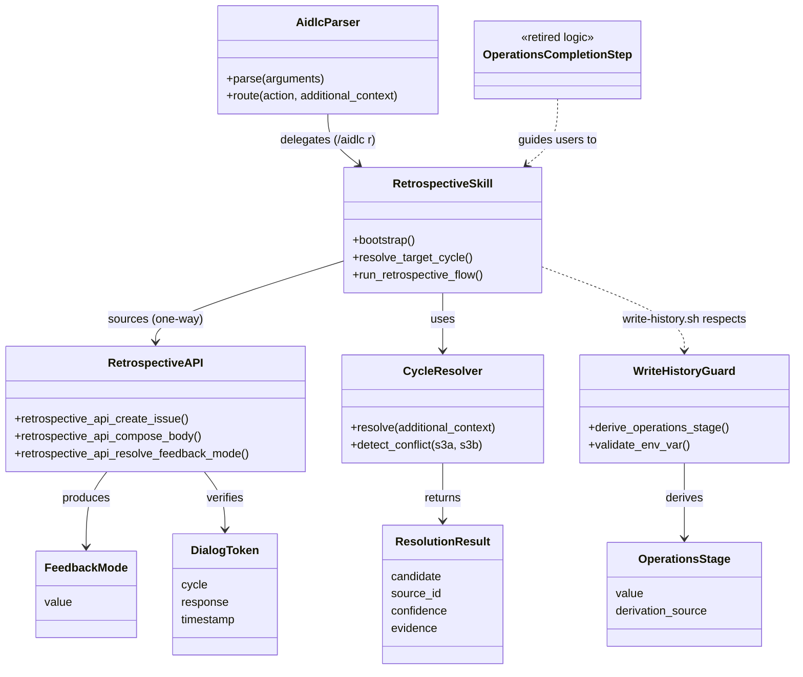

# ドメインモデル: Unit 005 - /aidlc-retrospective 独立スキル化

## 概要

「振り返り（retrospective）」を Operations Phase の責務から分離し、独立スキル `aidlc-retrospective` として再構成するためのコンポーネント境界とインターフェース契約を定義する。本 Unit はソフトウェアのビジネスドメインではなく **AI-DLC スキル基盤のメタ構造**を設計対象とするため、テンプレートの DDD 用語を「論理コンポーネント / 値オブジェクト / ガード契約」として読み替えて記述する。

**重要**: このドメインモデル設計では**コードは書かず**、構造と責務の定義のみを行う。実装は Phase 2 で行う。

---

## エンティティ（論理コンポーネント）

### 1. RetrospectiveSkill（独立スキル）

- **ID**: スキル名 `aidlc-retrospective`（ファイル配置: `skills/aidlc-retrospective/`）
- **属性**:
    - `version`: スキルバージョン（独立に管理 / `version.txt` 等 / Phase 1 論理設計で確定）
    - `entry_point`: `SKILL.md` のフロントマター `name` と本文の起動手順
    - `argument_hint`: `[追加コンテキスト]`（対象サイクル指定または対話開始）
    - `committed_inputs`: 対象サイクル / additional_context
- **振る舞い**:
    - `bootstrap()`: `AIDLC_BASE` を解決して `retrospective-api.sh` を `source`
    - `resolve_target_cycle()`: `CycleResolver` に解決を委譲
    - `gate_feedback_mode()`: feedback_mode の opt-out（`disabled` 時は exit 0）
    - `run_retrospective_flow()`: 振り返りフロー本体を起動（feedback_mode 解決 → wizard / cap 判定 → 本文構築 → Issue 起票 → spool fallback → mirror_state 更新）
    - **不変条件**: `aidlc` 本体スキルへの逆参照を作らない（単方向境界）

### 2. AidlcParser（既存スキルの拡張）

- **ID**: スキル名 `aidlc` の SKILL.md 内「引数ルーティング」テーブル
- **属性**:
    - `actions`: 既存 `inception` / `construction` / `operations` / `setup` / `express` / `feedback` / `migrate` / `help` / `version` に **`retrospective`（短縮: `r`）を追加**
    - `delegation_targets`: `setup` / `migrate` / `feedback` / **`retrospective`（新規）**
- **振る舞い**:
    - `parse(arguments)`: 先頭トークンを action として展開（短縮形対応）
    - `route(action, additional_context)`: `retrospective` / `r` の場合は `/aidlc-retrospective {additional_context}` への委譲指示を出力
    - **不変条件**: 委譲後は親スキルが成功/失敗の検出責務を持たない（既存の `setup` / `migrate` / `feedback` と同等）

### 3. RetrospectiveAPI（公開 API 層）

- **ID**: `skills/aidlc/scripts/lib/retrospective-api.sh`
- **属性**:
    - `internal_libs`: 内部 source 対象 `lib/retrospective-issue.sh` / `lib/feedback-mode.sh` / `lib/feedback-mode-wizard.sh` / `lib/predecessor-issue.sh`
    - `exported_functions`: 公開関数リスト（`retrospective_api_*` プレフィックス）
- **振る舞い**:
    - `retrospective_api_resolve_feedback_mode(raw)`: feedback_mode を 5 値（`silent` / `mirror` / `disabled` / `interactive` / 未設定 silent fallback）で正規化
    - `retrospective_api_compose_body(draft_yaml_path, kpt_md_path, cycle)`: 振り返り Issue 本文構築
    - `retrospective_api_create_issue(body_path, mode, cycle)`: dialog token verify 内蔵の Issue 起票
    - `retrospective_api_record_response(cycle, response)`: dialog token 発行（`approved` / `denied`）
    - `retrospective_api_run_wizard()`: interactive wizard
    - `retrospective_api_check_cap(mode, current_count, limit)`: cap 判定
- **不変条件**:
    - 非公開関数（`_validate_apply_path` 等の内部実装）への外部依存を禁止
    - 戻り値の出力形式は関数タイプ別に分類する（指摘 #3 反映 / Round 1）:
        - **タイプ A（副作用あり / 状態を持つ）**: `key=value` 複数行形式（例: `retrospective_api_create_issue`、`retrospective_api_record_response`）。呼出側はキー単位でパースする
        - **タイプ B（純粋値返却 / 単一値）**: raw text 1 行形式（例: `retrospective_api_resolve_feedback_mode` → `silent`、`retrospective_api_run_wizard` → `mirror`、`retrospective_api_check_cap` → `over=true`、`retrospective_api_compose_body` → markdown 本文）。呼出側はそのまま読み取る
    - 例外ルールが許可される関数は API リファレンスで明示し、無断追加を禁止
    - 呼出側のパース責務はタイプ A では「キー単位での正規表現抽出」、タイプ B では「stdout 全体をそのまま使用」

### 4. CycleResolver（独立コンポーネント）

- **ID**: 配置先は `skills/aidlc/scripts/lib/cycle-resolver.sh` または `aidlc-retrospective` 配下（Phase 1 論理設計で確定）
- **属性**:
    - `strategies`: 4 つの Strategy（S1 ArgStrategy / S2 BranchStrategy / S3a GitLogStrategy / S3b CycleDirStrategy）
    - `priority_order`: `S1 > S2 > S3a > S3b`
- **振る舞い**:
    - `resolve(additional_context) -> ResolutionResult | null`: 全 Strategy を実行 → 候補リスト収集 → 優先順位適用 → fail-safe ガード適用
    - `detect_conflict(s3a, s3b) -> bool`: S3a と S3b の候補が不一致かを判定
- **不変条件**:
    - 第一候補が `confidence != high` かつ S3a/S3b が不一致 → AskUserQuestion 必須
    - 候補ゼロ → AskUserQuestion フォールバック

### 5. WriteHistoryGuard（既存 `write-history.sh` の拡張）

- **ID**: `skills/aidlc/scripts/write-history.sh`
- **属性**:
    - `operations_stage`: 導出値（`pre-merge` / `post-merge`）
    - `derivation_inputs`: `AIDLC_OPERATIONS_STAGE` 環境変数 / `git rev-parse --abbrev-ref HEAD` / `gh pr view` / cycle directory の存在
- **振る舞い**:
    - `derive_operations_stage()`: 実行コンテキストから operations_stage を導出
    - `validate_env_var()`: `AIDLC_OPERATIONS_STAGE` が設定済の場合、許可値のみ受容
    - `apply_state_transition_guard()`: `pre-merge → post-merge` の単方向遷移のみ許可
    - `block_post_merge_write()`: `post-merge` で `cycles/{{CYCLE}}/**` 書き込み試行時 exit 3
- **不変条件**:
    - 未検証値は fail-closed（exit 3）
    - 状態遷移は単方向のみ
    - `aidlc-retrospective` 経由でも本契約は不変

### 6. OperationsCompletionStep（既存 §1 の縮退）

- **ID**: `skills/aidlc/steps/operations/04-completion.md` §1（振り返り）
- **属性**:
    - `pre_extraction_state`: §1.0〜§1.6 の実行ロジックを内包
    - `post_extraction_state`: 案内文のみ「振り返りは `/aidlc r` を実行してください」
- **振る舞い**:
    - 実行ロジックは削除し、`/aidlc r` への案内のみ残す
    - `predecessor_resolve_issue`（Inception 側）への影響なし
- **不変条件**:
    - §1 の実行ロジック残存 = ゼロ（検証コマンド: `grep -rn "retrospective_issue_create\|retrospective_prefill_hook\|retrospective_update_hook" skills/aidlc/steps/operations/`）

---

## 値オブジェクト

### ResolutionResult

- **属性**:
    - `candidate`: string（解決されたサイクル名 / 例: `v2.6.0`）
    - `source_id`: enum（`arg` / `branch` / `gitlog` / `cycledir` / `user_input`）
    - `confidence`: enum（`high` / `medium` / `low`）
    - `evidence`: string（決定根拠 / 例: ブランチ名・コミット SHA・ディレクトリパス）
- **不変性**: 一度生成されたら変更されない（Strategy 実行結果のスナップショット）
- **等価性**: 全フィールド一致で等価

### FeedbackMode

- **属性**:
    - `value`: enum（`silent` / `mirror` / `disabled` / `interactive` / 未設定 silent fallback）
- **不変性**: 起動時に確定し、フロー実行中は不変
- **等価性**: `value` 一致で等価

### OperationsStage

- **属性**:
    - `value`: enum（`pre-merge` / `post-merge`）
    - `derivation_source`: enum（`env_var` / `branch_pr_state` / `cycle_dir`）
- **不変性**: 一度導出されたら同一実行内で不変
- **等価性**: `value` 一致で等価

### DialogToken

- **属性**:
    - `cycle`: string
    - `response`: enum（`approved` / `denied`）
    - `timestamp`: 発行時刻（TTL 300 秒）
- **不変性**: 発行後に内容変更不可（TTL 失効のみ）
- **等価性**: `cycle` 一致で等価（同一サイクル内では最新トークンのみ有効）

---

## 集約

### RetrospectiveExecution

- **集約ルート**: `RetrospectiveSkill`
- **含まれる要素**:
    - `FeedbackMode`（値オブジェクト）
    - `ResolutionResult`（値オブジェクト / CycleResolver の結果）
    - `DialogToken`（値オブジェクト / dialog token guard 経由）
    - `RetrospectiveIssueBody`（Issue 本文 / `lib/retrospective-issue.sh` 経由で構築）
- **境界**: 振り返り 1 回分の実行コンテキスト（起動 → 起票 / spool / 終了 まで）
- **不変条件**:
    - `FeedbackMode = disabled` → 起動メッセージ表示 + exit 0（Issue 起票なし）
    - Issue 起票直前に `DialogToken` が `approved` で発行済 + TTL 内であること
    - `cap 超過` 時は Step 3〜5 をスキップして §1.6 相当へ
    - `gh_status != available` 時は spool fallback

### OperationsStageDerivation

- **集約ルート**: `WriteHistoryGuard`
- **含まれる要素**:
    - `OperationsStage`（値オブジェクト）
    - 実行コンテキスト（ブランチ / PR / cycle dir）
- **境界**: `write-history.sh` 1 回分の実行
- **不変条件**:
    - `AIDLC_OPERATIONS_STAGE` 設定済 → 許可値のみ受容
    - 未設定 → 実行コンテキストから自動導出 / 判定不能なら exit 3
    - `post-merge → pre-merge` 逆遷移は禁止（exit 3）

---

## ドメインサービス

### CycleResolverStrategyOrchestrator

- **責務**: `CycleResolver` 内で 4 つの Strategy を順次実行し、優先順位と fail-safe ガードを適用する
- **操作**:
    - `run_all_strategies(additional_context) -> List<ResolutionResult>`: 全 Strategy 実行
    - `select_first_match(results) -> ResolutionResult | null`: 優先順位適用
    - `apply_fail_safe_guard(first, s3a, s3b) -> ResolutionResult`: 不一致時 AskUserQuestion フォールバック

### RetrospectiveFlowController

- **責務**: 振り返りフローの呼び出し順序を制御する（feedback_mode 解決 → wizard / cap → 本文構築 → 起票 → spool / mirror）
- **操作**:
    - `start(target_cycle, additional_context)`: フロー起動
    - `dispatch_by_mode(mode)`: feedback_mode 別の分岐
    - `handle_cap_exceeded()`: cap 超過時の §1.6 相当処理
    - `handle_gh_unavailable()`: spool fallback

### MigrateNotifier（既存 `aidlc-migrate` の拡張）

- **責務**: v2.5.x → v2.6.0 アップグレード時の破壊的変更を通知する
- **操作**:
    - `emit_v260_breaking_notice()`: 「Operations 内振り返りは `/aidlc r` に移行されました」を出力

---

## リポジトリインターフェース（外部リソース境界）

### GitHubIssueRepository（既存 / 既存 lib に内包）

- **対象集約**: `RetrospectiveExecution.RetrospectiveIssueBody`
- **操作**:
    - `create(body, labels, milestone) -> issue_url`: Issue 起票
    - `view(number) -> Issue`: 既存 Issue 参照
    - `edit(number, fields)`: ラベル・本文の更新（mirror_state ラベル化等）

### SpoolRepository（既存 / `lib/aidlc-spool.sh` に内包）

- **対象集約**: `RetrospectiveExecution`（spool fallback 時）
- **操作**:
    - `append(cycle, body)`: スプール追記
    - `flush()`: `retrospective-resend.sh` 経由で gh 復旧時に再送

### FileSystemConfigRepository（既存 / `read-config.sh` 経由）

- **対象集約**: `FeedbackMode` の正規化に使用
- **操作**:
    - `read(key) -> value | null`: `.aidlc/config.toml` / `.aidlc/config.local.toml` のマージ値読み出し

---

## ファクトリ

### RetrospectiveAPIFactory

- **生成対象**: `retrospective-api.sh` の bootstrap 状態
- **生成ロジック概要**:
    - `AIDLC_BASE` を解決（`CLAUDE_PROJECT_DIR` / `${BASH_SOURCE[0]}` 起点 / `gh repo view` の優先順位 / Phase 1 論理設計で確定）
    - 内部 `lib/*.sh` を `source`
    - 公開 API（`retrospective_api_*` プレフィックス）のみを export
    - 非公開関数は `_internal_*` プレフィックスを付与（外部から呼ばれにくくする）

---

## ドメインモデル図

依存方向は単方向。**層定義（指摘 #2 反映 / Round 1）**:

| 層 | コンポーネント | 役割 |
|----|---------------|------|
| L1 Parser 層 | `AidlcParser` | エントリポイント / 委譲指示 |
| L2 独立スキル層 | `RetrospectiveSkill` | フロー制御 / bootstrap |
| L3 公開コンポーネント層（並列） | `RetrospectiveAPI`（Facade for Issue/feedback 系） `CycleResolver`（独立公開コンポーネント for サイクル特定） `WriteHistoryGuard`（独立 Guard コンポーネント for マージ前完結契約） | 公開境界 |
| L4 内部実装層 | `lib/retrospective-issue.sh` / `lib/feedback-mode.sh` / `lib/feedback-mode-wizard.sh` / `lib/predecessor-issue.sh` 等 | 内部実装（外部から直接呼ばない） |

**依存規則**:

- `L1 → L2 → L3 → L4` の単方向のみ許可
- L3 内のコンポーネントは互いに独立（`RetrospectiveAPI` と `CycleResolver` は相互依存しない）
- `RetrospectiveSkill` は L3 の複数コンポーネントを直接参照可（`retrospective-api.sh` と `cycle-resolver.sh` を別目的の公開コンポーネントとして source）
- L4 → L3 / L3 → L2 / L2 → L1 の逆参照は禁止
- `RetrospectiveSkill → AidlcParser` の逆参照は禁止

**Facade 境界**: `RetrospectiveAPI` は **Issue / feedback 系の Facade**（`lib/retrospective-issue.sh` / `lib/feedback-mode.sh` 等を集約）。`CycleResolver` は別目的（サイクル特定）の独立公開コンポーネントであり、Facade の対象外。両者を「L3 公開コンポーネント層」として並列扱いすることで境界を明確化する。

---

## ユビキタス言語

- **振り返り（retrospective）**: サイクル完了後に Keep / Problem / Try を整理し、必要に応じて GitHub Issue 化する活動
- **feedback_mode**: 振り返りフローの動作モード（5 値: `silent` / `mirror` / `disabled` / `interactive` / 未設定 silent fallback）
- **mirror フロー**: 振り返り内容を upstream リポジトリ（AI-DLC Starter Kit）に Issue として送信する経路
- **spool fallback**: `gh` 不可時に振り返り内容をローカルに退避し、後で `retrospective-resend.sh` で再送する仕組み
- **dialog token guard**: 振り返り Issue 起票前に AskUserQuestion 応答を要求し、対話確認トークン（TTL 300 秒）で副作用をブロックする二段防御
- **マージ前完結契約（pre-merge contract）**: PR マージ後は `cycles/{{CYCLE}}/**` を改変できない契約。`write-history.sh --operations-stage post-merge` 等で exit 3 ブロック
- **operations_stage**: `write-history.sh` で導出される実行ステージ（`pre-merge` / `post-merge`）。本 Unit で「呼出元入力値」から「導出値」に変更
- **公開 API 層（retrospective-api.sh）**: `aidlc-retrospective` から内部 `lib/*.sh` の実装詳細に依存しないための再エクスポート境界
- **CycleResolver**: 振り返り対象サイクルを 4 つの Strategy（引数 / ブランチ / git log / ディレクトリ）で解決する独立コンポーネント
- **単方向境界（one-way boundary）**: `aidlc-retrospective` から `aidlc` 本体スキルへの逆参照を作らない設計原則
- **破壊的変更（breaking change）**: v2.6.0 で Operations 内振り返り起動を完全廃止する非互換変更

---

## 不明点と質問（設計中に記録）

[Question] `CycleResolver` の配置先を `skills/aidlc/scripts/lib/cycle-resolver.sh`（共有）と `skills/aidlc-retrospective/scripts/cycle-resolver.sh`（独立スキル内）のどちらにするか？
[Answer] Phase 1 論理設計で確定。**初期案**: `skills/aidlc/scripts/lib/cycle-resolver.sh`（共有 lib として配置）。理由は (1) Inception の `predecessor_resolve_issue` でも将来再利用される可能性 / (2) 単方向境界（公開 API 層経由の `source`）と整合 / (3) `aidlc-retrospective` 単独でのコピー重複を避ける。

[Question] `retrospective-api.sh` で公開する関数の最小集合は何か？
[Answer] Phase 1 論理設計で確定。**初期案**: 6 関数（`resolve_feedback_mode` / `compose_body` / `create_issue` / `record_response` / `run_wizard` / `check_cap`）。Operations §1.0〜§1.6 の呼び出し箇所を逆引きして最小集合を抽出する。

[Question] `aidlc-retrospective` の `version.txt` をスタータキット本体の version と独立に管理するか？
[Answer] Phase 1 論理設計で確定。**初期案**: `aidlc-feedback` に倣う（`version.txt` を持たない / 親スキル `aidlc` の version に追従）。理由は破壊的変更が v2.6.0 に紐付くため、独立 version を持つ意義が薄い。

[Question] `OperationsStage` 導出時の `gh pr view` 失敗（オフライン等）はどう扱うか？
[Answer] Phase 1 論理設計で確定。**初期案**: `gh_status != available` 時はブランチ名のみで判定する fallback ロジック（`main` ブランチ + cycle dir 存在 → `post-merge` / `cycle/*` ブランチ → `pre-merge` / その他 → exit 3）。fail-closed の原則を維持する。
