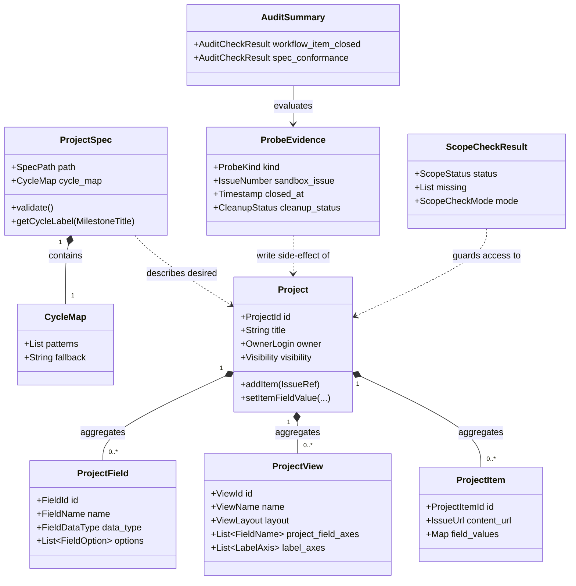

# ドメインモデル: Unit 006 GitHub Projects (ProjectsV2) フル移行

## 概要

GitHub Projects (ProjectsV2) を AI-DLC スターターキットのバックログ管理基盤として移行・運用するためのドメインモデル。GitHub.com 上の Project 構造を **宣言的仕様（Declarative Spec）** に集約し、`apply（実環境反映）` / `probe（書き込み副作用検証）` / `audit（read-only 評価）` の 3 責務に分離した適用アダプタを介して操作する。

**重要**: このドメインモデル設計では**コードは書かず**、構造と責務の定義のみを行います。実装は Phase 2（コード生成ステップ）で行います。

## エンティティ（Entity）

### Project

GitHub Projects (ProjectsV2) インスタンス。Owner（user / org）の下に存在する。

- **ID**: `ProjectId`（GitHub の `PVT_xxx` 形式の Node ID + Project number）
- **属性**:
  - `title`: String - Project の表示名（例: `AI-DLC Starter Kit Roadmap`）
  - `owner`: OwnerLogin - Project を保持する user または org の login（例: `ikeisuke`）
  - `visibility`: Visibility - `public` / `private`
  - `number`: Integer - Owner 内で一意の連番
  - `url`: ProjectUrl - GitHub.com 上の Project URL
  - `workflows`: List<ProjectWorkflow> - Project に紐づく自動化 workflow（intent のみ表現、有効/無効状態を含む）
- **振る舞い**:
  - `addItem(IssueReference)`: Project に Issue を Item として追加（Issue 自体は変更しない）
  - `setItemFieldValue(ProjectItemId, FieldName, FieldValue)`: Item の Project field を更新
  - `markWorkflowEnabled(WorkflowId)`: 自動化 workflow を「有効状態である」と意図表明する（実行経路は問わず、ドメイン上は intent のみ）

> **R1 指摘 #1 への対応**: 実行経路（CLI / GraphQL / UI）はドメイン層から排除し、アプリケーションサービス（`ProjectReconciler` / `WorkflowProbe`）と論理設計側の `ApplyStrategy` に閉じ込める。`Project.markWorkflowEnabled` はドメイン上の状態表明のみ。

### ProjectField

Project に紐づく field 定義。`Status` / `Priority` / `Cycle` の 3 種を持つ（`Type` は Project field ではなく Issue labels 派生軸として扱う）。

- **ID**: `FieldId`（GitHub の `PVTF_xxx` 形式の Node ID）
- **属性**:
  - `name`: FieldName - `Status` / `Priority` / `Cycle` のいずれか
  - `data_type`: FieldDataType - 本 Unit では `single_select` のみ
  - `options`: List<FieldOption> - single select の選択肢集合
- **振る舞い**:
  - `addOption(FieldOption)`: 選択肢を追加（既存選択肢は保持 / idempotent）

### ProjectView

Project に紐づく view 定義。Roadmap / Backlog Board / Priority Table / Feedback View の 4 種を持つ。

- **ID**: `ViewId`（GitHub の `PVTV_xxx` 形式の Node ID）
- **属性**:
  - `name`: ViewName - 表示名
  - `layout`: ViewLayout - `roadmap_layout` / `board_layout` / `table_layout`
  - `group_by`: Optional<FieldName> - グルーピング軸（Board の場合 `Status` 等 / Project field のみ）
  - `project_field_axes`: List<FieldName> - Project field を表示軸として使う集合（R1 指摘 #3 反映）
  - `label_axes`: List<LabelAxis> - Issue labels を表示軸として使う集合（例: `Type` ≒ `type:*` ラベル / R1 指摘 #3 反映）
  - `filter`: Optional<ViewFilter> - 表示フィルタ（例: `is:open` / `label:type:feedback is:open`）
- **振る舞い**:
  - 設定変更は GitHub 側の create/update API 経由（本 Unit では create のみ）

> **R1 指摘 #1 への対応**: 実行経路 `apply_strategy` は本 ViewDescriptor にも持たせず、論理設計側の `views[].apply_strategy` フィールドとして spec.yaml にのみ宣言する。ドメインモデル上は「どの軸で表示するか」のみを表現。
> **R1 指摘 #3 への対応**: `project_field_axes`（Project field の集合）と `label_axes`（labels 派生軸の集合）を分離。`Type` は常に `label_axes` に属し、`project_field_axes` には含まれない。

### ProjectItem

Project に追加された Issue / PR の参照。Issue 自体とは独立した Project 上のレコード。

- **ID**: `ProjectItemId`（GitHub の `PI_xxx` 形式の Node ID）
- **属性**:
  - `content_url`: IssueUrl - 紐づく Issue / PR の URL
  - `field_values`: Map<FieldName, FieldValue> - Project field の現在値
- **振る舞い**:
  - `setFieldValue(FieldName, FieldValue)`: field 値を更新（Project の振る舞い経由）

### ProjectSpec

宣言的仕様。Project の desired state を YAML で表現する単一 SoT（Single Source of Truth）。**ローカル設定エンティティ**であり GitHub 側には存在しない。

- **ID**: `SpecPath`（`config/github-project-spec.yaml`）
- **属性**:
  - `project`: ProjectDescriptor - `{title, owner, visibility}`
  - `fields`: List<FieldDescriptor> - field の desired state
  - `views`: List<ViewDescriptor> - view の desired state
  - `workflows`: List<WorkflowDescriptor> - 自動化 workflow の desired state
  - `manual_actions`: List<ManualActionDescriptor> - UI 手動工程 + 監査チェックキー
  - `cycle_map`: CycleMap - Milestone → Cycle 値の正規化マップ（spec 内包 / R2 指摘 #1）
  - `item_sources`: ItemSourceDescriptor - Item 投入対象の抽出ルール
- **振る舞い**:
  - `validate()`: spec の文法・必須キー・許容値を検証
  - `getCycleLabel(MilestoneTitle)`: cycle_map.patterns を順次照合し、マッチした `cycle_label` を返す。マッチなし / null → `cycle_map.fallback`（`Later`）

### ProbeEvidence

`probe-github-project.sh` が出力する write 副作用の記録。`audit-github-project.sh` の入力となる。

- **ID**: `EvidencePath`（`audit/probe-evidence.json` 等）
- **属性**:
  - `probe_kind`: ProbeKind - `workflow-item-closed` 等
  - `sandbox_issue_number`: IssueNumber - 検証用に作成した sandbox Issue の番号
  - `project_item_id`: ProjectItemId - sandbox Issue を Project に追加した際の ProjectItemId
  - `closed_at`: Timestamp - sandbox Issue の close タイムスタンプ
  - `cleanup_status`: CleanupStatus - `succeeded` / `failed`
- **振る舞い**:
  - `isComplete()`: probe 副作用が完了しているか（必須フィールドが揃っているか）

### AuditSummary

`audit-github-project.sh` の評価結果。CI / 工程 D8 で参照される。

- **ID**: `SummaryPath`（`audit/audit-summary.json`）
- **属性**:
  - `workflow_item_closed`: AuditCheckResult - `pass` / `fail` + evidence 参照
  - `spec_conformance`: AuditCheckResult - `pass` / `drift` + drift 詳細
  - `evaluated_at`: Timestamp
- **振る舞い**:
  - `hasFailure()`: いずれかの check が失敗しているか（CI 判定用）

### ScopeCheckResult

`bin/lib/gh-scope-check.sh` の構造化結果。strict/soft モードで挙動が変わる。

- **ID**: `(check_invocation_id)` - 呼出ごとに採番
- **属性**:
  - `status`: ScopeStatus - `ok` / `scope_missing`
  - `missing`: List<ScopeName> - 不足スコープのリスト
  - `mode`: ScopeCheckMode - `strict` / `soft`
- **振る舞い**:
  - `toExitCode()`: `strict` → 不足時 exit 2 / `soft` → exit 0
  - `toStderr()`: 構造化 JSON を stderr 出力

## 値オブジェクト（Value Object）

### Visibility

- **属性**: `enum`: `public` / `private`
- **不変性**: Visibility は Project 作成後に変更されない前提（変更は別ドメイン操作）
- **等価性**: 文字列値の完全一致

### FieldName / FieldOption / FieldValue

- **属性**:
  - `FieldName`: String - `Status` / `Priority` / `Cycle` のいずれか
  - `FieldOption`: String - 各 field の選択肢（例: Status の `Backlog`）
  - `FieldValue`: FieldOption への参照
- **不変性**: FieldOption は spec 上で宣言された集合に閉じる
- **等価性**: 文字列値の完全一致

### ViewLayout / ProbeKind / ScopeCheckMode / LabelAxis

- **属性**: 各 enum / 値オブジェクト
  - `ViewLayout`: `roadmap_layout` / `board_layout` / `table_layout`
  - `ProbeKind`: `workflow-item-closed`（将来拡張可）
  - `ScopeCheckMode`: `strict` / `soft`
  - `LabelAxis`: `{name: String, label_prefix: String}`（例: `{name: "Type", label_prefix: "type:"}`）
- **不変性**: enum 列挙値以外は受け付けない
- **等価性**: 文字列値の完全一致

> **R1 指摘 #1 への対応**: `ApplyStrategy`（`cli` / `graphql` / `manual`）はドメイン層から排除。論理設計側の Phase 2 実装方針として spec.yaml の `views[].apply_strategy` / `workflows[].apply_strategy` のみで使用する。

### CycleMap

`ProjectSpec` 内に内包される正規化マップ（R2 指摘 #1 で外部 JSON ファイルから spec 内包に変更）。

- **属性**:
  - `patterns`: List<{milestone_pattern: Regex, cycle_label: String}>
  - `fallback`: String - 通常 `Later`
  - `delete_handling`: String - 通常 `Later`
- **不変性**: マップは Project 操作中に変更されない（spec 改訂は別タイミング）
- **等価性**: パターンリスト + fallback の構造比較

### IssueReference / IssueUrl / MilestoneTitle / OwnerLogin / Timestamp

- **属性**:
  - `IssueUrl`: `https://github.com/{owner}/{repo}/issues/{N}` 形式の URL
  - `MilestoneTitle`: String（例: `v2.6.0`）
  - `OwnerLogin`: String（例: `ikeisuke`）
  - `Timestamp`: ISO 8601 文字列
- **不変性**: 値オブジェクトは作成後変更しない
- **等価性**: 文字列値の完全一致

### AuditCheckResult

- **属性**:
  - `status`: `pass` / `fail` / `drift`
  - `evidence_ref`: Optional<EvidencePath>
  - `details`: Map<String, Any> - drift 詳細など
- **不変性**: 評価時点でのスナップショット
- **等価性**: status + evidence_ref + details の構造比較

## 集約（Aggregate）

### Project Aggregate

GitHub Projects 上の単一 Project を統括する集約。

- **集約ルート**: `Project`
- **含まれる要素**:
  - `Project`（root）
  - `List<ProjectField>`
  - `List<ProjectView>`
  - `List<ProjectItem>`
  - `List<ProjectWorkflow>`
- **境界**: 単一 Project 内のフィールド・ビュー・Item・workflow の整合性を保護する。Project 間の関係は本集約のスコープ外
- **不変条件**:
  - Project には `Status` / `Priority` / `Cycle` の 3 field が必ず存在する（spec 宣言と一致）
  - 各 ProjectItem の `field_values` は対応 ProjectField の `options` の値を取る
  - View の `group_by` / `project_field_axes` は実在する FieldName を参照する（`label_axes` は labels への参照のみ / R1 指摘 #3）

### ProjectSpec Aggregate

宣言的仕様を統括する集約。GitHub 側とは独立したローカル設定。

- **集約ルート**: `ProjectSpec`
- **含まれる要素**:
  - `ProjectSpec`（root）
  - `CycleMap`（内包）
  - `List<ManualActionDescriptor>`
  - `ItemSourceDescriptor`
- **境界**: 単一 spec ファイル（`config/github-project-spec.yaml`）内の宣言の整合性を保護
- **不変条件**（R2 指摘 #2 反映で `project_field_axes` / `label_axes` 分離後の契約に書き換え）:
  - `views[*].project_field_axes ⊆ fields[*].name`（Project field 軸は宣言済 field のみ参照）
  - `views[*].label_axes[*].label_prefix` は非空文字列で `:` を含む（例: `type:`）
  - `views[*].group_by` は `fields[*].name` のいずれかに一致（dangling 禁止）
  - `cycle_map.fallback` は必ず非空文字列
  - `manual_actions[*].audit_check` は実在する audit check 種別（`workflow-item-closed` / `spec-conformance` 等）を参照する

### Audit Aggregate

probe / audit の実行結果を統括する集約。

- **集約ルート**: `AuditSummary`
- **含まれる要素**:
  - `AuditSummary`（root）
  - `List<ProbeEvidence>` - 評価対象となった probe 結果
- **境界**: 単一監査セッション内の evidence 集合の整合性を保護
- **不変条件**:
  - 各 audit check は対応する probe evidence（必要な場合）を参照する
  - `workflow_item_closed` audit check が `pass` の場合、`workflow-item-closed` probe evidence の `cleanup_status=succeeded` であること

## ドメインサービス

### ProjectReconciler

宣言的仕様（`ProjectSpec`）と実環境の `Project` 状態を比較し、差分を解消する責務。

- **責務**: spec.yaml を desired state、実環境を current state とし、ensure-* 系操作で差分を解消する
- **操作**:
  - `reconcileProject(ProjectSpec, dry_run: bool)`: Project 作成 / title 確認
  - `reconcileFields(ProjectSpec, Project, dry_run: bool)`: field 作成 / option 追加（既存削除はしない）
  - `reconcileViews(ProjectSpec, Project, dry_run: bool)`: view 作成（apply_strategy に従い CLI / GraphQL / manual 案内）
  - `syncItems(ProjectSpec, Project, IssueSet, dry_run: bool)`: 対象 Issue を Item として追加 + 初期 field 値セット

### CycleResolver

Issue の milestone から Project の `Cycle` field 値を導出するサービス。

- **責務**: Milestone title を `CycleMap` に基づき正規化して Cycle field 値を返す
- **操作**:
  - `resolveCycle(MilestoneTitle, CycleMap)`: パターン照合 → cycle_label / fallback

### ItemSourceCollector

Item 一括投入の対象 Issue 集合を抽出するサービス。

- **責務**: Issue #524 本文 + `backlog` ラベル付き Open Issue から union を生成
- **操作**:
  - `collect(IssueSourceDescriptor)`: List<IssueReference> を返す（Issue 番号昇順）

### WorkflowProbe

`Item closed` → `Status=Done` workflow の動作を sandbox Issue で検証するサービス。**write 副作用あり**（R2 指摘 #2 で audit から分離）。

- **責務**: sandbox Issue 作成 / Project 追加 / close / cleanup と probe-evidence.json 生成
- **操作**:
  - `probeWorkflowItemClosed(Project)`: ProbeEvidence を返す
  - cleanup は probe 自身の責務（成功/失敗どちらでも実施）

### ProjectAuditor

probe-evidence と spec を入力に Project の状態を read-only で評価するサービス（R2 指摘 #2 で write 操作から分離）。

- **責務**: probe 結果と現在の Project 状態を評価し AuditSummary を生成
- **操作**:
  - `auditWorkflowItemClosed(ProbeEvidence, Project)`: AuditCheckResult
  - `auditSpecConformance(ProjectSpec, Project)`: AuditCheckResult

### ScopeChecker

`gh auth status` の出力をパースし必須スコープの充足を判定するサービス。

- **責務**: 必須スコープの集合と現在のトークンスコープを比較し ScopeCheckResult を返す
- **操作**:
  - `check(required: List<ScopeName>, mode: ScopeCheckMode)`: ScopeCheckResult

## リポジトリインターフェース

### ProjectRepository

`Project` 集約の永続化抽象。実装は `gh project` CLI / GraphQL を呼び出す。

- **対象集約**: `Project`
- **操作**:
  - `findByTitle(OwnerLogin, title)`: Optional<Project>
  - `create(OwnerLogin, title, visibility)`: Project
  - `listFields(Project)`: List<ProjectField>
  - `createField(Project, FieldDescriptor)`: ProjectField
  - `addFieldOption(ProjectField, FieldOption)`: void
  - `listViews(Project)`: List<ProjectView>
  - `createView(Project, ViewDescriptor)`: Optional<ProjectView>（リポジトリ層はドメイン非依存。実行戦略の選択はアプリケーション層 `ProjectReconciler` の責務 / R2 指摘 #1 反映）
  - `listItems(Project)`: List<ProjectItem>
  - `addItem(Project, IssueUrl)`: ProjectItem
  - `setItemFieldValue(ProjectItem, FieldName, FieldValue)`: void
  - `delete(Project)`: void（取り消し用 / 工程 D2 取り消し性）

### IssueRepository（読み取り専用 / 既存 lib 流用）

Issue / Milestone / Label の取得抽象。

- **対象集約**: `Issue` 集約（本 Unit のスコープ外、参照のみ）
- **操作**:
  - `view(IssueNumber)`: Issue
  - `listOpen(label?, milestone?)`: List<Issue>
  - `getMilestone(IssueNumber)`: Optional<MilestoneTitle>
  - `getLabels(IssueNumber)`: List<LabelName>
  - `editBody(IssueNumber, body, backupPath)`: void（migrate-issue-524.sh が利用 / バックアップ必須）

### SpecRepository

`ProjectSpec` 集約のローカル永続化抽象。

- **対象集約**: `ProjectSpec`
- **操作**:
  - `load(SpecPath)`: ProjectSpec
  - `validate(ProjectSpec)`: ValidationResult

### EvidenceRepository / SummaryRepository

probe / audit の生成物を保存する抽象。

- **対象集約**: `ProbeEvidence` / `AuditSummary`
- **操作**:
  - `saveEvidence(ProbeEvidence)`: void
  - `loadEvidence(EvidencePath)`: ProbeEvidence
  - `saveSummary(AuditSummary)`: void

## ファクトリ（必要な場合のみ）

### ProjectFactory

GitHub Projects の Node ID 体系（PVT_xxx / PVTF_xxx 等）を扱う初期化を隠蔽。`gh project create` レスポンスから `Project` 集約を組み立てる責務。

- **生成対象**: `Project` 集約
- **生成ロジック概要**: `gh project create` のレスポンス JSON を解析し、Project number / Node ID / URL を組み立てる

### ProbeEvidenceFactory

probe 操作の途中タイムスタンプ・操作 ID を集約して `ProbeEvidence` を組み立てる責務。

- **生成対象**: `ProbeEvidence`
- **生成ロジック概要**: sandbox Issue 番号 / ProjectItemId / closed_at / cleanup 結果を集約

## ドメインモデル図

## ユビキタス言語

このドメインで使用する共通用語:

- **Project**: GitHub Projects (ProjectsV2) の単一インスタンス。本 Unit では `AI-DLC Starter Kit Roadmap` を指す
- **Field**: Project に紐づくカスタム属性（`Status` / `Priority` / `Cycle`）
- **View**: Project の表示形式（Roadmap / Board / Table）
- **Item**: Project に追加された Issue / PR の参照（Issue 自体とは独立）
- **Spec / Desired State**: `config/github-project-spec.yaml` で宣言された Project の理想状態（SoT 単一系統）
- **Reconcile**: spec の desired state と実環境 current state の差分を解消する操作
- **Probe**: write 副作用を伴う検証操作。sandbox Issue を実際に作成・close する
- **Audit**: read-only の状態評価操作。probe-evidence.json を入力に取る
- **Scope Check**: GitHub PAT の必須スコープ充足を事前確認する操作
- **Strict / Soft Mode**: スコープ不足時の挙動。strict は exit 2 (fatal)、soft は exit 0 + warn
- **Apply / Dry-run**: 実環境への反映 / 反映予定の表示のみ
- **Implementation Done / Execution Done**: 計画の二段完了定義（GATE-14）。前者はスクリプト整備完了、後者は実環境反映完了
- **Cycle Map / Fallback**: Milestone title を Project の Cycle field 値に正規化するマップ。マッチなしは `Later` に fallback

## 設計上の判断

### なぜ宣言的仕様（spec.yaml）を中央集権化したのか

R1 指摘 #4 への対応。CLI / GraphQL / UI 操作が分散すると再現性が損なわれる。spec.yaml を SoT として一元化することで、適用アダプタ（CLI / GraphQL / UI 案内）はすべて spec を desired state として参照する。drift 検出も spec を基準に行える。

### なぜ probe / audit を分離したのか

R2 指摘 #2 への対応。監査は本来 read-only であるべきで、検証のために sandbox を作成する責務（write）と、結果を評価する責務（read）が混在すると障害切り分けが困難になる。`probe-evidence.json` を介したパイプライン構造で、probe 失敗 / audit 失敗を独立に切り分け可能にする。

### なぜ cycle_map を spec 内包にしたのか

R2 指摘 #1 への対応。`spec.yaml` と `cycle-map.json` の 2 ファイル分離は SoT を 2 系統化するため、設定ドリフト時の責務境界が曖昧になる。spec.yaml に内包することで SoT を 1 系統に統合し、整合性検証も単一ファイルで完結する。

### なぜ Type を Project field ではなく labels 派生軸にしたのか

R1 指摘 #3 への対応。Issue 側の `type:*` ラベルが既に SoT として運用されているため、Project field 化すると同期問題が発生する。labels を view の filter として参照する派生軸に統一することで二重管理を回避する。

## 不明点と質問（設計中に記録）

[Question] Project の number / Node ID は spec.yaml に書き戻すべきか、それとも `.aidlc/config.toml` に書くべきか。

[Answer]（R1 指摘 #2 への対応で確定）**設定境界を明確に分離する**:

| 設定対象 | 格納先 | 責務 | 書き込み主体 | 更新タイミング |
|---------|--------|------|-------------|---------------|
| Desired state（理想状態） | `config/github-project-spec.yaml` | spec / SoT 単一系統 | 開発者（手編集） + Phase 2 実装時のみ | spec 改訂時 |
| Runtime binding（実環境 ID） | `.aidlc/config.toml` `[github_projects]` セクション | runtime / 実環境との紐付け | `bin/gh-project-cli.sh ensure-project` 成功時のみ自動更新 | Project 作成成功直後 / `gh project delete` 後はクリア |

- **手編集禁止**: `.aidlc/config.toml [github_projects].project_number` / `project_url` / `owner` は **`ensure-project` 専用の書き込み対象**。手編集すると spec / runtime の整合性が崩れる
- **読み取り経路**: 他のスクリプト（`ensure-fields` 等）は `.aidlc/config.toml [github_projects].project_number` を読むだけ。spec.yaml には実環境 ID を書かない

[Question] ProjectFactory / ProbeEvidenceFactory はシェルスクリプト実装で本当に必要か。

[Answer] シェル実装ではクラス概念がないため、ファクトリは「ヘルパー関数」相当として実装する（`bin/lib/gh-project-state.sh` 内に `_build_project_state()` 等）。論理設計でファイル分割と関数命名を確定。
