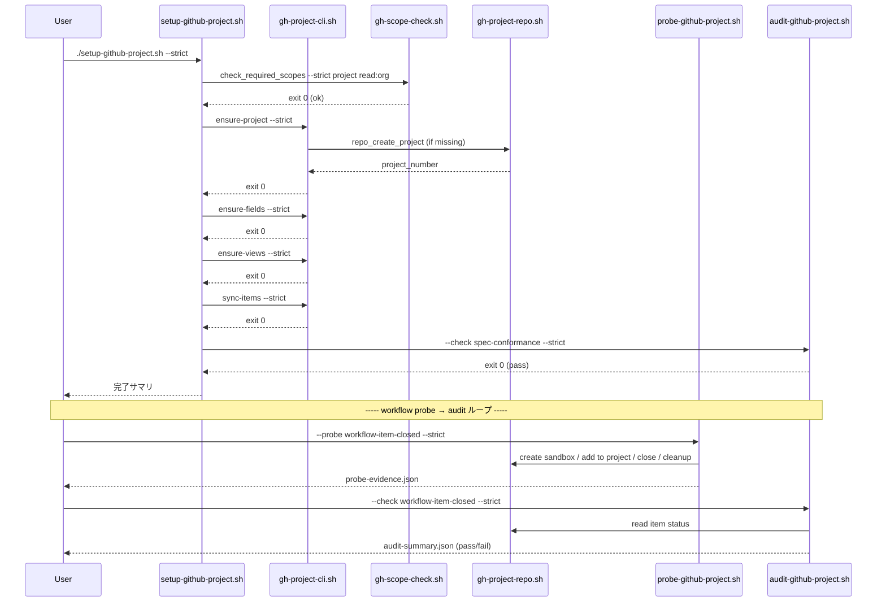

# 論理設計: Unit 006 GitHub Projects (ProjectsV2) フル移行

## 概要

GitHub Projects (ProjectsV2) を AI-DLC スターターキットのバックログ管理基盤として移行・運用するための論理設計。CLI ベースの宣言的構成管理（Spec-driven）パターンを採用し、`apply / probe / audit` の 3 責務分離 + strict/soft 二系統 + サブコマンド分割で実装する。

**重要**: この論理設計では**コードは書かず**、コンポーネント構成とインターフェース定義のみを行います。具体的なコード（GraphQL クエリ、bash 実装等）は Phase 2（コード生成ステップ）で作成します。

## アーキテクチャパターン

**採用パターン**: **Spec-driven CLI Reconciliation Pattern**（宣言的仕様駆動の Reconciliation 構造）

選定理由:

- Project の構造（fields / views / workflows / items）が複数の API 経路（`gh project` CLI / GraphQL / GitHub UI）に分散するため、desired state を 1 箇所に集約することで実行アダプタの差異を吸収する（GATE-15 / R1 指摘 #4）
- 冪等性を「現状取得 → desired 比較 → 差分のみ apply」の Reconciliation ループで実現（GATE-7）
- probe / audit / apply / scope-check を**直交する責務**として分離することで、障害切り分けとテスト容易性を確保（R2 指摘 #2）
- シェル + `gh` CLI + `yq` / `jq` / GraphQL のみで構成し、starter kit のシンプル性を維持（重い framework 不要）

副次パターン:

- **Strategy パターン**: View 作成時の `apply_strategy` (cli / graphql / manual) で適用経路を切り替え
- **Repository パターン**: `gh` CLI / GraphQL アクセスを `bin/lib/gh-project-state.sh` / `bin/lib/gh-project-repo.sh` に集約

## コンポーネント構成

### レイヤー / モジュール構成

```text
bin/
├── setup-github-project.sh           # 薄い orchestrator（apply 経路 / strict default）
├── gh-project-cli.sh                 # サブコマンド分割 CLI（GATE-7）
│   ├── ensure-project                # サブコマンド: Project 作成
│   ├── ensure-fields                 # サブコマンド: Fields 作成
│   ├── ensure-views                  # サブコマンド: Views 作成
│   ├── sync-items                    # サブコマンド: Items 投入
│   └── audit                         # サブコマンド: audit 委譲（read-only）
├── migrate-issue-524.sh              # Issue #524 リダイレクト化（apply / strict default）
├── probe-github-project.sh           # write 副作用 / sandbox 操作（GATE-6 / R2 指摘 #2）
├── audit-github-project.sh           # read-only 評価（GATE-6 / 15 / R2 指摘 #2）
└── lib/
    ├── gh-scope-check.sh             # GATE-12: strict/soft + 構造化結果
    ├── gh-project-state.sh           # 現状取得 + キャッシュ
    ├── gh-project-repo.sh            # gh CLI / GraphQL ラッパ
    ├── gh-project-spec.sh            # spec.yaml ロード + validate + cycle_map 評価
    └── gh-project-evidence.sh        # probe-evidence.json / audit-summary.json I/O

config/
├── github-project-spec.yaml          # SoT（GATE-15 / cycle_map 内包 / R2 指摘 #1）
└── (cycle-map.json は廃止 / R2 指摘 #1)

docs/development/
└── github-projects-setup.md          # スコープ拡張手順 + Project 構造説明 + 運用ルール

skills/aidlc/steps/inception/
└── 02-preparation.md                 # ステップ17 改修（GATE-11）

tests/bin/
├── gh-project-cli.bats               # サブコマンド単位テスト
├── setup-github-project.bats         # orchestrator テスト
├── migrate-issue-524.bats            # 本文置換テスト
├── probe-github-project.bats         # probe テスト（write モック）
├── audit-github-project.bats         # audit テスト（evidence fixture）
└── lib/
    ├── gh-scope-check.bats           # strict/soft exit code テスト
    ├── gh-project-state.bats         # state 取得テスト
    └── gh-project-spec.bats          # spec ロード / cycle_map 評価テスト
```

### コンポーネント詳細

#### `bin/gh-project-cli.sh`

- **責務**: 各サブコマンド (`ensure-project` / `ensure-fields` / `ensure-views` / `sync-items` / `audit`) のディスパッチ + サブコマンド別オプションパース
- **依存**: `bin/lib/gh-project-spec.sh`（spec ロード）/ `bin/lib/gh-project-state.sh`（現状取得）/ `bin/lib/gh-project-repo.sh`（gh CLI 呼出）/ `bin/lib/gh-scope-check.sh`（事前検証）
- **オプション仕様**（R2 指摘 #3 反映 / サブコマンド別共通）:

  | サブコマンド | `--dry-run` | `--strict` / `--soft` | デフォルトモード |
  |-------------|-------------|----------------------|-----------------|
  | `ensure-project` / `ensure-fields` / `ensure-views` / `sync-items` | ✓ サポート | ✓ サポート | `--strict` |
  | `audit` | ✗ 非対応（指定時は exit 1 + `args_invalid`） | ✓ サポート | `--soft`（CI は strict 明示） |

- **公開インターフェース**:
  - `gh-project-cli.sh ensure-project [--dry-run] [--strict|--soft]`
  - `gh-project-cli.sh ensure-fields [--dry-run] [--strict|--soft]`
  - `gh-project-cli.sh ensure-views [--dry-run] [--strict|--soft]`
  - `gh-project-cli.sh sync-items [--dry-run] [--strict|--soft]`
  - `gh-project-cli.sh audit [--check workflow-item-closed|spec-conformance|all] [--strict|--soft]`（read-only / `--dry-run` 指定時は exit 1 で拒否 / R1 指摘 #4 + R2 指摘 #3）

#### `bin/setup-github-project.sh`

- **責務**: `gh-project-cli.sh` の各サブコマンドを順次呼ぶ薄い orchestrator。エラー時は即時 exit
- **依存**: `bin/gh-project-cli.sh`
- **公開インターフェース**:
  - `setup-github-project.sh [--dry-run] [--strict|--soft]`（デフォルト `--strict` / R3 指摘 #1）

#### `bin/migrate-issue-524.sh`

- **責務**: Issue #524 本文を Project URL + 案内文 + 運用ルールに置換、旧本文をバックアップ
- **依存**: `bin/lib/gh-scope-check.sh`、`gh issue view/edit`
- **公開インターフェース**:
  - `migrate-issue-524.sh [--dry-run] [--strict|--soft]`（デフォルト `--strict`）
  - バックアップ先: `.aidlc/cycles/v2.6.0/operations/issue-524-backup.md`

#### `bin/probe-github-project.sh`

- **責務**: write 副作用ありの sandbox 操作 + cleanup + evidence 出力（GATE-6 / R2 指摘 #2）
- **依存**: `bin/lib/gh-project-repo.sh`、`bin/lib/gh-project-evidence.sh`
- **公開インターフェース**:
  - `probe-github-project.sh --probe workflow-item-closed [--dry-run] [--strict|--soft]`（デフォルト `--strict` / R3 指摘 #2 反映: write 副作用を持つため `--dry-run` をサポート、dry-run 時は sandbox 操作をスキップ / 共通契約「`--dry-run` の意味」参照）
  - 出力ファイル: `audit/probe-evidence.json`（dry-run / apply のどちらでも**常に**生成。dry-run 時は `dry_run: true` フラグと `would_create.sandbox_issue_title` 等のプレースホルダを記録 / R4 指摘 #1 反映で出力契約を単一化）
  - stdout: dry-run 時は `probe:workflow-item-closed:would-run:<sandbox_title>` の 1 行（apply 時は `probe:workflow-item-closed:completed:<sandbox_issue>` または `probe:workflow-item-closed:cleanup-failed:<sandbox_issue>`）

#### `bin/audit-github-project.sh`

- **責務**: read-only 評価（probe-evidence.json + 現状状態を入力に AuditSummary 出力）
- **依存**: `bin/lib/gh-project-spec.sh`、`bin/lib/gh-project-state.sh`、`bin/lib/gh-project-evidence.sh`
- **公開インターフェース**:
  - `audit-github-project.sh --check {workflow-item-closed|spec-conformance|all} [--strict|--soft]`（デフォルト `--soft` / CI は strict 明示）
  - 出力: `audit/audit-summary.json`

#### `bin/lib/gh-scope-check.sh`

- **責務**: `gh auth status` のパース + 必須スコープ検証 + 構造化結果出力（GATE-12）
- **依存**: `gh auth status`
- **公開インターフェース**:
  - `check_required_scopes [--strict|--soft] scope1 scope2 ...`
  - exit code: 0 (ok) / 2 (strict 不足) / 0 (soft 不足、warn のみ)
  - 副産物: `.aidlc/cache/gh-project-last-run.json`

#### `bin/lib/gh-project-state.sh`

- **責務**: 現状取得 + キャッシュ。`gh project list` / `field-list` / `view-list` / `item-list` の結果を 1 度だけ取得
- **公開インターフェース**:
  - `state_get_project_by_title <title>` → JSON
  - `state_get_fields <project_number>` → JSON
  - `state_get_views <project_number>` → JSON
  - `state_get_items <project_number>` → JSON
  - キャッシュ: `.aidlc/cache/gh-project-state-cache/`（プロセス単位）

#### `bin/lib/gh-project-repo.sh`

- **責務**: `gh project` CLI / GraphQL の薄いラッパ。コマンド失敗時のリトライ・エラー分類
- **公開インターフェース**:
  - `repo_create_project <owner> <title> <visibility>` → ProjectId / number
  - `repo_create_field <project_number> <name> <data_type> <options>` → FieldId
  - `repo_add_field_option <field_id> <option>` → void
  - `repo_create_view <project_number> <view_descriptor> <apply_strategy>` → ViewId or "manual"
  - `repo_add_item <project_number> <issue_url>` → ProjectItemId
  - `repo_set_item_field_value <project_item_id> <field_id> <option_id>` → void
  - `repo_create_sandbox_issue <title>` / `repo_close_issue <num>` / `repo_delete_issue <num>` (probe 専用)

#### `bin/lib/gh-project-spec.sh`

- **責務**: `config/github-project-spec.yaml` のロード + validate + cycle_map 評価
- **公開インターフェース**:
  - `spec_load <path>` → spec オブジェクト（jq でアクセス可能な JSON）
  - `spec_validate <spec>` → ValidationResult
  - `spec_resolve_cycle <spec> <milestone_title>` → cycle_label or "Later"

#### `bin/lib/gh-project-evidence.sh`

- **責務**: `audit/probe-evidence.json` / `audit/audit-summary.json` の I/O
- **公開インターフェース**:
  - `evidence_save_probe <evidence_json>` → void
  - `evidence_load_probe <path>` → JSON
  - `evidence_save_summary <summary_json>` → void

#### `config/github-project-spec.yaml`

- **責務**: SoT 単一系統。Project の desired state（GATE-15 / cycle_map 内包 / R2 指摘 #1）
- **依存**: なし（純粋データ）
- **構造**（Phase 2 で確定）:

```yaml
# config/github-project-spec.yaml（構造概要）
version: 1
project:
  title: "AI-DLC Starter Kit Roadmap"
  owner: "@me"
  visibility: "public"
fields:
  - name: Status
    data_type: single_select
    options: [Backlog, Next, In Progress, Review, Done]
  - name: Priority
    data_type: single_select
    options: [high, medium, low]
  - name: Cycle
    data_type: single_select
    options: dynamic  # cycle_map 経由で動的生成
views:
  # R1 指摘 #3 反映: project_field_axes と label_axes を分離。
  # `Type` は labels 派生軸として label_axes に属し、project_field_axes には含まれない。
  - name: Roadmap
    layout: roadmap_layout
    project_field_axes: [Cycle, Status]
    label_axes: []
    apply_strategy: graphql
  - name: Backlog Board
    layout: board_layout
    group_by: Status
    project_field_axes: [Status]
    label_axes: []
    apply_strategy: cli
  - name: Priority Table
    layout: table_layout
    project_field_axes: [Priority, Status, Cycle]
    label_axes:
      - { name: Type, label_prefix: "type:" }
    filter: "is:open"
    apply_strategy: graphql
  - name: Feedback View
    layout: table_layout
    project_field_axes: []
    label_axes:
      - { name: Type, label_prefix: "type:" }
    filter: "label:type:feedback is:open"
    apply_strategy: graphql
workflows:
  - id: item-closed-to-done
    trigger: item_closed
    action: set_status_done
    apply_strategy: manual  # GitHub UI（GATE-6）
manual_actions:
  - id: enable-item-closed-workflow
    description: "GitHub UI で Workflows → Item closed → Status=Done を有効化"
    audit_check: workflow-item-closed
cycle_map:
  patterns:
    - milestone_pattern: "^v\\d+\\.\\d+\\.\\d+$"
      cycle_label: "<milestone-title>"
  fallback: Later
  delete_handling: Later
item_sources:
  - source: issue-524-body
    issue_number: 524
  - source: backlog-label
    label: backlog
    state: open
```

#### `skills/aidlc/steps/inception/02-preparation.md` ステップ17 改修

- **責務**: バックログ確認時の Project 参照（GATE-11）
- **依存**: 既存 Inception フロー
- **改修内容**:
  - 既存挙動（`gh issue list --label backlog`）の前に Project 参照ステップを追加
  - `gh_status` + `bin/lib/gh-scope-check.sh --soft project,read:org` の結果に応じて分岐
  - `gh project item-list --owner @me <number>` で Backlog ビューの Item を抽出
  - スコープ不足時は既存挙動にフォールバック

## インターフェース設計

### 共通契約

#### exit code 規約（R1 指摘 #5 反映 / 失敗ドメイン分離）

| exit code | 意味 | 該当エラータイプ（`error_type` JSON フィールド） |
|-----------|------|----------------------------------------------|
| 0 | 成功 | - |
| 1 | 引数不正 / 入力フォーマット不正 | `args_invalid` / `input_format_invalid` |
| 2 | スコープ不足（strict） | `scope_missing` |
| 3 | gh API 失敗 / GitHub 側エラー | `gh_api_error` |
| 4 | spec 不正（バリデーション失敗 / dangling 参照） | `spec_invalid` |
| 5 | evidence / 入力前提不足（probe-evidence.json 不在 等） | `evidence_missing` |
| 6 | probe 副作用失敗（sandbox 作成 / close 失敗） | `probe_side_effect_failed` |
| 7 | audit 失敗（spec_conformance drift / workflow_item_closed 未遷移）（strict） | `audit_failed` |

すべてのエラー時は stderr に JSON で `{"error_type": "<type>", "details": {...}, "remediation": "<hint>"}` を出力する（`error_type` 必須）。soft モードは exit 0 だが構造化結果に `status` を記録。

#### `--dry-run` の意味（R1 指摘 #4 反映）

- **対象**: 外部書き込み副作用を持つコマンドのみ（`ensure-*` / `sync-items` / `migrate-issue-524.sh` / `probe-*`）
- **意味**: GitHub API への write 呼び出しをスキップし、変更内容を stdout に出力する。ローカル成果物（`audit-summary.json` 等の評価出力）はモード問わず生成可
- **read-only コマンド**: `audit-github-project.sh` / `gh-project-cli.sh audit` / `gh-scope-check.sh` は `--dry-run` を持たない（read-only のため意味不明瞭を回避）

### コマンド

#### `bin/gh-project-cli.sh ensure-project`

- **パラメータ**:
  - `--dry-run`: dry-run モード（GitHub API への write をスキップ / 任意）
  - `--strict` / `--soft`: モード（デフォルト `--strict`）
  - `--spec <path>`: spec ファイルパス（デフォルト `config/github-project-spec.yaml`）
- **戻り値**: 「共通契約 - exit code 規約」参照（0/1/2/3/4）
- **副作用**:
  - apply 時: `gh project create` / `.aidlc/config.toml [github_projects]` への runtime binding 書き込み（R1 指摘 #2 反映 / `ensure-project` 専用書き込み主体）
  - `.aidlc/cache/gh-project-state-cache/` 更新
- **stdout**: `project:created:<number>` / `project:exists:<number>` / `project:would-create:<title>`（dry-run）

#### `bin/gh-project-cli.sh ensure-fields`

- **パラメータ**: 共通オプション + `--project-number <N>`（`.aidlc/config.toml [github_projects].project_number` から自動解決可）
- **戻り値**: 共通契約参照（0/1/2/3/4）
- **副作用**: `gh project field-create` / `field-add-option`
- **stdout**: `field:created:<name>` / `field:updated:<name>:options-added` / `field:exists:<name>`

#### `bin/gh-project-cli.sh ensure-views`

- **パラメータ**: 共通オプション
- **戻り値**: 共通契約参照（0/1/2/3/4）
- **副作用**: `gh project view-create` または GraphQL `createProjectV2View` / `apply_strategy=manual` 時は GitHub UI 案内を stdout 出力
- **stdout**: `view:created:<name>:<strategy>` / `view:exists:<name>` / `view:manual-required:<name>:<instructions>`

#### `bin/gh-project-cli.sh sync-items`

- **パラメータ**: 共通オプション
- **戻り値**: 共通契約参照（0/1/2/3/4）
- **副作用**: `gh project item-add` / `gh project item-edit`（field 値セット）
- **stdout**: `item:added:<issue_url>` / `item:updated:<issue_url>:<fields>` / `item:exists:<issue_url>`

#### `bin/probe-github-project.sh --probe workflow-item-closed`

- **パラメータ**: `--dry-run` / `--strict` / `--soft`（デフォルト `--strict`）
- **戻り値**: 共通契約参照
  - exit 0: probe 完了（cleanup 成功 / cleanup 失敗どちらでも probe 自体は完了）
  - exit 2: スコープ不足（strict）
  - exit 6: probe 副作用失敗（sandbox 作成失敗 等）
- **副作用**: apply 時のみ sandbox Issue 作成・close・削除、`audit/probe-evidence.json` 生成（dry-run 時も probe-evidence.json は `dry_run: true` フラグ付きで常に生成 / 共通スキーマ）
- **stdout**: 単一契約（コンポーネント詳細セクションと整合 / R5 指摘 #1 反映で 3 ケースを明示）:
  - apply 成功: `probe:workflow-item-closed:completed:<sandbox_issue>`
  - apply 完了 + cleanup 失敗: `probe:workflow-item-closed:cleanup-failed:<sandbox_issue>`
  - dry-run: `probe:workflow-item-closed:would-run:<sandbox_title>`

#### `bin/audit-github-project.sh --check {workflow-item-closed|spec-conformance|all}`

- **パラメータ**: `--strict` / `--soft`（デフォルト `--soft` / CI は strict 明示）。**`--dry-run` は持たない**（read-only / R1 指摘 #4）
- **戻り値**: 共通契約参照
  - exit 0: 全 check pass
  - exit 5: 入力不足（probe-evidence.json 不在 等）
  - exit 7: 監査失敗（strict） / soft の場合は warn 出力で exit 0
- **副作用**: なし（read-only） / `audit/audit-summary.json` 生成
- **stdout**: `audit:workflow-item-closed:pass` / `audit:spec-conformance:drift:<count>`

#### `bin/migrate-issue-524.sh`

- **パラメータ**: 共通オプション
- **戻り値**: 共通契約参照（0/1/2/3）
- **副作用**: `gh issue edit 524 --body-file ...`、バックアップ `operations/issue-524-backup.md` 作成
- **stdout**: `issue-524:edited` / `issue-524:would-edit:<diff_path>`（dry-run）

### スクリプトインターフェース設計

#### `bin/lib/gh-scope-check.sh::check_required_scopes`

##### 概要

`gh auth status` をパースし、必須スコープが充足されているかを検証。strict/soft モード切替で挙動が変わる。

##### 引数

| 引数 | 必須/任意 | 説明 |
|------|----------|------|
| `--strict` / `--soft` | 任意 | モード（デフォルト `--soft`） |
| `<scope1> <scope2> ...` | 必須 | 必須スコープ（例: `project read:org read:project`） |

##### 成功時出力

- 終了コード: `0`
- 出力先: stderr に進捗ログ、`.aidlc/cache/gh-project-last-run.json` に構造化結果

##### エラー時出力

```text
ERROR: missing scopes: project,read:org
Run: gh auth refresh -s project,read:org
```

- 終了コード: `2`（strict 不足）/ `0`（soft 不足、warn のみ）
- 出力先: stderr

##### 使用コマンド

```bash
# strict モード（CI / 自動実行系）
bin/lib/gh-scope-check.sh --strict project read:org read:project

# soft モード（参照系 / Inception 統合）
bin/lib/gh-scope-check.sh --soft project read:org read:project
```

## データモデル概要

### 設定境界の責務分離（R1 指摘 #2 反映）

| 設定対象 | 格納先 | 責務 | 書き込み主体 | 更新タイミング |
|---------|--------|------|-------------|---------------|
| Desired state（理想状態） | `config/github-project-spec.yaml` | spec / SoT 単一系統。fields / views / workflows / cycle_map / item_sources を宣言 | 開発者（手編集） + Phase 2 実装時 | spec 改訂時のみ |
| Runtime binding（実環境 ID） | `.aidlc/config.toml [github_projects]` セクション | runtime / 実環境との紐付け（`project_url` / `project_number` / `owner`） | `bin/gh-project-cli.sh ensure-project` 専用 | Project 作成成功直後 / `gh project delete` 時クリア |

- **原則**: spec.yaml には実環境 ID を**書かない**。runtime binding は config.toml にのみ書く
- **手編集禁止**: `.aidlc/config.toml [github_projects]` の各キーは `ensure-project` 専用書き込み対象。手編集すると spec / runtime の整合性が崩れる
- **読み取り経路**: 他のサブコマンド（`ensure-fields` / `ensure-views` / `sync-items`）は `.aidlc/config.toml [github_projects].project_number` を読むだけで spec.yaml には書き込まない

### ファイル形式

#### `config/github-project-spec.yaml`

- **形式**: YAML
- **主要フィールド**: 上記「コンポーネント詳細」の `github-project-spec.yaml` 構造概要参照

#### `audit/probe-evidence.json`

- **形式**: JSON
- **主要フィールド**（apply 時 / dry-run 時 共通スキーマ / R4 指摘 #1 反映）:
  - `probe`: ProbeKind
  - `dry_run`: Boolean - apply は `false`、dry-run は `true`
  - `sandbox_issue`: Optional<Integer> - apply 時のみ実値、dry-run 時は `null`
  - `project_item_id`: Optional<String> - apply 時のみ実値、dry-run 時は `null`
  - `closed_at`: Optional<ISO 8601 timestamp> - apply 時のみ実値、dry-run 時は `null`
  - `cleanup_status`: Optional<enum (`succeeded` / `failed`)> - apply 時のみ、dry-run 時は `null`
  - `cleanup_evidence`: Optional<Object> - apply 時のみ
  - `would_create`: Optional<{sandbox_issue_title: String, ...}> - dry-run 時のみ（実行予定の詳細）

#### `audit/audit-summary.json`

- **形式**: JSON
- **主要フィールド**:
  - `evaluated_at`: ISO 8601 timestamp
  - `workflow_item_closed`: `{status: pass|fail, evidence_ref: <path>, details: ...}`
  - `spec_conformance`: `{status: pass|drift, drifts: [...], details: ...}`

#### `.aidlc/cache/gh-project-last-run.json`

- **形式**: JSON
- **主要フィールド**:
  - `status`: enum (`ok` / `scope_missing`)
  - `missing`: List<String>
  - `mode`: enum (`strict` / `soft`)
  - `timestamp`: ISO 8601 timestamp

#### `.aidlc/config.toml` `[github_projects]` セクション（追加）

- **形式**: TOML
- **主要フィールド**:
  - `project_url`: String - 実環境 Project URL
  - `project_number`: Integer - Project number
  - `owner`: String - Project owner login
- **書き込み主体**: `bin/gh-project-cli.sh ensure-project` 成功時のみ自動更新（手編集禁止）
- **読み取り主体**: `ensure-fields` / `ensure-views` / `sync-items` / `audit-github-project.sh` / `probe-github-project.sh` / Inception ステップ17

実環境固有の identifier はここに保存し、spec.yaml（desired state）と分離する（R1 指摘 #2 反映 / 「設定境界の責務分離」表参照）。

## 処理フロー概要

### `setup-github-project.sh`（orchestrator）の処理フロー

**ステップ**:

1. `bin/lib/gh-scope-check.sh --strict project read:org read:project` 実行 → 失敗で exit 2
2. `bin/gh-project-cli.sh ensure-project --strict` 実行 → 失敗で exit
3. `bin/gh-project-cli.sh ensure-fields --strict` 実行 → 失敗で exit
4. `bin/gh-project-cli.sh ensure-views --strict` 実行 → 失敗で exit
5. `bin/gh-project-cli.sh sync-items --strict` 実行 → 失敗で exit
6. `bin/audit-github-project.sh --check spec-conformance --strict` 実行（最終整合確認）
7. exit 0 + 完了サマリ stdout

**関与するコンポーネント**: `setup-github-project.sh` / `gh-project-cli.sh` / `gh-scope-check.sh` / `audit-github-project.sh`

### `probe → audit` フロー（GATE-6 / D5a→D5b）

**ステップ**:

1. `bin/probe-github-project.sh --probe workflow-item-closed --strict` 実行
   - sandbox Issue 作成 → Project に追加 → close → cleanup（削除試行）
   - `audit/probe-evidence.json` 出力
2. `bin/audit-github-project.sh --check workflow-item-closed --strict` 実行
   - probe-evidence.json をロード
   - `gh project item-list` で sandbox Item の Status を取得
   - `closed_at` から 30 秒以内に `Status=Done` 遷移したかを評価
   - `audit/audit-summary.json` 出力

**関与するコンポーネント**: `probe-github-project.sh` / `audit-github-project.sh` / `gh-project-evidence.sh`

### `sync-items` の Cycle 解決フロー

**ステップ**:

1. `gh issue list --label backlog --state open --json url,milestone` で対象 Issue を取得
2. `gh issue view 524 --json body` から URL リストを抽出
3. union を生成（Issue 番号昇順）
4. 各 Issue について:
   - `spec_resolve_cycle <spec> <milestone.title>` で cycle_label を導出
   - `repo_add_item` または `repo_set_item_field_value`（既存 Item の場合）

**関与するコンポーネント**: `gh-project-cli.sh sync-items` / `gh-project-spec.sh::spec_resolve_cycle` / `gh-project-repo.sh`



## 非機能要件（NFR）への対応

### 冪等性

- **要件**: `bin/setup-github-project.sh` を 2 回実行しても重複作成が発生しない
- **対応策**: 各 ensure-* サブコマンドが `gh project ...-list` で現状取得 → desired と差分計算 → 差分のみ apply。既存 field options は削除せず追加のみ（破壊的変更回避）

### 可観測性

- **要件**: 何が変更されたかを stdout/JSON で機械可読に出力
- **対応策**: 各サブコマンドの stdout 形式を `<resource>:<action>:<identifier>` で統一。`audit-summary.json` で監査結果を構造化

### 柔軟性（gh トークンスコープ不足時）

- **要件**: AI-DLC 主機能を阻害しない
- **対応策**: `gh-scope-check.sh` の strict/soft モード分離。AI-DLC スキル統合（Inception ステップ17）は soft モードで warn のみ + 既存挙動フォールバック

### 障害切り分け（probe / audit 分離）

- **要件**: probe 失敗（write 副作用）と audit 失敗（評価）を独立に切り分け可能
- **対応策**: `probe-evidence.json` パイプライン構造。probe 失敗時は probe-evidence.json が不完全 → audit 側で前提不満 fail。audit 失敗（probe 成功時）は GitHub 側 workflow 不調と切り分け

### 完全性監査

- **要件**: UI 手動工程の完了確認を投げっぱなしにしない（GATE-15）
- **対応策**: spec.yaml の `manual_actions[*].audit_check` で監査チェックキーを必須化。`audit-github-project.sh --check spec-conformance` で manual_action 充足を確認

## 技術選定

- **言語**: Bash 5.x（macOS 標準は 3.x のため、`#!/usr/bin/env bash` + Homebrew bash 5 を前提とするか、4.x 互換コードに限定するかは Phase 2 で確定）
- **設定ファイル**: YAML (`config/github-project-spec.yaml`) + TOML (`.aidlc/config.toml` の `[github_projects]`)
- **依存ツール**:
  - `gh` CLI v2.x（`project` サブコマンド対応）
  - `yq` v4.x（YAML パース）
  - `jq` v1.6+（JSON パース）
  - `bats` v1.8+（テスト）
- **GitHub API**: GraphQL `createProjectV2View` / `enableProjectV2Workflow`（CLI 不可分の操作のみ）
- **テスト**:
  - bats でユニットテスト（モック / fixture 経由）
  - 実環境テストは工程 D で手動実施

## 実装上の注意事項

### セキュリティ

- gh PAT を扱うため、トークン値が log / stderr に漏れないよう注意（`gh auth status` 出力は token を `***` マスクするため安全）
- spec.yaml に secrets を含めない（Project URL は public 情報、token は環境変数）

### 互換性 / starter-kit リポジトリ判定

- 本 Unit のスクリプトは starter kit 自身用（`bin/` 配下）。consumer プロジェクトでは実行されない前提
- 同様の理由で、ダウンストリーム consumer プロジェクトには影響しない（Unit 007 の squash-unit.sh 修正は別 Unit）

### 保守性 / 拡張性

- spec.yaml の `version: 1` を将来的なスキーマ進化に備えて宣言。将来 `version: 2` への移行時は `bin/lib/gh-project-spec.sh::spec_load` 内で migration 処理
- 新フィールド追加時は spec.yaml の `fields:` に追記するだけで `ensure-fields` が自動追従

### コマンド置換禁止（CLAUDE.md ルール）

- 本 Unit のすべてのシェルコードで `$()` / バッククォート禁止。動的値はテンプレートプレースホルダ + 別ステップ実行で対応

### Bash の `read` / `mapfile` / 配列の bash 4+ 機能

- macOS 標準 bash 3.x との互換性を Phase 2 で確認（Unit 002 の知見準拠）

### マニフェスト / バージョン管理（v2.6.0 リリース時）

- `CHANGELOG.md` v2.6.0 セクションに「Added: GitHub Projects (ProjectsV2) 移行基盤」を記載
- `.claude-plugin/marketplace.json` の `metadata.version` 更新（既存 release 経路に従う）

## 不明点と質問（設計中に記録）

[Question] `gh project view-create` CLI のサポート範囲が不安定な場合、Phase 2 でどこまで GraphQL に降格するか？

[Answer] Phase 2 実装時に実環境で挙動確認し、CLI で完結しないものは GraphQL 経由 + spec.yaml の `apply_strategy` を `cli → graphql` に書き換える。さらに GraphQL も不安定なら `manual` に降格。優先順位: `cli > graphql > manual`。

[Question] `enableProjectV2Workflow` GraphQL mutation が GA 不安定な場合、初期実装は `manual` 1 択でよいか？

[Answer] はい。`workflows[0].apply_strategy: manual` を初期実装とし、GitHub UI 操作手順を `docs/development/github-projects-setup.md` に記載。`audit_check: workflow-item-closed` で必ず監査されるため、設定漏れは検出可能。GraphQL の GA 安定化後に別 Unit で `manual → graphql` への昇格を検討。

[Question] `bats` テストでの `gh` CLI モック方式は？

[Answer] Phase 2 で確定するが、想定方式は (a) `bats-mock` ライブラリ導入、または (b) `tests/fixtures/gh-project-*.json` を fixture として用意し `gh` を `cat fixtures/...` で擬装するシェル関数で差し替え。既存テスト（`tests/bin/*.bats`）の流儀を踏襲。

[Question] `.aidlc/cache/gh-project-state-cache/` のキャッシュ無効化タイミングは？

[Answer] プロセス単位で有効（プロセス終了時に消失する `mktemp -d` ベース）。複数の `ensure-*` サブコマンドを同一プロセス（`setup-github-project.sh` 内）で呼ぶ場合のみキャッシュヒットさせる。`.aidlc/cache/` 永続化は本 Unit ではしない（API レート制限緩和は将来 Unit）。
