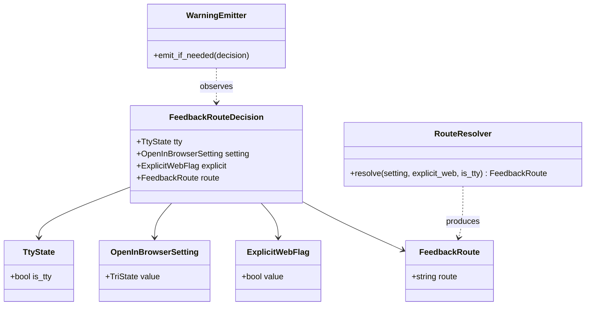

# ドメインモデル: Unit 003 aidlc-feedback の `--web` 強制起動解消（opt-in 化）

## 概要

`/aidlc feedback` 実行時の Issue 起票経路選択ドメインを定義する。3 つの入力（TTY 状態 / 設定値 / 明示フラグ）から採用経路（`web` / `direct`）を一意に決定する純関数的判定モデル。

**重要**: このドメインモデル設計では**コードは書かず**、構造と責務の定義のみを行います。

## 適用範囲

- 対象スキル: `aidlc-feedback`（`/aidlc feedback` コマンド）
- 対象操作: feedback Issue 起票時の経路選択（`gh issue create --web` か `gh issue create --body-file`）
- 対象 SoT: `user_stories.md` ストーリー 3 真理値表 6 行

## エンティティ（Entity）

本 Unit には永続化対象のエンティティは存在しない（ステートレス・1 回の起票フローで完結）。判定結果は呼び出し時のみ有効な一時値として扱う。

## 値オブジェクト（Value Object）

### TtyState

- **属性**: `is_tty: boolean` - 標準入力が端末か否か
- **不変性**: 1 回の起票フロー実行中は `[[ -t 0 ]]` の判定結果から導出された値で固定
- **等価性**: `is_tty` の真偽で判定
- **境界条件**: stdin が pipe / redirect された CI 環境では false。対話シェルでは true

### OpenInBrowserSetting

- **属性**: `value: TriState`（`true` / `false` / `unset_or_invalid`）
- **不変性**: `read-config.sh` から取得した値（exit code に応じて 3 値に正規化）
- **等価性**: `value` の比較で判定
- **正規化規則**:
  - `read-config.sh` exit 0 + 値 `"true"` → `true`
  - `read-config.sh` exit 0 + 値 `"false"` → `false`
  - `read-config.sh` exit 1（キー不在）→ `unset_or_invalid`
  - `read-config.sh` exit 2（エラー）→ `unset_or_invalid`
  - `exit 0` だが値が `true` / `false` 以外（型不一致）→ `unset_or_invalid` + 警告
- **不正値時の安全側挙動**: `unset_or_invalid` は判定上 `false` 相当として扱う（直接起票がデフォルト）

### ExplicitWebFlag

- **属性**: `value: boolean` - 明示的にブラウザ経路を選択する意図を示すフラグ
- **不変性**: 環境変数 `AIDLC_FEEDBACK_WEB` の値から導出された後は固定
- **等価性**: `value` の真偽で判定
- **SoT**: 環境変数 `AIDLC_FEEDBACK_WEB`（**唯一の入力経路**、計画レビュー Round 1 反映）
- **真理値解釈規則**:
  - `1` / `true` / `yes`（大小文字無視、前後空白除去後）→ `true`
  - 上記以外（空文字 / 未設定 / `0` / `false` / `no` / その他任意の文字列）→ `false`
- **境界条件**: 設計フェーズで確定する正規化規則（前後空白トリム / `tr '[:upper:]' '[:lower:]'` 適用）

### FeedbackRoute（判定結果）

- **属性**: `route: enum {"web", "direct"}` - 採用される起票経路
- **不変性**: `RouteResolver` の判定後は固定
- **等価性**: 文字列値の完全一致で判定
- **派生規則**: 真理値表 6 行に従う（`user_stories.md` ストーリー 3 が SoT）

## 集約（Aggregate）

### FeedbackRouteDecision

- **集約ルート**: `FeedbackRoute`（判定結果）
- **含まれる要素**:
  - `TtyState`
  - `OpenInBrowserSetting`
  - `ExplicitWebFlag`
- **境界**: 1 回の `/aidlc feedback` 起動内で完結。永続化なし
- **不変条件**:
  - 同一入力（3 値の組合せ）に対して常に同一の `FeedbackRoute` を返す（純関数性）
  - 真理値表 6 行を網羅し、未定義入力で例外的経路を選ばない
  - 非 TTY の場合は設定・フラグに関わらず必ず `direct`（**TTY 状態が最優先**）

## ドメインサービス

### RouteResolver

- **責務**: 3 つの値オブジェクトを入力に取り、`FeedbackRoute` を導出する純関数
- **操作**: `resolve(setting: OpenInBrowserSetting, explicit_web: ExplicitWebFlag, is_tty: TtyState) → FeedbackRoute`
- **副作用なし**（stderr 出力 / ファイル I/O / ネットワーク I/O いずれもなし）
- **関連実装**: `skills/aidlc-feedback/scripts/lib/resolve-route.sh` の `resolve_feedback_route` 関数（論点 1 の主案）

### WarningEmitter（呼び出し側責務）

- **責務**: 判定結果と入力状態の差分から警告メッセージを stderr に出力する
- **配置**: `feedback.md` の実行フロー内（`RouteResolver` の **呼び出し側**、計画レビュー Round 1 反映）
- **発火条件**（設計レビュー Round 1 #1 反映: 真理値表との整合）:
  - **強制無効化警告**: `is_tty=false` ∧ (`setting=true` ∨ `explicit_web=true`)
    - 真理値表 行 2（`setting=true` + 非 TTY）と行 4（`explicit_web=あり` + 非 TTY）の両方をカバー
    - メッセージ例: `warning: open_in_browser/AIDLC_FEEDBACK_WEB is overridden by non-TTY environment; using direct route`
  - **設定値型不一致警告**: `OpenInBrowserSetting=unset_or_invalid` のうち、`read-config.sh` exit 0 で値が `true`/`false` 以外 / exit 2 でエラーフォールバックしたケース
    - `read-config.sh` exit 1（キー不在の正常ケース）では警告を出さない
- **発火しない**:
  - 通常の TTY + デフォルト直接起票経路（行 5）
  - `explicit_web=true` + TTY のブラウザ経路（行 3）
  - `setting=true` + TTY のブラウザ経路（行 1）
  - 非 TTY + `setting=false`/未設定 + `explicit_web=false`（行 6、警告不要のデフォルト動作）

## リポジトリインターフェース

本 Unit には永続化対象がないため、リポジトリは存在しない。設定値の取得は `read-config.sh` を介した一方向参照のみ（永続化対象は `.aidlc/config.toml` 全体であり、本 Unit はその読取クライアント）。

## ファクトリ

なし（値オブジェクトは入力プリミティブから直接構築される）。

## ドメインモデル図

## ユビキタス言語

このドメインで使用する共通用語:

- **採用経路（FeedbackRoute）**: 1 回の feedback 起票で実際に使われる Issue 作成手段。`web`（ブラウザ起動）または `direct`（直接起票）の 2 値
- **明示フラグ（ExplicitWebFlag）**: 設定とは独立に「今回はブラウザで確認したい」と示す入力。本 Unit では SoT を環境変数 `AIDLC_FEEDBACK_WEB` に固定
- **TTY 優先**: 真理値表における優先順位の最上位ルール。非 TTY 環境では設定・フラグに関わらず必ず直接起票
- **直接起票（direct）**: `gh issue create --body-file` を使い、ブラウザを起動せずに Issue を作成する経路
- **opt-in `--web`**: デフォルトでは無効で、設定または明示フラグで有効化される `gh issue create --web` 経路

## 真理値表（再掲、SoT 参照）

警告ログ列は設計レビュー Round 1 #1 反映で `WarningEmitter` の発火条件と整合させている。

| # | 設定 `open_in_browser` | 明示フラグ（`AIDLC_FEEDBACK_WEB`） | TTY 状態 | 採用経路 | 警告ログ |
|---|----------------------|---------------------------------|---------|---------|---------|
| 1 | `true` | -              | TTY    | `web`     | なし |
| 2 | `true` | -              | 非 TTY | `direct`  | **あり**（`is_tty=false` ∧ `setting=true` で強制無効化） |
| 3 | `false` / 未設定 | あり        | TTY    | `web`     | なし |
| 4 | `false` / 未設定 | あり        | 非 TTY | `direct`  | **あり**（`is_tty=false` ∧ `explicit_web=true` で強制無効化） |
| 5 | `false` / 未設定 | なし        | TTY    | `direct`  | なし |
| 6 | `false` / 未設定 | なし        | 非 TTY | `direct`  | なし |

警告メッセージ統一: 行 2 / 行 4 ともに `warning: open_in_browser/AIDLC_FEEDBACK_WEB is overridden by non-TTY environment; using direct route` を出力する（`WarningEmitter` 仕様参照）。`OpenInBrowserSetting=unset_or_invalid` 由来の警告（型不一致 / TOML 破損）は本表とは独立に発火する（`WarningEmitter` の 2 つ目の発火条件）。

優先順位: **TTY 状態 > 設定 > フラグ**（`user_stories.md` ストーリー 3 / Unit 003 の SoT）。

## 不明点と質問（設計中に記録）

設計の論点 1〜4（計画ファイル §設計フェーズ参照）は論理設計フェーズで具体化する。本ドメインモデル段階で確定する必要のある不明点はなし。

なお論点 3（`AIDLC_FEEDBACK_WEB` の SoT 化）は計画レビュー Round 1 で確定済み、論点 4 の警告ログ責務分離も計画レビューで確定済み。
