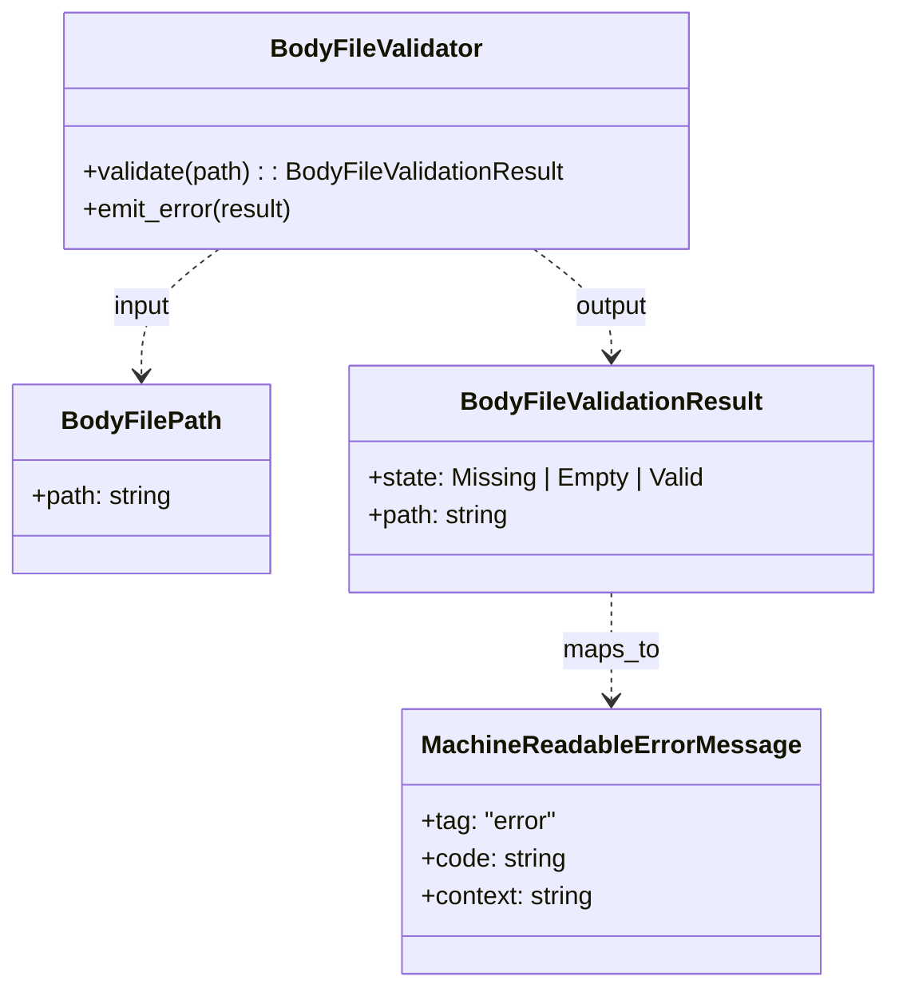

# ドメインモデル: Unit 001 pr-ready --body-file 空ファイル検証

## 概要

`operations-release.sh pr-ready --body-file <path>` と内部 `gh_pr_edit_body_with_fallback()` における「PR 本文ファイル」の入力妥当性を検証し、`gh pr edit` / REST PATCH リクエスト送信前に空ファイル / 不在ファイルを fail-fast で拒否するドメインを定義する。

**重要**: このドメインモデル設計では**コードは書かず**、構造と責務の定義のみを行います。

## エンティティ（Entity）

本ドメインはエンティティを持たない（純粋な検証ロジック）。

## 値オブジェクト（Value Object）

### `BodyFilePath`

- **属性**: `path: string` - PR 本文ファイルのパス（コマンドラインから受領）
- **不変性**: 受け取った後はパス文字列を変更しない（リサイズも書き込みもしない）
- **等価性**: 文字列比較

### `BodyFileValidationResult`

- **属性**:
  - `state: enum { Missing, Empty, Valid }` - 判定結果カテゴリ
  - `path: string` - 検証対象パス（エラー出力に同梱、ファイル内容は含めない）
- **不変性**: 検証結果は生成後変更しない
- **等価性**: `state` + `path` の組
- **`state` 定義**:
  - `Missing`: パスが **通常ファイル（regular file）として参照不可**。具体的には (a) ファイルとして存在しない、(b) ディレクトリ、(c) FIFO / デバイスファイル / ソケット等の非 regular な特殊ファイル、(d) 通常ファイルでない symlink 先 — のいずれか
  - `Empty`: 通常ファイルとして存在するがサイズ 0
  - `Valid`: 通常ファイルとして存在しサイズ ≥ 1

> 設計判断（codex 指摘 #1 反映）: 「ディレクトリや特殊ファイルが Valid 扱いになる」事態を防ぐため、`Valid` は **通常ファイル（regular file）かつ非空** に固定する。Issue #678 の受け入れ基準は「不在 / 0 バイト」の 2 種だが、不在以外の「regular file でないパス」も実用上は本 Unit の動機（PR 本文 null 上書き事故予防）と同等のリスク（`gh pr edit --body-file` 側の遅延失敗）を持つため、`Missing` ステートに **「regular file として参照不可」を含む拡張定義** を採用し、追加のエラーコードは導入せず `pr-ready:body-file-missing` に統合する（受け入れ基準は維持、API 表面は最小）。
>
> 設計判断（codex 指摘 #2 反映）: 当初案で導入を検討した `ValidationPhase` 値オブジェクトは、検証ロジック本体・エラーコード・stderr 出力に影響を与えないため、API 表面の不必要な拡大（将来分岐温床）として削除した。検証ヘルパーは `path` 単独入力とし、SoT の境界を最小化する。fallback 経路の追加コンテキストは別途 `pr-ready:fallback:rest-patch:*` シグナルで既に提供されている。

### `MachineReadableErrorMessage`

- **属性**:
  - `tag: literal "error"`
  - `code: enum { "pr-ready:body-file-missing", "pr-ready:body-file-empty" }`
  - `context: string` - 対象パス
- **形式**: tab 区切り 3 フィールド `error\t<code>\t<context>`
- **不変性**: 出力後変更しない
- **等価性**: 3 フィールド一致

## 集約（Aggregate）

### `BodyFileValidation`

- **集約ルート**: `BodyFileValidationResult`
- **含まれる要素**: `BodyFilePath`, `BodyFileValidationResult`, `MachineReadableErrorMessage`
- **境界**: PR 本文ファイル 1 件分の検証ライフサイクル（入力 → 判定 → 結果保持 → エラー出力）
- **不変条件**:
  - `state=Missing` の場合: パスが通常ファイルとして参照不可（不在 OR 非 regular）= `[[ -f "$path" ]]` が false
  - `state=Empty` の場合: 通常ファイルとして存在しサイズ 0 = `[[ -f "$path" ]]` かつ `[[ ! -s "$path" ]]`
  - `state=Valid` の場合: 通常ファイルとして存在しサイズ ≥ 1 = `[[ -f "$path" ]]` かつ `[[ -s "$path" ]]`
  - `state ≠ Valid` の場合は必ず `MachineReadableErrorMessage` を伴って stderr 出力される
  - 検証完了前に `gh pr edit` / `gh api PATCH` を発火させない

## ドメインサービス

### `BodyFileValidator`

- **責務**: `BodyFilePath` を入力として `BodyFileValidationResult` を返す唯一の検証 SoT。`cmd_pr_ready` Primary 経路と `gh_pr_edit_body_with_fallback` Fallback 経路の両方から呼ばれ、同一判定ロジックを保証する
- **操作**:
  - `validate(path: BodyFilePath) -> BodyFileValidationResult`
    - `[[ -f "$path" ]]` false（不在 or 非 regular file）→ `BodyFileValidationResult(Missing, path)`
    - `[[ -f "$path" ]]` true かつ `[[ ! -s "$path" ]]`（0 バイト）→ `BodyFileValidationResult(Empty, path)`
    - それ以外 → `BodyFileValidationResult(Valid, path)`
  - `emit_error(result: BodyFileValidationResult) -> stderr` を併設し、`Missing` / `Empty` 時に機械可読エラー＋人間可読案内（`Empty` のみ）を stderr に出力する
- **設計原則**: 単一 SoT（計画レビュー指摘 #1 反映: inline 実装禁止）。呼び出し側は戻り値判定のみを行う。設計レビュー指摘 #2 反映により `phase` 引数は導入しない（API 表面最小化）

## リポジトリインターフェース

該当なし（永続化の概念がないため）。

## ファクトリ

該当なし（値オブジェクトは直接生成）。

## ドメインモデル図

## ユビキタス言語

- **body file**: `pr-ready --body-file <path>` で受領する PR 本文を含むファイル
- **null 上書き事故**: 0 バイトファイル経由で REST PATCH が `body=null` を送信し PR 本文を空にする現象（Issue #678）
- **fail-fast**: `gh pr edit` / REST PATCH の API 送信前に検証エラーで停止すること（外部副作用ゼロ）
- **二重防御**: `Primary`（`cmd_pr_ready`）と `Fallback`（`gh_pr_edit_body_with_fallback`）の両経路で同等検証を再実施する設計
- **機械可読エラー**: tab 区切り 3 フィールド形式（`error\t<code>\t<context>`）。AI エージェントの自動再試行ロジックが parse できる

## 不明点と質問

[Question] なし（Unit 定義・user_stories ストーリー 2 が要件を明確に規定済み）
