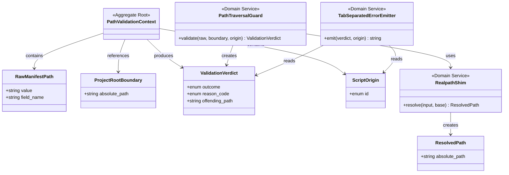

# ドメインモデル: aidlc-migrate manifest 由来パスのトラバーサル検証

## 概要

aidlc-migrate スクリプトが manifest（JSON）から取得した `path` / `destination` 文字列を、書き込み操作（`cp` / `rm` / `mkdir` / `mv` / `sed > $tmp && mv`）の前に検証し、`AIDLC_PROJECT_ROOT` 配下に物理的に収まることを保証する。

**重要**: このドメインモデル設計では**コードは書かず**、構造と責務の定義のみを行います。実装は Phase 2 で行います。

## エンティティ（Entity）

本 Unit には独立した永続化ライフサイクルを持つエンティティは存在しない（純粋関数的な検証ロジックのため）。検証対象パスは値オブジェクトとして扱う。

## 値オブジェクト（Value Object）

### RawManifestPath（生 manifest パス）

- **属性**:
  - `value`: string - manifest から jq で抽出した path / destination 文字列（未検証）
  - `field_name`: string - 由来フィールド名（`path` / `destination` / `new_path`）
- **不変性**: 値は manifest 由来の入力でありそのまま保持。正規化や物理解決は行わない（純粋な入力値の表現）
- **等価性**: `value` と `field_name` のペアで判定

### ProjectRootBoundary（プロジェクトルート境界）

- **属性**:
  - `absolute_path`: string - `AIDLC_PROJECT_ROOT` を `realpath -P` 相当で物理解決した絶対パス（末尾スラッシュなし正規形）
- **不変性**: スクリプト実行中は常に同一値。**スクリプト起動時に `_aidlc_migrate_path_guard_init` で1回だけ解決し、以降は再解決しない**（パフォーマンス NFR 達成 / テスタビリティ確保のための明示的なライフサイクル管理）
- **等価性**: `absolute_path` の文字列等価性で判定
- **不変条件**: `absolute_path` は `AIDLC_PROJECT_ROOT` 環境変数由来の物理パス。シンボリックリンク経由でない実在ディレクトリ。初期化前に PathTraversalGuard.validate を呼ぶと `init-required` システムエラー

### ResolvedPath（解決済みパス）

- **属性**:
  - `absolute_path`: string - RawManifestPath を `ProjectRootBoundary` を base directory として物理解決した絶対パス
- **不変性**: 同一の RawManifestPath + ProjectRootBoundary の組合せに対して常に同一値
- **等価性**: `absolute_path` の文字列等価性で判定

### ValidationVerdict（検証判定）

- **属性**:
  - `outcome`: enum - `accepted` / `rejected`
  - `reason_code`: enum - `accepted` の場合は `none`、`rejected` の場合は以下のいずれか:
    - `absolute_path` - 絶対パス（`/` で始まる）
    - `parent_traversal` - path component に `..` を含む
    - `outside_project_root` - 物理解決後にプロジェクトルート配下外
    - `symlink_escape` - シンボリックリンク経由でプロジェクトルート外に脱出
  - `offending_path`: string - 拒否時の元 path（マスクなし、ログ出力用）
- **不変性**: 検証実行時に1回だけ生成され、その後変更されない
- **等価性**: 3 属性すべての一致で判定

### ScriptOrigin（呼び出し元スクリプト識別子）

- **属性**:
  - `id`: enum - `migrate-apply-config` / `migrate-apply-data` / `migrate-cleanup`
- **不変性**: 値オブジェクトとして列挙値のみ保持
- **等価性**: `id` の文字列等価性

## 集約（Aggregate）

### PathValidationContext（パス検証コンテキスト）

- **集約ルート**: PathValidationContext（コンテキスト自体）
- **含まれる要素**: RawManifestPath × 1、ScriptOrigin × 1、ProjectRootBoundary × 1（参照）、ValidationVerdict × 1（実行結果）
- **境界**: 単一の `_aidlc_migrate_validate_path` 呼び出しに対応する1回分の検証コンテキスト
- **不変条件**:
  - `outcome=rejected` であれば `reason_code≠none` かつ `offending_path` は RawManifestPath.value と等しい
  - `outcome=accepted` であれば呼び出し元は raw path をそのまま使って書き込み操作を実施できる

## ドメインサービス

### PathTraversalGuard（パストラバーサル防御）

- **責務**: RawManifestPath を ProjectRootBoundary に対して検証し、ValidationVerdict を返す
- **操作**:
  - `validate(raw: RawManifestPath, boundary: ProjectRootBoundary, origin: ScriptOrigin) -> ValidationVerdict` - 以下の順で短絡判定:
    1. `raw.value` が `/` で始まる → `rejected(absolute_path)`
    2. `raw.value` の path component に `..` 含有 → `rejected(parent_traversal)`
    3. RealpathShim で物理解決した ResolvedPath が ProjectRootBoundary 配下外 → `rejected(outside_project_root)`
    4. RealpathShim 解決過程でシンボリックリンクが ProjectRootBoundary 外を指す → `rejected(symlink_escape)`
    5. それ以外 → `accepted`
- **不変条件**: 検証順序は固定（1→2→3→4）。早期検出可能なケースから順に判定し、後段の `realpath` 呼び出しオーバーヘッドを避ける
- **副作用**: なし（純粋関数）

### RealpathShim（realpath ポータブル化）

- **責務**: macOS BSD と GNU coreutils の `realpath` 挙動差を吸収し、物理パス（symlink 解決済み）を返す
- **操作**:
  - `resolve(input: string, base: ProjectRootBoundary) -> ResolvedPath | RealpathSystemError` - 物理パス解決を実施:
    - 第一選択: `realpath -m <input>` が利用可能 → そのまま使用
    - フォールバック: pure bash `cd -P` ループ実装（実体不在 path も親方向に遡って解決）
  - `RealpathSystemError`: 外部コマンド失敗等のシステムエラー（バリデーションではない）
- **不変条件**: 同一入力に対して macOS / Linux で同一の ResolvedPath を返す（クロスプラットフォーム不変性）
- **副作用**: なし（プロセス起動と stdout 読み取りのみ、ファイルシステムへの書き込みなし）

### TabSeparatedErrorEmitter（エラーメッセージ整形）

- **責務**: ValidationVerdict が `rejected` の場合に、tab 区切り 4 フィールドの機械可読 stderr メッセージを生成する
- **操作**:
  - `emit(verdict: ValidationVerdict, origin: ScriptOrigin, field_name: string) -> string` - 形式: `error\t<origin.id>:path-traversal\t<verdict.offending_path>\treason=<verdict.reason_code>;field=<field_name>`
- **不変条件**:
  - フィールド区切りは tab (`\t`) 固定、4 フィールド固定（5番目フィールドを追加しない / 機械パーサ互換性）
  - 第4フィールド内に `;` 区切りで `field=<field_name>` を含めることで診断精度を上げる（フィールド数=4 は維持）
  - `offending_path` には未マスクの値を含める（攻撃検出のためのフォレンジック価値優先 / Unit 定義 NFR）

## リポジトリインターフェース

本 Unit には永続化対象がないため、リポジトリは存在しない。

## ファクトリ（必要な場合のみ）

不要（値オブジェクトは入力文字列からの直接生成で十分）。

## ドメインモデル図

## ユビキタス言語

- **manifest**: aidlc-migrate スクリプトが入力として読み取る JSON ファイル（`apply.json` 等）。`resources[]` 配列で個別の処理要件を表現する
- **path traversal**: 入力パスに `..` や絶対パスを使って意図された境界を超える攻撃手法（OWASP 上の汎用脆弱性パターン）
- **fail-closed**: 検証失敗時に即停止する設計方針。安全側に倒すための原則
- **物理パス解決**: シンボリックリンクを実体に解決した正規形パス（`realpath -P` 相当）。論理パス解決（`readlink -f` の一部実装等）と対比して使う
- **二層 exit code 契約**: バリデーションエラー（拒否）= exit 1、システムエラー（環境異常）= exit 2 という 2 つのレイヤーの呼び出し元契約

## 不明点と質問（設計中に記録）

なし（計画段階で I/F・shim 方針が確定済み）。Phase 1 では pure bash `cd -P` ループの具体アルゴリズムを論理設計側で詰める。
