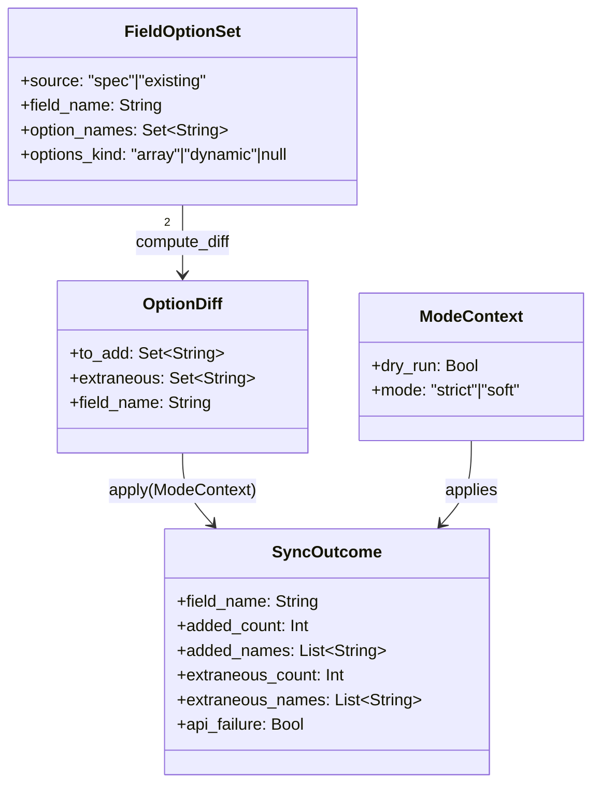

# ドメインモデル: Unit 004 — gh-project-cli ensure-fields の field options 差分同期

## 概要

`bin/gh-project-cli.sh ensure-fields` の `field:exists` 分岐に、spec.yaml と既存 Project field の **options 集合差分を片方向（spec → 既存）に同期する**責務を追加する。本 Unit はシェルスクリプトと GitHub Projects API の改修であり、伝統的な OO ドメインモデルというよりは「コマンド責務・集合演算・モード別不変条件」を中心に記述する。

**重要**: このドメインモデル設計では **コードは書かず**、構造と責務の定義のみを行う。実装は Phase 2 で行う。

---

## ドメイン概念

### 概念 1: FieldOptionSet（field options 集合）

- **定義**: 1 つの SINGLE_SELECT field が保持する option 名の集合
- **属性**:
  - `source`: `spec` / `existing` のいずれか
  - `field_name`: 対象 field 名（例: `Status`、`Cycle`、`Priority`）
  - `option_names`: option 名の集合（順序保証なし）
  - `options_kind`: spec のみ持つ属性。`array`（明示列挙）/ `dynamic`（cycle_map から派生）/ `null`（非 single_select）
- **不変条件**:
  - `source=spec` かつ `options_kind=array` のときのみ差分同期の対象
  - `source=spec` かつ `options_kind=dynamic` の場合は差分同期から除外（実 milestone 投入は `sync-items` 経路の責務）
  - option 名の集合演算は **JSON 配列**として保持する（CSV を内部表現としない）。出力時の CSV 整形は表示層の責務のみとし、ロジック層では JSON 配列のまま扱う（R1 指摘 #3 反映）

### 概念 2: OptionDiff（options 差分）

- **定義**: spec FieldOptionSet と existing FieldOptionSet から計算される 2 方向の差集合
- **属性**:
  - `to_add`: `spec - existing`（spec にあって existing にない option の集合）= 追加方向の差分
  - `extraneous`: `existing - spec`（existing にあって spec にない option の集合）= 既存余分
  - `field_name`: 対象 field 名
- **不変条件**:
  - 本 Unit のスコープは **`to_add` の API 反映**のみ（追加方向）
  - `extraneous` は **検出のみ**実施し、削除 API は呼ばない（境界）
  - `to_add` が空かつ `extraneous` が空 → no-op（出力なし）

### 概念 3: ModeContext（モード文脈）

- **定義**: `_subcmd_ensure_fields` 起動時の動作モードを表す文脈
- **属性**:
  - `dry_run`: `_DRY_RUN`（true / false）
  - `mode`: `_MODE`（`strict` / `soft`）
- **不変条件**:
  - `dry_run=true` のとき API は呼ばれない（idempotency 担保）
  - `dry_run=true` かつ `extraneous` 検出時、exit はしない（既存 dry-run 整合）
  - **`dry_run=false` かつ `mode=strict` かつ `extraneous != ∅` のとき、追加 API は呼ばずに即 exit 3（fail-fast）**（R1 指摘 #2 反映）
  - `dry_run=false` かつ `mode=strict` かつ API 失敗のとき exit 3
  - `dry_run=false` かつ `mode=soft` のときは extraneous / API 失敗ともに warn のみで exit 0

### 概念 4: SyncOutcome（同期実行結果）

- **定義**: 1 つの field に対する `_sync_field_options` 実行 1 回の結果
- **属性**:
  - `field_name`: 対象 field 名
  - `added_count`: 実際に追加した（または追加予定の）option 数
  - `added_names`: 追加した（または追加予定の）option 名リスト
  - `extraneous_count`: 既存余分の数
  - `extraneous_names`: 既存余分の option 名リスト
  - `api_failure`: API 呼出失敗フラグ（mode=soft 時のみ true のまま継続）
- **不変条件**:
  - `dry_run=true` のとき `added_count` は「予定数」（実際の API 呼出は 0）
  - `added_names` の集合と OptionDiff.to_add の集合は一致する（または部分集合 = soft で途中失敗時）
  - 出力フォーマット（stdout / stderr）は ModeContext と SyncOutcome の合成として決定的に導出される

---

## コマンド責務

### コマンド 1: `_subcmd_ensure_fields`（既存サブコマンド、拡張）

- **既存責務**（変更なし）:
  - spec.yaml ロード / runtime binding 確認 / 既存 fields 取得（`gh_project_state_get_fields`）
  - field 名一致で existing 判定（`.fields[] | select(.name==$n)`）
  - `field:exists:<name>` 出力
  - `field:create:<name>` 経路（`field:exists` でない場合）の field 新規作成
- **追加責務**（本 Unit）:
  - `field:exists` 分岐で **spec.options が array 形式**の場合に `_sync_field_options` を呼ぶ
  - 戻り値非 0 を伝播（既存 `create_field` 経路の rc 制御と同じ規約）
- **責務範囲外**:
  - field 自体の create / delete ロジック改変
  - dynamic option の差分計算（Cycle field は本 Unit のスコープ外）
  - options の削除 API 呼出（境界）
  - `ensure-views` / `sync-items` / `audit` への波及

### コマンド 2: `_sync_field_options`（新規ヘルパー）

- **責務**:
  - existing options の **JSON 配列**と spec options の **JSON 配列**を受け取り、集合差分（OptionDiff）を計算する
  - ModeContext（`_DRY_RUN` / `_MODE` グローバル変数）を参照し、SyncOutcome を生成する
  - 出力フォーマットに従って stdout / stderr に書き出す（CSV 整形は **表示層のみ**の責務）
  - 戻り値で呼出側に exit 制御の根拠（mode=strict での extraneous / API 失敗）を渡す
- **シグネチャ**: `_sync_field_options <field_id> <field_name> <existing_options_json> <spec_options_json> <owner> <number>`（R1 設計レビュー指摘 #3 反映: CSV → JSON 配列文字列）
  - `field_id`: 既存 field の Node ID（`gh api graphql` の `fieldId` 引数）
  - `field_name`: 出力用の field 名
  - `existing_options_json` / `spec_options_json`: jq の `-c` で抽出した **JSON 配列文字列**（例: `["A","B"]`、空配列 `[]` 許容）
  - `owner` / `number`: `gh_project_repo_add_field_option` 経由でしか必要にならないが、引数化して責務を明示
- **不変条件**:
  - 引数で `mode` / `dry_run` は受け取らない（既存規約踏襲。`_subcmd_*` 系と同じグローバル変数参照）
  - `existing_options_json` / `spec_options_json` は **空配列 `[]` を許容**（その場合 `to_add` = spec / `extraneous` = existing と扱う）。空文字や非配列 JSON は `args_invalid` で return 1
  - 集合演算は **jq の `--argjson` + 配列 set 演算**で実装し、CSV を内部表現としない（bash 文字列分割の落とし穴を回避 / R1 設計レビュー指摘 #3 反映）
  - CSV への変換は表示層（`printf` 直前の `jq join(",")`）のみで実施する
  - 出力は SyncOutcome から決定的に導出（同入力 → 同出力）

### コマンド 3: `_emit_warn`（新規ヘルパー）

- **責務**:
  - 既存 `_emit_error` と同じ JSON 形式（`{error_type, details}`）で warn メッセージを stderr に出力する
  - **`exit` しない**（呼出側が exit 制御する）
- **シグネチャ**: `_emit_warn <error_type> 
`
- **不変条件**:
  - stderr 限定（stdout に出力しない）
  - process は exit せず戻り値 0
  - `_emit_error` と同形式の JSON（{error_type, details}）。tab 区切り形式は導入しない

---

## 入出力契約

### 入力契約

| 入力源 | 契約 |
|--------|------|
| spec.yaml | `.fields[*].options` は `array` / `dynamic` / `null` のいずれか。`array` の場合は string の配列、order は spec 順 |
| `gh project field-list --format json` | `.fields[]` は `{id, name, options[]?}` の構造。`options[].name` で option 名取得（v2 SINGLE_SELECT field のみ） |
| `_DRY_RUN` / `_MODE` | 既存 `_parse_common_opts` でパース済の bash グローバル変数 |

### 出力契約

| 出力先 | 形式 | 用途 |
|--------|------|------|
| stdout | `field:<name>:options-added:<count>:names=<n1>,<n2>,...` | 通常追加実行時 |
| stdout | `field:<name>:options-would-add:<count>:names=<n1>,<n2>,...` | dry-run 時の追加予定 |
| stdout | （出力なし） | no-op（差分なし） |
| stderr | `{"error_type":"options_extraneous","details":"field=<name>:names=<n1>,..."}` | spec にない既存 options を検出 |
| stderr | `{"error_type":"gh_api_error","details":"options_add_failed:field=<name>:option=<n>"}` | `_emit_warn`（soft）または `_emit_error`（strict）として共通 |

### exit code 契約

| 状況 | exit code |
|------|-----------|
| 全成功（no-op / 追加成功） | 0 |
| dry-run + 任意の検出 | 0 |
| soft + extraneous / API 失敗 | 0 |
| strict + extraneous | 3 |
| strict + API 失敗 | 3 |
| 引数エラー（実装不整合） | 1（既存 `_emit_error args_invalid` 規約） |

---

## 不変条件（横断）

1. **冪等性**: 同一 spec / 同一 existing 状態で複数回 `_subcmd_ensure_fields` を実行しても結果が変わらない（追加成功後の 2 回目以降は no-op）
2. **片方向同期**: 削除方向の API 呼出は本 Unit では発生しない（strict は検出のみ）
3. **dynamic 除外**: `options_kind=dynamic` の field は差分同期処理を素通り（既存 `field:exists:<name>` のみ出力）
4. **既存 create 経路非干渉**: `field:exists` 判定 false の場合の `field:create:<name>` 経路は本 Unit では一切変更しない
5. **ドッグフーディング判定なし**: starter kit / consumer プロジェクトで動作が分岐しない（汎用論理のみ）
6. **コマンド置換境界**: bash スクリプト内部での `$(...)` ローカル変数代入は既存スタイル踏襲で許容（Unit 定義「Intent 制約適合」と整合 / R1 指摘 #1 で文言統一済み）。AI Bash プロンプト経由および git commit -m に渡す文字列内の `$(...)` は新規導入しない

---

## ユビキタス言語

- **options 差分同期**: spec → 既存の片方向追加（GitHub Projects field の SINGLE_SELECT options を spec.yaml に合わせて拡張する操作）
- **冪等同期**: 同一 spec で複数回実行しても結果が変わらない性質
- **追加方向 (to_add)**: `spec - existing` の集合
- **既存余分 (extraneous)**: `existing - spec` の集合（本 Unit では検出のみ）
- **dynamic field**: `spec.fields[*].options = "dynamic"` の field（Cycle field のみ）。実 milestone 投入は `sync-items` 経路の責務
- **ModeContext**: `_DRY_RUN` / `_MODE` の組合せが決定する 1 起動内の動作文脈
- **SyncOutcome**: 1 field 1 起動の同期結果（added / extraneous / api_failure を含む）

---

## ドメインモデル図

---

## 不明点と質問

[Question] なし。設計レビューで追加質問があれば追記する。
