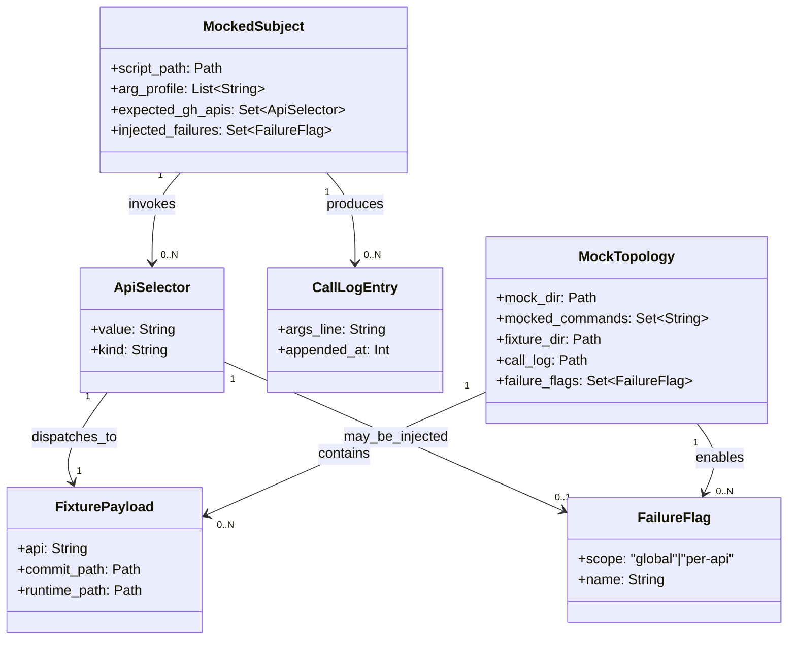

# ドメインモデル: Unit 005 — gh-project 副作用 bats テスト整備（gh API モックフレームワーク）

## 概要

`bin/tests/gh-project/_helpers.bash` を SoT とする **gh API モックフレームワーク** と、`setup-github-project.sh` / `migrate-issue-524.sh` / `probe-github-project.sh` / `audit-github-project.sh` 4 スクリプトの **副作用本体動作 bats** を整備する責務を表現する。本 Unit はテストインフラの追加であり、伝統的な OO ドメインモデルというよりは「モック契約・呼出履歴・失敗注入・fixture ライフサイクル」を中心に記述する。

**重要**: このドメインモデル設計では **コードは書かず**、構造と責務の定義のみを行う。実装は Phase 2 で行う。

---

## ドメイン概念

### 概念 1: ApiSelector（API 選択子）

- **定義**: `gh` wrapper が dispatch する単位。gh サブコマンド + 第 1 引数の組（スペース 1 個区切り）
- **属性**:
  - `value`: 文字列（例: `"project list"` / `"issue delete"` / `"api graphql"`）
  - `kind`: `auth` / `project-*` / `issue-*` / `api-*` のいずれか（dispatcher 内部分類のため）
- **不変条件**:
  - `value` は **gh サブコマンド名（1 トークン）+ 半角 1 スペース + サブサブコマンド名（1 トークン）** の形式に固定（dispatcher の `case "$1 $2"` 文と 1 対 1）
  - 例外: `auth status` は dispatch されずに即 stub 応答（`echo "Logged in"; exit 0`）で固定処理される
  - 第 3 引数以降（オプション / 値）は ApiSelector の同一性判定に含めない（dispatcher は subcommand のみで分岐し、payload は CallLogEntry に保存される）

### 概念 2: FailureFlag（失敗注入フラグ）

- **定義**: API 別または全体の失敗注入を制御する環境変数
- **属性**:
  - `scope`: `global` / `per-api`
  - `name`: 環境変数名（`MOCK_GH_FAIL` または `MOCK_<UPPER_UNDERSCORE>_FAIL`）
  - `derived_from`: per-api の場合は元 ApiSelector 値（例: `"project list"`）
- **不変条件**:
  - `scope=global` の `name` は **`MOCK_GH_FAIL` の 1 つのみ**（singleton）
  - `scope=per-api` の `name` は ApiSelector 値の正規化結果（`[:lower:][:space:]-` → `[:upper:][:space:]_` への変換 + 末尾 `_FAIL`）
  - **優先順位**: global > per-api（global が立っていれば API 別フラグの有無を問わず即 fail）
  - dispatcher の case 各分岐内で per-api フラグを評価し、case 文の手前でグローバルフラグを評価する（実装順序は後述「コマンド 2」の責務）
  - 立てるのは `gh_project_inject_failure <api>` ヘルパー経由（直接 export も可）。立てるタイミングは bats `setup()` または各 `@test` の冒頭

### 概念 3: FixturePayload（fixture JSON ペイロード）

- **定義**: `gh` wrapper が dispatch 成功時に `cat` で stdout に出力する JSON ファイル 1 つ
- **属性**:
  - `api`: ApiSelector の `value` をハイフン区切りに正規化したキー（例: `"project list"` → `project-list`、`"issue delete"` → `issue-delete`）
  - `commit_path`: リポジトリ commit 対象パス（`bin/tests/gh-project/fixtures/<api>.json` 配下）
  - `runtime_path`: ランタイム展開先（`${GH_PROJECT_FIXTURE_DIR}/<api>.json`、デフォルト `${BATS_TEST_TMPDIR}/fixtures/<api>.json`）
- **不変条件**:
  - **SoT は `commit_path`**（リポジトリ commit 対象）。`runtime_path` は SoT のコピー
  - `runtime_path` の親ディレクトリは `gh_project_setup_env` で必ず `mkdir -p` 済み
  - 同一 `api` キーに対して複数の fixture（正常系 / 異常系 / 大量データ等）を SoT 側で持ち、`gh_project_set_fixture <api> <commit_path>` で切替
  - `runtime_path` が存在しない状態で wrapper が dispatch すると `fixture not found: <runtime_path>` + exit 98（実装不備の即時検出）
  - fixture の JSON スキーマは 4 スクリプト本体が実際に `jq` クエリで参照するキー構造と一致させる（mock false positive 防止）

### 概念 4: CallLogEntry（呼出履歴エントリ）

- **定義**: `gh` wrapper が起動された 1 回分の引数列の記録
- **属性**:
  - `args_line`: `$*` を 1 行で連結した文字列（スペース 1 個区切り）
  - `appended_at`: 行番号（追記順、`wc -l` 相当）
- **不変条件**:
  - 記録先は `${GH_PROJECT_CALL_LOG}`（デフォルト `${BATS_TEST_TMPDIR}/gh_calls.log`）
  - `gh_project_setup_env` で空ファイル化（`: > "$GH_PROJECT_CALL_LOG"`）された状態から `@test` が開始する
  - 1 `@test` 内の bats `run` 1 回につき 0〜N 行追記される（呼出回数に等しい）
  - 追記タイミングは dispatcher 評価の **最初**（失敗注入で exit する場合も呼出履歴は 1 行残る）
  - アサートは `gh_project_assert_gh_call_count <pattern> <count>` / `gh_project_assert_gh_call_contains <pattern>` 経由（grep -c / grep -q）

### 概念 5: MockedSubject（モック対象スクリプト）

- **定義**: bats `run` で実行される 4 スクリプトのいずれか + `gh-project-cli.sh`
- **属性**:
  - `script_path`: リポジトリ root からの相対パス（例: `bin/probe-github-project.sh`）
  - `arg_profile`: bats `@test` ごとに決定される引数列（`--dry-run` / `--strict` / `--soft` / `--probe <name>` / `--check <type>` 等）
  - `expected_gh_apis`: 当該 `@test` で起動を想定する ApiSelector 集合
  - `injected_failures`: 当該 `@test` で立てる FailureFlag 集合
- **不変条件**:
  - 本 Unit では `script_path` の **本体を変更しない**（テスト追加のみ。Intent 制約適合）
  - `arg_profile` は CLI の args パース仕様に従い、unknown option は subject 自身が `args_invalid` を返す（mock 側で検出する責務ではない）
  - `expected_gh_apis` は dispatcher の case 文に登録されている ApiSelector の部分集合（未登録 API を呼ぶ subject はテスト失敗で検出すべき）

### 概念 6: MockTopology（モック構成）

- **定義**: 1 つの `@test` 実行中に有効な mock 一式
- **属性**:
  - `mock_dir`: `${MOCK_DIR}`（デフォルト `${BATS_TEST_TMPDIR}/mock-bin`、PATH 先頭に挿入）
  - `mocked_commands`: `gh` / `dasel` / `yq` / その他 wrapper の集合
  - `fixture_dir`: `${GH_PROJECT_FIXTURE_DIR}`
  - `call_log`: `${GH_PROJECT_CALL_LOG}`
  - `failure_flags`: 現在 export されている FailureFlag 集合
- **不変条件**:
  - `mock_dir` は `PATH` の最先頭に配置され、bats `run` 子プロセスにも継承される（subprocess 透過性）
  - bats `teardown()` は不要（`BATS_TEST_TMPDIR` が bats により自動 cleanup される）
  - mock 化していないコマンド（`bash` / `jq` / `printf` 等）は実体を使用する
  - `mock_dir` 配下に同名コマンドが複数あった場合の挙動は **未定義**（実装上は単一 wrapper のみ配置）

---

## コマンド責務

### コマンド 1: `gh_project_setup_env`（新規 helper / セットアップ）

- **責務**:
  - `AIDLC_REPO_ROOT` を `BATS_TEST_TMPDIR` に固定し、4 スクリプトが参照する `.aidlc/cache` / `config` ディレクトリを事前作成
  - `MOCK_DIR` / `GH_PROJECT_CALL_LOG` / `GH_PROJECT_FIXTURE_DIR` のデフォルト export と `mkdir -p`
  - `PATH` の先頭に `MOCK_DIR` を挿入
  - `GH_PROJECT_CALL_LOG` を空ファイル化
- **シグネチャ**: 引数なし（環境変数で制御）
- **不変条件**:
  - 既存の export 値（テスト側で先に設定済みの場合）を尊重（`:-` フォールバック）
  - 自身は mock factory を呼ばない（factory 呼出は別ヘルパーの責務）
  - 副作用は `BATS_TEST_TMPDIR` 配下と環境変数のみ（リポジトリ作業ツリーに書き込まない）

### コマンド 2: `gh_project_mock_gh`（新規 helper / gh wrapper factory）

- **責務**:
  - `${MOCK_DIR}/gh` に bash wrapper script を生成（heredoc）
  - wrapper 内部は (1) 呼出履歴追記 → (2) `auth status` 即応答 → (3) グローバル FailureFlag 評価 → (4) ApiSelector 別 case 文評価（per-api FailureFlag → fixture dispatch） → (5) `*)` で未モック検出 exit 99 → (6) fixture `cat` の順序で動作
  - chmod +x 付与
- **シグネチャ**: 引数なし（dispatch 表は wrapper 内に固定埋込）
- **不変条件**:
  - 生成された wrapper は **冪等**（複数回呼んでも同一内容で上書き）
  - case 文の網羅範囲は §「ApiSelector dispatch 表」（後述）で固定
  - グローバル FailureFlag は case 文の **前** に評価される（per-api より優先）
  - 未モック API は exit 99 で fail（false positive 防止 / NFR「検出力」担保）
  - fixture 不在は exit 98 で fail（実装不備の即時検出）

### コマンド 3: `gh_project_mock_dasel` / `gh_project_mock_yq`（新規 helper / 補助 wrapper factory）

- **責務**:
  - 各 wrapper script を `${MOCK_DIR}` に生成
  - `dasel`: Unit 004 で使用された v2/v3 構文双方を吸収するパターンを継承（`-f <file> <key>` / `<key> -f <file>` / `< <file>` の 3 形式）
  - `yq`: `<file>.json` が存在すればそれを返す（Unit 004 と同一）
- **不変条件**:
  - 4 スクリプトおよび `gh-project-cli.sh` が実際に呼ぶフォーマット以外はサポートしない（境界）
  - `dasel` / `yq` のフルモック化はスコープ外（Unit 定義「境界」）

### コマンド 4: `gh_project_set_fixture`（新規 helper / fixture コピー）

- **責務**:
  - リポジトリ commit 対象 fixture（`<src>`）をランタイム展開先（`${GH_PROJECT_FIXTURE_DIR}/<api>.json`）にコピー
- **シグネチャ**: `gh_project_set_fixture <api> <src>`
- **不変条件**:
  - `<src>` が存在しない場合は cp が exit 非 0 で即 fail（bats `setup()` がエラーで止まる）
  - `<api>` 名はハイフン区切り（`project-list` 等）。スペースを含まない
  - 上書き許容（同一 `@test` 内で fixture 切替の用途を想定）

### コマンド 5: `gh_project_inject_failure`（新規 helper / 失敗注入）

- **責務**:
  - 引数の ApiSelector 値を `MOCK_<UPPER_UNDERSCORE>_FAIL` 形式の環境変数名に正規化し export
- **シグネチャ**: `gh_project_inject_failure <api>`（`<api>` はスペース区切りの ApiSelector 値、例: `"project list"`）
- **不変条件**:
  - 変換規則: `[:lower:]` → `[:upper:]`、半角スペース → `_`、ハイフン → `_`、末尾に `_FAIL` 付与
  - グローバル失敗は `export MOCK_GH_FAIL=1` を直接呼ぶ（本ヘルパー経由ではない）
  - 立てたフラグは bats `@test` 終了時にプロセスごと破棄される（`BATS_TEST_TMPDIR` cleanup と同時）

### コマンド 6: `gh_project_assert_gh_call_count` / `gh_project_assert_gh_call_contains`（新規 helper / 呼出アサート）

- **責務**:
  - `${GH_PROJECT_CALL_LOG}` を grep -c / grep -q で評価し、bats `[ "$status" -eq ... ]` と同じスタイルでアサート失敗時に non-zero return
- **シグネチャ**:
  - `gh_project_assert_gh_call_count <pattern> <expected_count>`
  - `gh_project_assert_gh_call_contains <pattern>`
- **不変条件**:
  - `<pattern>` は basic / extended のうち **extended regexp**（`grep -E`）で評価
  - アサート失敗時に期待 / 実際の差分を stderr に出力（デバッグ支援）
  - `${GH_PROJECT_CALL_LOG}` 不在は実装不備で即 fail（`gh_project_setup_env` 未呼出を意味する）

---

## ApiSelector dispatch 表（dispatcher case 文の SoT）

| ApiSelector | 該当する subject 利用箇所 | fixture key | per-api FailureFlag |
|------------|--------------------------|-------------|--------------------|
| `auth status` | 全 subject（`gh_scope_check_require` 経由） | （fixture 不要 / stub 応答） | （対象外） |
| `project list` | `setup-github-project.sh` → `ensure-project`（`gh-project-state.sh:79`） | `project-list` | `MOCK_PROJECT_LIST_FAIL` |
| `project create` | `setup-github-project.sh` → `ensure-project`（`gh-project-repo.sh:39`） | `project-create` | `MOCK_PROJECT_CREATE_FAIL` |
| `project edit` | `ensure-project` の visibility public 化（`gh-project-repo.sh:52`） | `project-edit` | `MOCK_PROJECT_EDIT_FAIL` |
| `project field-list` | `ensure-fields` / `audit-github-project.sh`（`gh-project-state.sh:94`） | `field-list` | `MOCK_PROJECT_FIELD_LIST_FAIL` |
| `project field-create` | `ensure-fields` の field 新規作成（`gh-project-repo.sh:70`） | `project-field-create` | `MOCK_PROJECT_FIELD_CREATE_FAIL` |
| `project view-list` | `ensure-views`（`gh-project-state.sh:105`） | `project-view-list` | `MOCK_PROJECT_VIEW_LIST_FAIL` |
| `project view-create` | `ensure-views` の view 新規作成（`gh-project-repo.sh:124`） | `project-view-create` | `MOCK_PROJECT_VIEW_CREATE_FAIL` |
| `project item-add` | `probe-github-project.sh` sandbox 作成 / `sync-items`（`gh-project-repo.sh:151`） | `project-item-add` | `MOCK_PROJECT_ITEM_ADD_FAIL` |
| `project item-list` | `probe-github-project.sh` / `audit-github-project.sh`（`gh-project-state.sh:116`） | `project-item-list` | `MOCK_PROJECT_ITEM_LIST_FAIL` |
| `project item-edit` | `probe-github-project.sh` / `sync-items`（`gh-project-repo.sh:169`） | `project-item-edit` | `MOCK_PROJECT_ITEM_EDIT_FAIL` |
| `issue list` | `sync-items` で backlog Issue 列挙（`gh-project-cli.sh:530`） | `issue-list` | `MOCK_ISSUE_LIST_FAIL` |
| `issue view` | `migrate-issue-524.sh` body 取得（`migrate-issue-524.sh:63`）+ `sync-items`（`gh-project-cli.sh:522`） | `issue-view` | `MOCK_ISSUE_VIEW_FAIL` |
| `issue create` | `probe-github-project.sh` sandbox 作成（`gh-project-repo.sh:175`） | `issue-create` | `MOCK_ISSUE_CREATE_FAIL` |
| `issue edit` | `migrate-issue-524.sh` body 書換（`migrate-issue-524.sh:112`） | `issue-edit` | `MOCK_ISSUE_EDIT_FAIL` |
| `issue close` | `probe-github-project.sh` sandbox close（`gh-project-repo.sh:182`） | `issue-close` | `MOCK_ISSUE_CLOSE_FAIL` |
| `issue delete` | `probe-github-project.sh` cleanup（`gh-project-repo.sh:188`） | `issue-delete` | `MOCK_ISSUE_DELETE_FAIL` |
| `api graphql` | `ensure-fields` の `gh_project_repo_add_field_option`（`gh-project-repo.sh:87`） | `api-graphql` | `MOCK_API_GRAPHQL_FAIL` |
| **未登録（catch-all）** | （想定外） | （対象外） | （`unmocked:<args>` + exit 99） |

**fixture キー命名規約（指摘 #2 反映で明文化）**:

- fixture キー = `ApiSelector.value` の半角スペース・ハイフンを `-` に正規化したもの（例: `"project view-list"` → `project-view-list`、`"issue delete"` → `issue-delete`）
- fixture ファイル名 = `<fixture key>.json`
- 同一 API で複数バリアントが必要な場合のみ `<fixture key>-<variant>.json`（例: `field-list-default.json` / `field-list-with-cycle.json`）
- 命名は本表を SoT とし、論理設計の fixtures 一覧・スキーマ表は本表に追従する

---

## 不変条件（横断）

1. **未モック検出**: dispatcher の `*)` 分岐は **常時** `unmocked:<args>` + exit 99 を返す（false positive 防止 / NFR「検出力」）
2. **失敗注入の優先順位**: global `MOCK_GH_FAIL` > per-api `MOCK_<API>_FAIL`（dispatcher 内の評価順序で担保）
3. **fixture SoT 単一化**: リポジトリ commit 対象 fixture が唯一の SoT。ランタイム展開は SoT のコピーであり、SoT を変更しないテストは fixture を一切作成しない（読み込みで `runtime_path` 不在エラーが出るのは実装不備の即時検出）
4. **呼出履歴の不可破壊性**: `gh_project_setup_env` 以降、`@test` 内で `${GH_PROJECT_CALL_LOG}` を手動で書き換えない（アサート信頼性の担保）
5. **subject 非改変**: 4 スクリプト + `gh-project-cli.sh` の本体は本 Unit で変更しない（Intent 制約 / Phase 2 末尾の Unit 004 既存 bats モック経由化のみ既存 bats を変更する）
6. **ドッグフーディング判定なし**: モックヘルパーは consumer プロジェクトでも動作する汎用形式（自リポジトリ判定による分岐は導入しない / プロジェクトルール）
7. **コマンド置換境界**: `_helpers.bash` / bats ファイル内部の bash ローカル変数代入での `$(...)` は既存スタイル踏襲で許容。AI Bash プロンプト経由および git commit -m 内の `$(...)` は新規導入しない（CLAUDE.md ルール踏襲）
8. **再現性**: 同一 fixture + 同一環境変数 + 同一 subject 引数で **同一の bats 結果**（出力 / exit code / 呼出履歴）が得られる（決定性）

---

## ユビキタス言語

- **ApiSelector**: dispatcher の case 分岐キー（gh サブコマンド + 第 1 引数）
- **fixture SoT**: リポジトリ commit 対象の fixture JSON（`bin/tests/gh-project/fixtures/` 配下）
- **runtime fixture**: SoT のランタイム展開コピー（`${BATS_TEST_TMPDIR}/fixtures/` 配下）
- **per-api FailureFlag**: API 別の失敗注入環境変数（`MOCK_<API>_FAIL`）
- **global FailureFlag**: 全 API 共通の失敗注入環境変数（`MOCK_GH_FAIL`）
- **未モック検出**: dispatcher が catch-all `*)` で `unmocked:<args>` + exit 99 を返す挙動
- **subject**: bats `run` で実行される対象スクリプト（4 スクリプト + `gh-project-cli.sh`）
- **MockTopology**: 1 `@test` 中に有効な mock 一式（mock_dir / fixture_dir / call_log / failure_flags）
- **Unit 004 既存 bats モック経由化**: `ensure_fields_options_sync.bats` の `setup()` 内モック実装を `load '_helpers'` + 各 factory 呼出に置換する Phase 2 末尾の作業

---

## ドメインモデル図

---

## 不明点と質問

[Question] なし。設計レビューで追加質問があれば追記する。
