# ドメインモデル: Unit 006 AI エージェント Bash プロンプト経由の zsh OOM クラス予防

## 概要

「AI エージェントが Bash ツール経由で渡す文字列内のコマンド置換（`$(...)` / backtick）が zsh `command_not_found_handler` 再帰により OOM クラッシュを起こす根本原因クラス」への予防策を、リポジトリ配布規約（CLAUDE.md / AGENTS.md / SKILL.md / steps）として論理化する。

**重要**: 本 Unit は **規約ドキュメント改訂のみ** を対象とし、実行コード変更は伴わない。本ドメインモデルは「規約のレイヤー構造と参照経路」を整理する目的で記述する。

## エンティティ（Entity）

本 Unit はドキュメント Unit のため、ランタイムで識別可能な「エンティティ」は存在しない。代わりに「規約ドキュメント（Convention Document）」を論理エンティティとして扱う。

### ConventionDocument（規約ドキュメント）

- **ID**: ファイルパス（リポジトリルート相対 / 一意）
- **属性**:
  - `path`: string - リポジトリルート相対パス（一意 ID）
  - `layer`: enum - 規約レイヤー（`project_root` / `agent_baseline` / `skill_spec` / `phase_common` / `changelog`）
  - `audience`: enum - 想定読者（`ai_agent` / `human_contributor` / `both`）
  - `scope`: enum - 適用範囲（`repo_only` / `repo_and_consumer` / `distributed_baseline`）
- **振る舞い**:
  - `declare_rule(rule)`: 規約本文を宣言する（一次出典）
  - `reference_rule(source_path, anchor)`: 他規約ドキュメントを参照する（重複記述を避ける）
  - `provide_cross_reference(target_path, anchor)`: 他規約ドキュメントから参照可能にする

### 識別される ConventionDocument 7 種（案 b 採用時は +1 で 8 種）

| path | layer | audience | scope |
|------|-------|----------|-------|
| `CLAUDE.md` | `project_root` | `both` | `repo_and_consumer` |
| `AGENTS.md`（新規） | `agent_baseline` | `ai_agent` | `repo_and_consumer` |
| `skills/aidlc/SKILL.md` | `skill_spec` | `ai_agent` | `distributed_baseline` |
| `skills/write-history/SKILL.md` | `skill_spec` | `ai_agent` | `distributed_baseline` |
| `skills/aidlc/steps/common/commit-flow.md` | `phase_common` | `ai_agent` | `distributed_baseline` |
| `skills/aidlc/steps/common/review-flow.md` | `phase_common` | `ai_agent` | `distributed_baseline` |
| `CHANGELOG.md` | `changelog` | `human_contributor` | `repo_only` |

案 b 採用時には `skills/aidlc/steps/common/<新設>.md`（運用ガイド / `phase_common` / `ai_agent` / `distributed_baseline`）が追加され合計 8 種となる。本 Unit は論理設計の §「案 a / b 評価ログ」で **案 b 採用** が確定済み。

## 値オブジェクト（Value Object）

### SafetyRule（安全パターン規約）

- **属性**:
  - `forbidden_pattern`: 禁止されるコマンド置換パターン（`$(...)` / `` ` ` ``）
  - `applicable_scope`: 適用範囲（「全 Bash ツール呼び出し引数文字列」固定）
  - `recommendation_tier`: enum - 推奨度（`first_choice_file_based` / `second_choice_file_interface` / `forbidden_inline`）
  - `rationale`: zsh `command_not_found_handler` 再帰による OOM クラッシュ予防
  - `related_issues`: 一次起票 (#697) / 個別解決済 (#688)
- **不変性**: 規約本文は CLAUDE.md ① セクションを SoT（Single Source of Truth）として一次定義し、他ドキュメントは参照リンクのみ保持（重複記述しない）
- **等価性**: `forbidden_pattern` + `applicable_scope` の組で等価判定

### InterfaceRecommendation（インターフェース推奨度）

- **属性**:
  - `use_case`: enum - 用途（`history_record` / `pr_body` / `pr_ready` / `external_cli_review`）
  - `file_based_path`: 推奨される file-based 経路（例: `--content-file <file>` / `--body-file <file>`）
  - `inline_path`: 非推奨の直接引数経路（例: `--content "..."` / `--body "..."`）
  - `enforcement_level`: enum - 強制度（`must_recommend` / `should_recommend`）
- **不変性**: 一覧表は CLAUDE.md ① セクションの参考表に集約。個別 SKILL.md への直接改訂は本 Unit のスコープに含めない（`write-history` のみ MUST 例外）
- **等価性**: `use_case` で等価判定

### IssueReference（Issue 参照）

- **属性**:
  - `number`: int - GitHub Issue 番号
  - `status`: enum - `open` / `closed`
  - `relationship`: enum - `primary` / `sibling_resolved` / `predecessor`
- **不変性**: 改訂後の規約文書内では `#697` を primary、`#688` を sibling_resolved（CLOSED）として参照

## 集約（Aggregate）

### ConventionAggregate（規約集約）

- **集約ルート**: `CLAUDE.md`（SoT として規約本文を保持）
- **含まれる要素**:
  - `CLAUDE.md`（規約本文 SoT）
  - `AGENTS.md`（参照リンクのみ）
  - 各 SKILL.md / steps/common 配下のクロスリファレンス
- **境界**: 規約本文は CLAUDE.md ① セクションに集約。他ドキュメントは参照リンクのみ保持し、独自に詳細を再記述しない
- **不変条件**:
  - 規約本文の重複記述禁止（DRY 原則）
  - 参照先パス・アンカーは存在性を実装フェーズで検証
  - スクリプト本体動作・引数仕様は無変更（後方互換性完全維持）
  - ドッグフーディング特殊処理（自リポジトリ判定）禁止

## ドメインサービス

### CrossReferenceService（クロスリファレンス整合性サービス）

- **責務**: 規約ドキュメント間の参照リンクの整合性を保証する
- **操作**:
  - `validate_anchors()`: 参照先のアンカー（セクション見出し）が実在することを確認
  - `detect_duplication()`: 規約本文の重複記述を検出
  - `materialize_aggregate()`: ConventionAggregate の不変条件遵守を確認

実体は実装フェーズでのレビュー基準として機能する（自動化ツールは新設しない / markdownlint-cli2 で構文だけ保証）。

## リポジトリインターフェース

該当なし。本 Unit は永続化対象のドメインエンティティを持たないため、リポジトリインターフェースは設計しない。

## ファクトリ

該当なし。

## ドメインモデル図

```mermaid
classDiagram
    class ConventionAggregate {
        +CLAUDE_md: aggregate_root
        +invariants: DRY / cross_ref_integrity / backward_compat / no_dogfood
    }
    class CLAUDE_md {
        +path: "CLAUDE.md"
        +layer: project_root
        +scope: repo_and_consumer
        +declare_rule(SafetyRule)
    }
    class AGENTS_md {
        +path: "AGENTS.md"
        +layer: agent_baseline
        +scope: repo_and_consumer
        +reference_rule(CLAUDE_md, "#ai-エージェント-bash-ツール経由の安全パターン")
    }
    class SKILL_aidlc {
        +path: "skills/aidlc/SKILL.md"
        +layer: skill_spec
        +reference_rule(CLAUDE_md or steps_common, "...")
    }
    class SKILL_write_history {
        +path: "skills/write-history/SKILL.md"
        +layer: skill_spec
        +reference_rule(CLAUDE_md, "#ai-エージェント-bash-ツール経由の安全パターン")
        Note: 規約 SoT は CLAUDE.md ①。SKILL.md 内の --content-file 推奨明示は SoT 規約の運用補足（規約本文重複なし）
    }
    class commit_flow {
        +path: "skills/aidlc/steps/common/commit-flow.md"
        +layer: phase_common
        +reference_rule(CLAUDE_md, "#ai-エージェント-bash-ツール経由の安全パターン")
    }
    class review_flow {
        +path: "skills/aidlc/steps/common/review-flow.md"
        +layer: phase_common
        +reference_rule(CLAUDE_md, "#ai-エージェント-bash-ツール経由の安全パターン")
    }
    class CHANGELOG {
        +path: "CHANGELOG.md"
        +layer: changelog
        +scope: repo_only
    }

    ConventionAggregate o-- CLAUDE_md : root
    ConventionAggregate o-- AGENTS_md
    ConventionAggregate o-- SKILL_aidlc
    ConventionAggregate o-- SKILL_write_history
    ConventionAggregate o-- commit_flow
    ConventionAggregate o-- review_flow
    ConventionAggregate o-- CHANGELOG
    AGENTS_md ..> CLAUDE_md : references
    SKILL_aidlc ..> CLAUDE_md : references (案 a/b で経路分岐)
    commit_flow ..> CLAUDE_md : cross_reference
    review_flow ..> CLAUDE_md : cross_reference
```

## ユビキタス言語

- **コマンド置換（command substitution）**: シェルが `$(...)` または backtick `` ` ` `` を検出してその中身をコマンドとして実行し結果を文字列展開する機能
- **AI エージェント Bash ツール経由**: AI エージェント（Claude Code / Codex CLI / Gemini CLI 等）が Bash ツール（subprocess 起動）を通じてシェルコマンドを実行する経路。引数文字列がそのままシェル解釈される
- **zsh `command_not_found_handler` 無限再帰**: 未定義コマンドに対する zsh のフォールバックハンドラが、自身を再帰的に呼び出して fatal error: out of memory に至る既知パターン
- **file-based interface**: スクリプトが long-text を引数文字列ではなくファイルパス経由で受け取るインターフェース（`--content-file` / `--body-file` 等）
- **SoT（Single Source of Truth）**: 規約本文の一次出典。本 Unit では CLAUDE.md ① セクション
- **規約レイヤー**: ConventionDocument の `layer` 属性（`project_root` / `agent_baseline` / `skill_spec` / `phase_common` / `changelog`）
- **配布物 baseline**: starter kit が consumer プロジェクトに配布する規約セット。CLAUDE.md / AGENTS.md / skills/* が該当
- **ドッグフーディング特殊処理**: 自リポジトリが starter kit 自身か consumer かを判定して挙動を分岐させる本体スクリプトの内部処理。本 Unit では混入禁止

## 不明点と質問（設計中に記録）

[Question] 案 a / b 選定で 2:2 同点の場合、計画の確定ロジック「案 b デフォルト採用」に基づくが、Phase 1 終了時に基準スコアを評価ログとして論理設計ファイルに残すべきか
[Answer] 残す。論理設計の「案 a / b 評価ログ」セクションで 4 基準のスコアと根拠を明示する（再現可能性のため）

[Question] CLAUDE.md ① セクションに記載する参考表で `codex exec` の wrapper script 経由の具体的書式は本 Unit で確定するか
[Answer] 本 Unit では推奨経路の概念のみを示す。`codex exec - < <file>`（stdin 経由）の表記までは記載するが、wrapper script 実体の作成は別 Unit / 別 Issue（記載のみ）

[Question] `skills/aidlc/steps/common/commit-flow.md` の既存 backtick 関連記述（コミットメッセージ内 backtick 禁止）と本 Unit の規約（Bash ツール引数文字列内コマンド置換禁止）は別観点として扱うか
[Answer] 別観点として責務分離する。`commit-flow.md` には CLAUDE.md 新規セクションへの相互参照を追加し、「コミットメッセージ生成時のコマンド置換禁止は CLAUDE.md ① セクションの一例である」旨を 1〜2 行で明示する
