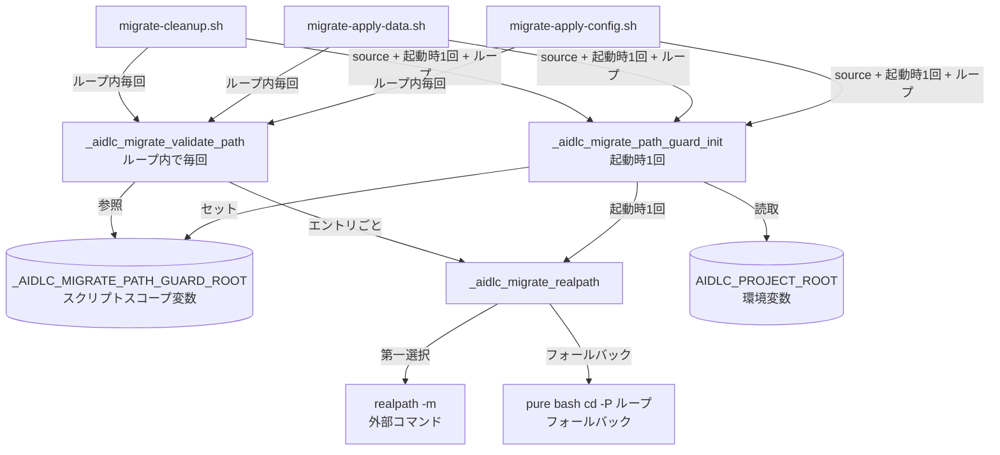

# 論理設計: aidlc-migrate manifest 由来パスのトラバーサル検証

## 概要

aidlc-migrate 配下の書き込み系3スクリプトに、共通ライブラリ `lib/path-guard.sh` 経由で manifest 由来パスの検証を組み込む。

**重要**: この論理設計では**コードは書かず**、コンポーネント構成とインターフェース定義のみを行います。具体的なコード（bash 関数本体・テストケース等）は Phase 2 で作成します。

## アーキテクチャパターン

**Library + Adapter パターン**:

- **Library 層**: `skills/aidlc-migrate/scripts/lib/path-guard.sh` がドメインサービス（PathTraversalGuard / RealpathShim / TabSeparatedErrorEmitter）を集約。bash function として実装し、source で呼び出し元から読み込む
- **Adapter 層**: 既存 3 スクリプト（migrate-apply-config.sh / migrate-apply-data.sh / migrate-cleanup.sh）が manifest を jq で抽出した直後に Library 関数を呼び出し、戻り値で書き込み操作の前置きとする

**選定理由**:

- 既存 aidlc-migrate スクリプト群は bash + jq + git で完結している。Library を bash function として実装することで、Python / Perl への依存追加を回避
- 3 ファイルすべてが同一の検証ロジックを必要とするため、コピー＆ペーストではなく source 共有による単一 SoT を確保
- 既存スクリプトの構造（jq ループ）を破壊せず、最小侵襲で組み込める

## コンポーネント構成

### モジュール構成

```text
skills/aidlc-migrate/scripts/
├── lib/                                      # 新設
│   └── path-guard.sh                          # 検証ライブラリ（PathTraversalGuard 集約）
├── migrate-apply-config.sh                    # 既存（検証フック追加）
├── migrate-apply-data.sh                      # 既存（検証フック追加）
└── migrate-cleanup.sh                         # 既存（検証フック追加）

tests/migration/
├── helpers/
│   └── setup.bash                              # 既存（攻撃 manifest fixture 追加）
├── migrate-path-traversal.bats                 # 新設（4×3 マトリクステスト）
├── migrate-apply-config.bats                   # 既存（回帰確認のみ）
├── migrate-apply-data.bats                     # 既存（回帰確認のみ）
└── migrate-cleanup.bats                        # 既存（回帰確認のみ）
```

### コンポーネント詳細

#### lib/path-guard.sh

- **責務**: PathTraversalGuard / RealpathShim / TabSeparatedErrorEmitter の bash 実装。呼び出し元が source で読み込んで使用
- **依存**: bash 4+ / coreutils `realpath` (利用可能なら) / git rev-parse
- **公開インターフェース**:
  - `_aidlc_migrate_path_guard_init` - 初期化関数（ProjectRootBoundary を1回解決し保持）
  - `_aidlc_migrate_validate_path <raw_path> <field_name> <script_id>` - メイン検証関数（init 済み前提）
  - `_aidlc_migrate_realpath <result_var> <input> [base]` - shim（第1引数に結果格納先変数名、第2引数 input、第3引数省略可な base。stdout は使わず `printf -v` で result_var に正規化済みパスを格納）
- **状態保持**: 初期化済みの ProjectRootBoundary は lib 内部のスクリプトスコープ変数 `_AIDLC_MIGRATE_PATH_GUARD_ROOT` に保持する（lib source 時は未設定、init 呼び出し後にセット）
- **非公開ヘルパー**（`_aidlc_migrate_*_internal` プレフィックス）:
  - 絶対パス判定
  - `..` セグメント判定
  - pure bash `cd -P` ループ実装
  - tab 区切りエラー出力

#### migrate-apply-config.sh（既存改修）

- **責務**: v1_config_move / config_update リソースの適用
- **依存**: `lib/path-guard.sh`（新規 source）
- **検証フック挿入位置**:
  - v1_config_move（line 62-63）: `path` および `dest` の jq 抽出直後（`if [[ -f "$dest" ]]` 判定の前）
  - config_update（line 100）: `path` の jq 抽出直後（`if [[ ! -f "$path" ]]` 判定の前）

#### migrate-apply-data.sh（既存改修）

- **責務**: v1_data_move / data_path_update リソースの適用
- **依存**: `lib/path-guard.sh`
- **検証フック挿入位置**:
  - v1_data_move（line 63-64）: `path` および `dest` の jq 抽出直後
  - data_path_update（line 93）: `path` の jq 抽出直後
  - file_rename（line 123 周辺）: `old_path` / `new_path` 両方を検証

#### migrate-cleanup.sh（既存改修）

- **責務**: cleanup リソースの適用（rm / mv）
- **依存**: `lib/path-guard.sh`
- **検証フック挿入位置**:
  - cleanup（line 80, 125 周辺）: `path` の jq 抽出直後

#### tests/migration/helpers/setup.bash（既存改修）

- **責務**: bats テストの共通セットアップ（TEST_TMPDIR 構築 / 攻撃 manifest 生成 / スクリプト実行ヘルパー）
- **依存**: bats-core 1.13+
- **新規追加機能**:
  - `setup_traversal_attack_manifest <attack_type> <resource_type>` - 攻撃シナリオ別 manifest 生成（attack_type ∈ {absolute, parent, outside, symlink}）
  - `assert_no_external_side_effect` - リポジトリ外ファイル変更なし検証

#### tests/migration/migrate-path-traversal.bats（新設）

- **責務**: PathTraversalGuard の統合テスト
- **依存**: setup.bash / lib/path-guard.sh / 3 スクリプト
- **テストマトリクス**: 4 attack × 3 script × 主要 field 組合せ（最低 8 ケース）

## インターフェース設計

### スクリプトインターフェース設計

#### lib/path-guard.sh（source される lib）

##### 関数 `_aidlc_migrate_path_guard_init`

###### 概要

呼び出し元スクリプト起動時に1回だけ呼ぶ初期化関数。`AIDLC_PROJECT_ROOT` を物理解決して lib 内部のスクリプトスコープ変数 `_AIDLC_MIGRATE_PATH_GUARD_ROOT` に保持する。

###### 引数

なし（環境変数 `AIDLC_PROJECT_ROOT` を読み取る）。

###### 戻り値

| 戻り値 | 意味 | 呼び出し元の対応 |
|--------|------|-------------------|
| `0` | 初期化成功（`_AIDLC_MIGRATE_PATH_GUARD_ROOT` がセット済み） | `_aidlc_migrate_validate_path` を呼び出せる |
| `2` | システムエラー（`AIDLC_PROJECT_ROOT` 未定義 / realpath 失敗） | `exit 2` で停止 |

###### エラー時出力

stderr に tab 区切り 4 フィールド固定:

```text
error<TAB>path-guard:init-failed<TAB><AIDLC_PROJECT_ROOT 値 or "(unset)">  <TAB>reason=<system_reason>
```

`<system_reason>`: `aidlc_project_root_unset` / `aidlc_project_root_resolution_failed`

###### 使用方法（呼び出し元）

```bash
source "${SCRIPT_DIR}/lib/path-guard.sh"
_aidlc_migrate_path_guard_init
init_rc=$?
if [[ $init_rc -ne 0 ]]; then
  exit "$init_rc"
fi
```

##### 関数 `_aidlc_migrate_validate_path`

###### 概要

manifest 由来パス文字列を検証し、戻り値で許可/拒否を呼び出し元に通知する。

###### 引数

| 引数 | 必須/任意 | 説明 |
|------|----------|------|
| `$1` raw_path | 必須 | manifest 由来の検証対象パス文字列 |
| `$2` field_name | 必須 | 由来フィールド名（`path` / `destination` / `new_path` 等） |
| `$3` script_id | 必須 | 呼び出し元スクリプト識別子（`migrate-apply-config` / `migrate-apply-data` / `migrate-cleanup`） |

###### 戻り値

| 戻り値 | 意味 | 呼び出し元の対応 |
|--------|------|-------------------|
| `0` | 検証成功（accepted） | raw_path をそのまま使用して書き込み操作続行 |
| `1` | 検証失敗（rejected: バリデーションエラー） | `exit 1` で即停止 |
| `2` | システムエラー（realpath shim 失敗等） | `exit 2` で即停止 |

###### 成功時出力

stdout: 何も出力しない（呼び出し元の journal JSON 出力を汚さない）
stderr: 何も出力しない

###### エラー時出力（戻り値 1）

stderr に tab 区切り 4 フィールド固定（第4フィールド形式は `reason=<code>;field=<name>`、フィールド数は常に 4 を維持）:

```text
error<TAB><script_id>:path-traversal<TAB><offending_path><TAB>reason=<code>;field=<name>
```

- `<script_id>`: 第3引数の値をそのまま展開
- `<offending_path>`: 第1引数 raw_path（マスクなし、フォレンジック用）
- `<code>`: `absolute_path` / `parent_traversal` / `outside_project_root` / `symlink_escape` のいずれか
- `<name>`: 第2引数 field_name（`path` / `destination` / `new_path` 等、診断精度向上に活用）

###### エラー時出力（戻り値 2）

stderr に tab 区切り 4 フィールド:

```text
error<TAB><script_id>:realpath-system-error<TAB><offending_path><TAB>reason=<system_reason>;field=<name>
```

`<system_reason>`: `init_required` / `realpath_failed` / `aidlc_project_root_unset` / `aidlc_project_root_resolution_failed` 等

###### 使用方法（呼び出し元側）

```bash
# scripts/migrate-apply-config.sh の例（実装ヒント / Phase 2 で具体化）
source "${SCRIPT_DIR}/lib/path-guard.sh"
_aidlc_migrate_path_guard_init
init_rc=$?
if [[ $init_rc -ne 0 ]]; then
  exit "$init_rc"
fi

# manifest ループ内
path=$(jq -r ".resources[$i].path" "$MANIFEST")
_aidlc_migrate_validate_path "$path" "path" "migrate-apply-config"
validate_rc=$?
if [[ $validate_rc -ne 0 ]]; then
  exit "$validate_rc"  # 戻り値 1（バリデーション失敗）/ 2（システムエラー）を呼び出し元 exit code に伝播
fi
```

**重要（codex 設計レビュー Round 1 #1 反映）**: `if ! _aidlc_migrate_validate_path ...; then exit $?; fi` パターンは使ってはならない。bash の `!` パイプライン演算子は終了ステータスを論理反転するため、`then` 節進入時の `$?` は反転後の `0` となり、戻り値 1/2 の契約が失われる。必ず戻り値を変数 `validate_rc=$?` に取得してから判定すること。

##### 関数 `_aidlc_migrate_realpath`

###### 概要

入力パスを物理解決（symlink 解決済み）して絶対パスを返す。macOS BSD と GNU coreutils の挙動差を吸収。

###### 引数

| 引数 | 必須/任意 | 説明 |
|------|----------|------|
| `$1` result_var | 必須 | 結果格納先の変数名（呼び出し元が `printf -v` で受け取る対象） |
| `$2` input | 必須 | 解決対象パス（絶対 / 相対 / 実体不在のいずれも可） |
| `$3` base | 任意（デフォルト: 現 PWD） | 相対パス解決の base directory（絶対パス前提） |

###### 戻り値

| 戻り値 | 意味 |
|--------|------|
| `0` | 解決成功（result_var に絶対パスを格納） |
| `2` | システムエラー（process substitution / cd ループ失敗等） |

###### 成功時出力

stdout には出力しない。第1引数で指定した変数名へ `printf -v` で物理解決済み絶対パス（末尾スラッシュなし正規形）を格納する。これは呼び出し元のパース容易性とコマンド置換 `$(...)` 不使用を両立するための設計選択。

###### アルゴリズム

1. `command -v realpath` で外部コマンド存在確認
2. `realpath -m` フラグがサポートされているか確認（`realpath -m / 2>/dev/null` で判定）
3. サポートされていれば `realpath -m -- "$input"` で解決
4. サポートされていなければ pure bash フォールバック実装（下記）

###### pure bash `cd -P` ループフォールバック実装の仕様

```text
入力: input（絶対パス or 相対パス）, base（CWD or 指定）

ステップ 1: 入力正規化
  - input が `/` で始まる → base 無視、input を candidate に
  - input が `/` で始まらない → candidate = "${base%/}/${input}"

ステップ 2: 親方向への分解
  - candidate を `/` で分割し path components 配列に
  - 末尾から順に「実在するディレクトリ」を見つけるまで pop
  - pop された components は tail_components 配列に積む

ステップ 3: 実在親ディレクトリでの物理解決
  - 実在親ディレクトリで `cd -P` してから `pwd -P` を取得（または `cd -P "$dir" && pwd -P`）
  - 失敗 → exit 2（cd_loop_failed）

ステップ 4: 残り components の結合
  - resolved_parent + tail_components を `/` で結合
  - `..` セグメントは「ステップ 3 までで物理解決済みの parent から論理的に削除」して合成
  - `.` セグメントは無視

ステップ 5: 末尾スラッシュ削除
  - 結果末尾の `/` を1つ削除（ただしルート `/` 単独は維持）

出力: stdout に絶対パスを echo
```

##### 検証順序とアルゴリズム（PathTraversalGuard 本体）

`_aidlc_migrate_validate_path` は以下の順で短絡判定する:

```text
入力: raw_path, field_name, script_id

ステップ 1: 絶対パス判定
  - raw_path が `/` で始まる → emit error(absolute_path) → return 1

ステップ 2: 親参照（..）判定
  - raw_path を `/` で分割した path components のいずれかが `..` リテラル → emit error(parent_traversal) → return 1
  - 例: `foo/../bar` は `bar` に正規化される前に検出する

ステップ 3: ProjectRootBoundary 参照
  - boundary = $_AIDLC_MIGRATE_PATH_GUARD_ROOT（init 関数が事前に解決・保持）
  - 未初期化（変数 unset）→ emit error(path-guard:init-required) → return 2

ステップ 4: ResolvedPath 解決
  - resolved = _aidlc_migrate_realpath "$raw_path" "$boundary"
  - 失敗 → emit error(realpath-system-error / cd_loop_failed) → return 2

ステップ 5: 配下判定
  - resolved が boundary と一致、または boundary + "/" プレフィックスで始まる → return 0（accepted）
  - そうでなければ:
    - raw_path の物理経路にシンボリックリンクが含まれる場合 → emit error(symlink_escape) → return 1
    - シンボリックリンクなしで配下外 → emit error(outside_project_root) → return 1

ステップ 5 の symlink 検出ロジック:
  - raw_path を base directory 起点で論理結合した論理パスを別途算出（`..` を辞書的に解決）
  - 論理パスが boundary 配下 だが ResolvedPath が boundary 配下外 → symlink_escape
  - 論理パス自体が boundary 配下外 → outside_project_root
```

### コマンド（該当する場合）

本 Unit ではコマンドラインインターフェースを新設しない（既存 3 スクリプトの引数仕様は変更しない）。

## データモデル概要

manifest JSON のスキーマは変更しない。既存の `resources[].path` / `resources[].destination` / `resources[].new_path` フィールドをそのまま受け取り、文字列レベルで検証する。

## 依存関係図



依存方向: Adapter（3 スクリプト）→ Library（init + validate）→ Shim → 外部コマンド。`init` と `validate` の責務分離により、`AIDLC_PROJECT_ROOT` の物理解決は起動時1回に集約される。循環依存なし。

## 設計判断と根拠

### 検証ロジックを共通 lib に集約する根拠

3 スクリプト全てで同じ拒否条件・同じエラー出力形式が必要なため、コピー＆ペーストではなく単一 SoT を確保する。Unit 計画§完了条件チェックリスト「manifest 由来パス検証を単一 SoT として実装している」を満たす。

### `..` 判定を realpath より前に実施する根拠

`realpath -m` は `..` を辞書的に解決して残らない正規形を返すため、検証後段では「`..` が含まれていた」事実が消失する。攻撃検出のフォレンジック価値を保つため、リテラルレベルで先行検出する。

### symlink_escape と outside_project_root の判定分離の根拠

両者とも「配下外」だが、原因が異なる:

- `outside_project_root`: 攻撃者が `../../../etc/passwd` のように明示的に外を指す
- `symlink_escape`: ProjectRoot 配下に作られた symlink が外を指している（攻撃者が事前に環境を細工しているケース）

ログ分析時の原因切り分けに必要なため、reason_code を分離する。

### 戻り値で 1 / 2 を返し呼び出し元が exit する設計の根拠

検証関数自体が `exit 1` を呼ぶと、呼び出し元の cleanup 処理（一時ファイル削除等）を妨げる。戻り値で通知 → 呼び出し元が判断 → 必要なら exit という制御フローを確保する。

### 初期化関数で ProjectRootBoundary を1回だけ解決する根拠（codex 設計レビュー R1 #3 反映）

`AIDLC_PROJECT_ROOT` の物理解決はプロセス起動時に1回行えば十分（スクリプト実行中にプロジェクトルートが移動することはない）。manifest エントリごとに `_aidlc_migrate_validate_path` 内で再解決すると、`realpath` 外部コマンド呼び出しのオーバーヘッドが n 倍になり、Unit 計画§NFR の「10ms 未満 / manifest エントリあたり」達成が困難になる。

`_aidlc_migrate_path_guard_init` で1回解決して `_AIDLC_MIGRATE_PATH_GUARD_ROOT` に保持し、`_aidlc_migrate_validate_path` は参照のみ行う構成にする。bats テストでは init をモック可能にしてテスタビリティを確保する（任意の boundary を注入可能）。

### `realpath -m` 第一選択 + pure bash フォールバックの根拠

- GNU coreutils（Linux ほぼ全 distro）と新しめの macOS Homebrew coreutils では `realpath -m` が使える
- 古い macOS BSD `realpath` には `-m` がないため、pure bash フォールバックで補完
- python3 / perl 委譲は依存追加のため不採用（Unit 計画で確定済み）

## クロスプラットフォーム検証戦略

| 環境 | realpath 利用 | フォールバック発動 | 検証方法 |
|------|-------------|-----------------|---------|
| Linux + GNU coreutils | 第一選択 | 発動しない | bats テストで `realpath -m` の挙動を直接検証 |
| macOS + Homebrew coreutils | 第一選択（`grealpath` ではなく `realpath` シンボルが coreutils 由来） | 発動しない | 同上 |
| macOS BSD realpath | 利用不可（`-m` なし） | 発動する | bats テストで `PATH` を細工して BSD realpath のみを露出させ、フォールバック経路を実行 |
| CI（GitHub Actions） | macOS / Linux 両方走らせる | macOS BSD レーンでフォールバック検証 | 既存 CI マトリクスに乗せる |

## 不明点と質問

なし（計画段階で I/F・shim 方針が確定済み）。Phase 1 で詰めた pure bash `cd -P` ループの具体アルゴリズムは本論理設計に記載した。

## Phase 2（実装）への引き継ぎ事項

1. lib/path-guard.sh 実装時、関数名は `_aidlc_migrate_*` プレフィックスで統一（既存 aidlc-migrate スクリプトの命名規約に合わせる）
2. tab 区切り出力は `printf 'error\t%s:path-traversal\t%s\treason=%s\n' "$origin" "$path" "$code"` を採用（`echo -e` は移植性が低いため不採用）
3. **新規 lib（`lib/path-guard.sh`）内ではコマンド置換 `$(...)` を新規導入しない**（Unit 定義「Intent 制約適合 / コマンド置換禁止」厳守）。代替パターン:
   - **関数戻り値経由**: 結果を変数名引数で返す（例: `_resolve_realpath result_var input` → 関数内で `printf -v "$result_var" '%s' "$path"` または `read -r result < /tmp/x` 経由）
   - **一時ファイル + read**: `realpath -m -- "$input" > "$tmpfile"` の後 `read -r resolved < "$tmpfile"`（または `IFS= read -r resolved < "$tmpfile"` で前後空白保持）
   - **mapfile / readarray**: 複数行結果が必要な場合 `mapfile -t arr < <(cmd)`（プロセス置換は対象外ルールで許容）
   - **shellcheck SC2046 / SC2086 を併用**: 上記代替を採れない箇所が出た場合は Phase 2 設計レビューに再諮問する
4. 既存 aidlc-migrate スクリプト本体（`migrate-apply-config.sh` 等）の改修箇所では、**既存の `$(...)` を維持しつつ新規追加分だけ規約準拠**とする（既存 `$(...)` の置換は本 Unit のスコープ外。defer 候補となれば Issue 起票）
5. bats fixture では `mktemp -d` 結果を一時ファイル経由 + `read` で受ける（`TMPDIR=$(mktemp -d)` パターンは新規導入しない）
6. CLAUDE.md「コマンド置換（`$(...)`）使用禁止」と Unit 定義「Intent 制約適合 / コマンド置換禁止」の双方を遵守する。両者は AI プロンプト・git コミット・新規スクリプトの3場面で適用される
