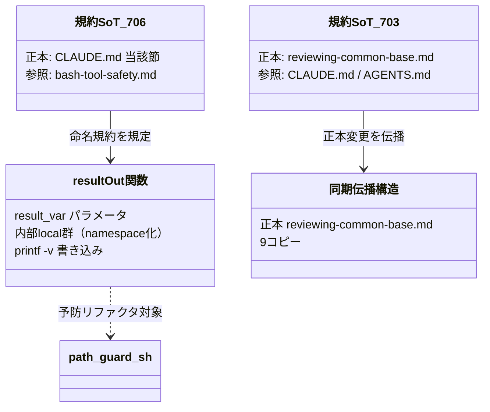

# ドメインモデル: AI エージェント Bash 実行の安全規約整備

## 概要

本 Unit は「AI エージェントが Bash ツール経由でシェル/スクリプトを実行する際の安全規約」を 2 軸で整備する docs + refactor タスクである。実行可能なアプリケーションドメインを持たないため、本ドメインモデルは「規約・運用ルールの SoT 構造」と「リファクタ対象コードの責務構造」を概念モデルとして定義する。

**重要**: このドメインモデル設計では**コードは書かず**、構造と責務の定義のみを行う。実装は Phase 2（コード生成ステップ）で行う。

## 概念エンティティ

ソフトウェアエンティティではなく、本 Unit が扱う「規約・成果物」の概念単位を定義する。

### 規約 SoT（Single Source of Truth）

- **識別子**: ドキュメントパス + セクション見出し
- **属性**:
  - `正本ファイル`: 規範文の唯一の正本となるファイル/セクション
  - `参照ドキュメント群`: 正本を参照するのみで規範文を重複掲載しないファイル群
- **振る舞い**:
  - `規範文を保持する`: 正本のみが規範文の本文を持つ
  - `参照を提供する`: 参照ドキュメントは正本へのリンク + 最小限の要約のみを持つ
- **本 Unit における具体**:
  - #706 規約（result-out 関数の local 命名規約）の正本 = `CLAUDE.md`「AI エージェント Bash ツール経由の安全パターン」セクション内の新規サブセクション
  - #703 規約（codex 非対話実行の `</dev/null` 必須運用）の正本 = `skills/reviewing-common/reviewing-common-base.md`（codex 実行コマンドの運用 SoT）
  - `bash-tool-safety.md` / `AGENTS.md` / 各 reviewing スキルの参照は「参照ドキュメント群」

### result-out 関数

- **識別子**: シェル関数名
- **属性**:
  - `result_var パラメータ`: 呼出側から結果書き込み先変数名を受け取る引数（慣例的に `$1`）
  - `内部 local 群`: 関数内部の作業用ローカル変数
  - `書き込み機構`: `printf -v "$result_var"` で呼出側変数へ結果を書き込む
- **振る舞い**:
  - `結果を呼出側へ書き込む`: `printf -v` により呼出側スコープの変数を更新する
  - `内部状態を namespace 化する`: 内部 local を関数固有プレフィックスで命名し、bash dynamic scope による呼出側変数の shadowing を防ぐ
- **不変条件（本 Unit の中核ルール）**: 内部の作業用 local は必ず関数固有プレフィックス（`_local_<関数省略名>_<名>`）で命名する。`_result_var` / `_input` / `_base` の標準パラメータバインディングは慣例名のまま許容する（先行修正 `_aidlc_migrate_path_guard_realpath_m_into` の `_local_m_resolved` がパイロット）

### 同期伝播構造（reviewing-common-base）

- **集約ルート**: 正本 `skills/reviewing-common/reviewing-common-base.md`
- **含まれる要素**: 9 つの同期コピー（`skills/reviewing-*/references/reviewing-common-base.md`）
- **境界**: 正本のみが編集対象。コピーは同期スクリプト経由でのみ更新される
- **不変条件**: 正本と全コピーの内容が一致している（`bin/sync-reviewing-common.sh --verify` で検証可能）

## ドメインサービス

### 命名規約ガード（概念）

- **責務**: result-out 関数の内部 local が caller 変数を shadowing しないことを構造的に保証する
- **操作**:
  - `規約として明文化する` - 正本に「printf -v 系 result-out 関数の local 命名規約」を記述
  - `予防的にリファクタする` - `path-guard.sh` の既存 result-out 関数群へ規約を適用
- **防御線の位置付け**: shellcheck SC2030/SC2031 は dynamic scope shadowing を捕捉しないため、本規約が主防御線となる

### stdin 待ちガード（概念）

- **責務**: 非対話 subprocess 環境（Bash ツール / hooks / CI）での `codex exec` 実行時に stdin EOF 待ちハングを防ぐ
- **操作**:
  - `運用ルールを正本に明文化する` - `reviewing-common-base.md` のコマンド例に `</dev/null` を付与し「stdin 待ちガードルール」セクションを新設
  - `横断ルールを参照ドキュメントに追記する` - `CLAUDE.md` / `AGENTS.md` に簡潔な横断ルール + 正本参照を追記
- **失敗モード**: `</dev/null` 欠落時、codex が `Reading additional input from stdin...` 後にハングし、AI エージェントが「セルフレビューへの無自覚な降格」を起こす

### 同期伝播サービス

- **責務**: 正本の変更を 9 コピーへ機械的に伝播し、一致を検証する
- **操作**:
  - `sync` - 正本を全コピーへコピー（`bin/sync-reviewing-common.sh`）
  - `verify` - 正本と全コピーの一致を検証（`bin/sync-reviewing-common.sh --verify`）
  - `dry-run` - 更新対象を表示のみ（`bin/sync-reviewing-common.sh --dry-run`）

## ユビキタス言語

- **result-out 関数**: 引数で結果書き込み先変数名を受け取り `printf -v "$result_var"` で呼出側変数へ書き込むシェル関数
- **dynamic scope shadowing**: bash の動的スコープにおいて、内部関数の `local` 宣言が呼出側の同名変数を覆い隠し、`printf -v` の書き込み先が意図せず内部 local になる現象（v2.6.2 CI 停止の原因）
- **namespace 化**: 内部 local を関数固有プレフィックス（`_local_<関数省略名>_<名>`）で命名し shadowing を構造的に防ぐこと
- **正本（SoT）**: 規範文の唯一の本文を持つファイル/セクション。他は参照のみ
- **stdin 待ちガード**: `codex exec` / `codex exec resume` に `</dev/null` を付与し stdin EOF 待ちを回避する運用ルール
- **同期伝播**: reviewing-common-base 正本 1 箇所の変更を `bin/sync-reviewing-common.sh` 経由で 9 コピーへ反映する構造

## ドメインモデル図

## 不明点と質問（設計中に記録）

[Question] 計画では #703 の同期検証を「CI 同期 verify」と記載していたが、同期 verify を実行する CI ジョブは存在するか？
[Answer] 調査の結果、`.github/workflows/` に `sync-reviewing-common.sh --verify` を実行する CI ジョブは存在しない。検証手段は `bin/sync-reviewing-common.sh --verify`（ローカル/手動実行）。本設計および後続の論理設計・完了条件はこの実機構（ローカル sync verify）に合わせる。CI ジョブの新規追加は Unit 境界「自動 lint ルールの新規実装は行わない」に該当するため本 Unit では行わない。
