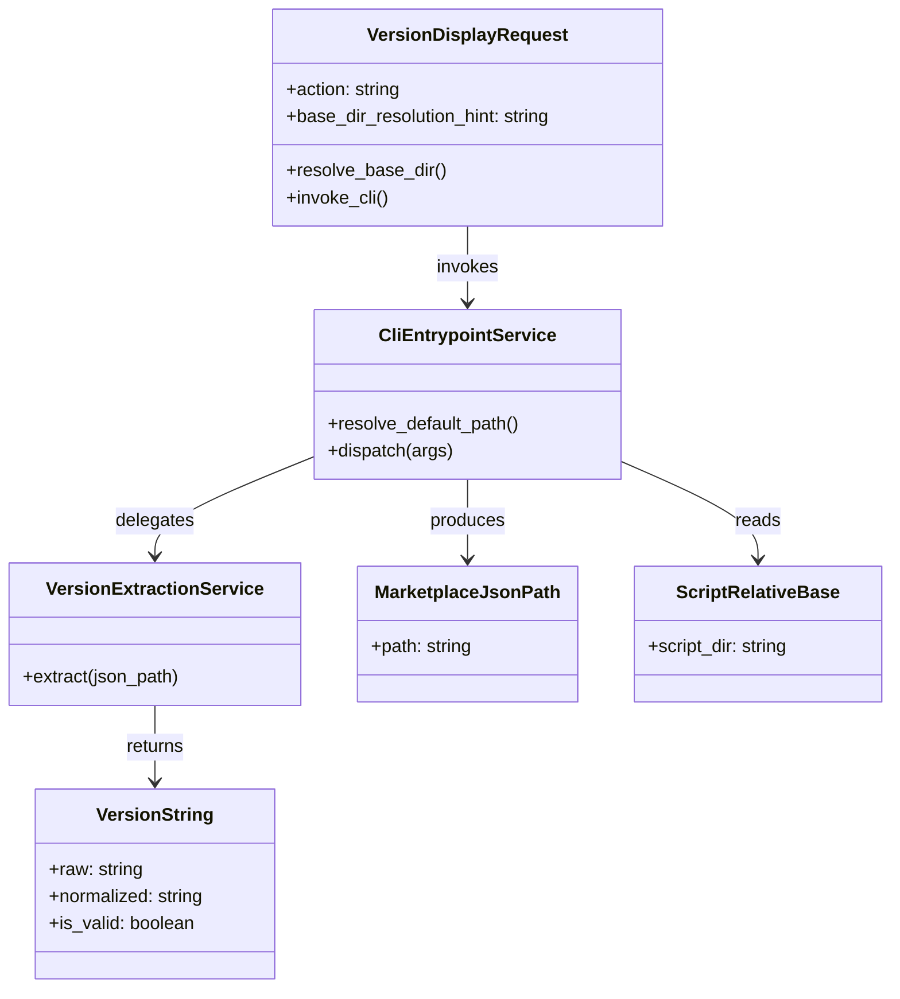

# ドメインモデル: Unit 003 - /aidlc v 経路の再現性向上

## 概要

`/aidlc v`（バージョン表示）アクションの実行ドメインを「version 文字列の正本（SoT）取得」と「AI エージェントによる安全な実行手順」の 2 軸で整理する。コードは書かず、構造と責務のみを定義する。

**重要**: 本 Unit は新規ドメインの導入ではなく、既存ドメイン（version 表示）の「責務再配分」が主目的。SKILL.md / `version.sh` CLI モードガード / `read_marketplace_version` 関数のレイヤー責務を明確化することで、AI エージェントの推測・パス組み立てミスの再現性を構造的に下げる。

## エンティティ（Entity）

### VersionDisplayRequest

- **ID**: アクション名（`version`、固定値）
- **属性**:
  - action: string - `/aidlc v` または `/aidlc version` のトリガー識別子
  - base_dir_resolution_hint: string - SKILL.md 冒頭「Base directory for this skill:」行への参照（AI が base dir を再現可能にする手がかり）
- **振る舞い**:
  - resolve_base_dir(): SKILL.md 冒頭行から base dir を取り出す手順契約
  - invoke_cli(): 解決した base dir 配下の `scripts/lib/version.sh` を引数省略で実行する契約

### VersionString

- **ID**: SemVer 文字列（例: `2.6.2`）
- **属性**:
  - raw: string - marketplace.json `metadata.version` から読み取った生の値
  - normalized: string - 前後空白トリム + 先頭 `v` 除去後の正規化値
  - is_valid: boolean - SemVer 2.0.0 仕様への適合判定結果
- **振る舞い**:
  - validate(): SemVer 2.0.0 パターンへの一致判定
  - strip_v_prefix(): 先頭 `v` 除去

## 値オブジェクト（Value Object）

### MarketplaceJsonPath

- **属性**: path: string - marketplace.json の絶対パス
- **不変性**: 一度確定したパスは VersionDisplayRequest の処理中に変更しない（CLI モードガード内で解決した値を `read_marketplace_version` に渡す）
- **等価性**: 文字列としての絶対パス完全一致

### ScriptRelativeBase

- **属性**: script_dir: string - `<repo_root>/skills/aidlc/scripts/lib`
- **不変性**: スクリプト自身の位置（`${BASH_SOURCE[0]}` 由来）から計算される値で、実行ごとに常に同じ
- **等価性**: 文字列としての絶対パス完全一致
- **派生**: `script_dir/../../../../.claude-plugin/marketplace.json` でデフォルト marketplace.json パスを導出

## 集約（Aggregate）

### VersionResolutionAggregate

- **集約ルート**: VersionDisplayRequest
- **含まれる要素**: MarketplaceJsonPath / ScriptRelativeBase / VersionString
- **境界**: `/aidlc v` アクションの単一トリガーから version 文字列出力までの一連の処理
- **不変条件**:
  - I1: VersionDisplayRequest は SKILL.md「バージョン表示」節の手順に従ってのみ発火する（内部知識による推測実行を禁止）
  - I2: MarketplaceJsonPath は ScriptRelativeBase 起点の自己解決か、明示的な引数渡し（test override）のいずれかで一意に確定する
  - I3: VersionString.is_valid=false の場合は `(version unknown)` フォールバック表示

## ドメインサービス

### VersionDisplayService（SKILL.md「バージョン表示」節として実装される手順）

- **責務**: AI エージェントが `/aidlc v` 実行時に踏む手順契約の単一ソース
- **操作**:
  - resolve_and_invoke(): 「Base directory for this skill:」行参照 → CLI モード呼び出し（引数省略） → exit code 分類 → 表示文字列決定
  - prohibit_internal_knowledge_guess(): 内部知識から version 文字列を推測することを禁止する明示的禁則

### VersionExtractionService（`read_marketplace_version` 関数として実装される）

- **責務**: marketplace.json から `metadata.version` を抽出し SemVer 検証を行う純粋関数
- **操作**:
  - extract(json_path): 与えられたパスから dasel / jq を介して `metadata.version` を取り出す（関数契約は不変）

### CliEntrypointService（`version.sh` CLI モードガードとして実装される）

- **責務**: スクリプト直接実行時の引数解決と VersionExtractionService への委譲
- **操作**:
  - resolve_default_path(): 引数省略時に ScriptRelativeBase から MarketplaceJsonPath を導出
  - dispatch(args): 引数あり時はそのパスを VersionExtractionService に渡し、引数なし時はデフォルトパスを渡す

## リポジトリインターフェース

### MarketplaceJsonRepository

- **対象集約**: VersionResolutionAggregate
- **操作**:
  - find_by_path(path): 指定パスから JSON を読み取り `metadata.version` を返す（dasel / jq 二段フォールバック）
  - default_path(): 既定の marketplace.json パス（ScriptRelativeBase から導出）を返す

## ファクトリ

本 Unit は新規ファクトリを導入しない。CLI モードガード内のデフォルトパス算出が事実上の「VersionResolutionAggregate ファクトリ」として機能する。

## ドメインモデル図

## ユビキタス言語

- **base dir**（スキルベースディレクトリ / `<skill_base>`）: SKILL.md と同じディレクトリの絶対パス（例: `<repo_root>/skills/aidlc/`）。AI エージェントは SKILL.md 冒頭の「Base directory for this skill:」行から取得する
- **repo_root**: リポジトリルート（`<repo_root>/skills/aidlc/...` の起点）。`<skill_base>` の親階層 2 段上に位置する
- **CLI モード**: `bash <path>/version.sh ...` 形式でのスクリプト直接実行。`source` 経由ではなく、`${BASH_SOURCE[0]} == $0` を満たす経路
- **自己解決**: CLI モードで引数省略時に `${BASH_SOURCE[0]}` 由来の ScriptRelativeBase から MarketplaceJsonPath を内部計算する挙動
- **test override**: テストや特殊用途で引数として明示的に marketplace.json パスを渡す経路（後方互換維持のため CLI モードガード内に残す）
- **内部知識からの推測**: AI エージェントが Bash を呼ばずに学習データ等から version 文字列を出力する禁止行為

## 不明点と質問

[Question] 自己解決失敗時（marketplace.json 不在）の表示文字列は `(version unknown)` で確定か？
[Answer] 確定。計画ファイル「完了条件チェックリスト」および SKILL.md 既存記述に従う。exit code に応じた分岐は CliEntrypointService が透過し、最終表示は VersionDisplayService（SKILL.md 手順）で決定する。

[Question] VersionExtractionService の関数契約（引数必須 / 空文字 → exit 2）は変更するか？
[Answer] 変更しない。CliEntrypointService 内で引数省略時に自己解決パスを生成し、必ず非空文字列で `read_marketplace_version` を呼び出す方針。これにより既存テスト C1〜C8 のうち関数直呼び部分は不変で pass し続ける。
