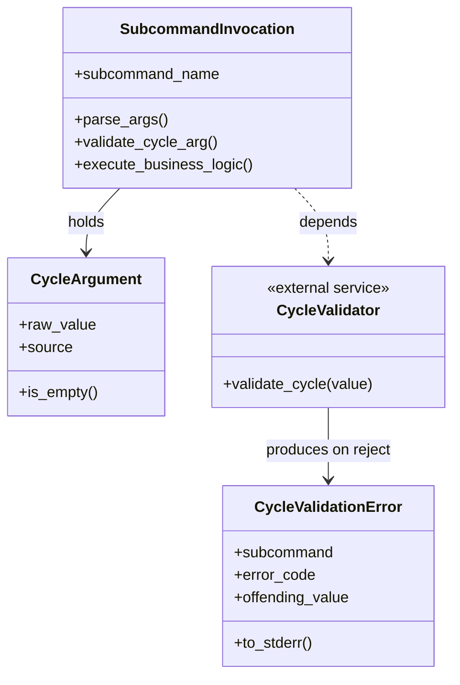

# ドメインモデル: operations-release.sh への validate_cycle 検証拡張

## 概要

`operations-release.sh` の `--cycle` 引数受付サブコマンド群（`cmd_record_release_prep_commit` / `cmd_pr_ready`）に、v2.6.3 Unit 002 で導入済みの `validate_cycle` を適用する。シェルスクリプトのドメイン上「引数検証」を独立した責務として扱い、サブコマンド入口で fail-fast する。

**重要**: 実装コードは Phase 2 で作成する。本ドキュメントは構造と責務の定義のみ。

## エンティティ

### CycleArgument

サブコマンドが受け取る `--cycle` 引数の表現。

- **ID**: サブコマンド名 + 引数値（識別はサブコマンド境界で閉じる）
- **属性**:
  - `subcommand_name`: 文字列 - サブコマンド名（`record-release-prep-commit` / `pr-ready` / `squash-712`）
  - `raw_value`: 文字列 - 利用者から渡された生値
  - `source`: 列挙 - 値の出所（`explicit_arg` = `--cycle <value>` 指定 / `branch_resolved` = `resolve_cycle_from_branch` 経由 / `omitted` = 未指定 + 解決失敗）
- **振る舞い**:
  - `is_empty()`: `raw_value` が空文字または未指定か判定
  - `is_pattern_valid()`: `validate_cycle` 関数（外部ドメインサービス）で検証された結果を保持

## 値オブジェクト

### CycleValidationResult

`validate_cycle` 呼び出しの結果。

- **属性**:
  - `accepted`: ブール - 検証通過か
  - `rejected_reason`: 列挙 - 不正パターン分類（traversal / leading_slash / whitespace / control_char / format_mismatch / reserved_name 等。本 Unit では `validate_cycle` の判定をそのまま受け、内部分類は持たない）
- **不変性**: 検証結果は一度確定したら変更されない
- **等価性**: `accepted` と `rejected_reason` の組で等価判定

### CycleValidationError

検証失敗時の出力契約。

- **属性**:
  - `subcommand`: 文字列 - サブコマンド名（`record-release-prep-commit` / `pr-ready`）
  - `error_code`: 固定文字列 - `invalid-cycle`
  - `offending_value`: 文字列 - 拒否された生値
- **不変性**: 一度生成された Error は変更されない
- **stderr 出力形式**: `error\t{subcommand}:{error_code}\t{offending_value}\n`（v2.6.3 Unit 002 の `cmd_squash_712` パターン踏襲）

## 集約

### SubcommandInvocation（サブコマンド起動）

各サブコマンドの起動シーケンスを 1 集約として扱う。

- **集約ルート**: サブコマンド名
- **含まれる要素**: `CycleArgument`、後続の処理ステップ（progress_file 解決 / get-related-issues 呼び出し等）
- **境界**: サブコマンド入口から終了まで
- **不変条件**:
  - 後続処理が `--cycle` を**パス展開**または**外部スクリプト引数**として使用する経路を持つ場合、後続処理に進む前に `CycleArgument` が `validate_cycle` を通過していること
  - 検証失敗時は後続処理に進まず、`CycleValidationError` を stderr 出力して exit 1

## ドメインサービス

### CycleValidator（既存・流用）

- **責務**: `--cycle` 文字列が `.aidlc/cycles/<cycle>/...` パスや外部スクリプト引数として安全に使用できるかを判定
- **実装位置**: `skills/aidlc/scripts/lib/validate.sh` の `validate_cycle` 関数（v2.6.3 Unit 002 で導入済み）
- **操作**:
  - `validate_cycle(value) -> exit_code`: 0=通過 / 1=拒否
- **本 Unit でのスコープ**: 関数本体の改修は対象外。呼び出し側に検証ポイントを追加するのみ

### CycleResolver（既存・流用）

- **責務**: `--cycle` 未指定時の値解決
- **実装位置**: `operations-release.sh` の `resolve_cycle_from_branch` 関数
- **操作**:
  - `resolve_cycle_from_branch() -> cycle_string`: 現在のブランチ名から `cycle/<name>` パターンで `<name>` を抽出、非該当なら空文字
- **本 Unit との関係**: `cmd_pr_ready` でブランチ解決経路を持つ。検証は解決後に実施する責務分担

## リポジトリインターフェース

該当なし（シェルスクリプトのドメインで永続化集約なし）。

## ファクトリ

該当なし。

## ドメインモデル図

## ユビキタス言語

- **`--cycle` 引数**: `.aidlc/cycles/<cycle>/...` パス解決および外部スクリプト（`pr-ops.sh get-related-issues` 等）に渡される文字列
- **fail-fast ポイント**: サブコマンド入口で検証を行い、後続の I/O を発火させない位置
- **二重防御 (defense in depth)**: 上位（サブコマンド入口の `validate_cycle`）と下位（既存の `__squash_712_check_history_clean` のインライン拒否等）で同じ意味の検証を重ねること。v2.6.3 Unit 002 で確立された方針
- **責務境界**: 「呼び出し側 vs 呼び出し先」のどちらで検証するかの設計判断。本 Unit は呼び出し側（`cmd_pr_ready` 等）で検証する方針を採用

## 不明点と質問

[Question] `cmd_pr_ready` の検証は `pr-ops.sh` 側ではなく呼び出し側で行う方針で良いか
[Answer] OK。`pr-ops.sh` は他のスクリプト（`cycle-pr-check.sh` 等）からも呼ばれるため、汎用ライブラリとしての中立性を保つ。検証は CLI 入口（`operations-release.sh` のサブコマンド）で行う。
