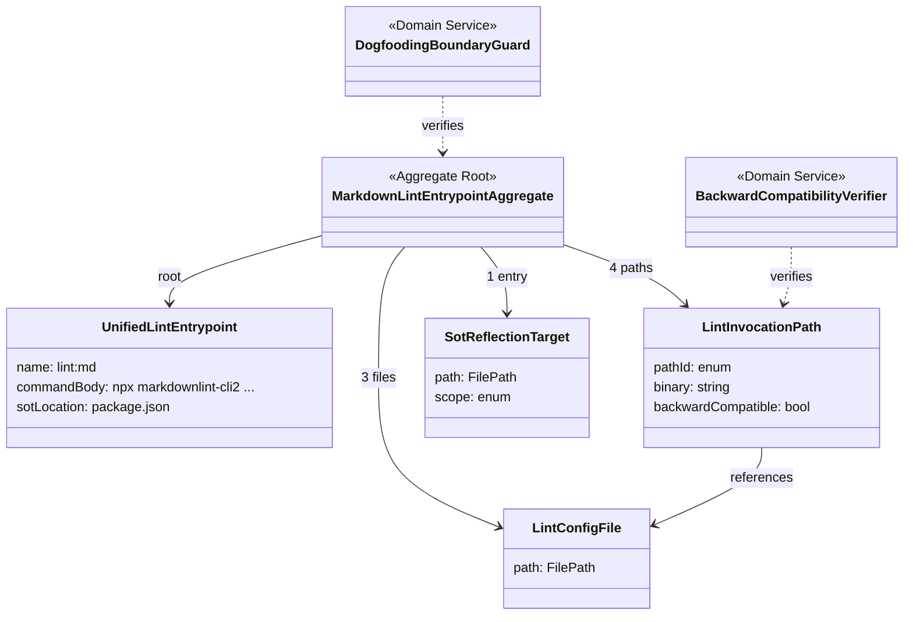

# ドメインモデル: markdown lint 統一エントリポイント化

## 概要

repo 内で散在する markdown lint 実行手段を概念的に整理し、「統一エントリポイント（UnifiedLintEntrypoint）」を Single Source of Truth として確立する。本ドメインモデルは構成要素とその責務境界の定義のみを行い、コードは Phase 2 で生成する。

**重要**: このドメインモデル設計では**コードは書かず**、構造と責務の定義のみを行います。

## エンティティ（Entity）

### UnifiedLintEntrypoint

- **ID**: `npm script 名` = `"lint:md"`（`package.json` の `scripts` キー）
- **属性**:
  - `name`: string - npm script 名（`lint:md` 固定）
  - `commandBody`: string - 実行コマンド本体（`npx markdownlint-cli2 "docs/translations/**/*.md" "prompts/**/*.md" "*.md"`、CI `markdownlint-cli2-action` の glob と同一値）
  - `sotLocation`: FilePath - SoT の所在（`package.json`）
- **振る舞い**:
  - `resolve()`: ローカルに `package.json` が存在する文脈で `npm run lint:md` 解決を成功させる。consumer プロジェクトで `package.json` 不在なら自然に opt-out（呼び出し側で `command not found` 相当）
  - `invokeMarkdownlintCli2()`: `npx` 経由で `markdownlint-cli2` バイナリを解決し起動する（版固定は本 Unit 対象外）

### LintInvocationPath

- **ID**: 呼び出し起点識別子（自由値、列挙: `ci_action` / `script_wrapper` / `direct_npx` / `unified_entrypoint`）
- **属性**:
  - `pathId`: enum - 呼び出し経路の識別
  - `binary`: string - 解決されるバイナリ（`markdownlint-cli2` バージョン）
  - `configFilesReferenced`: List<LintConfigFile> - 参照する設定ファイル集合
  - `backwardCompatible`: bool - 既存挙動と互換か
- **振る舞い**:
  - `verifyCompatibility(other: LintInvocationPath)`: 自身と他経路が同一 `configFilesReferenced` を参照することを確認する（バイナリ版の同一性は本 Unit 対象外）

## 値オブジェクト（Value Object）

### LintConfigFile

- **属性**: `path`: FilePath - 設定ファイルの repo-relative path
- **不変性**: 一度確立された設定ファイルパス集合は本 Unit で変更しない（変更は別 Unit / 別 Issue）
- **等価性**: `path` の文字列同値判定
- **既知のインスタンス集合**（本 Unit のスコープ内で参照される）:
  - `.markdownlint-cli2.jsonc`
  - `.markdownlint.json`
  - `.markdownlintignore`

### SotReflectionTarget

- **属性**:
  - `path`: FilePath - 反映先ドキュメントパス
  - `scope`: enum - 反映スコープ（`starter_kit_review` / `consumer_general` / `cross_skill_top_level`）
- **不変性**: `scope=starter_kit_review` の 1 件のみが本 Unit の有効値（散在防止）
- **等価性**: `path` + `scope` の組
- **本 Unit での確定値**: `path=skills/reviewing-common/reviewing-common-base.md`, `scope=starter_kit_review`

## 集約（Aggregate）

### MarkdownLintEntrypointAggregate

- **集約ルート**: `UnifiedLintEntrypoint`
- **含まれる要素**:
  - `UnifiedLintEntrypoint`（ルート）
  - `LintInvocationPath` 集合（既知 4 経路）
  - `LintConfigFile` 集合（3 ファイル）
  - `SotReflectionTarget`（1 件、starter kit 内レビュー導線限定）
- **境界**:
  - 本 Unit のスコープは「統一エントリポイント定義 + docs SoT 反映 + 後方互換確認」まで
  - CI ワークフロー差し替え / `run-markdownlint.sh` 置換 / `devDependencies` 追加は集約外（別 Unit / 別 Issue）
- **不変条件**:
  - `UnifiedLintEntrypoint.commandBody` が参照する設定ファイル集合 = 既存 `LintInvocationPath`（`ci_action` / `script_wrapper` / `direct_npx`）が参照する `configFilesReferenced` 和集合（**同一集合**であり、部分集合ではない）。`BackwardCompatibilityVerifier.verifyConfigFileSetIdentity()` の通過を本不変条件の必須成立条件とする
  - `SotReflectionTarget` の有効件数 = 1（散在防止）
  - 既存 `LintInvocationPath`（`ci_action` / `script_wrapper` / `direct_npx`）の `backwardCompatible = true` が本 Unit の前後で保たれる

## ドメインサービス

### BackwardCompatibilityVerifier

- **責務**: 既存 `LintInvocationPath` 3 経路（`ci_action` / `script_wrapper` / `direct_npx`）が本 Unit の変更前後で破壊されないことを検証する
- **操作**:
  - `verifyGrepNoRegression()` - 既存 `npx markdownlint-cli2` 直接呼び出し箇所が grep で残存することを確認
  - `verifyScriptWrapperSmoke()` - `skills/aidlc/scripts/run-markdownlint.sh` の既定経路 smoke 実行（exit 0）
  - `verifyConfigFileSetIdentity()` - 新規 `unified_entrypoint` 経路と既存経路の `configFilesReferenced` 集合が同一であることを確認

### DogfoodingBoundaryGuard

- **責務**: 「starter kit 自身か consumer か」を判定する分岐が `package.json` / 手順書 / scripts に混入していないことを確認する
- **操作**:
  - `verifyNoConditionalBranching()` - 配布物 baseline 規約（`CLAUDE.md`）に従い、starter kit 識別ロジックが本 Unit 成果物に含まれないことを目視/grep で確認
  - `verifyOptInByPresence()` - consumer 側は `package.json` の有無で自然 opt-in されることを確認（追加スクリプト不要）

## リポジトリインターフェース

本 Unit は永続化対象を持たない（ファイルシステム配置のみ）。リポジトリインターフェースは定義しない。

## ファクトリ

本 Unit はオブジェクト生成ロジックを持たない（静的な設定ファイル配置のみ）。

## ドメインモデル図

## ユビキタス言語

- **統一エントリポイント（UnifiedLintEntrypoint）**: AI レビュー / CI / ローカル開発が同一の npm script 名 `lint:md` から markdownlint を起動できる単一インターフェース。SoT は `package.json`
- **呼び出し経路（LintInvocationPath）**: markdownlint-cli2 を起動する具体的な経路。本 Unit では `unified_entrypoint`（新規）/ `ci_action` / `script_wrapper` / `direct_npx`（既存 3 経路）の 4 種を識別
- **後方互換性（backward compatibility）**: 既存 3 経路の動作と参照する設定ファイル集合が本 Unit 変更前後で同一であること。バイナリ版の同一性は対象外（Issue #713 で扱う）
- **SoT 反映先（SotReflectionTarget）**: 統一エントリポイント情報を 1 箇所だけ記述するドキュメント。starter kit 内 AI レビュー導線（reviewing-common 系）に限定
- **ドッグフーディング境界（dogfooding boundary）**: starter kit 自身か consumer かを判定する条件分岐を成果物に埋め込まない設計境界（CLAUDE.md 配布物 baseline 規約）

## 不明点と質問

[Question] なし（Unit 定義「責務」が小規模で対話による掘り下げを要する未確定要素は計画策定時点で解消済み）
[Answer] -
