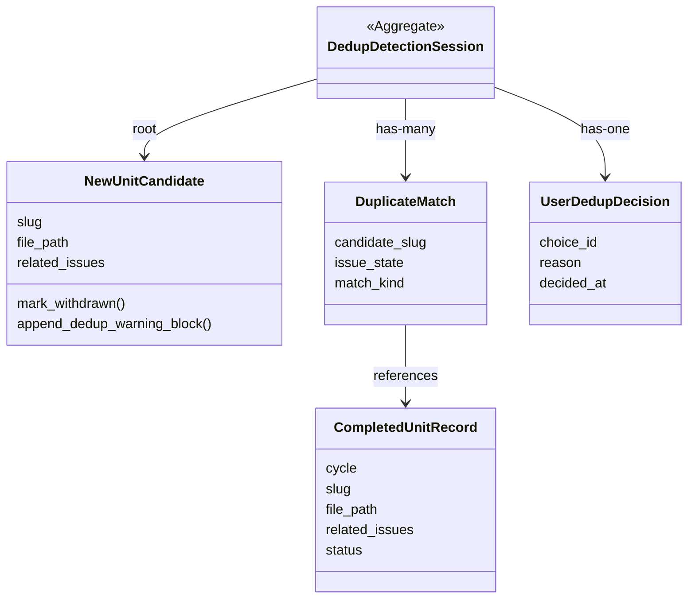

# ドメインモデル: Unit 001 Inception 直近サイクル完了 Unit との重複検出フロー SoT 化

## 概要

Inception Phase での Unit 定義策定時に、直近 N サイクルの完了 Unit との重複（slug 一致 + 関連 Issue CLOSED 状態）を検出し、ユーザー判断（取り下げ / 継続）を仰ぐドメイン。判定の中核は「新規候補 Unit 集合」と「過去完了 Unit 集合」の比較。

**重要**: このドメインモデル設計では**コードは書かず**、構造と責務の定義のみを行います。実装は Phase 2 で `steps/inception/04-stories-units.md` への手順追記として行います。

## エンティティ（Entity）

### NewUnitCandidate（新規 Unit 候補）

- **ID**: `slug`（ファイル名から `{NNN}-` プレフィックスを除いたケバブケース文字列）
- **属性**:
  - `slug`: string - 新規起案された Unit のスラグ識別子
  - `file_path`: string - Unit 定義ファイルの絶対パス
  - `related_issues`: list of int - 「関連 Issue」セクションから抽出された Issue 番号リスト（0 件以上）
- **振る舞い**:
  - `mark_withdrawn()`: 「実装状態 → 状態」を `取り下げ` に更新（物理削除は実施しない）
  - `append_dedup_warning_block(source, related_issue, reason, detected_at)`: 末尾に機械可読コメントブロックを追記

### CompletedUnitRecord（完了済み Unit 記録）

- **ID**: `(cycle, slug)` の複合キー
- **属性**:
  - `cycle`: string - 完了サイクルバージョン（例: `v2.6.4`）
  - `slug`: string - 完了 Unit のスラグ
  - `file_path`: string - 完了 Unit 定義ファイルパス（参照用）
  - `related_issues`: list of int - 関連 Issue 番号リスト
  - `status`: enum(`完了` | `取り下げ`) - 実装状態セクションの値
- **振る舞い**:
  - 不変。読み取り専用の参照対象

## 値オブジェクト（Value Object）

### DedupLookbackWindow（重複検出ウィンドウ）

- **属性**: `cycles_count`: int - 直近何サイクル分を対象にするか
- **不変性**: 構築時に正規化済み非負整数のみを受け付ける（不正値は config 解決層で warn + default 3 にフォールバック済み）
- **等価性**: `cycles_count` 値同一

### DuplicateMatch（重複一致）

- **属性**:
  - `candidate_slug`: string - 新規候補スラグ
  - `matched_unit`: `CompletedUnitRecord` への参照
  - `issue_state`: enum(`OPEN` | `CLOSED` | `UNKNOWN`) - 関連 Issue の状態（gh 不可用時 `UNKNOWN`）
  - `match_kind`: enum(`slug_only` | `slug_and_closed_issue`) - 重複の根拠強度
- **不変性**: スラグ比較は完全一致のみ（false positive 低減）
- **等価性**: `(candidate_slug, matched_unit.cycle, matched_unit.slug)` 三つ組同一

### UserDedupDecision（ユーザー判断）

- **属性**:
  - `choice_id`: enum(`withdraw` | `continue_with_reason`)
  - `reason`: string - `continue_with_reason` 選択時のみ必須（空文字 / 禁止パターン拒否）
  - `decided_at`: date - 判定日（YYYY-MM-DD）
- **不変性**: 判定後は更新不可。`reason` バリデーションは `review-flow.md` の禁止パターン規約準用
- **等価性**: 全属性一致

## 集約（Aggregate）

### DedupDetectionSession（重複検出セッション）

- **集約ルート**: `NewUnitCandidate`
- **含まれる要素**: `NewUnitCandidate`、`DuplicateMatch` のリスト、`UserDedupDecision`（判定後のみ）
- **境界**: 1 つの新規候補 Unit に対する重複検出 → ユーザー判断 → アクション実行の一連のフロー
- **不変条件**:
  - 1 つの候補に対して `UserDedupDecision` は 1 件のみ
  - `UserDedupDecision.choice_id = withdraw` の場合、`NewUnitCandidate` は `状態: 取り下げ` 状態でなければならない
  - `UserDedupDecision.choice_id = continue_with_reason` の場合、`NewUnitCandidate.file_path` の末尾に `dedup-warning` コメントブロックが追記されていること

## ドメインサービス

### SlugExtractionService

- **責務**: `.aidlc/cycles/v*/story-artifacts/units/*.md` ファイル名から slug を抽出
- **操作**:
  - `extract_completed_slugs(lookback: DedupLookbackWindow)` - 直近 N サイクル分の完了スラグ集合を返す。「実装状態 → 状態」が `完了` のもののみ対象（`取り下げ` は除外。`未着手` / `進行中` は現サイクル以外には通常存在しない）

### RelatedIssueExtractionService

- **責務**: Unit 定義ファイルから関連 Issue 番号を抽出
- **操作**:
  - `extract_issues(file_path)` - ファイル本文の「関連 Issue」セクション（または旧キー）から `#NNN` 形式の番号リストを返す

### IssueStateProbeService

- **責務**: GitHub Issue の OPEN/CLOSED 状態を確認（`gh issue view --json state`）
- **操作**:
  - `probe(issue_number)` - `OPEN` / `CLOSED` / `UNKNOWN` のいずれかを返す
- **可用性**: `gh_status != available` の場合は常に `UNKNOWN` を返す（フォールバック動作）

### DuplicateMatchingService

- **責務**: 新規候補と完了スラグ集合を突合し、`DuplicateMatch` リストを生成
- **操作**:
  - `match(candidate, completed_records, lookback)` - スラグ完全一致のみで一次フィルタ、ヒット件についてのみ Issue 状態を確認して `match_kind` を決定

### UserConfirmationService

- **責務**: AskUserQuestion 経由で `UserDedupDecision` を取得
- **操作**:
  - `ask(candidate, matches)` - 質問形式は `header="重複警告"` / 選択肢は `choice_id` 固定 (`withdraw` / `continue_with_reason`)、`continue_with_reason` 選択時 `reason` を要求

### DedupHistoryRecorder

- **責務**: `history/inception.md` への記録（`/write-history` ラッパー）
- **操作**:
  - `record_withdrawal(candidate, match)` - 「重複検出による取り下げ」イベント追記
  - `record_continuation(candidate, match, reason)` - 「重複検出後の継続判断」イベント追記

## リポジトリインターフェース

### CompletedUnitRepository

- **対象集約**: `CompletedUnitRecord`
- **操作**:
  - `list_recent(lookback: DedupLookbackWindow)` - 直近 N サイクル分の完了 Unit 記録一覧を返す（ファイルシステム由来 / read-only）
  - `find_by_slug(slug)` - 全サイクル横断のスラグ一致検索（補助）

## ファクトリ

### DedupLookbackWindowFactory

- **生成対象**: `DedupLookbackWindow`
- **生成ロジック概要**:
  1. `scripts/read-config.sh rules.inception.dedup_lookback_cycles` を呼ぶ
  2. exit 0 + 整数値（0 以上）→ そのまま採用
  3. exit 1（キー不在）→ defaults.toml 既定値 `3` を採用
  4. 不正値（負数 / 非整数 / 文字列）→ stderr に warn + default `3` を採用（fail-safe）
  5. `cycles_count = 0` の場合は重複検出を完全スキップする opt-out 動作（DedupDetectionSession 自体を起動しない）

## ドメインモデル図

## ユビキタス言語

- **重複検出ウィンドウ (DedupLookbackWindow)**: 重複候補探索の対象とする直近サイクル数。既定 3。0 で opt-out
- **スラグ完全一致 (slug exact match)**: ファイル名から抽出した slug 文字列の完全一致のみを重複候補とする判定方針。部分一致 / 正規化（複数形 / 略語）は本サイクルでは対象外
- **取り下げ (withdraw)**: 新規候補 Unit の `実装状態 → 状態` を `取り下げ` に変更する正規アクション。物理削除は実施しない（履歴トレース保持）
- **継続判断 (continue_with_reason)**: ユーザーが重複警告を承知の上で Unit を継続起案する判断。理由必須、機械可読コメントブロックで Unit 定義ファイル末尾に記録
- **gh 不可用フォールバック**: `gh_status != available` 時、Issue 状態は `UNKNOWN` 扱い。スラグ一致のみで警告を出すが、警告レベルは「弱」として AskUserQuestion で同様に判断を仰ぐ（処理は中断しない）

## 不明点と質問（設計中に記録）

[Question] 「関連 Issue」セクションの抽出パターンは固定文字列で問題ないか（v2.6.5 時点で全 Unit 定義テンプレ統一済みの確認）
[Answer] テンプレ `templates/unit_definition_template.md` を Read で確認 → 「## 関連Issue」見出し直下に `#NNN` 形式で列挙される統一フォーマット。これを SoT として抽出規則を固定する

[Question] `dedup_lookback_cycles = 0` のとき、AskUserQuestion 自体を起動しない opt-out で良いか（誤起動による中断回避）
[Answer] 良い。明示的 opt-out として「重複検出を実施しない」を正規動作とする。logger には `dedup: skipped (lookback=0)` を 1 行記録のみ
