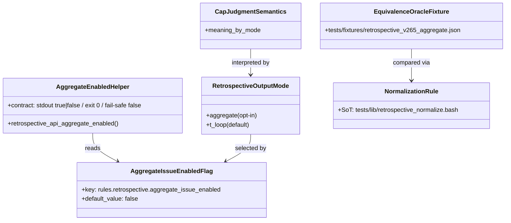

# ドメインモデル: Unit 001 — T 中心アウトプット仕様 + `aggregate_issue_enabled` フラグ + cap 仕様 SoT 定義

## 概要

aidlc-retrospective スキルの出力契約を「T 中心」へ転換するための **仕様 SoT + opt-in フラグ + 同等性オラクル fixture** を定義する。実装本体（T ループ起票）は Unit 004 に委譲し、本 Unit は契約と fixture と判定 helper を提供する。

**重要**: このドメインモデル設計では**コードは書かず**、構造と責務の定義のみを行います。

## 事前コード読込み（v2.6.5 / #679 / Unit 002 由来 / 必須）

### (a) Read 対象ファイル + 目的

| パス | Read 目的 |
|------|----------|
| `skills/aidlc-retrospective/SKILL.md`（41 行） | 冒頭 SoT 文言挿入位置の確認、単方向境界 / `v2.6.4 サイクル対象外項目` 節との整合確認 |
| `skills/aidlc-retrospective/steps/retrospective.md`（324 行） | 冒頭 SoT 挿入位置、§1.5 前置きの追加位置、`auto_issue_creation` opt-in 評価ロジック（既存実装パターン）の確認 |
| `skills/aidlc/scripts/lib/retrospective-api.sh`（148 行） | 多重 source ガード / bootstrap / タイプ A,B 関数命名規約 / 出力タイプ規約コメントの確認、helper 追加位置 |
| `skills/aidlc/config/defaults.toml`（113 行） | `[rules.retrospective]` セクション現状（既存 `feedback_mode` / `feedback_max_per_cycle` / `auto_issue_creation`）、コメント文体規約 |
| `skills/aidlc-setup/config/defaults.toml`（117 行） | 二重 SoT 配布用コピーの sync 形式、正本ヘッダコメントの位置 |

### (b) 設計時に意識すべき挙動

- **多重 source ガード**: `retrospective-api.sh` は `RETROSPECTIVE_API_SOURCED` でガード済。新 helper を追加してもガード位置を変えない
- **タイプ A/B 関数規約**: 公開 API には「タイプ A（key=value 複数行 + 副作用）」「タイプ B（raw text 1 行 / 純粋値）」の 2 系統があり、コメントヘッダで宣言する。本 Unit が追加する helper は **タイプ B（1 行 / 純粋値 `true|false`）** に分類される
- **fail-open 既存パターン**: 既存 `auto_issue_creation` 評価ロジック（`steps/retrospective.md` §1.5 Step 2 #opt-in 基盤フラグ節）が `read-config.sh` の `rc=0/1/その他` を区別し、`rc != 0` 時は `true` fallback + warn の **fail-open** を取る。本 Unit の新 helper は逆向きの **fail-safe（既定 `false`）** を取るため、評価方向が異なる点に注意（既定動作が「T ループ起票」= 新挙動になる）
- **opt-in 基盤との関係**: 既存 `auto_issue_creation` フラグは「起票そのものの ON/OFF」軸、本 Unit の `aggregate_issue_enabled` フラグは「起票形態の集約 vs T ループ」軸。両者は **独立軸の opt-in** として共存する（Intent 関連 Issue 節で明示済み）
- **二重 SoT 配布コピー**: `aidlc-setup/config/defaults.toml` 冒頭ヘッダに「正本: aidlc スキルの config/defaults.toml ... 正本が更新された場合はこのファイルも同期してください。」とある。CI 早期検出ガード（v2.6.5 Unit 004）はこの sync を検証している
- **§1.5 前置き挿入位置**: 既存 §1.5 は「Step 1 / Step 2 / Step 3 / Step 4 / Step 5」の構造。前置きは §1.5 直下の見出し文の直後（Step 1 開始前）に挿入する
- **既存 SoT 文言の不存在**: 「目的: T を Issue 化して...」文言は現状 SKILL.md / steps いずれにも存在しない。新規挿入として扱う
- **rules.retrospective.aggregate_issue_enabled の前例**: 同セクションには既に `auto_issue_creation` が存在するため、追加位置はその後（同一セクション末尾）が自然
- **fixture 保管位置**: `tests/fixtures/` ディレクトリ慣例（既存サイクルで他 fixture が存在するかは現時点で未確認 / 実装時に検証する）

### (c) 既存実装に基づく代替案検討

| 方針候補 | 既存実装との適合性 | 採用/却下 |
|---------|------------------|----------|
| **helper を `retrospective-api.sh` に直接追加**（タイプ B 関数として） | 既存タイプ B 関数（`retrospective_api_resolve_feedback_mode` / `retrospective_api_check_cap` 等）と同じ形式で追加可能。多重 source ガード / bootstrap への影響なし | **採用** |
| **新 lib ファイル `aggregate-flag.sh` を新設して source 追加** | 既存タイプ B 関数が同 file に集約される慣例から逸脱。Unit 004 が internal lib を直接 source する誘惑を生むリスク | 却下（境界規約違反 / 配置肥大化） |
| **SoT 文言を SKILL.md のみに記載し steps/retrospective.md からは省略** | Intent SC-01 が「**両方**冒頭に記載」を要件としている | 却下（SC-01 不充足） |
| **fixture を fixture ファイルなしで bats 内インライン定義** | 同等性オラクルの再利用性低下、v2.7.0+ の T ループ実装との差分検証時に再記述コスト | 却下（fixture 単独 SoT 化を選択） |
| **正規化規則を fixture 内（JSON フィールド）に持つ** | 正規化規則を fixture と test の両方に書く二重 SoT 化を招く。fixture には期待値のみ、規則は test helper 側、と分離 | 却下（test helper 側 SoT に集約） |

## 主要概念（Conceptual Entities）

> 本 Unit は OO 的なエンティティ／集約より、**振り返り出力契約 + flag + fixture** の概念モデルが中心。以下は「概念単位」として扱う。

### 概念 1: RetrospectiveOutputMode（振り返り出力モード）

- **取り得る値**: `aggregate` / `t_loop`
- **属性**:
  - `mode_name`: 列挙値 — 出力モード識別子
  - `cap_target`: 列挙値（`aggregate_issue_count` / `t_issue_total_count`）— `cap` 判定の対象
  - `default`: bool — 本 Unit 以降の既定モード
- **振る舞い**:
  - `t_loop` モード: 各 T を 1 Issue として起票（Unit 004 で実装）。cap は T Issue 起票合計の上限
  - `aggregate` モード: 集約 retrospective Issue を 1 件起票（v2.6.5 以前と同等）。cap は集約 Issue 1 件の上限
- **既定**: v2.6.6 以降 `t_loop` が既定。`aggregate` は opt-in (`aggregate_issue_enabled = true`) 時のみ

### 概念 2: AggregateIssueEnabledFlag（集約 Issue 起票 opt-in フラグ）

- **属性**:
  - `key`: `rules.retrospective.aggregate_issue_enabled`
  - `type`: bool
  - `default_value`: `false`
  - `resolution_layer`: `scripts/read-config.sh`（4 階層マージ: defaults / HOME / project / local）
- **振る舞い**:
  - `true`: `aggregate` モードを選択 → 既存 §1.5 Step 3/4/5 を実行
  - `false`: `t_loop` モードを選択 → Unit 004 の T ループ起票を実行
- **既定の意味（重要）**: 「未設定 = `false`」= 既定動作が新挙動（T ループ）。v2.6.5 以前 consumer のアップグレード時は明示設定が必要

### 概念 3: AggregateEnabledHelper（フラグ判定 helper）

- **位置**: `skills/aidlc/scripts/lib/retrospective-api.sh` 内
- **公開 API 名**: `retrospective_api_aggregate_enabled`
- **タイプ**: B（raw text 1 行 / 純粋値）
- **公開契約（単一・固定）**:
  - **stdout**: 常に `true` または `false` を 1 行（末尾改行あり）
  - **exit code**: 常に `0`
  - **fail-safe フォールバック（warn 出力の有無を明示 / 計画書および論理設計と完全一致）**:
    - `read-config.sh` exit 1（キー不在 / 既定動作）: stdout=`false` + exit 0 / **warn なし**
    - `read-config.sh` exit 0 + 不正値（`true|false` 以外）: stderr warn + stdout=`false` + exit 0
    - `read-config.sh` exit 2 以上（読み取り層エラー）: stderr warn + stdout=`false` + exit 0
- **境界**: helper は判定のみ提供。起票実行は Unit 004 / Step 3/4/5 / `retrospective_api_create_issue` のいずれかが担当

### 概念 4: CapJudgmentSemantics（cap 判定意味）

- **対象**: `rules.retrospective.feedback_max_per_cycle`（既存）
- **意味分岐**（`aggregate_issue_enabled` 値による）:
  - `true`: cap = 集約 retrospective Issue 1 件の上限（v2.6.5 以前同等）
  - `false`: cap = サイクル内 T Issue 起票合計の上限（v2.6.6 新意味）
- **既存実装変更なし**: cap 判定本体（`retrospective_api_check_cap`）の引数 / 戻り値は不変。意味解釈の SoT は steps/retrospective.md §1.5 前置き仕様節で行う

### 概念 5: EquivalenceOracleFixture（同等性オラクル fixture）

- **位置**: `tests/fixtures/retrospective_v265_aggregate.json`
- **目的**: `aggregate_issue_enabled = true` 設定時の起票結果が v2.6.5 動作と同等（または v2.6.6 リリース時点 aggregate path 出力と等価）であることを保証
- **SC-04 二段階基準（Unit 001 統合レビューで確定）**:
  - **Unit 001 段階基準（本 Unit 完了条件）**: スキーマ整備 + 正規化規則 SoT 確定 + 構造検証 bats。`fixture_status="schema-only"` 状態を許容
  - **Unit 004 finalize 基準（最終達成）**: aggregate path フル実起票による fixture 実値確定 + 差分 0 同等性 bats。`fixture_status="finalized"` へ遷移
- **生成元（Unit 004 段階で固定）**: v2.6.5 集約 retrospective Issue は実起票実績がない（v2.6.5 retrospective は #722/#723/#724 の T Issue 単位で散発化）ため、「v2.6.6 リリース時点の aggregate path コードで生成される集約 Issue 本文の固定スナップショット」を SoT とする。Intent SC-04「v2.6.5 と完全同等」は v2.6.5 実起票実績不在のため「v2.6.5 リリース時点コード生成 output と等価」に置換
- **フィールド構成**（期待値のみ。正規化規則本体はテストコード側 SoT）:
  - `expected_title`: 完全一致対象（集約 Issue タイトル）
  - `expected_heading_set`: 順序込みの本文 `## / ###` 見出し列
  - `expected_normalized_body_hash`: `normalize_volatile()` 適用後の本文 sha256（または見出し毎の normalized body の hash map）
  - `expected_labels`: ラベル集合（順不同）
  - `expected_cap`: `{ current_count, over }` の期待値

### 概念 6: NormalizationRule（正規化規則）

- **SoT 位置**: `tests/lib/retrospective_normalize.bash`（または相当する bats helper）
- **正規化対象 allowlist**（除外する揺らぎ）:
  - タイムスタンプ（ISO 8601 / `YYYY-MM-DD HH:MM:SS` JST / `YYYY-MM-DDTHH:MM:SS+09:00`）
  - セッション ID（`session_id`, UUID 等）
  - 環境固有絶対パス（`/Users/<name>/...`, `/home/<name>/...`）
  - 生成時差分要因（`generated_at` / patch 番号末尾）
- **正規化しない比較必須キー**:
  - Issue タイトル / 本文見出し / ラベル名 / cap の `current_count` / `over` / 各見出し配下の非変動本文
- **ハッシュ計算手順**: `normalize_volatile()` 適用後本文を `sha256sum` でハッシュ化し、fixture の `expected_normalized_body_hash` と比較

## 概念関係図（任意）

## 実装制約（本リポジトリ規約）

- **Bash ツール経由のコマンド置換禁止**: helper 実装内 / テスト bats 内のいずれでも `$(...)` / backtick を AI 起動 Bash ツールの引数文字列に含めない（SoT: `CLAUDE.md` §「AI エージェント Bash ツール経由の安全パターン」）
- **result-out 関数の local 命名規約**: `retrospective-api.sh` への helper 追加で `printf -v "$result_var"` 形式の result-out 関数を新設する場合、内部 local は `_local_<関数省略名>_<名>` 形式の namespace 付き命名を必ず適用する（dynamic scope shadowing による caller 変数空残しバグの予防 / v2.6.3 / #706 / SoT: `CLAUDE.md` §「printf -v 系 result-out 関数の local 命名規約」）。**本 Unit の `retrospective_api_aggregate_enabled` は stdout 出力型のためこの規約の直接適用対象外だが、関連 helper 拡張時に違反しないことを実装フェーズで再確認する**
- **codex 非対話実行時の stdin 待ちガード**: bats / CI でのレビュー実行 / 自動生成スクリプトから codex を呼ぶ場合、`</dev/null` 付与または `codex exec - < <file>` 形式を必ず使用（SoT: `CLAUDE.md` §「codex exec の stdin 待ちガード」）

## ユビキタス言語

- **集約 Issue（aggregate retrospective Issue）**: v2.6.5 以前の既定動作で起票していた `Retrospective: {cycle}` タイトルの 1 件集約 Issue
- **T Issue（per-Try Issue）**: v2.6.6 以降の既定動作で起票する Try 単位の個別 Issue（Unit 004 で実装）
- **opt-in 復元**: `aggregate_issue_enabled = true` で v2.6.5 動作を復元すること
- **fail-safe**: 取得失敗時に既定値（本 Unit では `false` = T ループ）に倒すこと
- **fail-open**: 取得失敗時に既存動作（過去版 `auto_issue_creation` の場合 `true` = 起票継続）に倒すこと
- **正規化ハッシュ**: タイムスタンプ等の揺らぎを除外した上での本文 sha256 ハッシュ
- **同等性オラクル**: v2.6.5 動作との差分 0 を判定するための期待値スナップショット

## 不明点と質問

- [Question] v2.6.5 サイクルの実起票 retrospective Issue 番号は確定済か？
- [Answer] Unit 001 統合レビューで確認済（`gh issue list --milestone v2.6.5 --label retrospective` 結果は #714 / #712 / #722 / #723 / #724 / `Retrospective: v2.6.5` タイトル集約 Issue は不在）。v2.6.5 で集約 Issue 起票機能は実起票されていない。よって本 Unit は **二段階基準** で進める: Unit 001 段階で fixture スキーマ + 正規化 SoT + helper + 構造検証 bats（`fixture_status="schema-only"`）まで完了し、Unit 004 finalize 段階で「v2.6.6 リリース時点 aggregate path コード生成 output」を SoT に fixture 実値確定 + 差分 0 同等性 bats を追加する（`blocked` を発生させない方針）
- [Question] `tests/fixtures/` ディレクトリは既存か、新設か？
- [Answer] 実装フェーズで確認済（既存）。`tests/fixtures/retrospective/` 配下に既存 fixture 群あり。本 Unit の fixture は `tests/fixtures/retrospective_v265_aggregate.json` として直下に配置（ファイル名で目的が明確に分かるため）
- [Question] `tests/lib/retrospective_normalize.bash` は既存 bats helper 群と命名整合するか？
- [Answer] 実装フェーズで確認済（既存 `tests/retrospective/helpers/setup.bash` が helper 命名規約として存在）。本 Unit は別目的（同等性比較の正規化）のため `tests/lib/retrospective_normalize.bash` として横断 helper 階層に配置
