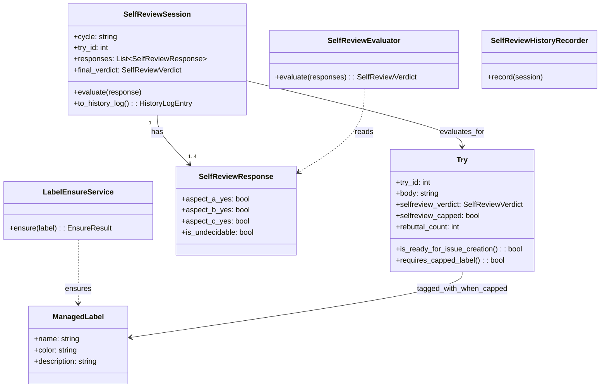

# ドメインモデル: Unit 002 §1.2.5 セルフレビュー観点新ステップ + 3 問固定判別ガイド

## 概要

`aidlc-retrospective` skill の §1.5 Issue 起票直前に **Try 構造性セルフレビュー** ドメインを導入し、Try が「次回から気をつける」「個別チェック追加」で済む表面的振り返りを構造的に予防するためのドメイン構造を定義する。

**重要**: このドメインモデル設計では**コードは書かず**、構造と責務の定義のみを行います。実装は Phase 2 で行います。

---

## 事前コード読込み（ステップ 0 / v2.6.5 / #679 / Unit 002）

### (a) Read 対象ファイル + 目的

| ファイル | Read 目的 |
|---------|----------|
| `skills/aidlc-retrospective/steps/retrospective.md`（350 行） | §1.2 主因切り分け（130-138）/ §1.3 格納先選択（140-150）/ §1.5 Issue 起票フロー（162-329）の現行構造を把握し、§1.2.5 挿入位置と dialog token TTL 制約を確認 |
| `skills/aidlc/scripts/lib/retrospective-api.sh`（204 行） | 公開 API レイアウト（タイプ A / B、終了コード規約 0/1/2/3/4、SOURCED ガード、bootstrap）と `retrospective_api_aggregate_enabled` の fail-safe パターンを把握し、`retrospective_api_ensure_label` を同等規約に合わせる |
| `tests/retrospective-aggregate-enabled.bats`（Unit 001 で導入） | bats テストの記述パターン（`setup` / `teardown` / `AIDLC_PROJECT_ROOT` モック / `load_api_fresh`）と SoT 文言検証パターンを把握 |
| `skills/aidlc/SKILL.md`「AskUserQuestion 使用ルール」 | 「ユーザー選択（振り返り内容の決定）」種別仕様（auto mode 適用外 / 実行時ガード = 対話確認トークン）を把握 |
| `skills/aidlc-retrospective/SKILL.md` | スキル冒頭の SoT 文言（v2.6.6 Unit 001 で「目的: T を Issue 化…」を追加済）を確認し、§1.2.5 から参照する文脈を把握 |
| `.aidlc/cycles/v2.6.6/story-artifacts/units/002-selfreview-and-classification-guide.md` | Unit 定義の責務・境界・NFR（特に可用性: AskUserQuestion 失敗時 `undecidable` 扱い）を把握 |

### (b) 設計時に意識すべき挙動

- **dialog token TTL 300 秒制約**: §1.5 Step 4 直前の `retrospective_dialog_token_verify` が TTL 切れすると起票がブロックされる（既存 retrospective-api.sh `exit 4 / reason=dialog-required`）。§1.2.5 の `AskUserQuestion` 3 観点 + 差し戻し（最大 3 回） は **token verify 前** に完了させる必要がある
- **`retrospective_api_*` シグネチャ不変規約**: Unit 001 の SC 検証で「既存公開関数シグネチャの不変性」が bats で固定済。新規 helper を追加する場合は既存関数のシグネチャを触らず、純粋な追加のみとする
- **タイプ B（純粋値 / stdout 1 行）規約**: 既存 `retrospective_api_aggregate_enabled` が fail-safe で常に `true`/`false` を返し exit 0 固定とする pattern を採用しているが、`retrospective_api_ensure_label` は副作用（`gh label create`）を持つため**タイプ A（副作用あり / exit code で判定）**に分類する
- **bash の `set -e` / `errexit` 状態保持**: 既存 `retrospective_api_aggregate_enabled` は caller の errexit を変更しないよう `if value=$(...); then ...; else rc=$?; fi` パターンを採用。新規 helper も同パターンに従う
- **既存の対話必須ガード**: §1.0.5 と §1.5 Step 4 の AskUserQuestion 必須ガードと、§1.2.5 の新規 AskUserQuestion との順序関係は「§1.2.5 完了 → token issue → §1.5 Step 4 → token verify → 起票」とする
- **`gh label create` の冪等性**: 既存ラベル時は exit 22 (HTTP 422 / already exists) を返す。これを「正常」と扱うか別途 `gh label list --search` で事前判定するかの設計判断が必要
- **bats テストでの AskUserQuestion 不在**: bats 環境では `AskUserQuestion` ツールを起動できないため、§1.2.5 の差し戻しループ判定ロジックは `retrospective_api_*` 関数レベル（=「判定」を外部関数化）に切り出して単体テスト可能にする必要がある

### (c) 既存実装に基づく代替案検討

| 案 | 採用判断 | 根拠 |
|----|---------|------|
| **案 A: §1.2.5 のループ制御フロー全体を bash 関数化（`retrospective_api_run_selfreview`）し、bats で全経路をテスト** | **却下** | `AskUserQuestion` 自体は外部ツールで bash から呼べない。bash 関数化しても結局 `AskUserQuestion` 呼び出し部はステップ文書側に残り、二重定義になる |
| **案 B: §1.2.5 の判定純粋ロジックのみを関数化し（`retrospective_api_evaluate_selfreview_verdict <a_yes> <b_yes> <c_yes> <rebuttal_count>` → `pass\|rebuttal\|capped\|undecidable`）、AskUserQuestion 呼び出しと差し戻しループはステップ文書側に残す。bats は関数の判定論理だけを網羅** | **採用** | 純粋関数化で bats 単体テスト可能。AskUserQuestion ループはステップ文書側で対話制御し、判定論理だけを SoT として固定できる。指摘 #3 の `undecidable` ケースも純粋判定でテスト可能 |
| **案 C: §1.2.5 を新ステップとして追加せず、§1.5 Step 4 の対話必須ガード内に組み込む** | **却下** | Unit 定義 SC-05 が「§1.2.5 という独立ステップ追加」を要求。§1.5 Step 4 内では既存 token verify との順序が崩れる |
| **案 D: `retrospective_api_ensure_label` を `gh label list --search` で事前判定 → 不在時のみ `gh label create`** | **採用** | `gh label create` の exit 22 解釈は version 依存（gh CLI が出すエラー文字列の安定性に依存しない）。事前 list で冪等性を担保する方が堅牢 |
| **案 E: `retrospective_api_ensure_label` を fail-safe（exit 0 統一 + warn のみ）にする** | **却下** | 計画書「公開契約」§1 で「`exit 2/3` で起票中断（厳格 fail-fast）」を確定済。`exit 0` 統一は不整合 |

---

## エンティティ（Entity）

### Try

- **ID**: Try 番号（1 サイクル内通し番号、整数）
- **属性**:
  - `body`: string - Try 本文（KPT テンプレの Try セクションから抽出）
  - `selfreview_verdict`: enum (`pass` | `rebuttal` | `capped` | `undecidable`) - §1.2.5 セルフレビュー確定結果
  - `selfreview_capped`: bool - `verdict=capped` の場合のみ `true`
  - `rebuttal_count`: int (0..3) - 差し戻しループの回数（上限 3）
- **振る舞い**:
  - `is_ready_for_issue_creation()`: `verdict ∈ {pass, capped}` のとき true（`undecidable` / `rebuttal` 中は起票しない）
  - `requires_capped_label()`: `selfreview_capped=true` のとき true

### SelfReviewSession

- **ID**: 振り返り 1 回（サイクル単位）内で各 Try に対応するセッション。複合キー（cycle, try_id）
- **属性**:
  - `cycle`: string - 対象サイクル（例: `v2.6.6`）
  - `try_id`: int - 対応する Try の ID
  - `responses`: List<SelfReviewResponse> - 差し戻し毎の 3 観点応答スナップショット（rebuttal_count + 1 件）
  - `final_verdict`: enum (`pass` | `rebuttal` | `capped` | `undecidable`) - 確定 verdict
- **振る舞い**:
  - `evaluate(response)`: 新しい応答を受けて差し戻し or pass or capped or undecidable を判定
  - `to_history_log()`: `history/operations.md` 追記用ログエントリを生成

---

## 値オブジェクト（Value Object）

### SelfReviewResponse

- **属性**:
  - `aspect_a_yes`: bool - 観点 A「気をつける逃げ」が「該当する（= 表面的）」か
  - `aspect_b_yes`: bool - 観点 B「個別 → 構造昇格」が「該当する（= 表面的 = 構造昇格できていない）」か
  - `aspect_c_yes`: bool - 観点 C「再発防止チェック逃げ」が「該当する（= 表面的）」か
  - `is_undecidable`: bool - `AskUserQuestion` 失敗時のセンチネル（`true` のとき他観点は無視）
- **不変性**: 1 回の AskUserQuestion 応答を表現するため、生成後は変更不可
- **等価性**: 4 属性すべての値の組で等価判定

### SelfReviewVerdict（純粋判定関数の戻り値）

- **属性**: enum 値 `pass` | `rebuttal` | `capped` | `undecidable`
- **不変性**: enum なので不変
- **等価性**: 文字列等価

### ManagedLabel

- **属性**:
  - `name`: string - ラベル名（`selfreview-capped` 等）
  - `color`: string - 6 桁 hex（既定 `BFD4F2`）
  - `description`: string - ラベル説明文
- **不変性**: name で一意。`color` / `description` は初回作成時のみ設定
- **等価性**: name で判定

---

## 集約（Aggregate）

### SelfReviewSessionAggregate

- **集約ルート**: `SelfReviewSession`
- **含まれる要素**: `SelfReviewSession` + 当該 session の `responses: List<SelfReviewResponse>`
- **境界**: 1 つの Try に対する `final_verdict` 確定までの応答列を 1 単位として保護
- **不変条件**（**優先順位付き / 上位ルールが下位ルールに優先**）:
  1. `responses.size <= 4`（初回応答 + 最大 3 回差し戻し）
  2. `final_verdict=undecidable` ⟺ いずれかの response で `is_undecidable=true`（最優先 / 4 回目で undecidable が出ても undecidable 確定）
  3. `final_verdict=pass` ⟺ 上位優先 (2) に該当せず、かつ直近 `responses[-1]` で `aspect_a_yes=aspect_b_yes=aspect_c_yes=false`
  4. `final_verdict=capped` ⟺ 上位優先 (2)(3) に該当せず、かつ `responses.size == 4`（差し戻し 3 回到達 / undecidable なし）
  5. `final_verdict=rebuttal` は中間状態としてのみ存在し、`final_verdict` 確定時は (2)(3)(4) のいずれか

> 優先順位は論理設計 §「判定論理（疑似コード）」の `if/elif` 順序（undecidable → pass → capped → rebuttal）と完全一致させ、4 回目で undecidable が同時発生したケース等の境界条件で論理矛盾が起きないようにする。

### LabelAggregate

- **集約ルート**: `ManagedLabel`
- **含まれる要素**: `ManagedLabel` 単独
- **境界**: GitHub repository 内の 1 ラベルを 1 単位として保護
- **不変条件**:
  - 同一 name のラベルが repository 内に複数存在しない（GitHub API 側で保証）

---

## ドメインサービス

### SelfReviewEvaluator（純粋判定サービス）

- **責務**: 与えられた応答列から `SelfReviewVerdict` を確定する純粋ロジック
- **操作**:
  - `evaluate(responses: List<SelfReviewResponse>) -> SelfReviewVerdict`
    - 1 件目から順に評価
    - 任意の `is_undecidable=true` を含む → `undecidable`
    - 直近 `response` の 3 観点すべて `false` → `pass`
    - `responses.size == 4` （差し戻し 3 回到達）→ `capped`
    - それ以外 → `rebuttal`（中間状態 / 次の AskUserQuestion を促す）
- **テスト容易性**: 副作用なしの純粋関数。論理設計で bash 関数 `retrospective_api_evaluate_selfreview_verdict` として実装

### LabelEnsureService

- **責務**: 指定ラベルが repository に存在することを保証（不在時は作成試行）
- **操作**:
  - `ensure(label: ManagedLabel) -> EnsureResult { ok | permission_denied | gh_unavailable }`
    - `gh label list --search <name>` で存在確認
    - 不在時 `gh label create` 1 回試行（リトライなし）
    - 権限不足 → `permission_denied`
    - `gh` 利用不能 → `gh_unavailable`
- **副作用**: ラベル新規作成（GitHub repository への書き込み）

### SelfReviewHistoryRecorder

- **責務**: `SelfReviewSession` の確定状態を `history/operations.md` に記録
- **操作**:
  - `record(session: SelfReviewSession)`: 計画書「公開契約 §2」のログフォーマットで `/write-history` 経由追記

---

## リポジトリインターフェース

### LabelRepository（GitHub API ラッパ）

- **対象集約**: `LabelAggregate`
- **操作**:
  - `exists(name) -> bool`: `gh label list --search <name>` でマッチ判定
  - `create(label: ManagedLabel) -> CreateResult { ok | permission_denied | gh_unavailable }`: `gh label create <name> --color <color> --description <description>`

### HistoryRepository（既存 `/write-history` ラッパ）

- **対象集約**: なし（イベントログとしての追記のみ）
- **操作**:
  - `append(cycle, event_payload)`: `write-history.sh` 経由で `history/operations.md` 追記

---

## ファクトリ

### TryClassificationGuideFactory（テンプレ生成）

- **生成対象**: `templates/try_classification_guide.md` の静的 markdown コンテンツ
- **生成ロジック概要**: 3 問固定（再発性 / 対象レイヤ / 再入余地）の見出し + 各問の判定指針 + 評価窓定義（本サイクルを含まない直前 3 サイクル分の `cycles/v*/operations/` + retrospective Issue）を SoT として 1 ファイルにまとめる。動的生成ではなく**静的テンプレートとして 1 度だけ作成**

---

## ドメインモデル図

---

## ユビキタス言語

- **Try 構造性セルフレビュー**: Try が「次回から気をつける / 個別チェック追加」で済む表面的内容になっていないかをユーザー自身が必須確認するレビュー工程
- **観点 A（気をつける逃げ）**: Try が「次回から気をつける / チェックを 1 項目追加する」で済んでいないかの確認観点
- **観点 B（個別 → 構造昇格）**: Problem を個別事象から構造課題（プロセス / 設計 / 規約 / SoT）に昇格できているかの確認観点
- **観点 C（再発防止チェック逃げ）**: P → T が再発防止チェックの追加で逃げていないかの確認観点
- **差し戻し**: いずれかの観点で「該当する（= 表面的）」と判定された場合、Try 起草に戻すループ。1 サイクル内 1 Try あたり最大 3 回
- **cap（差し戻し上限到達）**: 3 回差し戻しても表面的判定が解消しない場合の状態。`selfreview-capped` ラベル付与で T Issue を許可起票
- **`selfreview-capped` ラベル**: 差し戻し上限到達 Try に付与される GitHub ラベル。`color=BFD4F2`、`description="Try 構造性セルフレビュー上限到達"`
- **undecidable**: `AskUserQuestion` 失敗時のセンチネル状態。差し戻しでも採択でもなく保留扱い

---

## 不明点と質問（設計中に記録）

[Question] なし（計画書承認時に責務分割 / 公開契約 / undecidable 経路がすべて確定済み）
