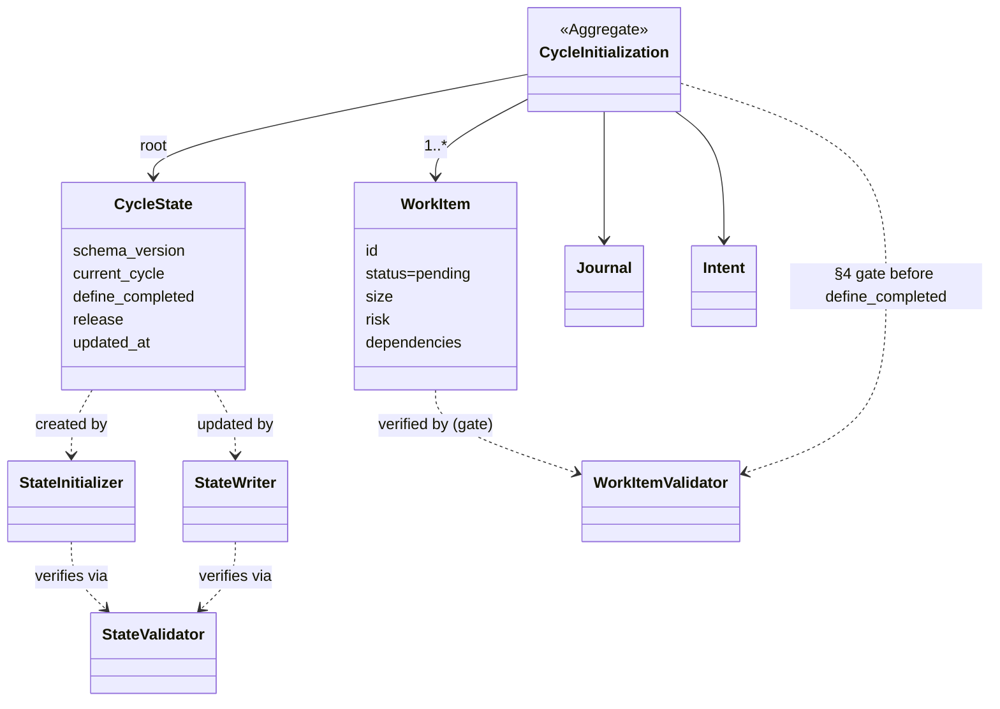

# ドメインモデル: Unit 001 v3 define フロー実行実装

## 概要

v3 `define` フロー（旧 Inception）の実行実装に関わる状態・成果物・操作の構造と責務を定義する。define は「作るもの・作らないもの・完了条件・作業単位（work item）を決め、cycle を初期化する」フローであり、本モデルは cycle 状態（`state.json`）・work item・journal・intent といった成果物エンティティと、それらを生成・初期化する操作（サービス）の責務境界を明確化する。

**重要**: このドメインモデル設計では**コードは書かず**、構造と責務の定義のみを行う。実装は Phase 2（コード生成）で行う。

## 事前コード読込み（v2.6.5 / #679 工程）

### (a) Read 対象ファイル + 目的

| ファイル | Read 目的 |
|---------|----------|
| `skills/aidlc-v3/steps/define.md` | 現状の「読める手順」skeleton（Step 1〜4）の粒度と、実行実装化で具体化すべき箇所の特定 |
| `skills/aidlc-v3/SKILL.md` | v3 オーケストレーターの define ルーティング・パス解決・skeleton 注記の把握 |
| `skills/aidlc-v3/scripts/state-write.sh` | 既存 state 書き込み IF（更新専用 / atomic temp+mv / 許可フィールド / 終了コード規約）の把握。**L7「初期 state の生成は Phase 3 / define フローへ defer」/ L109 ファイル不存在 exit 1 を確認** |
| `skills/aidlc-v3/scripts/state-validate.sh` | schema 検証 IF（必須フィールド・型・ISO8601・終了コード 0/1/2）の把握。初期 state 生成後の検証に再利用 |
| `skills/aidlc-v3/scripts/state-read.sh` | 読み取り IF（欠落と明示 null の区別）の把握 |
| `skills/aidlc-v3/scripts/tests/test-state-scripts.sh` | サンドボックス（`mktemp -d` + trap cleanup）・`make_valid_state` フィクスチャ・`assert_rc`/`assert_out` 方式の踏襲元 |
| `skills/aidlc-v3/templates/{intent,work-item,journal}.md` | 成果物テンプレートのプレースホルダ形式（`{{...}}`）・frontmatter 既定値 |
| `skills/aidlc-v3/steps/status.md` | define 完了後にフェーズ導出可能な状態（develop / release 可能）の参照仕様 |
| `docs/v3/data-model.md` §2/§3/§4/§5/§7 | ディレクトリ構造・state.json schema・work item frontmatter・フェーズ導出・journal 形式の設計正本 |
| `docs/v3/workflow.md` §3.1 | define Step 1〜4 の正本仕様 |

### (b) 設計時に意識すべき挙動

- `state-write.sh` は **既存ファイル更新専用**。対象ファイルが存在しないと exit 1。初期 `state.json` 生成は本フローの責務（state-write.sh 側で defer 宣言済み）。
- `state-write.sh` の atomic 方式は「同一ディレクトリに `mktemp` → `jq` 更新 → `state-validate.sh` 検証 → `mv`（atomic-replace）」。初期生成（state-init.sh）は同じ temp→validate の思想を踏襲しつつ、**確定操作は上書きを許さない `ln`（create-only）**とする（init と write で確定プリミティブが分岐 / 上書き禁止のため init は mv を使わない）。
- `state-write.sh` の許可フィールドは `define_completed` / `release.*` のみ。`schema_version` / `current_cycle` / `updated_at` は**更新対象外**（schema_version・current_cycle は作成時確定、updated_at は自動更新）。よって初期生成側が schema_version・current_cycle を確定する責務を持つ。
- `state-validate.sh` は schema_version の**値**は検証しない（型が string であれば valid。値互換性検証は Unit 004 / #731 の範囲）。初期生成は固定値 `"3.0"` を書く。
- `updated_at` は `AIDLC_STATE_NOW` 環境変数で上書き可能（テスト用）。初期生成スクリプトも同じ規約を踏襲する。
- `.aidlc/state.json` は cycle ディレクトリ配下ではなく**リポジトリ直下**（data-model §2）。
- work item frontmatter の必須キー 6 個・enum・本文必須 6 セクションは data-model §4 が正本。`dependencies` に存在しない ID を書くと §6 trace 整合エラー。
- v2 `.aidlc/`（`config.toml` / `cycles/`）を破壊しないこと（クリーンカット / 共存）。

### (c) 既存実装に基づく代替案検討

| 方針 | 既存実装との適合性 | 採用 / 却下 |
|------|------------------|------------|
| **extend**: `state-write.sh` に「不在時は初期生成」分岐を追加 | 却下。L7 で「更新専用」を設計契約として宣言しており、責務（field 更新）に「skeleton 生成」を混入させると単一責務が崩れる。許可フィールド以外（schema_version/current_cycle）を書く別経路が必要になり case 分岐が肥大化 | 却下 |
| **inline**: define.md の AI 手順で初期 JSON を temp に Write → validate → mv | 却下寄り。AI が SoT 状態ファイルの JSON を手書きするのは脆弱（誤フィールド・型ミス）。atomic 手順を Markdown 手順としてしか担保できず再現テストが困難 | 却下 |
| **replace/新規**: `state-init.sh`（atomic create-only の初期生成スクリプト）を新設 | 採用。既存 state-*.sh と同じ安全境界スクリプト層に属し、temp→validate の atomic 思想を踏襲（確定操作は `ln` create-only / state-write の `mv` replace とは分岐）。create-only ガードで既存 state の誤上書きを防止。単体テスト可能 | **採用（計画 D1(a)）** |

## エンティティ（Entity）

### CycleState（サイクル状態 / `.aidlc/state.json`）

- **ID**: `current_cycle`（string / 例 `"v3.0.0"`）。リポジトリに 1 つの単一現在状態。
- **属性**:
  - `schema_version`: string - schema バージョン（初版固定 `"3.0"`）。作成時確定・更新対象外。
  - `current_cycle`: string - 対象サイクル識別子。作成時確定・更新対象外。
  - `define_completed`: boolean - define 完了フラグ。初期 `false`、Step 4 完了時に `true`。
  - `release`: ReleaseState（値オブジェクト集合）- `pr_number`(int|null) / `ready`(bool) / `merge_approved`(bool)。初期 `null/false/false`。
  - `updated_at`: string(ISO 8601) - 最終更新時刻。書き込み時自動更新。
- **振る舞い**:
  - `初期化`: schema_version・current_cycle 確定 + define_completed=false + release 初期値で skeleton を atomic 生成（StateInitializer 経由）。
  - `define 完了マーク`: define_completed を true に更新（StateWriter 経由 / single-actor moment / data-model §3.3）。
- **不変条件**: data-model §3 の schema（必須フィールド・型・release 3 サブフィールド・updated_at の ISO8601）を常に満たす。final path への直接書き込みを行わず、atomic 経路で操作する（**初期化は temp→validate→`ln`（create-only）/ 更新は temp→validate→`mv`（atomic-replace）**）。

### WorkItem（作業単位 / `work-items/{id}-{slug}.md`）

- **ID**: `id`（string / 3 桁ゼロ埋め推奨 / 例 `"001"`）。
- **属性**（frontmatter / data-model §4.1）:
  - `status`: enum(`pending`/`in_progress`/`blocked`/`done`/`withdrawn`) - 個別状態。define 生成時の初期値は **`pending`**。
  - `size`: enum(`tiny`/`normal`/`risky`)。
  - `risk`: enum(`low`/`medium`/`high`)。
  - `assigned`: string|null（未割当 `null`）。
  - `dependencies`: array<id>（依存 work item ID / 空配列可）。
  - 本文必須 6 セクション: Goal / Scope / Acceptance Criteria / Traceability / Size / Risk / Dependencies（`Implementation Notes` 任意）。
- **振る舞い**:
  - `生成`: テンプレート `templates/work-item.md` を基に frontmatter + 本文を埋めて作成（Step 3 承認後、Step 4 で永続化）。
- **不変条件**: frontmatter 必須キー・enum 値域を満たす。`dependencies` は実在する work item ID のみを参照する（§6 trace 整合）。status 初期値は `pending`。

### CycleScaffold（cycle 成果物群 / `cycles/{cycle}/`）

- **ID**: cycle ディレクトリパス。
- **含まれる要素**: `intent.md`（Intent）/ `work-items/*.md`（WorkItem 集合）/ `journal.md`（Journal）。
- **構造**: v3 **フラット構造**（v2 の inception/construction/operations サブディレクトリを持たない / data-model §2）。
- **振る舞い**: `scaffold` - cycle ディレクトリと必須成果物を作成（Step 4）。

### Journal（作業証跡 / `journal.md`）

- **属性**: 日付見出し（`## YYYY-MM-DD`）配下の箇条書き（追記型 / data-model §7）。
- **振る舞い**: `define 完了追記` - define 完了の証跡（例: `define completed: intent and N work items created`）を追記する。

## 値オブジェクト（Value Object）

### SchemaVersion

- **属性**: string（初版 `"3.0"`）
- **不変性**: 作成時に確定し、本フローでは変更しない（互換性検証は Unit 004 / #731）。
- **等価性**: 文字列一致。

### CycleId

- **属性**: string（`vX.Y.Z` 系識別子 / 例 `v3.0.0-alpha.3`）
- **不変性**: cycle 作成時に確定。
- **健全性制約**: 非空かつ許容文字集合 `^[A-Za-z0-9][A-Za-z0-9._-]*$`（`/`・空白・制御文字を含まない）。cycle ディレクトリ名・ブランチ suffix・`state.current_cycle` の同一キーになるため、不正値は path/branch 整合を壊す。StateInitializer がこのガードを実施する。**`vX.Y.Z` 厳密形式の検証は本 Unit のスコープ外**（consumer の任意識別子余地を残す / 厳密 regex は defer）。
- **等価性**: 文字列一致。`current_cycle` と cycle ディレクトリ名・ブランチ名の整合キー。

### Phase（導出値 / 非永続）

- **属性**: `define` / `develop` / `release 可能` / `complete` の導出結果。
- **不変性**: **状態として保持しない**（`current_phase` を持たない）。CycleState + WorkItem 群から常に導出（data-model §5）。
- **等価性**: 導出ロジックの出力としてのみ存在。本 Unit は「define 完了後に develop / release 可能を導出できる状態になること」を検証対象とする（導出実装＝status は Phase 6）。

## 集約（Aggregate）

### CycleInitialization（cycle 初期化集約）

- **集約ルート**: CycleState
- **含まれる要素**: CycleState / CycleScaffold（intent.md / work-items / journal.md）
- **境界**: define Step 4 の「single-actor moment」で一括初期化される範囲。
- **不変条件**:
  - `define_completed: true` が確定した時点で、`intent.md` と 1 件以上の `work-items/*.md` と `journal.md` が存在する（成果物なしで define 完了にしない）。
  - **`define_completed: true` が確定した時点で、全 `work-items/*.md` が data-model §4 schema に準拠する**（frontmatter 必須 6 キー・enum 値域・status 初期値 pending・本文必須 6 セクション・`dependencies` が実在 work item ID のみ参照）。この検証ゲートを通過しない限り `define_completed` を true にしない（生成ミスが完了マークまで素通りすることを防ぐ）。
  - `state.json` の `current_cycle` と cycle ディレクトリ名（および cycle ブランチ suffix）が同一値で一致する。current_cycle は入力健全性ガード（StateInitializer）を満たす。
  - 初期化は atomic で行い、final path へ直接 Write しない。state.json の確定操作は create-only（`ln`）。

## ドメインサービス

### StateInitializer（`scripts/state-init.sh` / 新規）

- **責務**: 初期 `state.json`（skeleton）を atomic に create-only 生成する。schema_version・current_cycle を確定し、define_completed=false / release 初期値 / updated_at を書く。current_cycle の入力健全性（非空 / `/`・空白・制御文字を含まない / 許容文字集合 `^[A-Za-z0-9][A-Za-z0-9._-]*$`）をガードする。
- **操作**:
  - `init(current_cycle, [file])` - current_cycle 健全性検証 → canonical skeleton を temp に生成 → `state-validate.sh` で検証 → **`ln`（ハードリンク）で atomic create-only 配置**（target 既存なら失敗 → exit 1）→ temp 削除。`mv` は使わない（無条件上書きで TOCTOU 窓が残り create-only 契約を破るため）。
- **不変条件**: final path へ直接 Write しない。確定操作は `ln`（create-only）であり、既存 state を決して上書きしない。`state-write.sh` の atomic-replace（`mv`）とは原子化プリミティブが分岐する（init=create-only / write=replace）。

### StateWriter（`scripts/state-write.sh` / 既存・再利用）

- **責務**: 既存 state の許可フィールド（`define_completed` / `release.*`）を atomic 更新。
- **操作**: `write(field, value, [file])` - 本 Unit では `write("define_completed", "true")` を Step 4 完了時に使用。

### StateValidator（`scripts/state-validate.sh` / 既存・再利用）

- **責務**: state.json の schema 妥当性検証（read-only）。StateInitializer / StateWriter の確定前検証に再利用。

### WorkItemValidator（`scripts/work-item-validate.sh` / 新規）

- **責務**: 指定ディレクトリ内の全 work item（`*.md`）が data-model §4 schema に準拠するかを検証する（read-only）。define Step 4-2 の検証ゲート実体であり、集約不変条件「`define_completed: true` 確定時に全 work item が §4 準拠」を担保する。`StateValidator` が state.json を検証するのと対称な、work item frontmatter / 本文の schema validator。後続フェーズ（develop / doctor）からも再利用可能。
- **操作**: `validate(work_items_dir, [expected_status])` - 各 work item の frontmatter 必須 6 キー・enum 値域（status/size/risk）・型制約（`assigned` は string or null / `dependencies` は array `[...]`）・id とファイル名整合・本文必須 6 セクション・dependencies の実在 ID 参照を検証。`expected_status` 指定時は全 work item の `status` がその値であることを追加検証（define は `pending` を渡す）。exit 0 = `status:valid` / 違反・0 件・ディレクトリ不在 = exit 1 / 読み取り不可 = exit 2。
- **不変条件**: 状態を変更しない（read-only）。検証はファイル単位で fail-fast（最初の違反で exit 1）。define Step 4 では本検証を `state-init` より前に実行し、失敗時は state.json を生成しない（ゲート先行 fail-fast）。

### CycleScaffolder（define.md Step 4 手順 / AI inline）

- **責務**: cycle ディレクトリ作成（`mkdir -p`）と、テンプレートを基にした intent.md / work-items/*.md / journal.md の生成。安全境界不要な単純処理のため AI inline（RFC P4）。
- **操作**: `scaffold(cycle, intent, work_items)` - フラット構造で成果物を配置。

### DefineCommitter（define.md Step 4 手順 / AI inline + git）

- **責務**: cycle ブランチ作成 + 初回 commit。通常パスでは Draft PR を作成しない（`early_pr: true` 時のみ / 詳細は release フェーズ責務）。
- **操作**: `commit(cycle)` - branch 作成 → `git add -A` → 初回 commit。

## リポジトリインターフェース

本 Unit はファイルシステム（`.aidlc/` 配下）と git をストアとする。明示的なリポジトリ抽象は持たず、state.json は state-*.sh 経由、その他成果物は AI inline のファイル操作で永続化する。

## ドメインモデル図

## ユビキタス言語

- **cycle state**: サイクルレベル状態（`.aidlc/state.json`）。リポジトリに 1 つ。
- **work item state**: work item 個別状態（各 `work-items/*.md` の frontmatter）。
- **single-actor moment**: 書き込み競合を避けるため state.json 書き込みを define 完了時・release 時に限定する設計原則（data-model §3.3）。
- **フェーズ導出**: `current_phase` を保持せず CycleState + work item から都度導出すること（data-model §5）。
- **create-only**: 既存ファイルを上書きしない生成（StateInitializer のガード）。
- **フラット構造**: v3 cycle ディレクトリが inception/construction/operations サブディレクトリを持たない構造（data-model §2）。

## 不明点と質問（設計中に記録）

[Question] 初期 `state.json` 生成を新規 `state-init.sh` で行う方針は妥当か（Unit 責務文言は「state-write.sh 経由」だが、state-write.sh は構造的に更新専用）。
[Answer] 妥当。state-write.sh L7 が初期生成を本フローへ defer 宣言しており、更新専用契約に初期生成を混入させない。承認済み計画 D1(a) が `state-init.sh` を推奨案として確定済み。Unit 責務「state.json 初期化」を正しく実装したもの。

[Question] `define_completed: true` は state-init.sh で直接書くか、state-write.sh 経由で別途書くか。
[Answer] state-init.sh は常に `define_completed: false` の skeleton を生成し、`true` への遷移は state-write.sh の責務（data-model §3.3 の書き込みタイミング表 = define実行者が Step 4 完了時に書く）。責務分離（init=skeleton / write=field 更新）を維持する。
