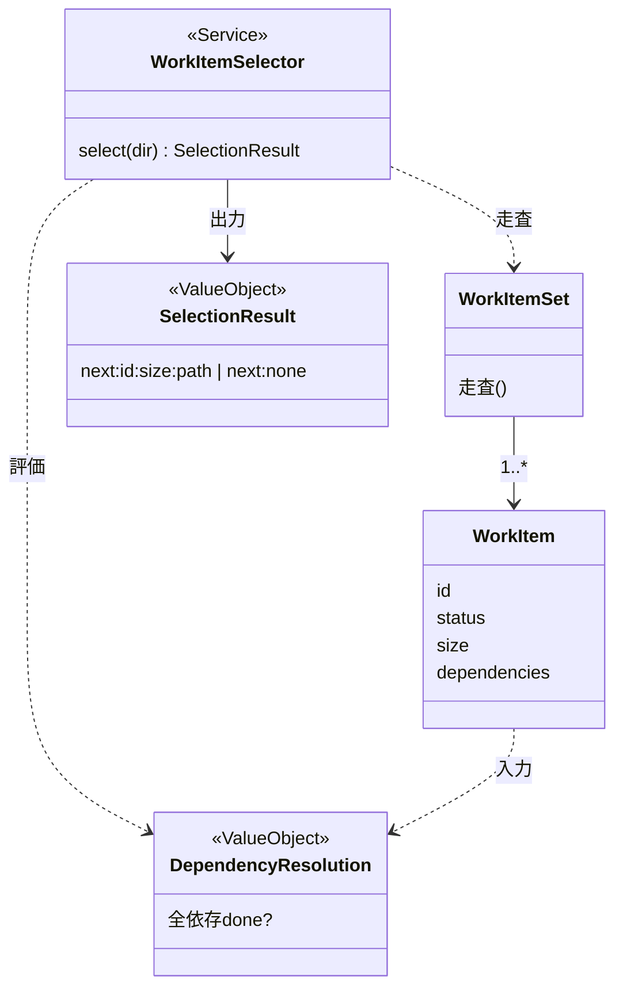

# ドメインモデル: Unit 002 work-item-next.sh（依存解決による次 work item 選定）

## 概要

develop フローが「次にどの work item に着手するか」を一意に決めるための依存解決ドメインを定義する。`work-items/*.md` の frontmatter（status / dependencies / size）を入力に、`docs/v3/data-model.md` §5.2 の選定規則で次着手候補を決定論的に 1 件選ぶ読み取り専用サービス `work-item-next.sh`（WorkItemSelector）の責務・規則・境界を明確化する。本モデルは状態を変更しない（選定のみ）。

## 事前コード読込み

### (a) Read 対象ファイル + 目的

| ファイル | Read 目的 |
|---------|----------|
| `docs/v3/data-model.md` §4 / §5.2 / §6 | frontmatter 仕様（status/size/dependencies enum・型）/ dependency 解決規則（pending のみ候補・全依存 done・withdrawn は自動充足しない）/ 破損時方針の正本 |
| `docs/v3/workflow.md` §3.2 | develop の work item 選定手順（本 Unit が返す候補の利用側契約） |
| `skills/aidlc-v3/scripts/work-item-validate.sh` | Unit 001 成果物。frontmatter スカラー抽出（`read_scalar` = 引用符バランス）・dependencies 配列パース・id 集合収集の実装パターン。本 Unit のパース実装の参照元（D1 で共有方針を決定） |
| `skills/aidlc-v3/scripts/state-read.sh` / `state-validate.sh` | 既存スクリプトの出力規約（`key:value`）・終了コード規約（0/1/2）・read-only 設計の踏襲元 |
| `skills/aidlc-v3/scripts/tests/test-define-flow.sh` | サンドボックス（`mktemp -d` + trap）・`assert_*` 方式・work item fixture 生成の踏襲元 |

### (b) 設計時に意識すべき挙動

- §5.2: 新規着手候補は `status: pending` のみ。`dependencies` の全 work item が `done` の場合に選定可能。`withdrawn` 依存先は `done` と異なり**自動充足しない**（人間判断まで `blocked` 相当）。
- §5.1 評価順 4（release 可能判定）は `done` + `withdrawn` の両方を完了扱いとするが、これは**個別 item の dependency 解決とは別レイヤ**。本 Unit は item 選定（`done` のみ自動充足）を扱い、release 可能判定は扱わない。
- frontmatter 仕様（§4）: `status ∈ {pending,in_progress,blocked,done,withdrawn}` / `size ∈ {tiny,normal,risky}` / `dependencies` は実在 work item ID の配列。本 Unit は **validate 済みの work-items を入力前提**とするが、不在 dependency 参照（境界 d）への防御は持つ。
- 既存スクリプト規約: `key:value` 出力 / 終了コード 0=正常・1=入力エラー・2=システムエラー / read-only。

### (c) 既存実装に基づく代替案検討（D1: frontmatter パース共有方針）

| 方針 | 適合性 | 採用 / 却下 |
|------|--------|------------|
| (a) `work-item-validate.sh` の `read_scalar` 等を共有 lib（`scripts/lib/work-item-read.sh`）に抽出し両者で source | DRY だが、Unit 001 のテスト済み validate.sh を再オープン・両ファイルを lib に結合する。validate（検証 = malformed で exit 1）と next（選定 = validate 済み前提の読み取り）は**エラー意味論が異なる**ため、共有 lib に両者の要求を背負わせると責務が肥大化 | 却下（当面） |
| (b) work-item-next.sh 内に独自の軽量読み取りを実装（status/size の単純抽出 + dependencies 配列パース） | next は validate 済み work-items を入力とし、選定に必要な最小読み取りのみ。重複は小さく（スカラー 2 個 + 配列 1 個）、validate.sh を再オープンしない。責務独立 | **採用（D1）** |
| (c) 重複を許容し将来 3 例目の consumer 出現時に lib 化 | (b) と同じ。lib 化の判断を「3 consumer ルール」で defer | 採用（(b) と一体 / lib 化トリガを明記） |

> **D1 決定**: work-item-next.sh は独自の軽量読み取りを実装する。`work-item-validate.sh` への変更は行わない（Unit 001 の tested code を再オープンしない）。frontmatter パースの共有 lib 化は、3 例目の consumer が現れた時点で実施する（YAGNI / 結合回避）。next は validate 済み work-items を入力前提とするが、不在 dependency 参照（境界 d）への防御は持つ。

## エンティティ（Entity）

### WorkItem（作業単位 / `work-items/{id}-{slug}.md`）

- **ID**: `id`（string / 例 `"001"`）。ファイル名 prefix（`<id>-<slug>.md`）と一致。
- **選定に用いる属性**（frontmatter / data-model §4.1）:
  - `status`: enum(`pending`/`in_progress`/`blocked`/`done`/`withdrawn`)。選定対象判定の主キー。
  - `size`: enum(`tiny`/`normal`/`risky`)。選定結果に同梱（Unit 003 の tiny 確認用）。
  - `dependencies`: array<id>（依存 work item ID / 空配列可）。依存解決の入力。
- **不変条件（入力前提）**: validate 済み（§4 準拠）の work-items を入力とする。ただし `dependencies` の参照先が実在しない場合（境界 d）は WARN + 候補外として防御する。

### WorkItemSet（work item 集合 / `work-items/` ディレクトリ）

- **ID**: work-items ディレクトリパス。
- **含まれる要素**: WorkItem の集合。全 id 集合 = 依存実在判定の母集合。
- **振る舞い**: `走査` - 全 `*.md` を読み取り、id / status / size / dependencies を抽出する。

## 値オブジェクト（Value Object）

### DependencyResolution（依存解決結果 / 導出値・非永続）

- **属性**: ある WorkItem について「全 dependencies が `done` か」の真偽。
- **規則**: 全依存の status が `done` → 充足。1 つでも非 `done`（`pending`/`in_progress`/`blocked`/`withdrawn`）→ 非充足。`withdrawn` 依存も非充足（§5.2: `done` のみ自動充足）。
- **不変性**: WorkItemSet の現在状態から都度導出。状態として保持しない。

### SelectionResult（選定結果 / 出力値オブジェクト）

- **属性**: 選定時 `next:<id>:<size>:<path>` / 候補なし `next:none`。
- **不変性**: 決定的（同一入力 → 同一出力）。複数候補時は id 昇順で先頭 1 件（D3）。

## ドメインサービス

### WorkItemSelector（`scripts/work-item-next.sh` / 新規）

- **責務**: WorkItemSet を走査し、§5.2 規則で次着手 work item を決定論的に 1 件選定する読み取り専用サービス。state も work item も変更しない。
- **操作**: `select(work_items_dir)` →
  1. 全 work item の id / status / size / dependencies を読み取り、id 集合を構築。
  2. **resume 優先（D2）**: `in_progress` の work item が 1 件以上あれば、最小 id の in_progress を選定して返す（中断した develop の再開）。複数 in_progress があれば WARN（stderr / 異常: 並行作業の疑い）を出しつつ最小 id を返す。
  3. in_progress が 0 件なら、`pending` かつ全 dependencies が `done` の候補を抽出（境界 a）。非 done 依存（境界 b）・`withdrawn` 依存（境界 c）を持つものは除外。不在 dependency 参照（境界 d）は WARN + 当該 item を候補外。
  4. 候補が複数なら id 昇順で先頭（境界 e / D3）。候補 0 件なら `next:none`。
- **不変条件**: read-only。決定的選定（id 昇順で一意）。`withdrawn` を `done` と同一視しない。release 可能判定（§5.1 評価順 4）は担当しない。

> **選定対象 status の整理**: 新規着手候補は `pending` のみ。`in_progress` は resume 候補（D2）。`done`/`withdrawn`/`blocked` は候補外（`blocked` は外部待ち、`done`/`withdrawn` は完了/取り下げ）。

## 集約（Aggregate）

本 Unit は読み取り専用で状態を変更しないため、書き込み境界としての集約は持たない。WorkItemSet を一貫性の読み取り単位（スナップショット走査）として扱う。

## リポジトリインターフェース

ファイルシステム（`work-items/*.md`）をストアとする。明示的なリポジトリ抽象は持たず、frontmatter を直接読み取る（read-only）。

## ドメインモデル図

## ユビキタス言語

- **次着手候補（next）**: §5.2 規則で次に develop 対象に選べる work item。本 Unit は決定的に 1 件返す。
- **依存充足**: ある work item の全 `dependencies` の status が `done` であること（`withdrawn` は充足しない）。
- **resume 優先**: `in_progress` work item があれば新規 `pending` 選定より優先して返す方針（D2 / 中断再開）。
- **候補 status 規約**: 新規着手候補は `pending` のみ。`in_progress` は resume 候補。`done`/`withdrawn`/`blocked` は候補外。

## 不明点と質問（設計中に記録）

[Question] in_progress work item が存在する場合、新規 pending を選ぶか in_progress を resume するか。
[Answer] resume 優先（D2）。develop は work item を 1 件ずつ pending→in_progress→done と進める前提であり、in_progress の存在は中断した作業を意味する。新規 pending を並行で始めると複数 in_progress が生じるため、最小 id の in_progress を返して再開を促す。複数 in_progress は異常として WARN を出す。`workflow.md` §3.2 の「1 件ずつ進める」前提と整合。

[Question] frontmatter パースを work-item-validate.sh と共有するか。
[Answer] 当面は共有しない（D1 / (b)+(c)）。validate（検証）と next（選定）はエラー意味論が異なり、共有 lib 化は Unit 001 の tested code 再オープン + 結合を生む。next 独自の軽量読み取りを実装し、3 例目 consumer 出現時に lib 化する（YAGNI）。
