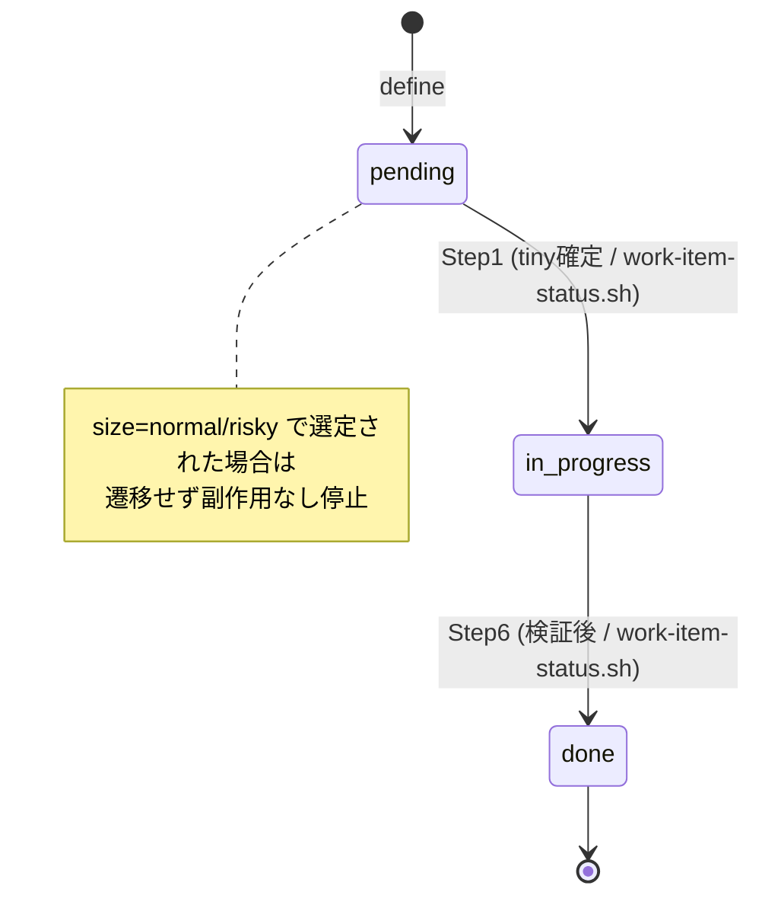

# ドメインモデル: Unit 003 v3 develop tiny フロー実行実装

## 概要

v3 develop tiny フローの状態遷移とフェーズ導出をモデル化する。work item を `pending → in_progress → done` と遷移させ、tiny サイズのみを design / review なしで完了させる「1 実行 = 1 work item」の作業単位を扱う。

**重要**: このドメインモデル設計では**コードは書かず**、構造と責務の定義のみを行う。実装は Phase 2 で行う。

## ステップ0: 事前コード読込み

### (a) Read 対象ファイル + 目的

| ファイル | Read 目的 |
|---------|----------|
| `skills/aidlc-v3/scripts/work-item-next.sh` | Step 1 選定の入力契約（出力 `next:<id>:<size>:<path>` / `next:none` / resume 優先 / exit 0/1/2）を正確に把握する |
| `skills/aidlc-v3/scripts/work-item-validate.sh` | `read_scalar` の frontmatter スカラー抽出パターン（status 行の正規表現・引用符・inline コメント処理）を `work-item-status.sh` の更新ロジックの参照にする |
| `skills/aidlc-v3/scripts/state-write.sh` | atomic 書き込み（temp + mv / 同一ディレクトリ mktemp / trap / 終了コード正規化）と `AIDLC_STATE_NOW` テストフックの実装パターンを `work-item-status.sh` に踏襲する |
| `skills/aidlc-v3/scripts/state-read.sh` | フェーズ導出で `define_completed` / `release.*` を読む手段を確認する |
| `skills/aidlc-v3/steps/define.md` | develop.md の記法スタイル（Step 構成・パス解決・commit/journal 記法・検証ゲート記述）を揃える |
| `skills/aidlc-v3/steps/status.md` | フェーズ導出（§5.1）の表示仕様と「全 status 走査」方式を develop 完了後の案内分岐に一致させる |
| `skills/aidlc-v3/scripts/tests/test-define-flow.sh` | テストハーネスのサンドボックス構築（`mktemp -d`）・assert 関数・ドライバ模擬（`run_define_step4`）方式を踏襲する |
| `docs/v3/workflow.md` §3.2 / §6.2 | develop フロー Step 詳細・size×review マトリクス（tiny スキップ）の正本 |
| `docs/v3/data-model.md` §4 / §5.1 / §5.2 / §7 | frontmatter status enum / フェーズ導出 / dependency 解決 / journal 形式の正本 |
| `skills/aidlc-v3/templates/journal.md` | journal 追記形式（`## YYYY-MM-DD` 配下に箇条書き） |

### (b) 設計時に意識すべき挙動

- `work-item-next.sh` は **resume 優先**: `in_progress` が 1 件以上あれば pending 選定ロジックに到達せず、最小 id の in_progress を `next:<id>:<size>:<path>` で返す（複数 in_progress は WARN を stderr に出しつつ最小 id 返却）。develop は in_progress 経路を必ず想定する必要がある。
- `next:none` は「選定可能 item なし」を意味するのみ。blocked 相当（withdrawn 依存 / 未充足依存）の pending が残っていても発生するため、**フェーズ導出（release 可能 / develop 継続）の根拠にしない**（§5.2 別レイヤ）。release 可能判定は全 work item frontmatter status の走査で行う（§5.1 評価順 4）。
- `next:none` は **exit 0**（正常）。exit 1 は入力エラー（ディレクトリ不在 / work item 0 件）。
- 出力 path は呼び出し時 cwd 基準（スクリプトは正規化しない）。develop は work-items ディレクトリ引数の与え方で path 形を制御する。
- frontmatter の status 行は `read_scalar` 同様、`status:` 行・前後空白・inline コメント・両端引用符を考慮する必要がある。status を書き換える際は **status 行のみ**を変更し他フィールド・本文を保持する。
- `state-write.sh` は work item frontmatter を扱わない（許可フィールドは state.json の `define_completed` / `release.*` のみ）。frontmatter status の書き込み手段は本 Unit で新設する（既存に皆無）。
- 終了コード規約は全 v3 スクリプトで 0=正常 / 1=入力・バリデーションエラー / 2=システムエラー で統一されている。`work-item-status.sh` もこれに従う。

### (c) 既存実装に基づく代替案検討

| 方針 | 既存実装との適合性 | 採否 |
|------|------------------|------|
| **status 更新を専用スクリプト `work-item-status.sh` で行う（refactor: state-write.sh の atomic パターンを流用）** | `state-write.sh` の temp+mv / 同一 dir mktemp / trap / rc 正規化 / `AIDLC_STATE_NOW` フックがそのまま frontmatter 1 行更新に転用でき、テストも `run_define_step4` 同様にスクリプト呼出で決定的再現できる。RFC P4 安全境界とも整合 | **採用**（計画 D1） |
| status 更新を develop.md 内の AI Edit で直接行う | スクリプト新設不要だが、テストハーネスから決定的再現できず（AI ステップ）、atomic 性・期待現在 status 検証も担保されない。RFC P4 安全境界に劣る | 却下 |
| sed インライン更新 | atomic でなく、引用符・inline コメント・複数 status 行の偽陽性に弱い。`read_scalar` 相当の堅牢性を再実装する手間が専用スクリプトと変わらない | 却下 |
| 選定を develop.md 内で frontmatter 再パースして実装 | `work-item-next.sh`（Unit 002）が既に決定的選定 + size 同梱を提供済み。再実装は DRY 違反 | 却下（既存スクリプト利用） |

## エンティティ（Entity）

### WorkItem

- **ID**: string（3 桁ゼロ埋め推奨 / 例 `"003"`） — `id` frontmatter
- **属性**:
  - `status`: WorkItemStatus - 作業状態（本 Unit の主たる遷移対象）
  - `size`: WorkItemSize - 作業規模（tiny のみ本フロー対象）
  - `risk`: enum(low/medium/high) - 本 Unit では参照のみ
  - `dependencies`: WorkItem ID のリスト - 選定の依存解決に使用（参照のみ）
  - `path`: ファイルパス（`work-items/<id>-<slug>.md`）
- **振る舞い**:
  - `transitionStatus(expected, next)`: 期待現在 status と一致する場合のみ status を遷移（`work-item-status.sh` が担う / pending→in_progress→done）。一致しない場合は遷移しない（不正遷移ガード）
  - `isTiny()`: size が tiny かを判定（副作用なし停止の分岐根拠）

### DevelopTinyRun

- **ID**: 暗黙（1 実行 = 1 work item / 対象 WorkItem id で識別）
- **属性**:
  - `target`: WorkItem - 選定された対象（resume または新規）
  - `selectionSource`: enum(resume / fresh / none) - 選定経路
- **振る舞い**:
  - `select()`: WorkItemSelection サービスで次対象を決定（resume 優先）
  - `guardTiny()`: target が tiny でなければ副作用なし停止（mutation を一切行わない）
  - `complete()`: 実装 + 検証後、status を done に遷移し journal 追記・commit を確定

## 値オブジェクト（Value Object）

### WorkItemStatus

- **属性**: 値 ∈ {`pending`, `in_progress`, `blocked`, `done`, `withdrawn`}（data-model §4.1）
- **不変性**: 列挙値であり、遷移は新しい値オブジェクトへの置換として表現
- **等価性**: 文字列値で判定
- **本 Unit で扱う遷移**: `pending → in_progress`（Step 1 tiny 確定後）/ `in_progress → done`（Step 6 完了）。それ以外（blocked / withdrawn 含む）は本 Unit の develop tiny フローの遷移対象外

### WorkItemSize

- **属性**: 値 ∈ {`tiny`, `normal`, `risky`}（data-model §4.1）
- **等価性**: 文字列値で判定
- **本 Unit の意味**: `tiny` のみ design/review スキップで完走。`normal` / `risky` は未サポート案内で停止（副作用なし）

### SelectionResult

- **属性**: `work-item-next.sh` の出力 1 行
  - 選定あり: `next:<id>:<size>:<path>`
  - 候補なし: `next:none`
- **不変性**: 読み取り専用の選定結果（state を変えない）
- **解釈**: size を内包するため develop は frontmatter 再パースなしで tiny 判定できる。一方 **status と選定経路（resume/fresh）は含まない**ため、tiny 確定後に develop が対象 frontmatter から現在 status を別途読取り、`work-item-status.sh` の expected-current として渡す

## 集約（Aggregate）

### Cycle 状態集約

- **集約ルート**: Cycle（`state.json` の `current_cycle`）
- **含まれる要素**: `state.json`（define_completed / release.*）+ 全 `work-items/*.md` の frontmatter status 集合
- **境界**: フェーズ導出はこの集約全体（state + 全 work item status）を入力とする
- **不変条件**:
  - フェーズは保持せず常に導出（`current_phase` を持たない / RFC DG-6）
  - release 可能（§5.1 評価順 4）= 全 work item が done/withdrawn。develop 継続（評価順 3）= done/withdrawn 以外が 1 つ以上ある
  - status 遷移は単一フィールドの最小変更（他フィールド・本文・他 work item を変えない）

## ドメインサービス

### WorkItemSelection（既存 `work-item-next.sh` を利用）

- **責務**: 次に着手すべき work item を決定論的に 1 件選定（resume 優先 → pending+全依存 done → id 昇順）
- **操作**: `select(work-items-dir)` → SelectionResult。状態を変更しない（読み取り専用）

### WorkItemStatusAccess（新規 `work-item-status.sh` / read + write 2 モード）

- **責務**: WorkItem frontmatter の status パースを集約する安全境界。現在 status の堅牢な読取（read）と、期待現在 status 検証つき atomic 遷移（write）を提供
- **操作**:
  - `read(work-item-path)` → `status:<value>`（Step 1 で fresh/resume 判定と expected-current 取得に使用 / 状態変更なし）
  - `transition(work-item-path, expected-current, next-status)` → status 行のみ更新 / 終了コード 0/1/2
- **不変条件**: enum 検証 / 期待現在 status 不一致は遷移拒否（exit 1）/ frontmatter 内 status 行がちょうど 1 行でなければ拒否（exit 1 / 曖昧ガード）/ status 行以外（本文・frontmatter 外の `status:` 含む）を変更しない / atomic（temp + mv）

### PhaseDerivation（develop.md 内の判定ロジック / status.md と同方式）

- **責務**: 全 work item frontmatter status を走査し、develop 完了後の次フェーズ（develop 継続 / release 可能）を導出（§5.1）
- **操作**: `derive(state, all-work-item-statuses)` → develop 継続 / release 可能。`next:none` を根拠にしない

## ドメインモデル図（任意）

## ユビキタス言語

- **develop tiny フロー**: tiny サイズの work item を design/review なしで `pending→in_progress→done` まで完了させる 1 実行 = 1 work item の作業
- **resume**: 既存 in_progress work item を再開対象として選定すること（`work-item-next.sh` の優先動作）
- **副作用なし停止**: 対象が tiny でない場合に frontmatter / journal / commit を一切変更せず案内のみで終了すること
- **フェーズ導出**: state.json + 全 work item frontmatter status から現在フェーズ（define/develop/release/complete）を一意に決める処理（§5.1 / current_phase は保持しない）
- **release 可能**: 全 work item が done/withdrawn の状態（§5.1 評価順 4 / next:none とは別概念）

## 不明点と質問（設計中に記録）

[Question] develop tiny フローで実装変更が無い tiny（例: ドキュメントのみ）の場合も work item 単位 commit を作るか。
[Answer]（設計判断）tiny は最小でも status:done + journal 追記の差分が生じるため、それらを含む commit を必ず 1 つ作る（空 commit は作らない）。計画 D4 の「最終 commit に実装変更 + status:done + journal 追記を集約」に従う。

[Question] resume された in_progress が normal/risky だった場合、副作用なし停止のみで status を pending に戻すか。
[Answer]（設計判断）戻さない。本 Unit は tiny のみ対象であり、normal/risky の状態操作は Phase 4 の責務。in_progress のまま未サポート案内で停止し、status/journal/commit を変更しない（副作用なし）。
